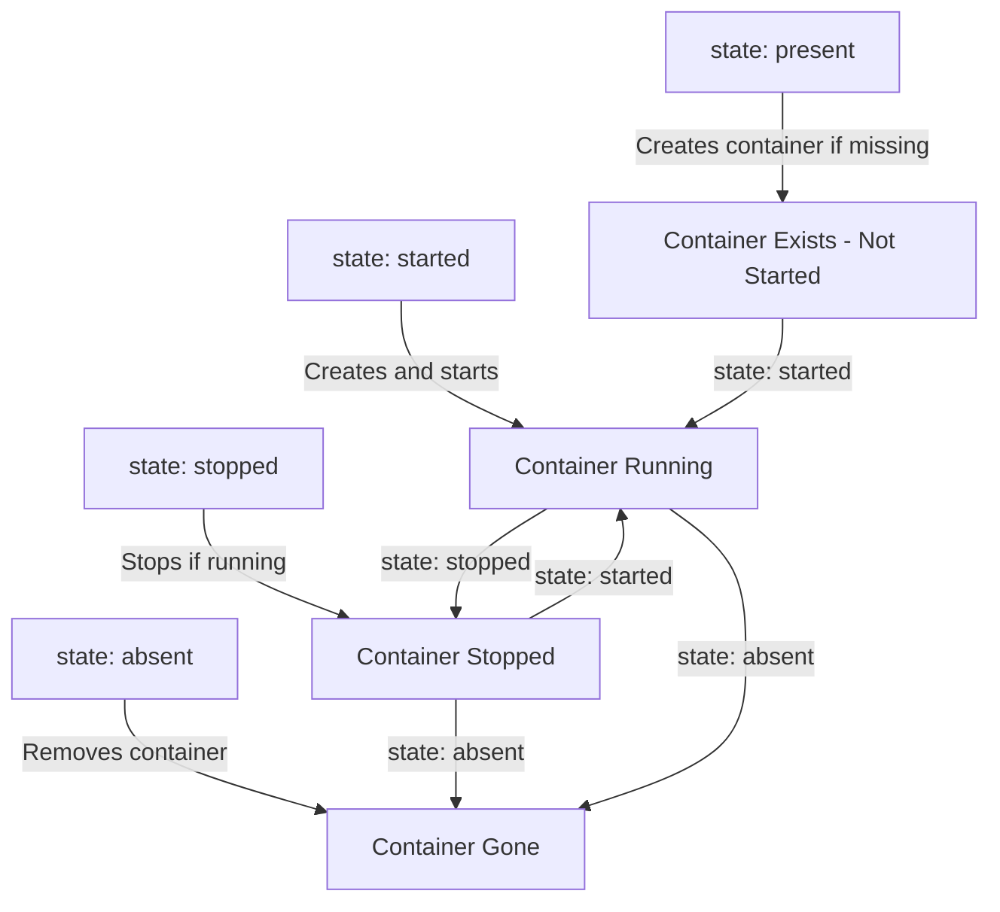

# How to Use the Ansible docker_container Module

Author: [nawazdhandala](https://www.github.com/nawazdhandala)

Tags: Ansible, Docker, docker_container, Containers, Automation

Description: Deep dive into the Ansible docker_container module covering all major parameters with practical examples for managing Docker containers.

---

The `docker_container` module from the `community.docker` collection is probably the module you will use most when managing Docker with Ansible. It handles the full lifecycle of containers: creating, starting, stopping, restarting, and removing them. It also manages port mappings, volumes, environment variables, resource limits, health checks, and pretty much every other Docker container configuration option. In this post, we will explore the module in depth with practical examples.

## Prerequisites

You need the `community.docker` collection and the Docker Python SDK installed.

```bash
# Install the collection
ansible-galaxy collection install community.docker

# Install the Python SDK
pip install docker
```

Docker must be installed and running on the target host.

## Basic Container Operations

Let us start with the fundamental operations.

```yaml
# basic-container-ops.yml - Fundamental docker_container operations
---
- name: Basic Container Operations
  hosts: docker_hosts
  become: true

  tasks:
    # Create and start a container
    - name: Run an nginx container
      community.docker.docker_container:
        name: my-nginx
        image: nginx:1.25
        state: started

    # Stop a running container
    - name: Stop the nginx container
      community.docker.docker_container:
        name: my-nginx
        state: stopped

    # Restart a container
    - name: Restart the container
      community.docker.docker_container:
        name: my-nginx
        state: started
        restart: true

    # Remove a container
    - name: Remove the container
      community.docker.docker_container:
        name: my-nginx
        state: absent
```

## Understanding State Options

The `state` parameter controls what the module does. Here is how each state works:



- **present**: Ensures the container exists but does not start it
- **started**: Ensures the container exists AND is running
- **stopped**: Ensures the container is stopped (but not removed)
- **absent**: Removes the container entirely

## Port Mappings

Exposing container ports is one of the most common configurations.

```yaml
# port-mappings.yml - Various port mapping configurations
---
- name: Container Port Mappings
  hosts: docker_hosts
  become: true

  tasks:
    # Simple port mapping: host_port:container_port
    - name: Map port 8080 on host to 80 in container
      community.docker.docker_container:
        name: web-simple
        image: nginx:1.25
        state: started
        ports:
          - "8080:80"

    # Map multiple ports
    - name: Container with multiple port mappings
      community.docker.docker_container:
        name: web-multi-port
        image: nginx:1.25
        state: started
        ports:
          - "80:80"
          - "443:443"

    # Bind to a specific interface
    - name: Bind port only to localhost
      community.docker.docker_container:
        name: web-localhost-only
        image: nginx:1.25
        state: started
        ports:
          - "127.0.0.1:8080:80"

    # Map a range of ports
    - name: Map a port range
      community.docker.docker_container:
        name: web-port-range
        image: nginx:1.25
        state: started
        ports:
          - "8000-8010:8000-8010"

    # Let Docker assign a random host port
    - name: Random host port mapping
      community.docker.docker_container:
        name: web-random-port
        image: nginx:1.25
        state: started
        published_ports:
          - "80"
      register: random_port_container
```

## Environment Variables

Pass configuration to your containers through environment variables.

```yaml
# env-variables.yml - Setting environment variables on containers
---
- name: Container Environment Variables
  hosts: docker_hosts
  become: true

  tasks:
    # Simple environment variables
    - name: Container with environment variables
      community.docker.docker_container:
        name: app-server
        image: node:20-slim
        state: started
        env:
          NODE_ENV: "production"
          PORT: "3000"
          DATABASE_URL: "postgres://db:5432/myapp"
          REDIS_URL: "redis://cache:6379"
          LOG_LEVEL: "info"

    # Using an env file from the host
    - name: Container with env_file
      community.docker.docker_container:
        name: app-with-env-file
        image: node:20-slim
        state: started
        env_file: /opt/myapp/.env
```

## Volume Mounts

Mount host directories or Docker volumes into containers.

```yaml
# volume-mounts.yml - Different volume mounting strategies
---
- name: Container Volume Management
  hosts: docker_hosts
  become: true

  tasks:
    # Bind mount a host directory
    - name: Mount host directory into container
      community.docker.docker_container:
        name: web-with-content
        image: nginx:1.25
        state: started
        ports:
          - "80:80"
        volumes:
          - "/opt/website:/usr/share/nginx/html:ro"

    # Named Docker volume
    - name: Container with a named volume
      community.docker.docker_container:
        name: postgres-db
        image: postgres:16
        state: started
        env:
          POSTGRES_PASSWORD: "secretpassword"
        volumes:
          - "postgres-data:/var/lib/postgresql/data"

    # Multiple volumes with different access modes
    - name: Container with multiple volumes
      community.docker.docker_container:
        name: app-complex
        image: myapp:latest
        state: started
        volumes:
          # Read-only config
          - "/etc/myapp/config:/app/config:ro"
          # Writable data directory
          - "app-data:/app/data:rw"
          # Read-only secrets
          - "/run/secrets:/app/secrets:ro"
          # Temp directory using tmpfs
        tmpfs:
          - "/tmp"
```

## Resource Limits

Prevent containers from consuming all host resources.

```yaml
# resource-limits.yml - Set CPU and memory limits on containers
---
- name: Container Resource Limits
  hosts: docker_hosts
  become: true

  tasks:
    - name: Container with memory and CPU limits
      community.docker.docker_container:
        name: app-limited
        image: myapp:latest
        state: started
        # Memory limit: 512 MB
        memory: "512m"
        # Memory + swap limit: 1 GB (512m swap)
        memory_swap: "1g"
        # Reserve 256 MB of memory
        memory_reservation: "256m"
        # CPU limit: 1.5 cores
        cpus: 1.5
        # CPU shares (relative weight)
        cpu_shares: 512
        # Pin to specific CPUs
        cpuset_cpus: "0,1"

    - name: Container with pids limit
      community.docker.docker_container:
        name: app-pids-limited
        image: myapp:latest
        state: started
        memory: "256m"
        # Limit number of processes
        pids_limit: 100
```

## Health Checks

Define how Docker should check if your container is healthy.

```yaml
# health-checks.yml - Configure container health checks
---
- name: Container Health Checks
  hosts: docker_hosts
  become: true

  tasks:
    - name: Container with HTTP health check
      community.docker.docker_container:
        name: web-with-health
        image: nginx:1.25
        state: started
        ports:
          - "80:80"
        healthcheck:
          test: ["CMD", "curl", "-f", "http://localhost:80/"]
          interval: 30s
          timeout: 10s
          retries: 3
          start_period: 10s

    - name: Container with custom health check script
      community.docker.docker_container:
        name: app-with-health
        image: myapp:latest
        state: started
        healthcheck:
          test: ["CMD-SHELL", "/app/health-check.sh"]
          interval: 15s
          timeout: 5s
          retries: 5
          start_period: 30s
```

## Restart Policies

Control what happens when a container exits.

```yaml
# restart-policies.yml - Configure container restart behavior
---
- name: Container Restart Policies
  hosts: docker_hosts
  become: true

  tasks:
    # Always restart (good for production services)
    - name: Container that always restarts
      community.docker.docker_container:
        name: always-up
        image: nginx:1.25
        state: started
        restart_policy: always

    # Restart unless explicitly stopped
    - name: Container that restarts unless stopped
      community.docker.docker_container:
        name: resilient-app
        image: myapp:latest
        state: started
        restart_policy: unless-stopped

    # Restart on failure with a max retry count
    - name: Container with limited restart attempts
      community.docker.docker_container:
        name: retry-app
        image: myapp:latest
        state: started
        restart_policy: on-failure
        restart_retries: 5

    # Never restart (good for one-off tasks)
    - name: One-shot container
      community.docker.docker_container:
        name: migration-runner
        image: myapp:latest
        state: started
        restart_policy: "no"
        command: "python manage.py migrate"
        auto_remove: true
```

## Networking

Connect containers to Docker networks.

```yaml
# container-networking.yml - Container network configuration
---
- name: Container Networking
  hosts: docker_hosts
  become: true

  tasks:
    # Create a custom network first
    - name: Create app network
      community.docker.docker_network:
        name: backend
        driver: bridge

    # Container on a custom network with aliases
    - name: API server on backend network
      community.docker.docker_container:
        name: api-server
        image: myapp-api:latest
        state: started
        networks:
          - name: backend
            aliases:
              - api
              - backend-api
        dns_servers:
          - "8.8.8.8"
          - "8.8.4.4"

    # Container on multiple networks
    - name: Create frontend network
      community.docker.docker_network:
        name: frontend

    - name: Proxy on both frontend and backend networks
      community.docker.docker_container:
        name: reverse-proxy
        image: nginx:1.25
        state: started
        ports:
          - "80:80"
        networks:
          - name: frontend
          - name: backend
```

## Running Commands and Executing in Containers

```yaml
# container-commands.yml - Override commands and exec into containers
---
- name: Container Commands
  hosts: docker_hosts
  become: true

  tasks:
    # Override the default command
    - name: Run container with custom command
      community.docker.docker_container:
        name: custom-cmd
        image: python:3.12
        state: started
        command: "python -m http.server 8000"
        ports:
          - "8000:8000"

    # Override the entrypoint
    - name: Run with custom entrypoint
      community.docker.docker_container:
        name: debug-container
        image: myapp:latest
        state: started
        entrypoint: ["/bin/bash"]
        command: ["-c", "while true; do sleep 3600; done"]

    # Execute a command in a running container
    - name: Run a command inside a running container
      community.docker.docker_container_exec:
        container: api-server
        command: "python manage.py collectstatic --noinput"
      register: exec_result

    - name: Show command output
      ansible.builtin.debug:
        msg: "{{ exec_result.stdout }}"
```

## Complete Application Deployment Example

Here is a real-world example deploying a multi-container application.

```yaml
# deploy-app.yml - Deploy a complete application stack
---
- name: Deploy Application Stack
  hosts: docker_hosts
  become: true

  vars:
    app_version: "2.5.0"
    db_password: "{{ vault_db_password }}"

  tasks:
    - name: Create application network
      community.docker.docker_network:
        name: app-network

    - name: Create data volumes
      community.docker.docker_volume:
        name: "{{ item }}"
      loop:
        - postgres-data
        - redis-data

    - name: Start PostgreSQL database
      community.docker.docker_container:
        name: postgres
        image: postgres:16
        state: started
        restart_policy: unless-stopped
        env:
          POSTGRES_DB: "myapp"
          POSTGRES_USER: "myapp"
          POSTGRES_PASSWORD: "{{ db_password }}"
        volumes:
          - "postgres-data:/var/lib/postgresql/data"
        networks:
          - name: app-network
        memory: "512m"
        healthcheck:
          test: ["CMD-SHELL", "pg_isready -U myapp"]
          interval: 10s
          timeout: 5s
          retries: 5
      no_log: true

    - name: Start Redis cache
      community.docker.docker_container:
        name: redis
        image: redis:7
        state: started
        restart_policy: unless-stopped
        volumes:
          - "redis-data:/data"
        networks:
          - name: app-network
        memory: "256m"
        command: "redis-server --maxmemory 200mb --maxmemory-policy allkeys-lru"

    - name: Start application
      community.docker.docker_container:
        name: app
        image: "myregistry/myapp:{{ app_version }}"
        state: started
        restart_policy: unless-stopped
        env:
          DATABASE_URL: "postgres://myapp:{{ db_password }}@postgres:5432/myapp"
          REDIS_URL: "redis://redis:6379"
          NODE_ENV: "production"
        ports:
          - "3000:3000"
        networks:
          - name: app-network
        memory: "1g"
        cpus: 2.0
        healthcheck:
          test: ["CMD", "curl", "-f", "http://localhost:3000/health"]
          interval: 15s
          timeout: 5s
          retries: 3
      no_log: true

    - name: Verify all containers are running
      community.docker.docker_container_info:
        name: "{{ item }}"
      loop:
        - postgres
        - redis
        - app
      register: container_checks

    - name: Show deployment status
      ansible.builtin.debug:
        msg: "{{ item.item }}: {{ item.container.State.Status }}"
      loop: "{{ container_checks.results }}"
```

## Tips for Using docker_container

1. **Use `restart_policy: unless-stopped` for services.** This ensures containers come back after a host reboot but stay stopped if you explicitly stop them.

2. **Always name your containers.** Named containers are easier to manage and reference in playbooks.

3. **Set memory limits.** Containers without memory limits can consume all host memory and cause out-of-memory kills.

4. **Use health checks.** They let Docker (and monitoring tools) know when your application is actually ready to serve traffic.

5. **Use `no_log: true` when passing secrets.** Environment variables often contain passwords and API keys.

6. **Use `pull: true` to ensure the latest image.** Without it, Docker will use a locally cached image if one exists.

## Conclusion

The `docker_container` module is a comprehensive tool for managing Docker containers with Ansible. It covers every container configuration option Docker supports, from basic port mappings to advanced resource limits and health checks. By using this module in your playbooks, you get declarative, idempotent container management that integrates seamlessly with the rest of your Ansible automation.
