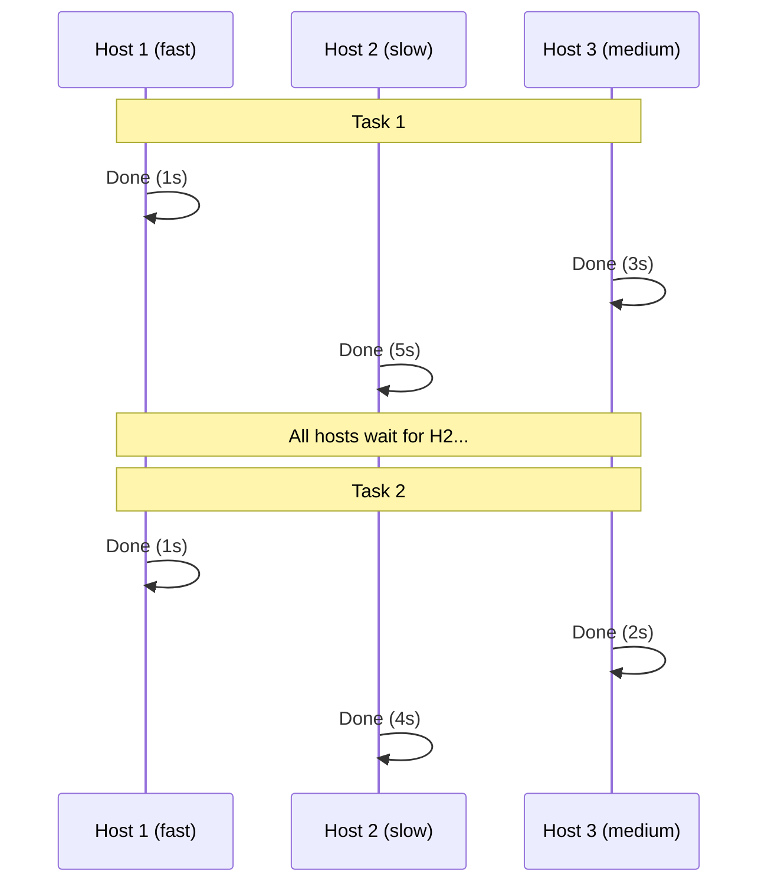
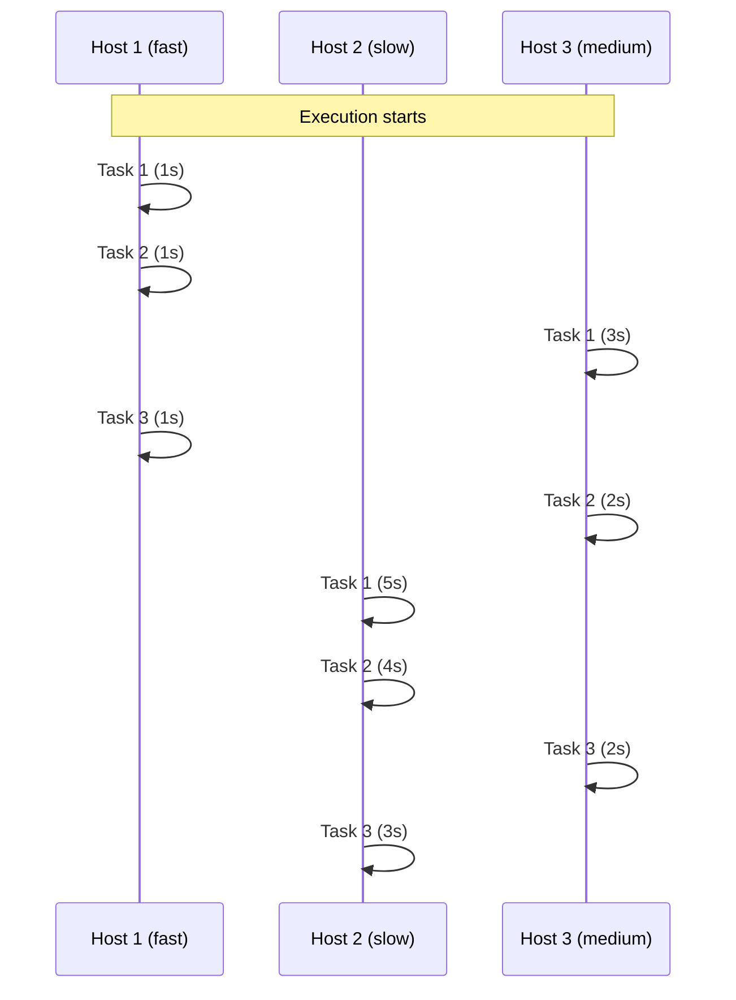

# How to Use the Ansible free Strategy for Faster Execution

Author: [nawazdhandala](https://www.github.com/nawazdhandala)

Tags: Ansible, Performance, Strategy, Automation

Description: Learn how the Ansible free strategy works, when to use it, and how it lets hosts proceed through tasks independently for faster playbook runs.

---

Ansible's default execution model, the `linear` strategy, forces all hosts to complete a task before any host moves on to the next one. This means your fastest host sits idle while waiting for the slowest one to catch up. The `free` strategy removes that constraint, letting each host proceed through the task list at its own pace. In the right scenario, this can shave significant time off your playbook runs.

## How the Linear Strategy Works

With the default linear strategy, execution looks like this:



Host 1 finishes Task 1 in 1 second but has to wait 4 more seconds for Host 2 before it can start Task 2. That idle time adds up across many tasks and many hosts.

## How the Free Strategy Works

With the free strategy, each host moves on as soon as it finishes:



Host 1 blows through all three tasks while Host 2 is still on Task 1. Total wall clock time drops because fast hosts are never idle.

## Enabling the Free Strategy

You can set the free strategy at the play level:

```yaml
---
# Use free strategy for independent server setup
- hosts: webservers
  strategy: free
  become: true
  tasks:
    - name: Update apt cache
      apt:
        update_cache: true
        cache_valid_time: 3600

    - name: Install required packages
      apt:
        name:
          - nginx
          - python3
          - curl
        state: present

    - name: Start nginx
      service:
        name: nginx
        state: started
        enabled: true
```

Or set it as the default for all plays in `ansible.cfg`:

```ini
# Set free as the default strategy
[defaults]
strategy = free
```

I prefer setting it per-play rather than globally, because not every play is a good fit for the free strategy.

## When Free Strategy Helps Most

The free strategy gives the biggest performance boost when:

1. Hosts have different performance characteristics (mix of old and new hardware)
2. Task durations vary significantly between hosts (some have packages cached, some do not)
3. Tasks are independent and do not require cross-host coordination

Here is a practical example where free shines. Imagine patching 100 servers where half already have the latest packages:

```yaml
---
# Patching playbook - free strategy lets already-patched servers finish quickly
- hosts: all_servers
  strategy: free
  become: true
  tasks:
    - name: Update all packages
      apt:
        upgrade: dist
        update_cache: true
      register: update_result

    - name: Check if reboot is required
      stat:
        path: /var/run/reboot-required
      register: reboot_required

    - name: Reboot if needed
      reboot:
        reboot_timeout: 300
      when: reboot_required.stat.exists

    - name: Wait for server to come back
      wait_for_connection:
        delay: 10
        timeout: 300
      when: reboot_required.stat.exists
```

Servers that are already up to date will fly through this playbook in seconds, while servers needing full upgrades and reboots take their time. Without the free strategy, every host would wait for the slowest upgrader before moving to the reboot check.

## When NOT to Use Free Strategy

The free strategy is a bad choice when task order matters across hosts. Common examples:

Rolling deployments with a load balancer:

```yaml
---
# DO NOT use free strategy here - order matters
- hosts: webservers
  serial: 2
  strategy: linear
  tasks:
    - name: Remove from load balancer
      uri:
        url: "http://lb.example.com/api/remove/{{ inventory_hostname }}"
        method: POST
      delegate_to: localhost

    - name: Deploy new application version
      copy:
        src: app-v2.tar.gz
        dest: /opt/app/

    - name: Restart application
      service:
        name: myapp
        state: restarted

    - name: Add back to load balancer
      uri:
        url: "http://lb.example.com/api/add/{{ inventory_hostname }}"
        method: POST
      delegate_to: localhost
```

If you used the free strategy here, some hosts might be removed from the load balancer and not yet added back while other hosts are being removed too, potentially taking down your entire service.

Also avoid free when using `delegate_to` that targets the same host from multiple sources, or when tasks set facts that other hosts need.

## Debugging Free Strategy Runs

The free strategy makes output harder to read because tasks from different hosts interleave. Use the `yaml` callback plugin for cleaner output:

```ini
# Make free strategy output more readable
[defaults]
strategy = free
stdout_callback = yaml
```

You can also use the `debug` strategy during development and switch to `free` for production runs:

```yaml
---
# Development: use debug strategy to step through tasks
# Production: use free strategy for speed
- hosts: webservers
  strategy: "{{ lookup('env', 'ANSIBLE_STRATEGY') | default('free') }}"
  tasks:
    - name: Setup webserver
      include_role:
        name: webserver
```

```bash
# Development run with step-through debugging
ANSIBLE_STRATEGY=debug ansible-playbook site.yml

# Production run with free strategy
ansible-playbook site.yml
```

## Free Strategy with Forks

The free strategy works with the forks setting. Forks still limit how many hosts run concurrently:

```ini
# Combine free strategy with high fork count
[defaults]
strategy = free
forks = 50
```

With 100 hosts and 50 forks, Ansible picks 50 hosts for the first batch. Under the free strategy, as a host finishes all its tasks, Ansible can start a new host in its place, even if other hosts in the batch are still working. This is more efficient than the linear strategy, where all 50 hosts must finish the current task before the batch moves forward.

## Handling Errors with Free Strategy

Error handling with the free strategy has a subtle difference. With linear strategy, if a host fails and you have `any_errors_fatal: true`, all hosts stop at the same task boundary. With the free strategy, some hosts may have already moved past that point:

```yaml
---
# Be careful with any_errors_fatal under free strategy
- hosts: webservers
  strategy: free
  any_errors_fatal: true
  tasks:
    - name: Check prerequisites
      command: /opt/check-prereqs.sh
      # If this fails on any host, other hosts may already be on later tasks

    - name: Deploy application
      copy:
        src: app.tar.gz
        dest: /opt/app/
```

For safety-critical playbooks where you need clean abort semantics, stick with the linear strategy.

## Practical Performance Comparison

In testing across a heterogeneous fleet of 50 servers (mix of t2.micro and c5.2xlarge instances), a 15-task configuration playbook showed these results:

| Strategy | Total Time | Notes |
|---|---|---|
| linear | 8m 22s | All hosts wait for slowest per task |
| free | 5m 47s | Fast hosts finish early |

That is a 31% improvement, and the gap widens as host performance varies more. The free strategy is an easy win for any playbook where tasks are independent and hosts are not identical.
