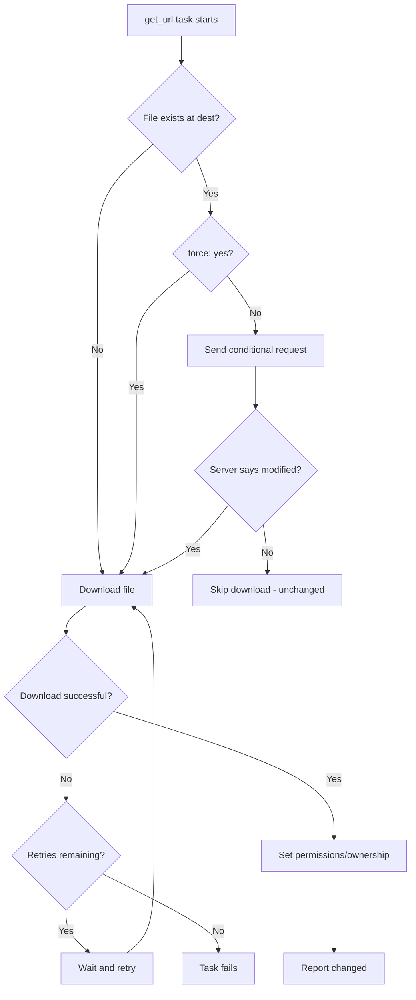

# How to Use the Ansible get_url Module to Download Files

Author: [nawazdhandala](https://www.github.com/nawazdhandala)

Tags: Ansible, DevOps, Automation, Linux

Description: Learn how to use the Ansible get_url module to download files from HTTP, HTTPS, and FTP servers to managed hosts with proper error handling.

---

Downloading files to remote servers is one of the most common automation tasks. Whether you need to pull a GPG key, grab a binary release, or fetch a configuration file from an internal server, the Ansible `get_url` module handles it cleanly. It supports HTTP, HTTPS, and FTP protocols, with features like checksum verification, authentication, and custom headers that make it suitable for production deployments.

## Basic File Downloads

The simplest use of `get_url` downloads a file from a URL to a specified path on the remote host.

```yaml
# Download the latest Docker Compose binary
- name: Download Docker Compose
  ansible.builtin.get_url:
    url: "https://github.com/docker/compose/releases/download/v2.24.5/docker-compose-linux-x86_64"
    dest: /usr/local/bin/docker-compose
    mode: '0755'
    owner: root
    group: root
```

The module checks whether the file already exists at the destination. If the remote server supports it, the module uses HTTP `If-Modified-Since` headers or ETag comparison to skip downloads when the file has not changed. This makes the task idempotent out of the box.

## Setting Permissions and Ownership

You can control the file's permissions, owner, and group directly in the task.

```yaml
# Download a GPG key and set proper permissions
- name: Download repository GPG key
  ansible.builtin.get_url:
    url: https://packages.grafana.com/gpg.key
    dest: /usr/share/keyrings/grafana-archive-keyring.gpg
    mode: '0644'
    owner: root
    group: root
```

## Downloading to a Directory

If you specify a directory as the `dest`, the module saves the file using the filename from the URL.

```yaml
# Download to a directory - file will be named based on the URL
- name: Download application installer to temp directory
  ansible.builtin.get_url:
    url: https://example.com/releases/myapp-installer-2.0.sh
    dest: /tmp/
    mode: '0755'
```

This creates `/tmp/myapp-installer-2.0.sh` on the remote host.

## Handling Redirects

The `get_url` module follows HTTP redirects by default. This is important for services like GitHub releases that redirect to CDN URLs.

```yaml
# GitHub releases typically redirect to a CDN
# get_url follows redirects automatically
- name: Download kubectl binary
  ansible.builtin.get_url:
    url: "https://dl.k8s.io/release/v1.29.1/bin/linux/amd64/kubectl"
    dest: /usr/local/bin/kubectl
    mode: '0755'
```

## Custom Headers

Some download servers require specific HTTP headers. The `headers` parameter lets you add them.

```yaml
# Download with custom headers for API token authentication
- name: Download artifact from internal server
  ansible.builtin.get_url:
    url: "https://artifacts.internal.company.com/api/releases/latest/myapp.tar.gz"
    dest: /opt/releases/myapp-latest.tar.gz
    headers:
      Authorization: "Bearer {{ api_token }}"
      Accept: "application/octet-stream"
    mode: '0644'
```

## Timeout Configuration

For large files or slow connections, adjust the timeout settings.

```yaml
# Download a large file with extended timeout
- name: Download large database dump
  ansible.builtin.get_url:
    url: "https://backups.example.com/db-dump-latest.sql.gz"
    dest: /opt/backups/db-dump-latest.sql.gz
    timeout: 300
    mode: '0600'
    owner: postgres
    group: postgres
```

The default timeout is 10 seconds, which is often too short for large files.

## Using force Parameter

By default, `get_url` uses conditional requests to avoid re-downloading unchanged files. Setting `force: yes` always downloads the file, regardless of whether it has changed.

```yaml
# Always download the latest version of a frequently updated file
- name: Download latest threat intelligence feed
  ansible.builtin.get_url:
    url: "https://feeds.example.com/threat-indicators.csv"
    dest: /opt/security/threat-indicators.csv
    force: yes
    mode: '0644'
    backup: yes
```

The `backup: yes` option creates a timestamped backup of the existing file before overwriting.

## Downloading Multiple Files

Use a loop to download multiple files efficiently.

```yaml
# Download multiple monitoring tool binaries
- name: Download monitoring stack binaries
  ansible.builtin.get_url:
    url: "{{ item.url }}"
    dest: "{{ item.dest }}"
    mode: "{{ item.mode | default('0755') }}"
    owner: root
    group: root
  loop:
    - url: "https://github.com/prometheus/prometheus/releases/download/v2.50.0/prometheus-2.50.0.linux-amd64.tar.gz"
      dest: /tmp/prometheus.tar.gz
      mode: '0644'
    - url: "https://github.com/prometheus/node_exporter/releases/download/v1.7.0/node_exporter-1.7.0.linux-amd64.tar.gz"
      dest: /tmp/node_exporter.tar.gz
      mode: '0644'
    - url: "https://dl.grafana.com/oss/release/grafana-10.3.1.linux-amd64.tar.gz"
      dest: /tmp/grafana.tar.gz
      mode: '0644'
```

## Working with Proxy Servers

In corporate environments, you often need to go through a proxy.

```yaml
# Download through an HTTP proxy
- name: Download package through corporate proxy
  ansible.builtin.get_url:
    url: "https://releases.hashicorp.com/vault/1.15.4/vault_1.15.4_linux_amd64.zip"
    dest: /tmp/vault.zip
    mode: '0644'
  environment:
    http_proxy: "http://proxy.company.com:3128"
    https_proxy: "http://proxy.company.com:3128"
    no_proxy: "localhost,127.0.0.1,.company.com"
```

## SSL/TLS Certificate Handling

For servers with self-signed certificates or custom CAs, you have options to handle certificate verification.

```yaml
# Download from a server with a custom CA certificate
- name: Download from internal HTTPS server
  ansible.builtin.get_url:
    url: "https://internal-repo.company.com/packages/myapp.rpm"
    dest: /tmp/myapp.rpm
    ca_path: /etc/pki/tls/certs/company-ca.pem
    mode: '0644'

# For development/testing environments only - skip certificate validation
- name: Download from dev server with self-signed cert
  ansible.builtin.get_url:
    url: "https://dev-server.local/artifact.tar.gz"
    dest: /tmp/artifact.tar.gz
    validate_certs: no
    mode: '0644'
  when: environment_type == 'development'
```

Never disable certificate validation in production.

## Error Handling and Retries

Network downloads can fail. Build resilience into your playbooks.

```yaml
# Download with retry logic
- name: Download critical dependency with retries
  ansible.builtin.get_url:
    url: "{{ dependency_url }}"
    dest: /opt/deps/library.tar.gz
    mode: '0644'
  register: download_result
  retries: 5
  delay: 10
  until: download_result is success

# Download with fallback URLs
- name: Try primary download URL
  ansible.builtin.get_url:
    url: "https://primary-mirror.example.com/package.tar.gz"
    dest: /tmp/package.tar.gz
    mode: '0644'
    timeout: 30
  register: primary_download
  ignore_errors: yes

- name: Fall back to secondary mirror
  ansible.builtin.get_url:
    url: "https://secondary-mirror.example.com/package.tar.gz"
    dest: /tmp/package.tar.gz
    mode: '0644'
  when: primary_download is failed
```

## Complete Example: Deploying a Binary Application

Here is a full playbook that downloads and deploys a Go binary application.

```yaml
---
- name: Deploy application from release download
  hosts: app_servers
  become: yes
  vars:
    app_name: myapp
    app_version: "3.2.1"
    app_user: myapp
    download_base: "https://github.com/org/myapp/releases/download"

  tasks:
    - name: Create application user
      ansible.builtin.user:
        name: "{{ app_user }}"
        system: yes
        shell: /sbin/nologin

    - name: Create application directories
      ansible.builtin.file:
        path: "{{ item }}"
        state: directory
        owner: "{{ app_user }}"
        group: "{{ app_user }}"
        mode: '0755'
      loop:
        - "/opt/{{ app_name }}"
        - "/opt/{{ app_name }}/bin"
        - "/var/log/{{ app_name }}"

    - name: Download application binary
      ansible.builtin.get_url:
        url: "{{ download_base }}/v{{ app_version }}/{{ app_name }}-{{ app_version }}-linux-amd64"
        dest: "/opt/{{ app_name }}/bin/{{ app_name }}"
        mode: '0755'
        owner: "{{ app_user }}"
        group: "{{ app_user }}"
      register: binary_download
      retries: 3
      delay: 5
      until: binary_download is success
      notify: Restart application

    - name: Download default configuration
      ansible.builtin.get_url:
        url: "{{ download_base }}/v{{ app_version }}/{{ app_name }}.example.yml"
        dest: "/opt/{{ app_name }}/config.yml"
        mode: '0640'
        owner: "{{ app_user }}"
        group: "{{ app_user }}"
        force: no

  handlers:
    - name: Restart application
      ansible.builtin.systemd:
        name: "{{ app_name }}"
        state: restarted
```

## Download Flow



## Summary

The `get_url` module is the standard way to download files in Ansible playbooks. It handles HTTP redirects, supports conditional downloads for idempotency, and provides checksum verification for security. With retry logic, proxy support, and custom headers, it covers the full range of download scenarios you will encounter in production environments. Combine it with `unarchive` for downloading and extracting archives, or use it standalone for binary downloads and configuration file fetching.
