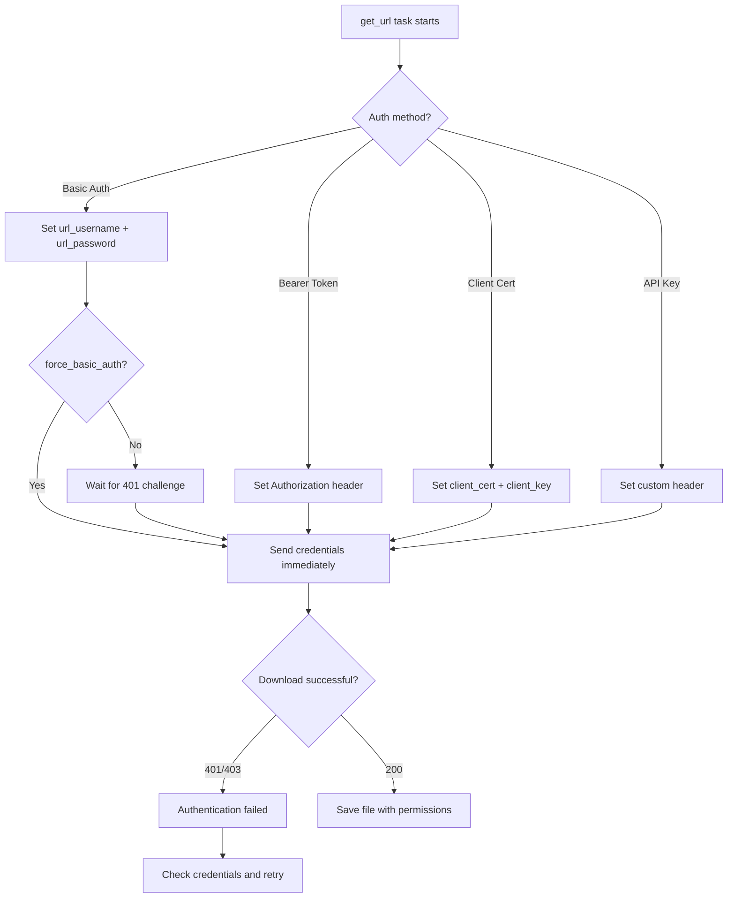

# How to Use the Ansible get_url Module with Authentication

Author: [nawazdhandala](https://www.github.com/nawazdhandala)

Tags: Ansible, DevOps, Security, Automation

Description: Learn how to use the Ansible get_url module with various authentication methods including basic auth, tokens, client certificates, and API keys.

---

Many file downloads in real infrastructure require authentication. Artifact repositories, private GitHub releases, internal package servers, and cloud storage all need credentials before they will serve files. The Ansible `get_url` module supports multiple authentication methods, and knowing how to use them securely is essential for production automation.

## Basic Authentication

The most common authentication method uses a username and password combination. The `get_url` module has built-in parameters for this.

```yaml
# Download from a server that requires basic HTTP authentication
- name: Download artifact from Nexus repository
  ansible.builtin.get_url:
    url: "https://nexus.company.com/repository/releases/com/company/myapp/2.1.0/myapp-2.1.0.jar"
    dest: /opt/myapp/lib/myapp.jar
    url_username: "{{ nexus_username }}"
    url_password: "{{ nexus_password }}"
    mode: '0644'
    owner: appuser
    group: appuser
```

The `url_username` and `url_password` parameters send credentials using HTTP Basic Authentication. By default, Ansible only sends credentials after receiving a 401 challenge from the server. If the server does not send a challenge (some APIs expect credentials on the first request), use `force_basic_auth`.

```yaml
# Force sending credentials with the initial request
- name: Download from API that expects auth on first request
  ansible.builtin.get_url:
    url: "https://api.artifactory.company.com/artifacts/myapp-latest.tar.gz"
    dest: /tmp/myapp-latest.tar.gz
    url_username: "{{ artifactory_user }}"
    url_password: "{{ artifactory_api_key }}"
    force_basic_auth: yes
    mode: '0644'
```

## Token-Based Authentication

Many modern APIs and services use bearer tokens or API keys passed in HTTP headers.

```yaml
# Download from GitHub API using a personal access token
- name: Download release asset from private GitHub repository
  ansible.builtin.get_url:
    url: "https://api.github.com/repos/company/private-app/releases/assets/12345"
    dest: /tmp/private-app.tar.gz
    headers:
      Authorization: "Bearer {{ github_token }}"
      Accept: "application/octet-stream"
    mode: '0644'
```

```yaml
# Download from GitLab package registry with job token
- name: Download package from GitLab
  ansible.builtin.get_url:
    url: "https://gitlab.company.com/api/v4/projects/42/packages/generic/myapp/1.0.0/myapp-linux-amd64"
    dest: /opt/myapp/bin/myapp
    headers:
      PRIVATE-TOKEN: "{{ gitlab_api_token }}"
    mode: '0755'
```

## Downloading from AWS S3

For S3 downloads, you can use pre-signed URLs or pass AWS credentials in headers.

```yaml
# Use a pre-signed S3 URL (no additional auth needed)
- name: Download config from S3 using pre-signed URL
  ansible.builtin.get_url:
    url: "{{ s3_presigned_url }}"
    dest: /opt/app/config.tar.gz
    mode: '0640'
    timeout: 120

# Generate the pre-signed URL on the controller first
- name: Generate pre-signed S3 URL
  ansible.builtin.command: >
    aws s3 presign s3://my-bucket/releases/app-2.0.tar.gz
    --expires-in 3600
  delegate_to: localhost
  register: presigned_url_result
  changed_when: false

- name: Download from S3 using pre-signed URL
  ansible.builtin.get_url:
    url: "{{ presigned_url_result.stdout }}"
    dest: /tmp/app-2.0.tar.gz
    mode: '0644'
```

## Client Certificate Authentication

Some enterprise environments require mutual TLS (mTLS) where the client presents a certificate to authenticate.

```yaml
# Download using client certificate authentication
- name: Download from mTLS-protected server
  ansible.builtin.get_url:
    url: "https://secure-repo.company.com/packages/myapp-3.0.rpm"
    dest: /tmp/myapp-3.0.rpm
    client_cert: /etc/pki/tls/certs/ansible-client.pem
    client_key: /etc/pki/tls/private/ansible-client-key.pem
    mode: '0644'
```

The client certificate and key files must exist on the remote host before the download task runs.

```yaml
# Deploy client certificates first, then download
- name: Deploy client certificate
  ansible.builtin.copy:
    src: certs/ansible-client.pem
    dest: /etc/pki/tls/certs/ansible-client.pem
    mode: '0644'

- name: Deploy client private key
  ansible.builtin.copy:
    src: certs/ansible-client-key.pem
    dest: /etc/pki/tls/private/ansible-client-key.pem
    mode: '0600'

- name: Download package with client cert authentication
  ansible.builtin.get_url:
    url: "https://secure-repo.company.com/packages/myapp-3.0.rpm"
    dest: /tmp/myapp-3.0.rpm
    client_cert: /etc/pki/tls/certs/ansible-client.pem
    client_key: /etc/pki/tls/private/ansible-client-key.pem
    mode: '0644'
```

## Securing Credentials with Ansible Vault

Never put passwords or tokens in plaintext in your playbooks. Use Ansible Vault to encrypt sensitive values.

```yaml
# vars/vault.yml (encrypted with ansible-vault)
# ansible-vault create vars/vault.yml
vault_nexus_username: deploy-user
vault_nexus_password: super-secret-password
vault_github_token: ghp_xxxxxxxxxxxxxxxxxxxx
vault_artifactory_api_key: AKCxxxxxxxxxxxxxxxxx
```

Reference the vault variables in your playbook.

```yaml
---
- name: Download authenticated artifacts
  hosts: app_servers
  become: yes
  vars_files:
    - vars/vault.yml

  tasks:
    - name: Download from Nexus with vault credentials
      ansible.builtin.get_url:
        url: "https://nexus.company.com/repository/releases/myapp-2.1.jar"
        dest: /opt/myapp/lib/myapp.jar
        url_username: "{{ vault_nexus_username }}"
        url_password: "{{ vault_nexus_password }}"
        force_basic_auth: yes
        mode: '0644'
```

Run the playbook with the vault password.

```bash
# Run playbook with vault password prompt
ansible-playbook deploy.yml --ask-vault-pass

# Or use a vault password file
ansible-playbook deploy.yml --vault-password-file ~/.vault_pass
```

## Downloading from JFrog Artifactory

Artifactory is widely used for artifact management. Here are patterns for different authentication approaches.

```yaml
# Using API key
- name: Download from Artifactory with API key
  ansible.builtin.get_url:
    url: "https://artifactory.company.com/artifactory/libs-release/com/company/mylib/1.0/mylib-1.0.jar"
    dest: /opt/app/lib/mylib.jar
    headers:
      X-JFrog-Art-Api: "{{ artifactory_api_key }}"
    mode: '0644'

# Using access token
- name: Download from Artifactory with access token
  ansible.builtin.get_url:
    url: "https://artifactory.company.com/artifactory/libs-release/com/company/mylib/1.0/mylib-1.0.jar"
    dest: /opt/app/lib/mylib.jar
    headers:
      Authorization: "Bearer {{ artifactory_access_token }}"
    mode: '0644'
```

## Full Deployment Example with Multiple Auth Methods

Here is a realistic playbook that downloads components from different authenticated sources.

```yaml
---
- name: Deploy application with authenticated downloads
  hosts: app_servers
  become: yes
  vars_files:
    - vars/vault.yml
  vars:
    app_version: "3.5.0"

  tasks:
    - name: Download application binary from Nexus
      ansible.builtin.get_url:
        url: "https://nexus.company.com/repository/releases/myapp/{{ app_version }}/myapp-{{ app_version }}"
        dest: /opt/myapp/bin/myapp
        url_username: "{{ vault_nexus_username }}"
        url_password: "{{ vault_nexus_password }}"
        force_basic_auth: yes
        mode: '0755'
        owner: myapp
        group: myapp
      register: binary_download
      retries: 3
      delay: 10
      until: binary_download is success
      notify: Restart myapp

    - name: Download configuration template from private GitHub repo
      ansible.builtin.get_url:
        url: "https://raw.githubusercontent.com/company/configs/main/myapp/{{ app_version }}/config.yml"
        dest: /opt/myapp/config.yml
        headers:
          Authorization: "Bearer {{ vault_github_token }}"
        mode: '0640'
        owner: myapp
        group: myapp
        backup: yes

    - name: Download TLS certificates from internal CA
      ansible.builtin.get_url:
        url: "https://ca.internal.company.com/api/v1/cert/myapp-{{ inventory_hostname }}"
        dest: /opt/myapp/tls/server.pem
        headers:
          X-API-Key: "{{ vault_ca_api_key }}"
        mode: '0600'
        owner: myapp
        group: myapp

  handlers:
    - name: Restart myapp
      ansible.builtin.systemd:
        name: myapp
        state: restarted
```

## Authentication Flow



## Summary

The `get_url` module handles every common authentication pattern you will encounter in enterprise environments. Basic auth covers most artifact repositories, token-based auth works with modern APIs and GitHub, client certificates handle mTLS requirements, and custom headers support proprietary authentication schemes. Always store credentials in Ansible Vault, use `force_basic_auth` when the server expects credentials upfront, and combine downloads with retry logic for reliability. These patterns cover the vast majority of authenticated download scenarios in real infrastructure automation.
