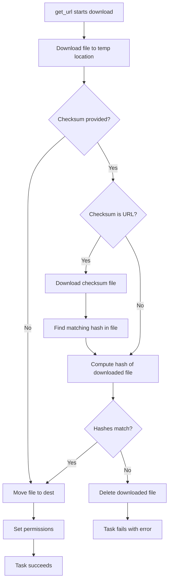

# How to Use the Ansible get_url Module with Checksums

Author: [nawazdhandala](https://www.github.com/nawazdhandala)

Tags: Ansible, DevOps, Security, Automation

Description: Learn how to use checksum verification with the Ansible get_url module to ensure downloaded files are authentic and uncorrupted.

---

Downloading files from the internet without verifying their integrity is a security risk. A corrupted download, a man-in-the-middle attack, or a compromised mirror could deliver malicious content to your servers. The Ansible `get_url` module has built-in checksum verification that validates downloaded files against known-good hashes. This guide covers every checksum pattern you will need.

## Why Checksums Matter

When you download a binary from the internet and deploy it to production servers, you need to know that what you got is exactly what the publisher intended. HTTPS protects the transport layer, but it does not protect against a compromised server or CDN. Checksums provide an independent verification that the file content matches expectations.

## Basic Checksum Verification

The `checksum` parameter accepts a hash algorithm prefix followed by the expected hash value.

```yaml
# Download kubectl with SHA256 checksum verification
- name: Download kubectl with checksum
  ansible.builtin.get_url:
    url: "https://dl.k8s.io/release/v1.29.1/bin/linux/amd64/kubectl"
    dest: /usr/local/bin/kubectl
    checksum: "sha256:69ab3a931e826bf7ac14d38ba7ca637d2b75b4629990c4850801a6a8c94d4b0a"
    mode: '0755'
```

Supported hash algorithms include `md5`, `sha1`, `sha224`, `sha256`, `sha384`, and `sha512`. Always prefer SHA256 or stronger.

## Using a Checksum File URL

Many software projects publish checksum files alongside their releases. The `get_url` module can download the checksum file and extract the right hash automatically.

```yaml
# Download Terraform and verify against the official SHA256SUMS file
- name: Download Terraform with checksum from URL
  ansible.builtin.get_url:
    url: "https://releases.hashicorp.com/terraform/1.7.3/terraform_1.7.3_linux_amd64.zip"
    dest: /tmp/terraform.zip
    checksum: "sha256:https://releases.hashicorp.com/terraform/1.7.3/terraform_1.7.3_SHA256SUMS"
    mode: '0644'
```

When you pass a URL as the checksum value, Ansible downloads the checksum file, finds the line that matches your download filename, and uses that hash for verification. The checksum file format should be the standard output of `sha256sum` or similar tools.

Here is what a typical SHA256SUMS file looks like:

```
b84b0baf5cc32476c2632d09a5c59c37e6cb00e5a6f4fbe8038a3b22315d1e9e  terraform_1.7.3_darwin_amd64.zip
a1b2c3d4e5f6...  terraform_1.7.3_linux_amd64.zip
```

## Checksum Verification with Variables

For version-managed deployments, store checksums in variables alongside version numbers.

```yaml
---
- name: Deploy monitoring tools with checksum verification
  hosts: monitoring
  become: yes
  vars:
    prometheus_version: "2.50.0"
    prometheus_checksum: "sha256:610e71b6a8610cc52ddb5c1389e3d4b1f3fa8e9f41e8ed7816e4ce63feda1e98"
    node_exporter_version: "1.7.0"
    node_exporter_checksum: "sha256:a550cd5c05f760b7934a2d0afad66d2e92e681482f5f57a917465b1fba3b02a6"

  tasks:
    - name: Download Prometheus
      ansible.builtin.get_url:
        url: "https://github.com/prometheus/prometheus/releases/download/v{{ prometheus_version }}/prometheus-{{ prometheus_version }}.linux-amd64.tar.gz"
        dest: "/tmp/prometheus-{{ prometheus_version }}.tar.gz"
        checksum: "{{ prometheus_checksum }}"
        mode: '0644'

    - name: Download Node Exporter
      ansible.builtin.get_url:
        url: "https://github.com/prometheus/node_exporter/releases/download/v{{ node_exporter_version }}/node_exporter-{{ node_exporter_version }}.linux-amd64.tar.gz"
        dest: "/tmp/node_exporter-{{ node_exporter_version }}.tar.gz"
        checksum: "{{ node_exporter_checksum }}"
        mode: '0644'
```

## Managing Checksums in a Dictionary

For applications with many downloadable components, a dictionary structure keeps things organized.

```yaml
# vars/checksums.yml - Centralized checksum management
tools:
  terraform:
    version: "1.7.3"
    url: "https://releases.hashicorp.com/terraform/1.7.3/terraform_1.7.3_linux_amd64.zip"
    checksum: "sha256:b84b0baf5cc32476c2632d09a5c59c37e6cb00e5a6f4fbe8038a3b22315d1e9e"
    dest: /tmp/terraform.zip
  vault:
    version: "1.15.4"
    url: "https://releases.hashicorp.com/vault/1.15.4/vault_1.15.4_linux_amd64.zip"
    checksum: "sha256:a1b2c3d4e5f67890abcdef1234567890abcdef1234567890abcdef1234567890"
    dest: /tmp/vault.zip
  consul:
    version: "1.17.2"
    url: "https://releases.hashicorp.com/consul/1.17.2/consul_1.17.2_linux_amd64.zip"
    checksum: "sha256:deadbeef1234567890abcdef1234567890abcdef1234567890abcdef12345678"
    dest: /tmp/consul.zip
```

```yaml
# Download all tools with checksum verification
- name: Download HashiCorp tools
  ansible.builtin.get_url:
    url: "{{ item.value.url }}"
    dest: "{{ item.value.dest }}"
    checksum: "{{ item.value.checksum }}"
    mode: '0644'
  loop: "{{ tools | dict2items }}"
  loop_control:
    label: "{{ item.key }} v{{ item.value.version }}"
```

## Two-Step Verification with GPG Signatures

Some projects provide GPG signatures alongside checksums for an additional layer of trust. You can verify the checksum file itself is authentic before using it.

```yaml
# Download HashiCorp GPG key, checksum file, signature, and binary
# Then verify the chain of trust
- name: Download Terraform SHA256SUMS
  ansible.builtin.get_url:
    url: "https://releases.hashicorp.com/terraform/{{ tf_version }}/terraform_{{ tf_version }}_SHA256SUMS"
    dest: "/tmp/terraform_{{ tf_version }}_SHA256SUMS"
    mode: '0644'

- name: Download Terraform SHA256SUMS signature
  ansible.builtin.get_url:
    url: "https://releases.hashicorp.com/terraform/{{ tf_version }}/terraform_{{ tf_version }}_SHA256SUMS.sig"
    dest: "/tmp/terraform_{{ tf_version }}_SHA256SUMS.sig"
    mode: '0644'

- name: Import HashiCorp GPG key
  ansible.builtin.command: >
    gpg --import /usr/share/keyrings/hashicorp-archive-keyring.gpg
  changed_when: false

- name: Verify signature on checksum file
  ansible.builtin.command: >
    gpg --verify
    /tmp/terraform_{{ tf_version }}_SHA256SUMS.sig
    /tmp/terraform_{{ tf_version }}_SHA256SUMS
  register: gpg_verify
  changed_when: false

- name: Download Terraform binary with verified checksum
  ansible.builtin.get_url:
    url: "https://releases.hashicorp.com/terraform/{{ tf_version }}/terraform_{{ tf_version }}_linux_amd64.zip"
    dest: /tmp/terraform.zip
    checksum: "sha256:file:///tmp/terraform_{{ tf_version }}_SHA256SUMS"
    mode: '0644'
  when: gpg_verify.rc == 0
```

## Handling Checksum Failures

When a checksum does not match, the `get_url` module raises an error and the task fails. Handle this gracefully.

```yaml
# Handle checksum verification failures
- name: Download with checksum and error handling
  block:
    - name: Download application binary
      ansible.builtin.get_url:
        url: "{{ app_download_url }}"
        dest: /opt/app/bin/myapp
        checksum: "sha256:{{ app_sha256 }}"
        mode: '0755'
      register: download

  rescue:
    - name: Log checksum failure
      ansible.builtin.debug:
        msg: >
          SECURITY ALERT: Checksum verification failed for {{ app_download_url }}.
          Expected: {{ app_sha256 }}.
          The downloaded file may be corrupted or tampered with.

    - name: Remove potentially compromised file
      ansible.builtin.file:
        path: /opt/app/bin/myapp
        state: absent

    - name: Fail the play
      ansible.builtin.fail:
        msg: "Checksum verification failed. Aborting deployment for safety."
```

## Computing Checksums from Existing Files

Sometimes you need to compute the checksum of a file you already have, perhaps to generate your checksum variables.

```bash
# Generate SHA256 checksum on your workstation
sha256sum terraform_1.7.3_linux_amd64.zip
# Output: b84b0baf5cc32476c2632d09a5c59c37e6cb00e5a6f4fbe8038a3b22315d1e9e  terraform_1.7.3_linux_amd64.zip

# You can also use openssl
openssl dgst -sha256 terraform_1.7.3_linux_amd64.zip
```

## Checksum Verification Process



## Checksum Algorithms Compared

| Algorithm | Hash Length | Security | Speed | Recommended |
|-----------|-----------|----------|-------|-------------|
| MD5 | 128 bit | Broken | Fast | No |
| SHA1 | 160 bit | Weak | Fast | No |
| SHA256 | 256 bit | Strong | Medium | Yes |
| SHA384 | 384 bit | Strong | Slower | Overkill for most uses |
| SHA512 | 512 bit | Strong | Slower | Yes for high security |

Use SHA256 as your default. MD5 and SHA1 are cryptographically broken and should not be used for security verification.

## Summary

Checksum verification with `get_url` is a straightforward security measure that every Ansible playbook downloading files should include. Whether you embed the hash directly, reference a remote checksum file, or implement full GPG signature verification, the effort is minimal compared to the risk of deploying tampered binaries. Store your checksums alongside version numbers in variable files, update them as part of your version upgrade process, and always use SHA256 or stronger. A few extra lines in your playbook can prevent a supply chain attack from compromising your infrastructure.
