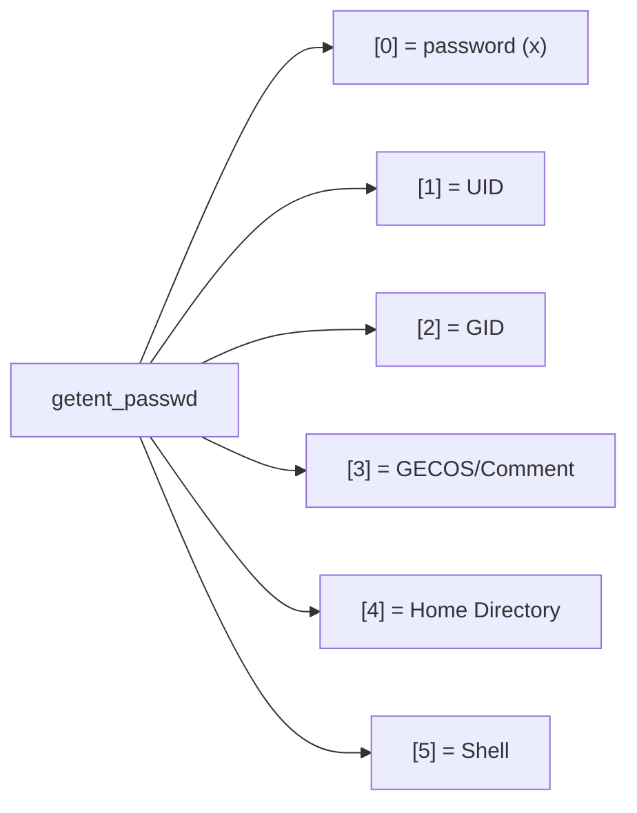

# How to Use the Ansible getent Module for User Information

Author: [nawazdhandala](https://www.github.com/nawazdhandala)

Tags: Ansible, User Management, Linux, System Information

Description: Learn how to query user and group information from system databases using the Ansible getent module for auditing and conditional logic.

---

The `getent` module in Ansible queries system name service databases like passwd, group, shadow, and hosts. It is the Ansible equivalent of the `getent` command-line tool, and it is invaluable for gathering user information, checking if accounts exist, and building conditional logic based on system state. If you need to know anything about users or groups on a target system, this module is your starting point.

## What getent Does

The `getent` module queries the Name Service Switch (NSS) databases. These include:

- **passwd**: User account information
- **group**: Group information
- **shadow**: Password aging information (requires root)
- **hosts**: Hostname resolution
- **services**: Network services

The module stores results as Ansible facts, which you can then use in subsequent tasks.

## Querying a Specific User

To check if a user exists and get their details:

```yaml
# query-user.yml - Get information about a specific user
- name: Query user information
  hosts: all
  become: yes
  tasks:
    - name: Get info for user 'deploy'
      ansible.builtin.getent:
        database: passwd
        key: deploy

    - name: Display user information
      ansible.builtin.debug:
        msg: "{{ getent_passwd }}"
```

The result is stored in `getent_passwd` (the variable name is always `getent_` followed by the database name). For the passwd database, the output looks like:

```json
{
  "deploy": [
    "x",
    "1001",
    "1001",
    "Deploy User",
    "/home/deploy",
    "/bin/bash"
  ]
}
```

The fields correspond to the `/etc/passwd` columns: password placeholder, UID, GID, GECOS, home directory, shell.

## Parsing getent Results

The output is a dictionary where the key is the username and the value is a list. Here is how to extract specific fields:

```yaml
# parse-getent.yml - Parse user information from getent
- name: Parse user information
  hosts: all
  become: yes
  tasks:
    - name: Get user info
      ansible.builtin.getent:
        database: passwd
        key: deploy

    - name: Extract specific fields
      ansible.builtin.debug:
        msg:
          username: deploy
          uid: "{{ getent_passwd['deploy'][1] }}"
          gid: "{{ getent_passwd['deploy'][2] }}"
          comment: "{{ getent_passwd['deploy'][3] }}"
          home: "{{ getent_passwd['deploy'][4] }}"
          shell: "{{ getent_passwd['deploy'][5] }}"
```

## Field Mapping

Here is how getent fields map to passwd entries:



## Querying All Users

Omit the `key` parameter to get all entries:

```yaml
# query-all-users.yml - Get all user accounts
- name: Query all users
  hosts: all
  become: yes
  tasks:
    - name: Get all passwd entries
      ansible.builtin.getent:
        database: passwd

    - name: List all usernames
      ansible.builtin.debug:
        msg: "{{ getent_passwd.keys() | list }}"

    - name: Find users with UID >= 1000 (regular users)
      ansible.builtin.debug:
        msg: "Regular users: {{ getent_passwd | dict2items | selectattr('value.1', 'ge', '1000') | map(attribute='key') | list }}"
```

## Checking If a User Exists

One of the most common uses of `getent` is checking whether a user exists before performing an action:

```yaml
# check-user-exists.yml - Conditional logic based on user existence
- name: Check if user exists
  hosts: all
  become: yes
  tasks:
    - name: Try to get user info
      ansible.builtin.getent:
        database: passwd
        key: olduser
      register: user_check
      failed_when: false

    - name: Do something if user exists
      ansible.builtin.debug:
        msg: "User olduser exists with UID {{ getent_passwd['olduser'][1] }}"
      when: user_check is not failed

    - name: Do something else if user does not exist
      ansible.builtin.debug:
        msg: "User olduser does not exist on {{ inventory_hostname }}"
      when: user_check is failed
```

The `failed_when: false` is important. Without it, the task fails if the user does not exist, stopping the playbook.

## Querying Group Information

The group database works the same way:

```yaml
# query-groups.yml - Get group information
- name: Query group information
  hosts: all
  become: yes
  tasks:
    - name: Get info for developers group
      ansible.builtin.getent:
        database: group
        key: developers

    - name: Display group info
      ansible.builtin.debug:
        msg:
          group_name: developers
          gid: "{{ getent_group['developers'][1] }}"
          members: "{{ getent_group['developers'][2] }}"

    - name: Get all groups
      ansible.builtin.getent:
        database: group

    - name: List all group names
      ansible.builtin.debug:
        msg: "{{ getent_group.keys() | list }}"
```

## Querying Shadow Database

The shadow database contains password aging info. Requires root access:

```yaml
# query-shadow.yml - Get password aging information
- name: Query shadow database
  hosts: all
  become: yes
  tasks:
    - name: Get shadow entry for deploy
      ansible.builtin.getent:
        database: shadow
        key: deploy

    - name: Display password aging info
      ansible.builtin.debug:
        msg:
          last_change: "{{ getent_shadow['deploy'][1] }}"
          min_age: "{{ getent_shadow['deploy'][2] }}"
          max_age: "{{ getent_shadow['deploy'][3] }}"
          warning: "{{ getent_shadow['deploy'][4] }}"
          inactive: "{{ getent_shadow['deploy'][5] }}"
          expire: "{{ getent_shadow['deploy'][6] }}"
```

## Building a User Audit Report

Combine getent queries to build a comprehensive user audit:

```yaml
# user-audit.yml - Comprehensive user audit
- name: User audit report
  hosts: all
  become: yes
  tasks:
    - name: Get all passwd entries
      ansible.builtin.getent:
        database: passwd

    - name: Get all group entries
      ansible.builtin.getent:
        database: group

    # Find users with UID >= 1000 (interactive users)
    - name: Identify interactive users
      ansible.builtin.set_fact:
        interactive_users: >-
          {{ getent_passwd | dict2items
             | selectattr('value.1', 'ge', '1000')
             | rejectattr('key', 'equalto', 'nobody')
             | map(attribute='key') | list }}

    - name: Display interactive users
      ansible.builtin.debug:
        msg: "Interactive users on {{ inventory_hostname }}: {{ interactive_users }}"

    # Find users with nologin shell
    - name: Identify disabled users
      ansible.builtin.set_fact:
        disabled_users: >-
          {{ getent_passwd | dict2items
             | selectattr('value.5', 'search', 'nologin|false')
             | map(attribute='key') | list }}

    - name: Display disabled users count
      ansible.builtin.debug:
        msg: "{{ disabled_users | length }} users have login disabled"

    # Find users with bash shell
    - name: Identify users with bash
      ansible.builtin.set_fact:
        bash_users: >-
          {{ getent_passwd | dict2items
             | selectattr('value.5', 'equalto', '/bin/bash')
             | map(attribute='key') | list }}

    - name: Display bash users
      ansible.builtin.debug:
        msg: "Users with bash: {{ bash_users }}"
```

## Using getent for Conditional Task Execution

A practical use case: only deploy SSH keys if the user actually exists on the target host:

```yaml
# conditional-ssh-deploy.yml - Deploy SSH keys only for existing users
- name: Deploy SSH keys for existing users
  hosts: all
  become: yes
  vars:
    ssh_keys:
      alice: "ssh-ed25519 AAAAC3... alice@laptop"
      bob: "ssh-ed25519 AAAAC3... bob@laptop"
      carol: "ssh-ed25519 AAAAC3... carol@laptop"
  tasks:
    - name: Get all users
      ansible.builtin.getent:
        database: passwd

    - name: Deploy SSH key only if user exists
      ansible.posix.authorized_key:
        user: "{{ item.key }}"
        key: "{{ item.value }}"
        state: present
      loop: "{{ ssh_keys | dict2items }}"
      when: item.key in getent_passwd
      loop_control:
        label: "{{ item.key }}"
```

## Using getent with split Filter

The `split` parameter controls what character is used to separate returned values. This is useful when querying non-standard databases:

```yaml
# getent-split.yml - Use custom split character
- name: Query services database
  hosts: all
  tasks:
    - name: Get SSH service info
      ansible.builtin.getent:
        database: services
        key: ssh
        split: "/"

    - name: Display service info
      ansible.builtin.debug:
        msg: "{{ getent_services }}"
```

## Comparing Users Across Hosts

Collect user info from all hosts and compare:

```yaml
# compare-users.yml - Compare user lists across hosts
- name: Compare users across fleet
  hosts: all
  become: yes
  tasks:
    - name: Get all users
      ansible.builtin.getent:
        database: passwd

    - name: Store regular users as fact
      ansible.builtin.set_fact:
        host_users: >-
          {{ getent_passwd | dict2items
             | selectattr('value.1', 'ge', '1000')
             | rejectattr('key', 'equalto', 'nobody')
             | map(attribute='key') | sort | list }}

- name: Report user differences
  hosts: localhost
  tasks:
    - name: Display users per host
      ansible.builtin.debug:
        msg: "{{ item }}: {{ hostvars[item].host_users }}"
      loop: "{{ groups['all'] }}"
```

## Best Practices

1. **Use `failed_when: false`** when checking for users that might not exist. Otherwise the playbook stops on missing users.

2. **Remember the variable naming**. The fact is always `getent_` plus the database name. `getent_passwd`, `getent_group`, `getent_shadow`.

3. **Fields are strings**. Even numeric fields like UID come back as strings. Use `| int` when you need to do numeric comparisons.

4. **Shadow requires root**. You need `become: yes` to query the shadow database.

5. **Use getent for pre-flight checks**. Before modifying users, query their current state. This helps avoid unintended changes.

The `getent` module is one of those utilities that does not get much attention but is incredibly useful for user management automation. It bridges the gap between "what exists" and "what should exist" on your servers.
