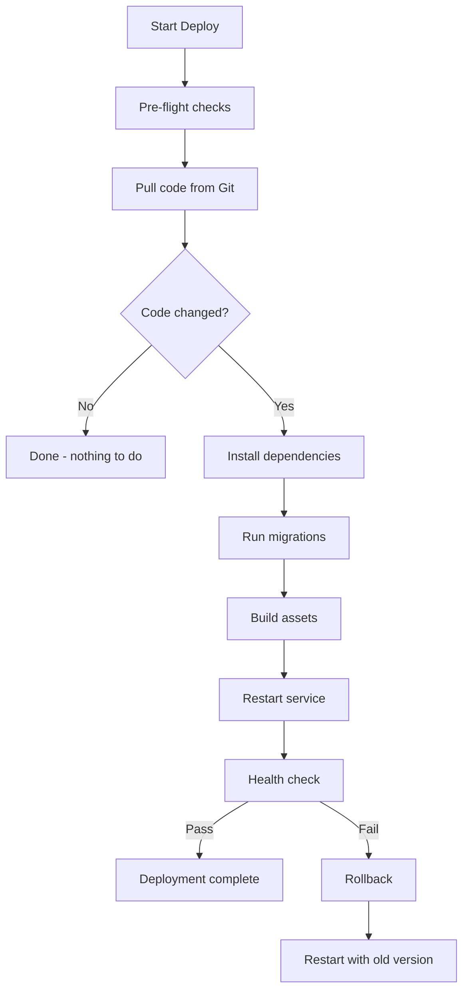

# How to Use the Ansible git Module for Deployment

Author: [nawazdhandala](https://www.github.com/nawazdhandala)

Tags: Ansible, Git, Deployment, CI/CD

Description: Learn how to use the Ansible git module for application deployment including build steps, service restarts, rolling updates, and zero-downtime strategies.

---

Using the Ansible git module for deployment is one of the most common patterns in the Ansible ecosystem. It is simple, repeatable, and gives you full control over what version of code runs on each server. This post walks through a complete deployment workflow, from basic code pulls to production-grade zero-downtime deployments.

## Basic Deployment Pattern

The fundamental pattern is: pull code, install dependencies, restart service.

```yaml
# playbook-basic-deploy.yml
# Basic deployment: pull code, install deps, restart service
- name: Deploy application
  hosts: webservers
  become: true
  vars:
    app_repo: "https://github.com/example/myapp.git"
    app_version: "v2.1.0"
    app_dir: /opt/myapp

  tasks:
    - name: Pull application code
      ansible.builtin.git:
        repo: "{{ app_repo }}"
        dest: "{{ app_dir }}"
        version: "{{ app_version }}"
        force: true
      register: git_result

    - name: Install Python dependencies
      ansible.builtin.pip:
        requirements: "{{ app_dir }}/requirements.txt"
        virtualenv: "{{ app_dir }}/venv"
      when: git_result.changed

    - name: Restart application service
      ansible.builtin.systemd:
        name: myapp
        state: restarted
      when: git_result.changed
```

## Full Deployment Workflow

A production deployment typically has more steps:

```yaml
# playbook-full-deploy.yml
# Complete deployment with pre-checks, migrations, build, and health verification
- name: Full deployment workflow
  hosts: webservers
  become: true
  vars:
    app_repo: "https://github.com/example/webapp.git"
    app_version: "{{ version | default('main') }}"
    app_dir: /opt/webapp
    app_user: webapp

  pre_tasks:
    - name: Verify disk space available
      ansible.builtin.assert:
        that:
          - ansible_facts.mounts | selectattr('mount', 'equalto', '/') | map(attribute='size_available') | first > 1073741824
        fail_msg: "Less than 1GB free disk space"

  tasks:
    - name: Get current version
      ansible.builtin.shell: "cd {{ app_dir }} && git describe --tags 2>/dev/null || echo 'none'"
      register: prev_version
      changed_when: false
      failed_when: false

    - name: Pull new code
      ansible.builtin.git:
        repo: "{{ app_repo }}"
        dest: "{{ app_dir }}"
        version: "{{ app_version }}"
        force: true
      register: code_update

    - name: Run deployment steps if code changed
      when: code_update.changed
      block:
        - name: Install system dependencies
          ansible.builtin.apt:
            name:
              - build-essential
              - libpq-dev
            state: present

        - name: Install Python packages
          ansible.builtin.pip:
            requirements: "{{ app_dir }}/requirements.txt"
            virtualenv: "{{ app_dir }}/venv"

        - name: Run database migrations
          ansible.builtin.shell: |
            cd {{ app_dir }}
            source venv/bin/activate
            python manage.py migrate --noinput
          become_user: "{{ app_user }}"

        - name: Collect static files
          ansible.builtin.shell: |
            cd {{ app_dir }}
            source venv/bin/activate
            python manage.py collectstatic --noinput
          become_user: "{{ app_user }}"

        - name: Restart application
          ansible.builtin.systemd:
            name: webapp
            state: restarted

        - name: Wait for application to start
          ansible.builtin.uri:
            url: "http://localhost:8080/health"
            status_code: 200
          retries: 10
          delay: 3
          register: health_check

    - name: Report deployment status
      ansible.builtin.debug:
        msg: |
          Previous version: {{ prev_version.stdout }}
          Current version: {{ app_version }} ({{ code_update.after[:12] }})
          Code changed: {{ code_update.changed }}
```

## Deployment Strategy Flow



## Rolling Deployment (Zero Downtime)

Deploy one server at a time with health checks:

```yaml
# playbook-rolling-deploy.yml
# Rolling deployment: updates one server at a time behind a load balancer
- name: Rolling deployment
  hosts: webservers
  become: true
  serial: 1
  max_fail_percentage: 0
  vars:
    app_version: "{{ version }}"

  tasks:
    - name: Disable in load balancer
      ansible.builtin.shell: |
        curl -s -X POST http://lb.internal:8080/api/backends/{{ inventory_hostname }}/disable
      delegate_to: localhost
      changed_when: true

    - name: Wait for connections to drain
      ansible.builtin.pause:
        seconds: 15

    - name: Deploy new code
      ansible.builtin.git:
        repo: "https://github.com/example/webapp.git"
        dest: /opt/webapp
        version: "{{ app_version }}"
        force: true
      register: deploy

    - name: Install dependencies
      ansible.builtin.pip:
        requirements: /opt/webapp/requirements.txt
        virtualenv: /opt/webapp/venv
      when: deploy.changed

    - name: Restart application
      ansible.builtin.systemd:
        name: webapp
        state: restarted
      when: deploy.changed

    - name: Health check
      ansible.builtin.uri:
        url: "http://{{ inventory_hostname }}:8080/health"
        status_code: 200
      retries: 15
      delay: 2

    - name: Re-enable in load balancer
      ansible.builtin.shell: |
        curl -s -X POST http://lb.internal:8080/api/backends/{{ inventory_hostname }}/enable
      delegate_to: localhost
      changed_when: true
```

## Blue-Green Deployment

Maintain two deployment directories and switch between them:

```yaml
# playbook-blue-green.yml
# Blue-green deployment: prepares new version alongside current, then switches
- name: Blue-green deployment
  hosts: webservers
  become: true
  vars:
    app_version: "{{ version }}"
    base_dir: /opt/webapp
    current_link: /opt/webapp/current

  tasks:
    - name: Determine active and inactive slots
      ansible.builtin.shell: "readlink -f {{ current_link }} | xargs basename"
      register: active_slot
      changed_when: false
      failed_when: false

    - name: Set slot variables
      ansible.builtin.set_fact:
        deploy_slot: "{{ 'green' if active_slot.stdout == 'blue' else 'blue' }}"
        active: "{{ active_slot.stdout | default('none') }}"

    - name: Deploy to inactive slot
      ansible.builtin.git:
        repo: "https://github.com/example/webapp.git"
        dest: "{{ base_dir }}/{{ deploy_slot }}"
        version: "{{ app_version }}"
        force: true

    - name: Install dependencies in new slot
      ansible.builtin.pip:
        requirements: "{{ base_dir }}/{{ deploy_slot }}/requirements.txt"
        virtualenv: "{{ base_dir }}/{{ deploy_slot }}/venv"

    - name: Switch symlink to new slot
      ansible.builtin.file:
        src: "{{ base_dir }}/{{ deploy_slot }}"
        dest: "{{ current_link }}"
        state: link
        force: true

    - name: Restart application (reads from current symlink)
      ansible.builtin.systemd:
        name: webapp
        state: restarted

    - name: Health check
      ansible.builtin.uri:
        url: "http://localhost:8080/health"
        status_code: 200
      retries: 10
      delay: 3

    - name: Report
      ansible.builtin.debug:
        msg: "Deployed {{ app_version }} to {{ deploy_slot }} slot (was {{ active }})"
```

## Deployment with Notifications

```yaml
# playbook-notify-deploy.yml
# Deploys with Slack notifications at start, completion, and failure
- name: Deploy with notifications
  hosts: webservers
  become: true
  vars:
    app_version: "{{ version }}"
    slack_webhook: "{{ lookup('env', 'SLACK_WEBHOOK') }}"

  pre_tasks:
    - name: Notify deployment start
      ansible.builtin.uri:
        url: "{{ slack_webhook }}"
        method: POST
        body_format: json
        body:
          text: "Deploying {{ app_version }} to {{ ansible_play_hosts | length }} servers"
      delegate_to: localhost
      run_once: true

  tasks:
    - name: Deploy code
      ansible.builtin.git:
        repo: "https://github.com/example/webapp.git"
        dest: /opt/webapp
        version: "{{ app_version }}"
        force: true
      register: deploy

    - name: Post-deploy steps
      ansible.builtin.shell: "cd /opt/webapp && make deploy"
      when: deploy.changed

  post_tasks:
    - name: Notify deployment complete
      ansible.builtin.uri:
        url: "{{ slack_webhook }}"
        method: POST
        body_format: json
        body:
          text: "Deployment of {{ app_version }} complete on all servers"
      delegate_to: localhost
      run_once: true
```

## Summary

The Ansible git module is the core of Git-based deployments. The basic pattern of pull-install-restart covers most use cases. For production environments, add health checks, rolling updates with `serial`, and automated rollback with `block/rescue`. Blue-green deployments using symlinks give you instant switchover and rollback capability. Always register the git module result and use `.changed` to skip unnecessary steps when the code has not actually changed. Combine with notifications to keep your team informed of deployment progress and status.
