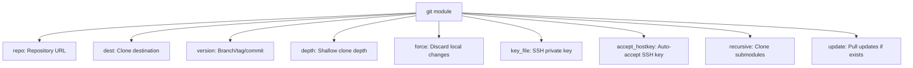

# How to Use the Ansible git Module to Clone Repositories

Author: [nawazdhandala](https://www.github.com/nawazdhandala)

Tags: Ansible, Git, Version Control, Deployment

Description: Learn how to use the Ansible git module to clone repositories, manage versions, handle authentication, and automate code deployment on remote hosts.

---

The `ansible.builtin.git` module is the standard way to clone and manage Git repositories on remote hosts with Ansible. Whether you are deploying application code, pulling configuration files, or setting up development environments, this module handles the common Git operations you need.

## Basic Repository Clone

The simplest use case is cloning a repository to a target directory:

```yaml
# playbook-basic-clone.yml
# Clones a public Git repository to the specified destination
- name: Clone a Git repository
  hosts: webservers
  become: true

  tasks:
    - name: Clone the application repository
      ansible.builtin.git:
        repo: "https://github.com/example/myapp.git"
        dest: /opt/myapp
        version: main
```

The `repo` parameter accepts HTTPS or SSH URLs. The `dest` parameter is where the repository will be cloned on the remote host. If the directory already exists with the correct repository, Ansible will pull updates instead of cloning again.

## Cloning with Version Control

Specify a branch, tag, or commit hash with the `version` parameter:

```yaml
# playbook-versioned-clone.yml
# Demonstrates cloning at specific branches, tags, and commit SHAs
- name: Clone specific versions
  hosts: webservers
  become: true

  tasks:
    - name: Clone specific branch
      ansible.builtin.git:
        repo: "https://github.com/example/myapp.git"
        dest: /opt/myapp
        version: develop

    - name: Clone specific tag
      ansible.builtin.git:
        repo: "https://github.com/example/myapp.git"
        dest: /opt/myapp-release
        version: v2.1.0

    - name: Clone specific commit
      ansible.builtin.git:
        repo: "https://github.com/example/myapp.git"
        dest: /opt/myapp-pinned
        version: "a1b2c3d4e5f6"
```

## Clone with Authentication

For private repositories, you can use HTTPS with tokens or SSH with keys:

```yaml
# playbook-auth-clone.yml
# Clones private repositories using HTTPS token and SSH key methods
- name: Clone private repositories
  hosts: webservers
  become: true

  tasks:
    - name: Clone with HTTPS token
      ansible.builtin.git:
        repo: "https://{{ github_token }}@github.com/myorg/private-repo.git"
        dest: /opt/private-app
        version: main
      vars:
        github_token: "{{ lookup('env', 'GITHUB_TOKEN') }}"

    - name: Clone with SSH
      ansible.builtin.git:
        repo: "git@github.com:myorg/private-repo.git"
        dest: /opt/private-app-ssh
        version: main
        key_file: /home/deploy/.ssh/deploy_key
        accept_hostkey: true
```

## Module Parameters Overview



## Shallow Clone for Speed

For large repositories, use `depth` to perform a shallow clone:

```yaml
# playbook-shallow-clone.yml
# Performs a shallow clone with limited history for faster deployment
- name: Shallow clone for deployment
  hosts: webservers
  become: true

  tasks:
    - name: Shallow clone (only latest commit)
      ansible.builtin.git:
        repo: "https://github.com/example/large-repo.git"
        dest: /opt/app
        version: main
        depth: 1
```

This downloads only the latest commit instead of the entire history, saving bandwidth and time.

## Setting File Ownership

Control the ownership of the cloned files:

```yaml
# playbook-ownership.yml
# Clones a repository and sets the file ownership to the application user
- name: Clone with proper ownership
  hosts: webservers
  become: true

  tasks:
    - name: Ensure app user exists
      ansible.builtin.user:
        name: appuser
        system: true
        create_home: false

    - name: Clone repository as appuser
      ansible.builtin.git:
        repo: "https://github.com/example/myapp.git"
        dest: /opt/myapp
        version: main
      become_user: appuser

    - name: Alternative: clone then chown
      ansible.builtin.git:
        repo: "https://github.com/example/myapp.git"
        dest: /opt/myapp-alt
        version: main

    - name: Set ownership
      ansible.builtin.file:
        path: /opt/myapp-alt
        owner: appuser
        group: appuser
        recurse: true
```

## Handling Clone Updates

When the destination already exists, the git module will update it:

```yaml
# playbook-update.yml
# Clones a repo and handles subsequent updates on re-runs
- name: Clone or update repository
  hosts: webservers
  become: true

  tasks:
    - name: Clone/update the application
      ansible.builtin.git:
        repo: "https://github.com/example/myapp.git"
        dest: /opt/myapp
        version: main
        update: true
      register: git_result

    - name: Show what happened
      ansible.builtin.debug:
        msg: >-
          
          Repository updated. Before: {{ git_result.before }}, After: {{ git_result.after }}
          
          Repository already at the desired version.
          

    - name: Run post-update tasks only if code changed
      ansible.builtin.shell: |
        cd /opt/myapp
        npm install
        npm run build
      when: git_result.changed
```

## Cloning Multiple Repositories

```yaml
# playbook-multi-clone.yml
# Clones multiple repositories using a loop over a variable list
- name: Clone multiple repos
  hosts: webservers
  become: true
  vars:
    repositories:
      - name: frontend
        repo: "https://github.com/example/frontend.git"
        dest: /opt/frontend
        version: v3.0.0
      - name: backend
        repo: "https://github.com/example/backend.git"
        dest: /opt/backend
        version: v2.5.0
      - name: shared-libs
        repo: "https://github.com/example/shared-libs.git"
        dest: /opt/shared-libs
        version: main

  tasks:
    - name: Clone all repositories
      ansible.builtin.git:
        repo: "{{ item.repo }}"
        dest: "{{ item.dest }}"
        version: "{{ item.version }}"
        depth: 1
      loop: "{{ repositories }}"
      loop_control:
        label: "{{ item.name }}"
      register: clone_results

    - name: Show clone results
      ansible.builtin.debug:
        msg: "{{ item.item.name }}: {{ 'updated' if item.changed else 'no change' }}"
      loop: "{{ clone_results.results }}"
      loop_control:
        label: "{{ item.item.name }}"
```

## Practical Example: Application Deployment

```yaml
# playbook-deploy.yml
# Full deployment workflow: clone, install dependencies, build, and restart
- name: Deploy application from Git
  hosts: webservers
  become: true
  vars:
    app_version: "v2.1.0"
    app_repo: "https://github.com/example/myapp.git"
    app_dir: /opt/myapp

  tasks:
    - name: Clone application code
      ansible.builtin.git:
        repo: "{{ app_repo }}"
        dest: "{{ app_dir }}"
        version: "{{ app_version }}"
        force: true
      register: git_clone
      notify: Restart application

    - name: Install dependencies
      ansible.builtin.shell: |
        cd {{ app_dir }}
        pip install -r requirements.txt
      when: git_clone.changed

    - name: Run database migrations
      ansible.builtin.shell: |
        cd {{ app_dir }}
        python manage.py migrate
      when: git_clone.changed

    - name: Collect static files
      ansible.builtin.shell: |
        cd {{ app_dir }}
        python manage.py collectstatic --noinput
      when: git_clone.changed

  handlers:
    - name: Restart application
      ansible.builtin.systemd:
        name: myapp
        state: restarted
```

## Error Handling

```yaml
# playbook-error-handling.yml
# Handles common Git clone errors with block/rescue
- name: Clone with error handling
  hosts: webservers
  become: true

  tasks:
    - name: Attempt to clone repository
      block:
        - name: Clone the repo
          ansible.builtin.git:
            repo: "https://github.com/example/myapp.git"
            dest: /opt/myapp
            version: main
          register: git_result

      rescue:
        - name: Clean up failed clone
          ansible.builtin.file:
            path: /opt/myapp
            state: absent

        - name: Retry clone from scratch
          ansible.builtin.git:
            repo: "https://github.com/example/myapp.git"
            dest: /opt/myapp
            version: main
```

## Summary

The `ansible.builtin.git` module is the standard tool for cloning and updating Git repositories on remote hosts. Use `version` to pin to a branch, tag, or commit. Use `depth: 1` for shallow clones that save time and bandwidth. Use `key_file` for SSH authentication and token-embedded URLs for HTTPS. The module is idempotent, so it will only pull changes when the remote has new commits. Register the result and check `.changed` to conditionally run post-deployment tasks like building, migrating, and restarting services.
