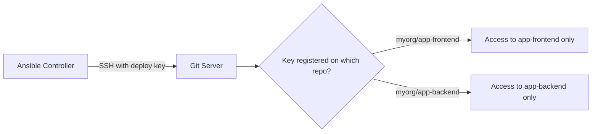

# How to Use the Ansible git Module with Deploy Keys

Author: [nawazdhandala](https://www.github.com/nawazdhandala)

Tags: Ansible, Git, Deploy Keys, Security

Description: Learn how to use deploy keys with the Ansible git module for secure, repository-scoped access to private Git repositories during automated deployments.

---

Deploy keys are SSH keys that grant access to a single repository. Unlike personal SSH keys or access tokens tied to a user account, deploy keys are scoped to one repository and can be set to read-only. This makes them ideal for deployment automation where you want minimal permissions.

## What Are Deploy Keys?

Deploy keys are SSH public keys registered on a specific repository (on GitHub, GitLab, Bitbucket, etc.). When Ansible connects to the Git server using the corresponding private key, it gets access to that one repository only.



## Generating a Deploy Key

First, generate an SSH key pair specifically for deployment:

```yaml
# playbook-generate-deploy-key.yml
# Generates an ed25519 SSH key pair for use as a Git deploy key
- name: Generate deploy key
  hosts: localhost
  gather_facts: false

  tasks:
    - name: Generate ed25519 key pair
      community.crypto.openssh_keypair:
        path: "./deploy_keys/myapp_deploy_key"
        type: ed25519
        comment: "deploy-key-myapp@ansible"
      register: key_result

    - name: Show public key to add to GitHub/GitLab
      ansible.builtin.debug:
        msg: |
          Add this public key to your repository's deploy keys:
          {{ key_result.public_key }}
```

After generating the key, add the public key to your repository settings:
- **GitHub**: Repository > Settings > Deploy keys > Add deploy key
- **GitLab**: Repository > Settings > Repository > Deploy keys
- **Bitbucket**: Repository > Settings > Access keys

## Deploying and Using the Deploy Key

```yaml
# playbook-use-deploy-key.yml
# Deploys the SSH key to the server and uses it to clone a private repository
- name: Deploy with deploy key
  hosts: webservers
  become: true
  vars:
    deploy_key_content: "{{ lookup('file', 'deploy_keys/myapp_deploy_key') }}"

  tasks:
    - name: Create deployment SSH directory
      ansible.builtin.file:
        path: /opt/deploy/.ssh
        state: directory
        owner: root
        group: root
        mode: "0700"

    - name: Deploy the SSH private key
      ansible.builtin.copy:
        content: "{{ deploy_key_content }}"
        dest: /opt/deploy/.ssh/myapp_key
        owner: root
        group: root
        mode: "0600"
      no_log: true

    - name: Clone repository using deploy key
      ansible.builtin.git:
        repo: "git@github.com:myorg/myapp.git"
        dest: /opt/myapp
        version: main
        key_file: /opt/deploy/.ssh/myapp_key
        accept_hostkey: true

    - name: Clean up deploy key (optional - for ephemeral use)
      ansible.builtin.file:
        path: /opt/deploy/.ssh/myapp_key
        state: absent
```

## Multiple Repositories with Separate Deploy Keys

Each repository gets its own deploy key:

```yaml
# playbook-multi-deploy-keys.yml
# Manages separate deploy keys for multiple private repositories
- name: Deploy multiple repos with separate keys
  hosts: webservers
  become: true
  vars:
    repositories:
      - name: frontend
        repo: "git@github.com:myorg/frontend.git"
        key_file: deploy_keys/frontend_key
        dest: /opt/frontend
        version: v3.0.0
      - name: backend
        repo: "git@github.com:myorg/backend.git"
        key_file: deploy_keys/backend_key
        dest: /opt/backend
        version: v2.5.0
      - name: shared-config
        repo: "git@github.com:myorg/shared-config.git"
        key_file: deploy_keys/config_key
        dest: /opt/shared-config
        version: main

  tasks:
    - name: Create SSH directory
      ansible.builtin.file:
        path: /opt/deploy/.ssh
        state: directory
        mode: "0700"

    - name: Deploy SSH keys for each repository
      ansible.builtin.copy:
        content: "{{ lookup('file', item.key_file) }}"
        dest: "/opt/deploy/.ssh/{{ item.name }}_key"
        mode: "0600"
      loop: "{{ repositories }}"
      loop_control:
        label: "{{ item.name }}"
      no_log: true

    - name: Clone each repository with its deploy key
      ansible.builtin.git:
        repo: "{{ item.repo }}"
        dest: "{{ item.dest }}"
        version: "{{ item.version }}"
        key_file: "/opt/deploy/.ssh/{{ item.name }}_key"
        accept_hostkey: true
      loop: "{{ repositories }}"
      loop_control:
        label: "{{ item.name }}@{{ item.version }}"
```

## Using Ansible Vault with Deploy Keys

Store deploy keys securely with Ansible Vault:

```bash
# Encrypt the deploy key
ansible-vault encrypt deploy_keys/myapp_deploy_key
```

```yaml
# playbook-vault-deploy-key.yml
# Uses a vault-encrypted deploy key for secure deployment
- name: Deploy with vault-encrypted key
  hosts: webservers
  become: true

  tasks:
    - name: Write decrypted key to temp file
      ansible.builtin.copy:
        content: "{{ lookup('file', 'deploy_keys/myapp_deploy_key') }}"
        dest: /tmp/.deploy_key
        mode: "0600"
      no_log: true

    - name: Clone using deploy key
      ansible.builtin.git:
        repo: "git@github.com:myorg/myapp.git"
        dest: /opt/myapp
        version: main
        key_file: /tmp/.deploy_key
        accept_hostkey: true

    - name: Remove temp key
      ansible.builtin.file:
        path: /tmp/.deploy_key
        state: absent
      always_run: true
```

## SSH Config for Deploy Keys

When you have multiple deploy keys, an SSH config file maps each host alias to the right key:

```yaml
# playbook-ssh-config.yml
# Configures SSH with host aliases so each repo uses the correct deploy key
- name: Configure SSH for deploy keys
  hosts: webservers
  become: true

  tasks:
    - name: Write SSH config with host aliases
      ansible.builtin.copy:
        content: |
          # Frontend repo
          Host github-frontend
            HostName github.com
            User git
            IdentityFile /opt/deploy/.ssh/frontend_key
            IdentitiesOnly yes
            StrictHostKeyChecking accept-new

          # Backend repo
          Host github-backend
            HostName github.com
            User git
            IdentityFile /opt/deploy/.ssh/backend_key
            IdentitiesOnly yes
            StrictHostKeyChecking accept-new
        dest: /opt/deploy/.ssh/config
        mode: "0600"

    - name: Clone frontend using SSH alias
      ansible.builtin.git:
        repo: "git@github-frontend:myorg/frontend.git"
        dest: /opt/frontend
        version: main
        ssh_opts: "-F /opt/deploy/.ssh/config"

    - name: Clone backend using SSH alias
      ansible.builtin.git:
        repo: "git@github-backend:myorg/backend.git"
        dest: /opt/backend
        version: main
        ssh_opts: "-F /opt/deploy/.ssh/config"
```

## Read-Only vs Read-Write Deploy Keys

GitHub and GitLab let you choose whether a deploy key has write access:

```yaml
# playbook-readonly-key.yml
# Demonstrates using a read-only deploy key (clone only, no push)
- name: Use read-only deploy key
  hosts: webservers
  become: true

  tasks:
    - name: Clone with read-only deploy key
      ansible.builtin.git:
        repo: "git@github.com:myorg/myapp.git"
        dest: /opt/myapp
        version: main
        key_file: /opt/deploy/.ssh/readonly_key
        accept_hostkey: true
```

For most deployment scenarios, read-only access is sufficient and more secure. Only use read-write keys if your deployment process needs to push changes back to the repository (like updating version files or committing build artifacts).

## Rotating Deploy Keys

```yaml
# playbook-rotate-keys.yml
# Rotates deploy keys by generating a new pair and deploying it
- name: Rotate deploy keys
  hosts: webservers
  become: true

  tasks:
    - name: Generate new deploy key
      community.crypto.openssh_keypair:
        path: /opt/deploy/.ssh/myapp_key_new
        type: ed25519
        comment: "deploy-key-myapp@ansible-{{ lookup('pipe', 'date +%Y%m%d') }}"
      register: new_key

    - name: Show new public key (add to repository before continuing)
      ansible.builtin.debug:
        msg: "Add this key to the repository, then run the next phase: {{ new_key.public_key }}"
      when: new_key.changed

    - name: Replace old key with new key
      ansible.builtin.copy:
        src: /opt/deploy/.ssh/myapp_key_new
        dest: /opt/deploy/.ssh/myapp_key
        remote_src: true
        mode: "0600"

    - name: Test the new key works
      ansible.builtin.git:
        repo: "git@github.com:myorg/myapp.git"
        dest: /opt/myapp
        version: main
        key_file: /opt/deploy/.ssh/myapp_key
        accept_hostkey: true
```

## Summary

Deploy keys provide repository-scoped SSH access that is more secure than personal tokens or user SSH keys. Generate a unique key pair for each repository, add the public key to the repository settings, and use the private key with the `key_file` parameter in the Ansible git module. Store private keys in Ansible Vault for security. When managing multiple repositories, use separate deploy keys for each and manage them with SSH config host aliases. Prefer read-only deploy keys for deployment scenarios, and rotate keys periodically as part of your security practices.
