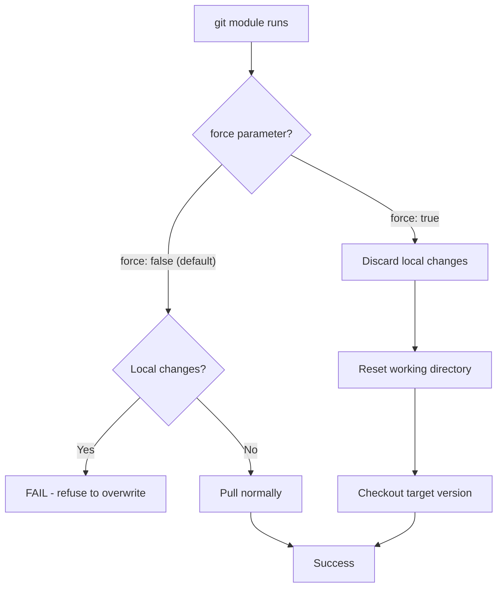

# How to Use the Ansible git Module with Force Pull

Author: [nawazdhandala](https://www.github.com/nawazdhandala)

Tags: Ansible, Git, Deployment, Force Pull

Description: Learn how to use the Ansible git module with force pull to handle dirty working directories, discarding local changes for clean deployments every time.

---

Sometimes the working directory on a remote host gets modified outside of your deployment process. Configuration files get edited manually, log files get written into the repo directory, or a previous deployment left uncommitted changes. In these situations, the normal git pull will fail. The `force` parameter in the Ansible git module solves this by discarding local changes.

## The Problem: Dirty Working Directory

Without `force`, the git module will fail if there are local modifications:

```
fatal: could not reset index file to revision 'HEAD'
```

Or:

```
Local modifications exist in repository (force=no)
```

## Using force: true

The `force` parameter tells Ansible to discard any local changes and force the checkout:

```yaml
# playbook-force-pull.yml
# Force pulls the latest code, discarding any local modifications
- name: Force pull latest code
  hosts: webservers
  become: true

  tasks:
    - name: Deploy with force (discard local changes)
      ansible.builtin.git:
        repo: "https://github.com/example/myapp.git"
        dest: /opt/myapp
        version: main
        force: true
      register: deploy_result

    - name: Show deployment result
      ansible.builtin.debug:
        msg: "Commit: {{ deploy_result.after[:12] }}, Changed: {{ deploy_result.changed }}"
```

What `force: true` does behind the scenes:
1. Resets the working directory (`git checkout -- .`)
2. Cleans untracked files
3. Updates to the specified version

## Force Pull Decision Flow



## When to Use force: true

Use force when:
- You do not control what happens on the server between deployments
- The deployment process is the single source of truth for the code
- Manual edits on production should always be overwritten

Do NOT use force when:
- Local changes should be preserved (like user-uploaded files inside the repo)
- You want the deployment to fail fast if someone modified files manually

```yaml
# playbook-safe-force.yml
# Backs up local changes before force pulling
- name: Safe force pull with backup
  hosts: webservers
  become: true

  tasks:
    - name: Check for local modifications
      ansible.builtin.shell: "cd /opt/myapp && git status --porcelain"
      register: git_status
      changed_when: false
      failed_when: false

    - name: Backup local changes if any
      ansible.builtin.shell: |
        cd /opt/myapp
        git stash save "ansible-backup-$(date +%Y%m%d-%H%M%S)"
      when: git_status.stdout | length > 0

    - name: Force pull the latest code
      ansible.builtin.git:
        repo: "https://github.com/example/myapp.git"
        dest: /opt/myapp
        version: main
        force: true
```

## Force Pull with Pre-Flight Checks

```yaml
# playbook-preflight-force.yml
# Runs pre-flight checks before force pulling to ensure safe deployment
- name: Pre-flight check then force deploy
  hosts: webservers
  become: true

  tasks:
    - name: Check current state
      ansible.builtin.shell: |
        cd /opt/myapp 2>/dev/null && echo "exists" || echo "new"
      register: repo_state
      changed_when: false

    - name: Get current commit if repo exists
      ansible.builtin.shell: "cd /opt/myapp && git rev-parse --short HEAD"
      register: current_commit
      changed_when: false
      when: repo_state.stdout == "exists"

    - name: Report pre-deployment state
      ansible.builtin.debug:
        msg: |
          Repository state: {{ repo_state.stdout }}
          Current commit: {{ current_commit.stdout | default('N/A') }}
          Target version: v2.1.0

    - name: Force deploy
      ansible.builtin.git:
        repo: "https://github.com/example/myapp.git"
        dest: /opt/myapp
        version: v2.1.0
        force: true
      register: deploy

    - name: Post-deployment report
      ansible.builtin.debug:
        msg: |
          Previous: {{ current_commit.stdout | default('fresh clone') }}
          Current: {{ deploy.after[:12] }}
          Changed: {{ deploy.changed }}
```

## Force Pull with Excluded Files

When you need to force pull but preserve certain local files:

```yaml
# playbook-force-preserve.yml
# Force pulls but preserves local config files by backing up and restoring them
- name: Force pull while preserving local configs
  hosts: webservers
  become: true
  vars:
    preserve_files:
      - config/local_settings.py
      - .env
      - uploads/

  tasks:
    - name: Backup files to preserve
      ansible.builtin.shell: |
        cd /opt/myapp
        mkdir -p /tmp/deploy_backup
        
        if [ -e "{{ f }}" ]; then
          cp -a "{{ f }}" "/tmp/deploy_backup/{{ f | basename }}"
        fi
        
      changed_when: false
      failed_when: false

    - name: Force pull latest code
      ansible.builtin.git:
        repo: "https://github.com/example/myapp.git"
        dest: /opt/myapp
        version: main
        force: true

    - name: Restore preserved files
      ansible.builtin.shell: |
        cd /opt/myapp
        
        if [ -e "/tmp/deploy_backup/{{ f | basename }}" ]; then
          cp -a "/tmp/deploy_backup/{{ f | basename }}" "{{ f }}"
        fi
        
      changed_when: false

    - name: Clean up backup
      ansible.builtin.file:
        path: /tmp/deploy_backup
        state: absent
```

## Force Pull in Rolling Deployment

```yaml
# playbook-rolling-force.yml
# Performs a rolling deployment with force pull, one server at a time
- name: Rolling force deployment
  hosts: webservers
  become: true
  serial: 1
  vars:
    app_version: "v2.2.0"

  tasks:
    - name: Remove from load balancer
      ansible.builtin.uri:
        url: "http://lb.internal/api/remove"
        method: POST
        body_format: json
        body:
          host: "{{ inventory_hostname }}"
      delegate_to: localhost

    - name: Wait for connections to drain
      ansible.builtin.pause:
        seconds: 10

    - name: Force deploy new version
      ansible.builtin.git:
        repo: "https://github.com/example/myapp.git"
        dest: /opt/myapp
        version: "{{ app_version }}"
        force: true
      register: deploy

    - name: Rebuild if code changed
      ansible.builtin.shell: "cd /opt/myapp && make build"
      when: deploy.changed

    - name: Restart application
      ansible.builtin.systemd:
        name: myapp
        state: restarted
      when: deploy.changed

    - name: Health check
      ansible.builtin.uri:
        url: "http://localhost:8080/health"
        status_code: 200
      retries: 10
      delay: 3

    - name: Add back to load balancer
      ansible.builtin.uri:
        url: "http://lb.internal/api/add"
        method: POST
        body_format: json
        body:
          host: "{{ inventory_hostname }}"
      delegate_to: localhost
```

## Handling .gitignore Files During Force Pull

Force pull respects `.gitignore` for untracked files. Files listed in `.gitignore` that are not tracked by Git will not be removed:

```yaml
# playbook-gitignore-safe.yml
# Demonstrates that force pull preserves untracked gitignored files
- name: Force pull with gitignore safety
  hosts: webservers
  become: true

  tasks:
    - name: Create local files that should survive force pull
      ansible.builtin.copy:
        content: "LOG_LEVEL=debug"
        dest: /opt/myapp/.env
      when: false  # Only needed once

    - name: Force pull (gitignored files like .env are preserved)
      ansible.builtin.git:
        repo: "https://github.com/example/myapp.git"
        dest: /opt/myapp
        version: main
        force: true

    - name: Verify .env still exists (if it was gitignored)
      ansible.builtin.stat:
        path: /opt/myapp/.env
      register: env_file

    - name: Report
      ansible.builtin.debug:
        msg: ".env preserved: {{ env_file.stat.exists }}"
```

## Summary

The `force: true` parameter in the Ansible git module is your tool for handling dirty working directories during deployment. It discards local modifications and forces the checkout to the specified version. Use it when the remote repository is the single source of truth and local edits should never block a deployment. For cases where certain local files need to be preserved, back them up before the force pull and restore them afterward. Combine force pull with rolling deployments and health checks for zero-downtime production updates. Just remember that force is destructive by nature, so always understand what local changes might be lost before enabling it.
