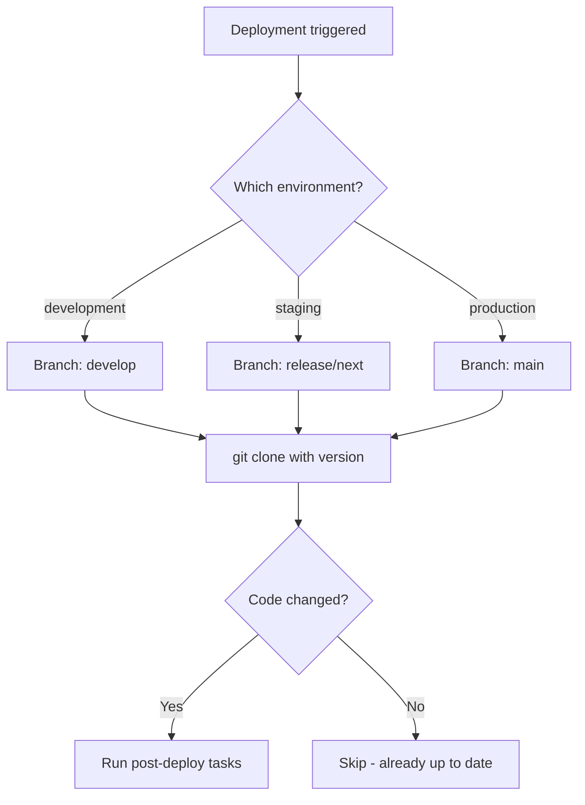

# How to Use the Ansible git Module with Specific Branches

Author: [nawazdhandala](https://www.github.com/nawazdhandala)

Tags: Ansible, Git, Branches, Deployment

Description: Learn how to use the Ansible git module to clone and switch between specific Git branches for environment-based deployments and feature testing.

---

Branch management is central to Git workflows, and when deploying with Ansible, you frequently need to clone or switch to specific branches. The `version` parameter in the git module handles this, but there are several patterns worth knowing for different deployment scenarios.

## Cloning a Specific Branch

The `version` parameter accepts branch names, tags, and commit hashes:

```yaml
# playbook-clone-branch.yml
# Clones a repository and checks out the develop branch
- name: Clone specific branch
  hosts: webservers
  become: true

  tasks:
    - name: Clone the develop branch
      ansible.builtin.git:
        repo: "https://github.com/example/myapp.git"
        dest: /opt/myapp
        version: develop

    - name: Verify the current branch
      ansible.builtin.shell: "cd /opt/myapp && git branch --show-current"
      register: current_branch
      changed_when: false

    - name: Show current branch
      ansible.builtin.debug:
        msg: "Current branch: {{ current_branch.stdout }}"
```

## Environment-Based Branch Selection

Deploy different branches to different environments:

```yaml
# playbook-env-branches.yml
# Selects the Git branch based on the target deployment environment
- name: Deploy environment-specific branch
  hosts: all
  become: true
  vars:
    branch_map:
      development: develop
      staging: release/next
      production: main
    deploy_env: "{{ environment | default('development') }}"

  tasks:
    - name: Determine target branch
      ansible.builtin.set_fact:
        target_branch: "{{ branch_map[deploy_env] }}"

    - name: Clone the appropriate branch
      ansible.builtin.git:
        repo: "https://github.com/example/myapp.git"
        dest: /opt/myapp
        version: "{{ target_branch }}"
      register: git_result

    - name: Show deployment info
      ansible.builtin.debug:
        msg: "Deployed {{ target_branch }} branch (commit: {{ git_result.after[:8] }})"
```

## Branch Selection Flow



## Switching Between Branches

When you need to switch branches on an existing clone:

```yaml
# playbook-switch-branch.yml
# Switches an existing repository clone to a different branch
- name: Switch branches
  hosts: webservers
  become: true
  vars:
    new_branch: feature/new-dashboard

  tasks:
    - name: Switch to new branch
      ansible.builtin.git:
        repo: "https://github.com/example/myapp.git"
        dest: /opt/myapp
        version: "{{ new_branch }}"
        force: true
      register: branch_switch

    - name: Show switch result
      ansible.builtin.debug:
        msg: "Switched from {{ branch_switch.before }} to {{ branch_switch.after }}"
      when: branch_switch.changed
```

The `force: true` parameter discards any local changes when switching branches. Without it, the switch will fail if there are uncommitted modifications.

## Feature Branch Deployment

Deploy feature branches for testing:

```yaml
# playbook-feature-branch.yml
# Deploys a feature branch to a staging server for testing
- name: Deploy feature branch for testing
  hosts: staging_servers
  become: true
  vars:
    feature_branch: "{{ branch | default('develop') }}"
    app_dir: /opt/myapp

  tasks:
    - name: Deploy feature branch
      ansible.builtin.git:
        repo: "https://github.com/example/myapp.git"
        dest: "{{ app_dir }}"
        version: "{{ feature_branch }}"
        force: true
      register: deploy_result

    - name: Install dependencies if code changed
      ansible.builtin.shell: |
        cd {{ app_dir }}
        pip install -r requirements.txt
      when: deploy_result.changed

    - name: Restart application
      ansible.builtin.systemd:
        name: myapp
        state: restarted
      when: deploy_result.changed

    - name: Display deployment summary
      ansible.builtin.debug:
        msg: |
          Branch: {{ feature_branch }}
          Commit: {{ deploy_result.after[:12] }}
          Changed: {{ deploy_result.changed }}
```

Run with: `ansible-playbook playbook-feature-branch.yml -e "branch=feature/new-api"`

## Multiple Branches Side by Side

Deploy multiple branches as separate instances:

```yaml
# playbook-multi-branch.yml
# Deploys multiple branches side by side for comparison testing
- name: Deploy multiple branches
  hosts: staging_servers
  become: true
  vars:
    branches:
      - name: main
        port: 8080
      - name: develop
        port: 8081
      - name: feature/experimental
        port: 8082

  tasks:
    - name: Clone each branch to its own directory
      ansible.builtin.git:
        repo: "https://github.com/example/myapp.git"
        dest: "/opt/myapp-{{ item.name | regex_replace('/', '-') }}"
        version: "{{ item.name }}"
        force: true
      loop: "{{ branches }}"
      loop_control:
        label: "{{ item.name }}"

    - name: Configure each instance
      ansible.builtin.template:
        src: app-config.j2
        dest: "/opt/myapp-{{ item.name | regex_replace('/', '-') }}/config.yml"
      loop: "{{ branches }}"
      loop_control:
        label: "{{ item.name }}"
      vars:
        app_port: "{{ item.port }}"
```

## Tracking Remote Branch Changes

Check if the remote branch has new commits before pulling:

```yaml
# playbook-check-updates.yml
# Checks for remote branch updates before deciding to deploy
- name: Check for branch updates
  hosts: webservers
  become: true

  tasks:
    - name: Get current local commit
      ansible.builtin.shell: "cd /opt/myapp && git rev-parse HEAD"
      register: local_commit
      changed_when: false
      failed_when: false

    - name: Get latest remote commit
      ansible.builtin.shell: "git ls-remote https://github.com/example/myapp.git refs/heads/main | cut -f1"
      register: remote_commit
      changed_when: false
      delegate_to: localhost

    - name: Compare commits
      ansible.builtin.debug:
        msg: >-
          
          No updates available. Both at {{ local_commit.stdout[:12] }}
          
          Update available! Local: {{ local_commit.stdout[:12] }}, Remote: {{ remote_commit.stdout[:12] }}
          

    - name: Pull updates only if needed
      ansible.builtin.git:
        repo: "https://github.com/example/myapp.git"
        dest: /opt/myapp
        version: main
      when: local_commit.stdout != remote_commit.stdout
```

## Handling Branch-Specific Configuration

```yaml
# playbook-branch-config.yml
# Applies branch-specific configuration after cloning
- name: Branch-specific configuration
  hosts: webservers
  become: true
  vars:
    target_branch: "{{ branch | default('main') }}"

  tasks:
    - name: Clone the branch
      ansible.builtin.git:
        repo: "https://github.com/example/myapp.git"
        dest: /opt/myapp
        version: "{{ target_branch }}"
      register: git_result

    - name: Apply production config
      ansible.builtin.template:
        src: config-production.j2
        dest: /opt/myapp/config/settings.yml
      when: target_branch == 'main'

    - name: Apply staging config with debug enabled
      ansible.builtin.template:
        src: config-staging.j2
        dest: /opt/myapp/config/settings.yml
      when: target_branch == 'develop' or target_branch is match('release/.*')

    - name: Apply development config
      ansible.builtin.template:
        src: config-dev.j2
        dest: /opt/myapp/config/settings.yml
      when: target_branch is match('feature/.*')
```

## Summary

The `version` parameter in the Ansible git module accepts branch names, making branch-based deployments straightforward. Use variables and maps to select branches based on environment. Use `force: true` when switching branches on existing clones with potential local changes. For feature branch testing, deploy to isolated directories or ports. Combine branch detection with conditional tasks to apply environment-specific configuration. Always register the git module result and use `.changed` to avoid running unnecessary post-deployment tasks when the code has not actually changed.
