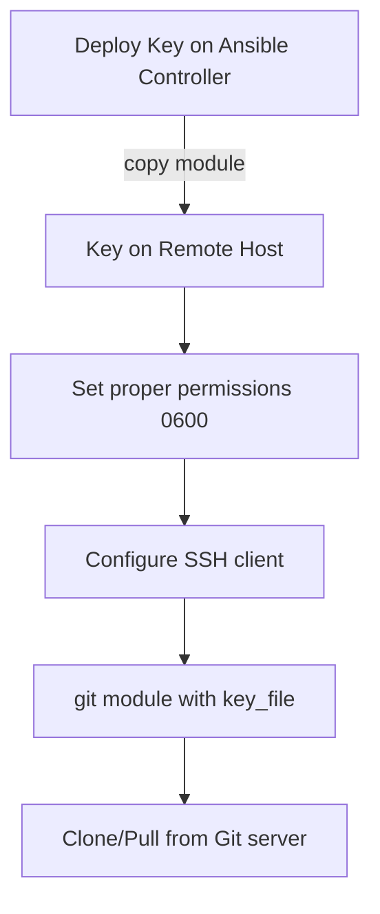

# How to Use the Ansible git Module with SSH Keys

Author: [nawazdhandala](https://www.github.com/nawazdhandala)

Tags: Ansible, Git, SSH, Security

Description: Learn how to use the Ansible git module with SSH keys for secure repository access, including deploy key setup, agent forwarding, and key management.

---

SSH keys are the preferred authentication method for Git operations in production environments. They are more secure than embedding tokens in URLs and can be scoped to specific repositories with deploy keys. This post covers all the patterns for using SSH keys with Ansible's git module.

## Basic SSH Key Usage

The simplest approach uses the `key_file` parameter to specify the SSH private key:

```yaml
# playbook-basic-ssh.yml
# Clones a private repository using an SSH deploy key
- name: Clone with SSH key
  hosts: webservers
  become: true

  tasks:
    - name: Clone private repository
      ansible.builtin.git:
        repo: "git@github.com:myorg/private-app.git"
        dest: /opt/app
        version: main
        key_file: /home/deploy/.ssh/deploy_key
        accept_hostkey: true
```

The `accept_hostkey: true` parameter automatically accepts the SSH host key from the Git server. This is useful for first-time connections but should be used carefully in production.

## Deploying SSH Keys First

Before cloning, you need the SSH key on the remote host:

```yaml
# playbook-deploy-key-setup.yml
# Deploys an SSH key to the remote host and then clones the repository
- name: Set up SSH key and clone
  hosts: webservers
  become: true
  vars:
    deploy_key: "{{ lookup('file', 'files/deploy_key') }}"
    deploy_key_pub: "{{ lookup('file', 'files/deploy_key.pub') }}"

  tasks:
    - name: Create deploy user
      ansible.builtin.user:
        name: deploy
        system: true
        create_home: true
        shell: /bin/bash

    - name: Create .ssh directory
      ansible.builtin.file:
        path: /home/deploy/.ssh
        state: directory
        owner: deploy
        group: deploy
        mode: "0700"

    - name: Deploy SSH private key
      ansible.builtin.copy:
        content: "{{ deploy_key }}"
        dest: /home/deploy/.ssh/deploy_key
        owner: deploy
        group: deploy
        mode: "0600"

    - name: Deploy SSH public key
      ansible.builtin.copy:
        content: "{{ deploy_key_pub }}"
        dest: /home/deploy/.ssh/deploy_key.pub
        owner: deploy
        group: deploy
        mode: "0644"

    - name: Configure SSH for GitHub
      ansible.builtin.copy:
        content: |
          Host github.com
            IdentityFile /home/deploy/.ssh/deploy_key
            StrictHostKeyChecking accept-new
        dest: /home/deploy/.ssh/config
        owner: deploy
        group: deploy
        mode: "0600"

    - name: Clone repository
      ansible.builtin.git:
        repo: "git@github.com:myorg/private-app.git"
        dest: /opt/app
        version: main
        key_file: /home/deploy/.ssh/deploy_key
        accept_hostkey: true
      become_user: deploy
```

## SSH Key Flow



## Using Ansible Vault for SSH Keys

Never store SSH keys in plain text. Use Ansible Vault:

```bash
# Encrypt the deploy key with Ansible Vault
ansible-vault encrypt files/deploy_key
```

```yaml
# playbook-vault-key.yml
# Deploys a vault-encrypted SSH key for secure Git operations
- name: Clone with vault-encrypted SSH key
  hosts: webservers
  become: true
  vars:
    encrypted_deploy_key: "{{ lookup('file', 'files/deploy_key') }}"

  tasks:
    - name: Deploy encrypted key (decrypted at runtime)
      ansible.builtin.copy:
        content: "{{ encrypted_deploy_key }}"
        dest: /tmp/deploy_key
        mode: "0600"
      no_log: true

    - name: Clone repository
      ansible.builtin.git:
        repo: "git@github.com:myorg/private-app.git"
        dest: /opt/app
        version: main
        key_file: /tmp/deploy_key
        accept_hostkey: true

    - name: Remove temporary key
      ansible.builtin.file:
        path: /tmp/deploy_key
        state: absent
```

## SSH Agent Forwarding

Instead of copying keys to remote hosts, you can forward your local SSH agent:

```yaml
# playbook-agent-forward.yml
# Uses SSH agent forwarding to clone without placing keys on remote hosts
- name: Clone using SSH agent forwarding
  hosts: webservers
  become: true
  vars:
    ansible_ssh_common_args: "-o ForwardAgent=yes"

  tasks:
    - name: Clone using forwarded SSH agent
      ansible.builtin.git:
        repo: "git@github.com:myorg/private-app.git"
        dest: /opt/app
        version: main
        accept_hostkey: true
      become: false
```

To use agent forwarding, you need to:
1. Add your key to the local SSH agent: `ssh-add ~/.ssh/deploy_key`
2. Enable ForwardAgent in your SSH config or ansible.cfg

## Multiple Repositories with Different Keys

When different repositories require different keys:

```yaml
# playbook-multi-key.yml
# Clones multiple private repos, each with its own SSH deploy key
- name: Clone repos with different keys
  hosts: webservers
  become: true
  vars:
    repositories:
      - name: frontend
        repo: "git@github.com:myorg/frontend.git"
        dest: /opt/frontend
        key: "{{ lookup('file', 'keys/frontend_deploy_key') }}"
      - name: backend
        repo: "git@github.com:myorg/backend.git"
        dest: /opt/backend
        key: "{{ lookup('file', 'keys/backend_deploy_key') }}"
      - name: shared-config
        repo: "git@github.com:myorg/shared-config.git"
        dest: /opt/shared-config
        key: "{{ lookup('file', 'keys/config_deploy_key') }}"

  tasks:
    - name: Deploy SSH keys and clone each repo
      ansible.builtin.include_tasks: clone-with-key.yml
      loop: "{{ repositories }}"
      loop_control:
        loop_var: repo_item
        label: "{{ repo_item.name }}"
```

The included task file:

```yaml
# clone-with-key.yml
# Task file that deploys a temporary SSH key and clones a single repo
- name: Deploy temporary SSH key for {{ repo_item.name }}
  ansible.builtin.copy:
    content: "{{ repo_item.key }}"
    dest: "/tmp/key_{{ repo_item.name }}"
    mode: "0600"
  no_log: true

- name: Clone {{ repo_item.name }}
  ansible.builtin.git:
    repo: "{{ repo_item.repo }}"
    dest: "{{ repo_item.dest }}"
    version: main
    key_file: "/tmp/key_{{ repo_item.name }}"
    accept_hostkey: true

- name: Remove temporary key for {{ repo_item.name }}
  ansible.builtin.file:
    path: "/tmp/key_{{ repo_item.name }}"
    state: absent
```

## Generating Deploy Keys with Ansible

```yaml
# playbook-generate-key.yml
# Generates a new SSH key pair for Git deploy access
- name: Generate SSH deploy key
  hosts: webservers
  become: true

  tasks:
    - name: Generate ed25519 SSH key pair
      community.crypto.openssh_keypair:
        path: /home/deploy/.ssh/deploy_key
        type: ed25519
        comment: "deploy@{{ inventory_hostname }}"
        owner: deploy
        group: deploy
      register: ssh_key

    - name: Show public key (add this to GitHub/GitLab as deploy key)
      ansible.builtin.debug:
        msg: "{{ ssh_key.public_key }}"
      when: ssh_key.changed
```

## Known Hosts Management

Instead of `accept_hostkey: true`, you can manage known hosts explicitly:

```yaml
# playbook-known-hosts.yml
# Pre-populates known_hosts file with GitHub's SSH key for security
- name: Manage known hosts securely
  hosts: webservers
  become: true

  tasks:
    - name: Add GitHub SSH key to known hosts
      ansible.builtin.known_hosts:
        name: github.com
        key: "github.com ssh-ed25519 AAAAC3NzaC1lZDI1NTE5AAAAIOMqqnkVzrm0SdG6UOoqKLsabgH5C9okWi0dh2l9GKJl"
        state: present

    - name: Add GitLab SSH key
      ansible.builtin.known_hosts:
        name: gitlab.com
        key: "gitlab.com ssh-ed25519 AAAAC3NzaC1lZDI1NTE5AAAAIAfuCHKVTjquxvt6CM6tdG4SLp1Btn/nOeHHE5UOzRdf"
        state: present

    - name: Now clone without accept_hostkey
      ansible.builtin.git:
        repo: "git@github.com:myorg/app.git"
        dest: /opt/app
        version: main
        key_file: /home/deploy/.ssh/deploy_key
```

## Summary

SSH key authentication with the Ansible git module provides secure, token-free access to private repositories. Deploy keys to remote hosts with proper permissions (0600 for private keys), configure the SSH client, and use `key_file` in the git module. For maximum security, use Ansible Vault for key storage, manage known_hosts explicitly instead of blindly accepting host keys, and clean up temporary keys after use. SSH agent forwarding is a good alternative when you do not want keys on the remote hosts at all, though it requires a running SSH agent on the controller.
