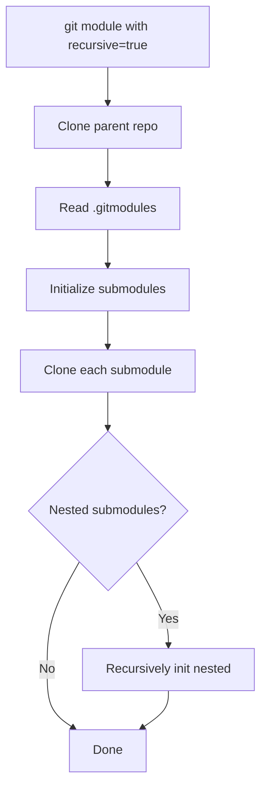

# How to Use the Ansible git Module with Submodules

Author: [nawazdhandala](https://www.github.com/nawazdhandala)

Tags: Ansible, Git, Submodules, Deployment

Description: Learn how to use the Ansible git module with Git submodules for cloning repositories that include shared libraries, themes, or dependencies as submodules.

---

Git submodules let you include one repository inside another. They are commonly used for shared libraries, themes, plugins, and vendor dependencies. When deploying with Ansible, you need to handle submodules explicitly because they are not initialized or updated by default.

## Cloning with Submodules

The `recursive` parameter tells the git module to initialize and update submodules:

```yaml
# playbook-recursive-clone.yml
# Clones a repository and automatically initializes all submodules
- name: Clone repository with submodules
  hosts: webservers
  become: true

  tasks:
    - name: Clone with submodules
      ansible.builtin.git:
        repo: "https://github.com/example/myapp.git"
        dest: /opt/myapp
        version: main
        recursive: true
```

Setting `recursive: true` is equivalent to running `git clone --recursive`. It initializes and clones all submodules, including nested submodules (submodules within submodules).

## Without recursive Parameter

If you omit `recursive`, only the parent repository is cloned. Submodule directories will exist but be empty:

```yaml
# playbook-no-recursive.yml
# Shows what happens when you clone without the recursive parameter
- name: Clone without submodules (default)
  hosts: webservers
  become: true

  tasks:
    - name: Clone parent only
      ansible.builtin.git:
        repo: "https://github.com/example/myapp.git"
        dest: /opt/myapp
        version: main
        # recursive defaults to true in newer Ansible versions

    - name: Verify submodule status
      ansible.builtin.shell: "cd /opt/myapp && git submodule status"
      register: submodule_status
      changed_when: false

    - name: Show submodule status
      ansible.builtin.debug:
        msg: "{{ submodule_status.stdout_lines }}"
```

## Submodule Workflow in Ansible



## Handling Private Submodules

When submodules point to private repositories, you need authentication for each:

```yaml
# playbook-private-submodules.yml
# Handles cloning when both parent and submodules are private repositories
- name: Clone with private submodules
  hosts: webservers
  become: true

  tasks:
    - name: Set up SSH config for multiple Git hosts
      ansible.builtin.copy:
        content: |
          Host github.com
            IdentityFile /home/deploy/.ssh/deploy_key
            StrictHostKeyChecking accept-new

          Host gitlab.internal.com
            IdentityFile /home/deploy/.ssh/gitlab_key
            StrictHostKeyChecking accept-new
        dest: /home/deploy/.ssh/config
        owner: deploy
        group: deploy
        mode: "0600"

    - name: Clone with submodules using SSH
      ansible.builtin.git:
        repo: "git@github.com:myorg/myapp.git"
        dest: /opt/myapp
        version: main
        recursive: true
        key_file: /home/deploy/.ssh/deploy_key
        accept_hostkey: true
      become_user: deploy
```

## Selective Submodule Initialization

Sometimes you do not need all submodules. You can initialize them selectively:

```yaml
# playbook-selective-submodules.yml
# Clones without submodules then selectively initializes only the ones needed
- name: Selective submodule initialization
  hosts: webservers
  become: true

  tasks:
    - name: Clone parent without submodules
      ansible.builtin.git:
        repo: "https://github.com/example/myapp.git"
        dest: /opt/myapp
        version: main
        recursive: false

    - name: Initialize only needed submodules
      ansible.builtin.shell: |
        cd /opt/myapp
        git submodule init {{ item }}
        git submodule update {{ item }}
      loop:
        - libs/core-utils
        - libs/auth-module
      register: submodule_result
      changed_when: "'Submodule path' in submodule_result.stdout"
```

## Updating Submodules

When updating a deployment, you may need to update submodules to match the parent:

```yaml
# playbook-update-submodules.yml
# Updates the parent repository and ensures submodules are in sync
- name: Update repository and submodules
  hosts: webservers
  become: true

  tasks:
    - name: Update parent repository
      ansible.builtin.git:
        repo: "https://github.com/example/myapp.git"
        dest: /opt/myapp
        version: main
        recursive: true
      register: git_update

    - name: Force submodule sync (if URLs changed)
      ansible.builtin.shell: |
        cd /opt/myapp
        git submodule sync --recursive
        git submodule update --init --recursive
      when: git_update.changed
```

## Checking Submodule Status

```yaml
# playbook-submodule-status.yml
# Reports the status of all submodules in a cloned repository
- name: Check submodule status
  hosts: webservers
  gather_facts: false

  tasks:
    - name: Get submodule status
      ansible.builtin.shell: "cd /opt/myapp && git submodule status --recursive"
      register: submod_status
      changed_when: false

    - name: Parse submodule info
      ansible.builtin.set_fact:
        submodules: >-
          
          
          
          
          
          
          
          {{ result }}

    - name: Display submodule report
      ansible.builtin.debug:
        msg: |
          Submodule Report:
          
          {{ sub.path }}: {{ sub.status }} ({{ sub.commit[:8] }})
          
```

## Practical Example: WordPress with Plugin Submodules

```yaml
# playbook-wordpress-submodules.yml
# Deploys WordPress with themes and plugins managed as Git submodules
- name: Deploy WordPress with submodule plugins
  hosts: webservers
  become: true
  vars:
    wp_version: "v6.4.2"
    wp_dir: /var/www/wordpress

  tasks:
    - name: Clone WordPress with theme and plugin submodules
      ansible.builtin.git:
        repo: "git@github.com:myorg/wordpress-site.git"
        dest: "{{ wp_dir }}"
        version: "{{ wp_version }}"
        recursive: true
        key_file: /home/deploy/.ssh/deploy_key
        accept_hostkey: true
      register: wp_clone

    - name: Set file ownership
      ansible.builtin.file:
        path: "{{ wp_dir }}"
        owner: www-data
        group: www-data
        recurse: true
      when: wp_clone.changed

    - name: Verify critical submodules are present
      ansible.builtin.stat:
        path: "{{ wp_dir }}/{{ item }}"
      loop:
        - wp-content/themes/custom-theme
        - wp-content/plugins/custom-plugin
        - wp-content/plugins/woocommerce
      register: submodule_check

    - name: Alert on missing submodules
      ansible.builtin.fail:
        msg: "Submodule missing: {{ item.item }}"
      when: not item.stat.exists
      loop: "{{ submodule_check.results }}"
      loop_control:
        label: "{{ item.item }}"
```

## Submodule Pinning to Specific Commits

The parent repository tracks a specific commit for each submodule. When you check out a tag of the parent, the submodules are locked to the commits recorded at that tag:

```yaml
# playbook-pinned-submodules.yml
# Deploys a tagged release with submodules locked to their recorded commits
- name: Deploy with pinned submodule versions
  hosts: webservers
  become: true
  vars:
    release_tag: "v3.0.0"

  tasks:
    - name: Deploy with exact submodule versions from tag
      ansible.builtin.git:
        repo: "https://github.com/example/myapp.git"
        dest: /opt/myapp
        version: "{{ release_tag }}"
        recursive: true
        force: true

    - name: Verify submodule commits match expected
      ansible.builtin.shell: "cd /opt/myapp && git submodule status"
      register: pinned_status
      changed_when: false

    - name: Show pinned submodule versions
      ansible.builtin.debug:
        msg: "{{ pinned_status.stdout_lines }}"
```

## Summary

The `recursive: true` parameter in the Ansible git module handles submodule initialization and updates automatically. Use it when your repositories include submodules for shared code, themes, plugins, or vendor libraries. For private submodules, ensure SSH keys are configured for all the Git hosts involved. Use selective initialization when you only need specific submodules. After updating the parent repository, always ensure submodules are synced. And when deploying tagged releases, remember that the parent tag pins each submodule to a specific commit, giving you reproducible deployments across all components.
