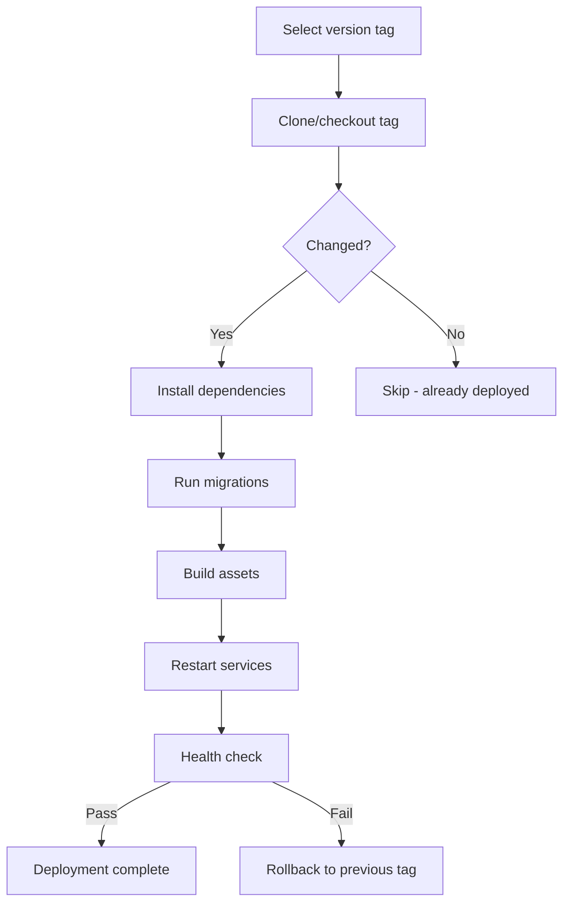

# How to Use the Ansible git Module with Tags

Author: [nawazdhandala](https://www.github.com/nawazdhandala)

Tags: Ansible, Git, Tags, Version Control

Description: Learn how to use the Ansible git module with Git tags for versioned deployments, tag-based rollbacks, and release management in your automation workflows.

---

Git tags are the standard way to mark release versions. When deploying with Ansible, using tags instead of branch names gives you precise, immutable version references. A tag always points to the same commit, which makes deployments reproducible and rollbacks predictable.

## Deploying a Specific Tag

```yaml
# playbook-tag-deploy.yml
# Clones a repository at a specific release tag
- name: Deploy specific version
  hosts: webservers
  become: true
  vars:
    app_version: "v2.1.0"

  tasks:
    - name: Deploy application at tagged version
      ansible.builtin.git:
        repo: "https://github.com/example/myapp.git"
        dest: /opt/myapp
        version: "{{ app_version }}"
      register: deploy_result

    - name: Show deployment info
      ansible.builtin.debug:
        msg: "Deployed {{ app_version }} (commit: {{ deploy_result.after[:12] }})"
```

## Listing Available Tags

Before deploying, you might want to know what tags are available:

```yaml
# playbook-list-tags.yml
# Lists all available tags from the remote repository
- name: List available release tags
  hosts: localhost
  gather_facts: false

  tasks:
    - name: Get all tags from remote
      ansible.builtin.shell: |
        git ls-remote --tags https://github.com/example/myapp.git | \
        awk '{print $2}' | \
        sed 's|refs/tags/||' | \
        grep -v '\^{}' | \
        sort -V
      register: available_tags
      changed_when: false

    - name: Show available tags
      ansible.builtin.debug:
        msg: "{{ available_tags.stdout_lines }}"

    - name: Show latest 5 tags
      ansible.builtin.debug:
        msg: "Latest tags: {{ available_tags.stdout_lines | last(5) | default(available_tags.stdout_lines) }}"
```

## Tag-Based Deployment Workflow



## Full Deployment with Rollback

```yaml
# playbook-tag-rollback.yml
# Deploys a tagged version with automatic rollback capability
- name: Deploy with rollback support
  hosts: webservers
  become: true
  vars:
    new_version: "v2.2.0"
    app_dir: /opt/myapp

  tasks:
    - name: Get current version before deploy
      ansible.builtin.shell: "cd {{ app_dir }} && git describe --tags --exact-match 2>/dev/null || git rev-parse --short HEAD"
      register: current_version
      changed_when: false
      failed_when: false

    - name: Store current version for potential rollback
      ansible.builtin.set_fact:
        previous_version: "{{ current_version.stdout }}"

    - name: Deploy new version
      block:
        - name: Checkout new tag
          ansible.builtin.git:
            repo: "https://github.com/example/myapp.git"
            dest: "{{ app_dir }}"
            version: "{{ new_version }}"
            force: true
          register: deploy

        - name: Install dependencies
          ansible.builtin.shell: "cd {{ app_dir }} && pip install -r requirements.txt"
          when: deploy.changed

        - name: Run health check
          ansible.builtin.uri:
            url: "http://localhost:8080/health"
            status_code: 200
          retries: 5
          delay: 3

        - name: Deployment successful
          ansible.builtin.debug:
            msg: "Successfully deployed {{ new_version }} (was {{ previous_version }})"

      rescue:
        - name: Deployment failed - rolling back
          ansible.builtin.git:
            repo: "https://github.com/example/myapp.git"
            dest: "{{ app_dir }}"
            version: "{{ previous_version }}"
            force: true

        - name: Restart with previous version
          ansible.builtin.systemd:
            name: myapp
            state: restarted

        - name: Report rollback
          ansible.builtin.fail:
            msg: "Deploy of {{ new_version }} failed. Rolled back to {{ previous_version }}"
```

## Deploying Latest Tag Automatically

```yaml
# playbook-latest-tag.yml
# Automatically discovers and deploys the latest semver tag
- name: Deploy latest tag
  hosts: webservers
  become: true

  tasks:
    - name: Get latest tag from remote
      ansible.builtin.shell: |
        git ls-remote --tags https://github.com/example/myapp.git | \
        awk '{print $2}' | \
        sed 's|refs/tags/||' | \
        grep -v '\^{}' | \
        grep '^v[0-9]' | \
        sort -V | \
        tail -1
      register: latest_tag
      changed_when: false
      delegate_to: localhost
      run_once: true

    - name: Show latest tag
      ansible.builtin.debug:
        msg: "Latest release: {{ latest_tag.stdout }}"
      run_once: true

    - name: Deploy latest tag
      ansible.builtin.git:
        repo: "https://github.com/example/myapp.git"
        dest: /opt/myapp
        version: "{{ latest_tag.stdout }}"
      register: deploy_result

    - name: Run post-deploy if changed
      ansible.builtin.shell: |
        cd /opt/myapp
        make build
      when: deploy_result.changed
```

## Version Comparison

Compare current and target versions before deploying:

```yaml
# playbook-version-compare.yml
# Compares current deployed version with target and shows upgrade path
- name: Compare and deploy version
  hosts: webservers
  become: true
  vars:
    target_version: "v2.3.0"

  tasks:
    - name: Get currently deployed tag
      ansible.builtin.shell: "cd /opt/myapp && git describe --tags --exact-match 2>/dev/null || echo 'untagged'"
      register: current_tag
      changed_when: false
      failed_when: false

    - name: Show version comparison
      ansible.builtin.debug:
        msg: |
          Current: {{ current_tag.stdout }}
          Target:  {{ target_version }}
          Action:  {{ 'upgrade' if current_tag.stdout != target_version else 'no change needed' }}

    - name: Deploy if versions differ
      ansible.builtin.git:
        repo: "https://github.com/example/myapp.git"
        dest: /opt/myapp
        version: "{{ target_version }}"
      when: current_tag.stdout != target_version
      register: deploy_result
      notify: Restart myapp

  handlers:
    - name: Restart myapp
      ansible.builtin.systemd:
        name: myapp
        state: restarted
```

## Tag Validation

Verify a tag exists before attempting deployment:

```yaml
# playbook-validate-tag.yml
# Validates that the requested tag exists in the remote repository before deploying
- name: Validate and deploy tag
  hosts: localhost
  gather_facts: false
  vars:
    requested_version: "v2.1.0"

  tasks:
    - name: Check if tag exists
      ansible.builtin.shell: |
        git ls-remote --tags https://github.com/example/myapp.git "refs/tags/{{ requested_version }}" | wc -l
      register: tag_check
      changed_when: false

    - name: Fail if tag does not exist
      ansible.builtin.assert:
        that:
          - tag_check.stdout | int > 0
        fail_msg: "Tag {{ requested_version }} does not exist in the repository"
        success_msg: "Tag {{ requested_version }} verified"

- name: Deploy verified tag
  hosts: webservers
  become: true
  vars:
    requested_version: "v2.1.0"

  tasks:
    - name: Deploy the verified tag
      ansible.builtin.git:
        repo: "https://github.com/example/myapp.git"
        dest: /opt/myapp
        version: "{{ requested_version }}"
```

## Tagging Multiple Services

Deploy coordinated versions across services:

```yaml
# playbook-multi-service-tags.yml
# Deploys multiple services at their specific tagged versions
- name: Deploy microservices at specific tags
  hosts: webservers
  become: true
  vars:
    service_versions:
      - name: api-gateway
        repo: "https://github.com/example/api-gateway.git"
        version: "v1.5.0"
        dest: /opt/api-gateway
      - name: user-service
        repo: "https://github.com/example/user-service.git"
        version: "v2.3.1"
        dest: /opt/user-service
      - name: order-service
        repo: "https://github.com/example/order-service.git"
        version: "v3.0.0"
        dest: /opt/order-service

  tasks:
    - name: Deploy each service at its tagged version
      ansible.builtin.git:
        repo: "{{ item.repo }}"
        dest: "{{ item.dest }}"
        version: "{{ item.version }}"
        depth: 1
      loop: "{{ service_versions }}"
      loop_control:
        label: "{{ item.name }}@{{ item.version }}"
      register: service_deploys

    - name: Show deployment summary
      ansible.builtin.debug:
        msg: "{{ item.item.name }}@{{ item.item.version }}: {{ 'UPDATED' if item.changed else 'unchanged' }}"
      loop: "{{ service_deploys.results }}"
      loop_control:
        label: "{{ item.item.name }}"
```

## Summary

Git tags provide immutable version references that are ideal for production deployments. Use the `version` parameter in the Ansible git module to deploy specific tags. Always store the current version before deploying so you can roll back if something goes wrong. Validate that tags exist before attempting deployment to get clear error messages. For automated deployments, discover the latest tag with `git ls-remote` and `sort -V`. The combination of tag-based deployments with Ansible's block/rescue pattern gives you a reliable deploy-and-rollback workflow that works well for production environments.
