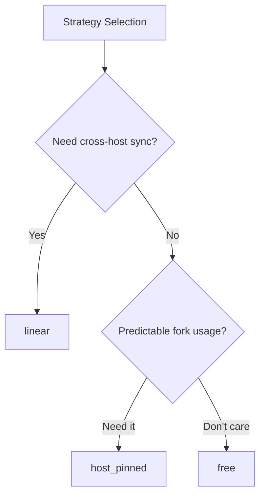

# How to Use the Ansible host_pinned Strategy

Author: [nawazdhandala](https://www.github.com/nawazdhandala)

Tags: Ansible, Performance, Strategy, DevOps

Description: Understand the Ansible host_pinned strategy and how it differs from free and linear strategies for optimized playbook execution.

---

Ansible ships with three built-in execution strategies: `linear`, `free`, and `host_pinned`. While linear and free get most of the attention, the `host_pinned` strategy occupies a useful middle ground that many teams overlook. It behaves like the free strategy but with a critical difference in how it manages fork slots. Understanding when to use it can help you optimize playbook execution for specific workloads.

## Strategy Comparison

Before diving into host_pinned, let us quickly recap the three strategies.

The `linear` strategy processes one task at a time across all hosts. Every host must finish the current task before anyone moves to the next.

The `free` strategy lets each host proceed through tasks independently. As soon as a host finishes a task, it starts the next one without waiting for others.

The `host_pinned` strategy also lets hosts proceed independently, like free. The difference is in how fork slots are allocated. With free, when a host finishes all its tasks, its fork slot is released and can be assigned to a new host. With host_pinned, each host keeps its fork slot for the entire play, even while waiting for a task to complete.



## Why Fork Pinning Matters

The practical difference comes down to predictability. With the free strategy, fork slots are recycled aggressively. If you have 100 hosts and 20 forks, the free strategy might process hosts in an unpredictable order as slots open up. This can lead to situations where a few slow hosts monopolize fork slots late in the run.

With host_pinned, once a host gets a fork slot, it keeps it until all its tasks are done. This means the first 20 hosts get processed, and only when a host finishes its entire task list does a new host get picked up. The result is more predictable resource usage on the control node.

## Enabling host_pinned

Set it at the play level:

```yaml
---
# Use host_pinned strategy for predictable fork allocation
- hosts: all_servers
  strategy: host_pinned
  become: true
  tasks:
    - name: Gather system info
      setup:
        gather_subset:
          - hardware

    - name: Install monitoring agent
      apt:
        name: node-exporter
        state: present

    - name: Configure monitoring agent
      template:
        src: node-exporter.conf.j2
        dest: /etc/default/node-exporter

    - name: Start monitoring agent
      service:
        name: node-exporter
        state: started
        enabled: true
```

Or globally in ansible.cfg:

```ini
# Set host_pinned as the default strategy
[defaults]
strategy = host_pinned
forks = 30
```

## When to Use host_pinned Over free

The host_pinned strategy is the better choice in several scenarios.

**Scenario 1: When you need to limit concurrent connections to a shared resource.**

If your tasks interact with a database or API that has connection limits, host_pinned gives you precise control over concurrency:

```yaml
---
# Database migration with controlled concurrency
- hosts: app_servers
  strategy: host_pinned
  become: true
  tasks:
    - name: Stop application
      service:
        name: myapp
        state: stopped

    - name: Run database migration
      command: /opt/myapp/migrate.sh
      run_once: true

    - name: Update application binary
      copy:
        src: myapp-v2
        dest: /opt/myapp/myapp
        mode: '0755'

    - name: Start application
      service:
        name: myapp
        state: started

    - name: Health check
      uri:
        url: "http://{{ inventory_hostname }}:8080/health"
        status_code: 200
      retries: 10
      delay: 5
```

With `forks: 10` and host_pinned, you know that exactly 10 servers are being processed at any given time. With the free strategy, the count could fluctuate as fast hosts complete and new ones start.

**Scenario 2: When tasks have varying durations and you want fair scheduling.**

```yaml
---
# Server provisioning with mixed workloads
- hosts: new_servers
  strategy: host_pinned
  become: true
  tasks:
    - name: Update package cache
      apt:
        update_cache: true

    - name: Install base packages
      apt:
        name: "{{ base_packages }}"
        state: present
      vars:
        base_packages:
          - vim
          - htop
          - curl
          - wget
          - jq
          - git

    - name: Configure NTP
      template:
        src: ntp.conf.j2
        dest: /etc/ntp.conf
      notify: restart ntp

    - name: Apply security hardening
      include_role:
        name: security_hardening

    - name: Run compliance check
      command: /opt/compliance/check.sh
      register: compliance
      changed_when: false

    - name: Report compliance status
      debug:
        msg: "{{ inventory_hostname }}: {{ compliance.stdout }}"

  handlers:
    - name: restart ntp
      service:
        name: ntp
        state: restarted
```

**Scenario 3: When debugging and you want ordered output.**

The host_pinned strategy produces slightly more organized output than free, because hosts are processed in consistent batches:

```bash
# Compare output ordering between strategies
ANSIBLE_STRATEGY=host_pinned ansible-playbook setup.yml -f 5 | head -50
ANSIBLE_STRATEGY=free ansible-playbook setup.yml -f 5 | head -50
```

## Performance Characteristics

I benchmarked the three strategies across 60 hosts with a 12-task playbook. The tasks included package installs, file copies, template renders, and service restarts:

| Strategy | Total Time | Peak Memory | Fork Utilization |
|---|---|---|---|
| linear | 14m 33s | 1.2 GB | Low (lots of idle time) |
| free | 9m 12s | 1.8 GB | High (spiky) |
| host_pinned | 9m 48s | 1.4 GB | Steady |

The free strategy was slightly faster overall, but host_pinned used less memory because it did not have the overhead of rapidly cycling fork processes. In environments where control node resources are constrained, host_pinned can be the better practical choice.

## Combining with serial

Like the free strategy, host_pinned can be combined with `serial` for rolling updates:

```yaml
---
# Rolling update with host_pinned strategy
- hosts: webservers
  strategy: host_pinned
  serial: 5
  become: true
  tasks:
    - name: Pull latest Docker image
      docker_image:
        name: myapp
        tag: latest
        source: pull

    - name: Restart container
      docker_container:
        name: myapp
        image: myapp:latest
        state: started
        restart: true
        ports:
          - "8080:8080"

    - name: Wait for health check
      uri:
        url: "http://{{ inventory_hostname }}:8080/health"
        status_code: 200
      retries: 12
      delay: 5
      register: health
      until: health.status == 200
```

With `serial: 5`, each batch of 5 hosts runs through all tasks independently (since host_pinned does not enforce task-level synchronization), but the next batch of 5 does not start until the current batch is done.

## Error Handling Differences

Error handling under host_pinned is similar to free, with one nuance. When `max_fail_percentage` is set, the check happens at the end of each host's full task list rather than at task boundaries:

```yaml
---
# Allow up to 20% of hosts to fail before aborting
- hosts: all_servers
  strategy: host_pinned
  max_fail_percentage: 20
  tasks:
    - name: Apply update
      apt:
        name: critical-package
        state: latest

    - name: Verify update
      command: /opt/verify.sh
      register: verify_result
      failed_when: verify_result.rc != 0
```

## Practical Recommendations

Use host_pinned when:
- You want the speed benefits of non-blocking execution (like free) but with more predictable resource usage
- Your control node has limited memory and you cannot afford the spiky fork cycling of the free strategy
- You want output that is easier to follow than the free strategy's interleaved messages
- You are interacting with external services that are sensitive to connection patterns

Stick with free when:
- Raw speed is your top priority and you have plenty of control node resources
- Hosts have wildly different task completion times

Stick with linear when:
- Tasks depend on all hosts being at the same point
- You are doing rolling deployments that need cross-host coordination
- You need `any_errors_fatal` to work predictably

The host_pinned strategy is a solid choice for production workloads where you want to move faster than linear allows, but with more control than free provides. It deserves a place in your Ansible optimization toolkit.
