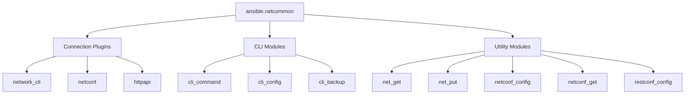

# How to Use the ansible.netcommon Collection for Network Automation

Author: [nawazdhandala](https://www.github.com/nawazdhandala)

Tags: Ansible, Network Automation, netcommon, Multi-Vendor

Description: Master the ansible.netcommon collection for vendor-agnostic network automation including connection plugins, CLI modules, and NETCONF operations.

---

When you are automating a network with devices from multiple vendors, you quickly realize that each vendor has its own Ansible collection with platform-specific modules. But there is a layer beneath those collections that provides the foundation for all of them: the `ansible.netcommon` collection. This collection contains the connection plugins, base modules, and utilities that every network platform relies on.

Understanding `ansible.netcommon` is essential because it gives you vendor-agnostic tools that work across Cisco, Juniper, Arista, VyOS, and any other platform that Ansible supports. This post covers the key components of the collection and shows you how to use them for multi-vendor network automation.

## What Is ansible.netcommon?

The `ansible.netcommon` collection provides three main categories of functionality:



The connection plugins handle how Ansible talks to network devices. The CLI modules provide vendor-agnostic ways to send commands and configuration. The utility modules handle file transfers and protocol-specific operations.

## Installation

```bash
# Install the netcommon collection
ansible-galaxy collection install ansible.netcommon

# It is typically installed as a dependency of vendor collections
# but it is good practice to install it explicitly
```

## Connection Plugins

### network_cli

The most commonly used connection plugin. It opens an SSH session to the device and sends CLI commands through it.

```yaml
# group_vars/network_devices.yml
# Standard network_cli connection configuration
ansible_connection: ansible.netcommon.network_cli
ansible_network_os: cisco.ios.ios
ansible_user: admin
ansible_password: "{{ vault_password }}"
ansible_become: yes
ansible_become_method: enable
ansible_become_password: "{{ vault_enable_password }}"
```

Key settings for network_cli:

| Variable | Description |
|----------|-------------|
| `ansible_network_os` | Platform identifier (cisco.ios.ios, arista.eos.eos, etc.) |
| `ansible_connection` | Must be `ansible.netcommon.network_cli` |
| `ansible_become` | Whether to enter privileged mode |
| `ansible_become_method` | How to enter privileged mode (enable, sudo) |
| `ansible_persistent_connect_timeout` | SSH connection timeout |
| `ansible_command_timeout` | Command execution timeout |

### netconf

Used for NETCONF-capable devices (JunOS, IOS-XR, some NX-OS):

```yaml
# group_vars/netconf_devices.yml
# NETCONF connection configuration
ansible_connection: ansible.netcommon.netconf
ansible_network_os: junipernetworks.junos.junos
ansible_user: admin
ansible_password: "{{ vault_password }}"
ansible_port: 830
ansible_netconf_ssh_config: true
```

### httpapi

Used for devices with REST APIs (Arista eAPI, NX-OS NX-API):

```yaml
# group_vars/api_devices.yml
# HTTP API connection configuration
ansible_connection: ansible.netcommon.httpapi
ansible_network_os: arista.eos.eos
ansible_httpapi_use_ssl: true
ansible_httpapi_validate_certs: false
ansible_user: admin
ansible_password: "{{ vault_password }}"
```

## The cli_command Module

The `cli_command` module sends a single command to a network device and returns the output. It works with any platform that uses the `network_cli` connection.

```yaml
# playbook-cli-command.yml
# Uses cli_command for vendor-agnostic show commands
- name: Run show commands on multiple platforms
  hosts: all_network
  gather_facts: no

  tasks:
    - name: Get device uptime on IOS
      ansible.netcommon.cli_command:
        command: show version | include uptime
      register: uptime
      when: ansible_network_os == 'cisco.ios.ios'

    - name: Get device uptime on EOS
      ansible.netcommon.cli_command:
        command: show uptime
      register: uptime
      when: ansible_network_os == 'arista.eos.eos'

    - name: Get device uptime on JunOS
      ansible.netcommon.cli_command:
        command: show system uptime
      register: uptime
      when: ansible_network_os == 'junipernetworks.junos.junos'

    - name: Display uptime
      ansible.builtin.debug:
        msg: "{{ inventory_hostname }}: {{ uptime.stdout }}"
```

### Handling Prompts

Some commands trigger interactive prompts. The `cli_command` module can handle these:

```yaml
# Handles commands that require confirmation
    - name: Clear counters with prompt handling
      ansible.netcommon.cli_command:
        command: clear counters
        prompt:
          - "Clear \"show interface\" counters on all interfaces"
        answer:
          - "y"
```

### Sending Commands with Check Mode

```yaml
# Using check mode for safe command execution
    - name: Verify a command without executing
      ansible.netcommon.cli_command:
        command: show running-config
      check_mode: yes
      register: config_preview
```

## The cli_config Module

The `cli_config` module sends configuration commands to a device. Unlike `cli_command`, it enters configuration mode, sends the commands, and exits. It works across vendors.

```yaml
# playbook-cli-config.yml
# Uses cli_config for vendor-agnostic configuration
- name: Apply configuration across multiple vendors
  hosts: all_network
  gather_facts: no

  tasks:
    - name: Configure NTP on all devices
      ansible.netcommon.cli_config:
        config: |
          ntp server 10.0.0.50
          ntp server 10.0.0.51
      when: ansible_network_os in ['cisco.ios.ios', 'cisco.nxos.nxos', 'arista.eos.eos']

    - name: Configure NTP on VyOS
      ansible.netcommon.cli_config:
        config: |
          set system ntp server 10.0.0.50
          set system ntp server 10.0.0.51
      when: ansible_network_os == 'vyos.vyos.vyos'

    - name: Configure NTP on JunOS
      ansible.netcommon.cli_config:
        config: |
          set system ntp server 10.0.0.50
          set system ntp server 10.0.0.51
      when: ansible_network_os == 'junipernetworks.junos.junos'
```

### Configuration with Diff

The `cli_config` module supports showing the diff of changes:

```yaml
    - name: Apply config and show diff
      ansible.netcommon.cli_config:
        config: |
          interface Loopback0
           description Managed by Ansible
        diff_match: line
      register: config_result

    - name: Show what changed
      ansible.builtin.debug:
        msg: "{{ config_result.diff }}"
      when: config_result.changed
```

### Configuration Backup

The `cli_config` module can create backups before making changes:

```yaml
    - name: Apply config with backup
      ansible.netcommon.cli_config:
        config: |
          logging host 10.0.100.50
        backup: yes
        backup_options:
          dir_path: "./backups/"
          filename: "{{ inventory_hostname }}-pre-change.cfg"
```

## NETCONF Modules

For NETCONF-capable devices, the collection provides specialized modules:

### netconf_get

Retrieves configuration or operational data via NETCONF:

```yaml
# playbook-netconf-get.yml
# Retrieves structured data via NETCONF
- name: Get data via NETCONF
  hosts: junos_routers
  gather_facts: no
  vars:
    ansible_connection: ansible.netcommon.netconf

  tasks:
    - name: Get interface configuration via NETCONF
      ansible.netcommon.netconf_get:
        filter: |
          <configuration>
            <interfaces/>
          </configuration>
        display: json
      register: interfaces

    - name: Display interface data
      ansible.builtin.debug:
        msg: "{{ interfaces.output }}"
```

### netconf_config

Pushes configuration via NETCONF:

```yaml
# playbook-netconf-config.yml
# Pushes configuration via NETCONF protocol
- name: Configure via NETCONF
  hosts: junos_routers
  gather_facts: no
  vars:
    ansible_connection: ansible.netcommon.netconf

  tasks:
    - name: Push interface configuration
      ansible.netcommon.netconf_config:
        content: |
          <config>
            <configuration>
              <interfaces>
                <interface>
                  <name>lo0</name>
                  <unit>
                    <name>0</name>
                    <description>Managed by Ansible via NETCONF</description>
                  </unit>
                </interface>
              </interfaces>
            </configuration>
          </config>
        target: candidate
        default_operation: merge
```

### netconf_rpc

For custom NETCONF RPC calls:

```yaml
    - name: Execute custom NETCONF RPC
      ansible.netcommon.netconf_rpc:
        rpc: get-system-information
        display: json
      register: system_info

    - name: Display system info
      ansible.builtin.debug:
        msg: "{{ system_info.output }}"
```

## Multi-Vendor Playbook Pattern

Here is a pattern for writing playbooks that work across multiple vendors using netcommon modules:

```yaml
# playbook-multi-vendor.yml
# Multi-vendor configuration management using netcommon modules
- name: Multi-vendor network management
  hosts: all_network
  gather_facts: no

  vars:
    syslog_server: 10.0.100.50
    ntp_servers:
      - 10.0.0.50
      - 10.0.0.51

  tasks:
    - name: Gather facts from all platforms
      ansible.netcommon.cli_command:
        command: "{{ facts_command }}"
      vars:
        facts_command: "{{ platform_commands[ansible_network_os].show_version }}"
      register: version_info

    - name: Apply syslog configuration
      ansible.netcommon.cli_config:
        config: "{{ lookup('template', 'templates/syslog-' + platform_name + '.j2') }}"
      vars:
        platform_name: "{{ ansible_network_os | regex_replace('.*\\.', '') }}"

    - name: Verify syslog configuration
      ansible.netcommon.cli_command:
        command: "{{ platform_commands[ansible_network_os].show_logging }}"
      register: logging_verify

    - name: Save configuration
      ansible.netcommon.cli_command:
        command: "{{ platform_commands[ansible_network_os].save_config }}"
```

With a platform commands variable file:

```yaml
# group_vars/all_network.yml
# Platform-specific command mappings for multi-vendor operations
platform_commands:
  cisco.ios.ios:
    show_version: "show version"
    show_logging: "show logging"
    save_config: "write memory"
  arista.eos.eos:
    show_version: "show version"
    show_logging: "show logging"
    save_config: "write memory"
  cisco.nxos.nxos:
    show_version: "show version"
    show_logging: "show logging"
    save_config: "copy running-config startup-config"
  vyos.vyos.vyos:
    show_version: "show version"
    show_logging: "show log"
    save_config: "save"
```

## Persistent Connection Settings

The netcommon collection manages persistent connections. Tuning these settings in `ansible.cfg` is important for reliability:

```ini
# ansible.cfg
# Persistent connection settings for network automation
[persistent_connection]
# How long to wait when establishing the SSH connection
connect_timeout = 30

# How long to wait for a command to complete
command_timeout = 60

# How long to keep trying to establish a connection
connect_retry_timeout = 15

# Buffer size for reading from the SSH channel
buffer_read_timeout = 0.1
```

## Tips for Using ansible.netcommon

**Use vendor-specific modules when they exist.** The netcommon modules are great for simple operations and multi-vendor scripts, but vendor-specific modules (like `cisco.ios.ios_vlans`) provide better idempotency and validation.

**cli_config vs cli_command.** Use `cli_command` for show/operational commands and `cli_config` for configuration changes. Do not mix them up, as `cli_config` enters configuration mode automatically.

**NETCONF is worth the setup effort.** If your devices support NETCONF, use it. It provides structured data, proper error handling, and transactional support that CLI-based automation cannot match.

**Test connection settings.** If you see timeout errors, increase the `command_timeout` and `connect_timeout` values. Older or heavily loaded devices can be slow to respond.

**The network_cli connection is persistent.** Ansible keeps the SSH session open for the duration of the play. This is faster than opening a new connection for each task, but it means that a single hung connection can block subsequent tasks.

The `ansible.netcommon` collection is the backbone of Ansible network automation. Whether you are managing a single-vendor environment or a mixed network with devices from multiple manufacturers, understanding the connection plugins and generic modules gives you the tools to build robust, portable automation.
