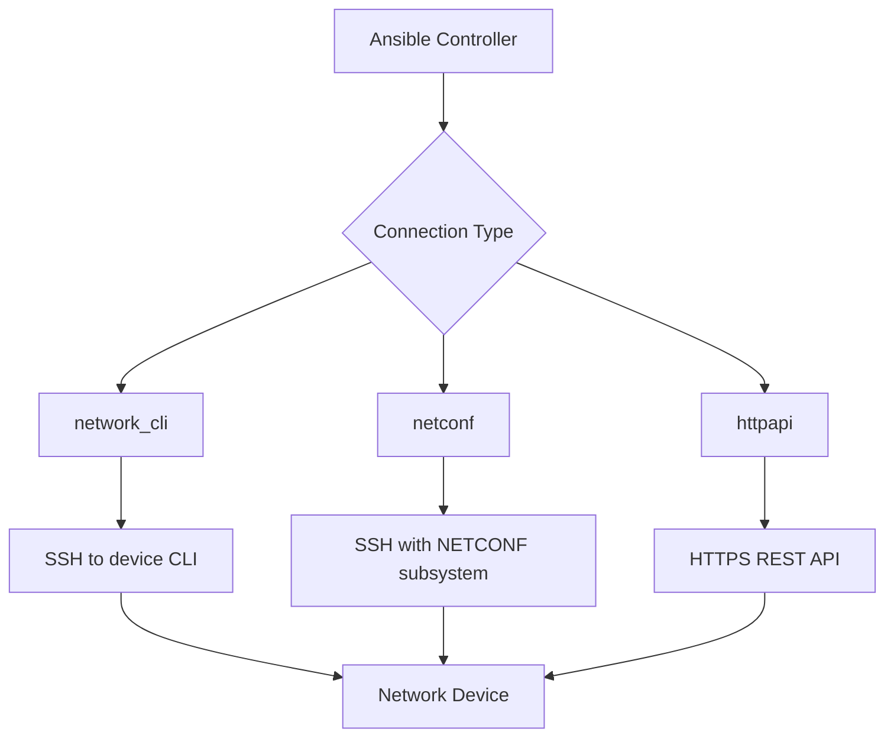

# How to Use the ansible.netcommon Collection

Author: [nawazdhandala](https://www.github.com/nawazdhandala)

Tags: Ansible, Networking, NetCommon, Network Automation, DevOps

Description: How to use the ansible.netcommon collection for network device automation with cli_command, cli_config, netconf, and httpapi connection plugins.

---

The `ansible.netcommon` collection provides the foundation for all network automation in Ansible. It includes connection plugins for talking to network devices (network_cli, netconf, httpapi), modules for sending commands and configuring devices, and utility plugins that other networking collections depend on. If you automate routers, switches, firewalls, or any network appliance with Ansible, this collection is at the base of the stack.

## Installation

```bash
# Install the ansible.netcommon collection
ansible-galaxy collection install ansible.netcommon

# Check installed version
ansible-galaxy collection list ansible.netcommon
```

In your requirements file:

```yaml
# requirements.yml
---
collections:
  - name: ansible.netcommon
    version: ">=6.0.0"
```

## Connection Plugins

The most important thing `ansible.netcommon` provides is the connection plugins that let Ansible talk to network devices. Unlike regular servers where you SSH in and run commands, network devices often have their own CLI shells, NETCONF interfaces, or REST APIs.

### network_cli

The `network_cli` connection plugin connects to devices over SSH and interacts with the device CLI:

```yaml
# inventory/network.yml - Network device inventory
---
all:
  children:
    routers:
      hosts:
        router01:
          ansible_host: 10.0.0.1
        router02:
          ansible_host: 10.0.0.2
      vars:
        ansible_connection: ansible.netcommon.network_cli
        ansible_network_os: cisco.ios.ios
        ansible_user: admin
        ansible_password: "{{ vault_network_password }}"
        ansible_become: true
        ansible_become_method: enable
        ansible_become_password: "{{ vault_enable_password }}"
```

### netconf

The `netconf` connection plugin uses the NETCONF protocol over SSH for structured configuration management:

```yaml
# inventory/netconf-devices.yml
---
all:
  children:
    juniper_switches:
      hosts:
        switch01:
          ansible_host: 10.0.1.1
      vars:
        ansible_connection: ansible.netcommon.netconf
        ansible_network_os: junipernetworks.junos.junos
        ansible_user: admin
        ansible_password: "{{ vault_junos_password }}"
        ansible_port: 830
```

### httpapi

The `httpapi` connection plugin communicates with devices through REST APIs:

```yaml
# inventory/api-devices.yml
---
all:
  children:
    firewalls:
      hosts:
        fw01:
          ansible_host: 10.0.2.1
      vars:
        ansible_connection: ansible.netcommon.httpapi
        ansible_network_os: fortinet.fortios.fortios
        ansible_httpapi_use_ssl: true
        ansible_httpapi_validate_certs: false
        ansible_user: admin
        ansible_password: "{{ vault_fw_password }}"
```

## Using cli_command

The `cli_command` module sends a single command to a network device and returns the output. It works with any device that supports the `network_cli` connection.

```yaml
# show-commands.yml - Gather information from network devices
---
- name: Gather network device information
  hosts: routers
  gather_facts: false
  tasks:
    - name: Get running configuration
      ansible.netcommon.cli_command:
        command: show running-config
      register: running_config

    - name: Show device version
      ansible.netcommon.cli_command:
        command: show version
      register: version_info

    - name: Display version output
      ansible.builtin.debug:
        var: version_info.stdout

    - name: Check interface status
      ansible.netcommon.cli_command:
        command: show ip interface brief
      register: interfaces

    - name: Save output to file
      ansible.builtin.copy:
        content: "{{ running_config.stdout }}"
        dest: "/opt/backups/{{ inventory_hostname }}_config.txt"
      delegate_to: localhost

    - name: Send command with prompt handling
      ansible.netcommon.cli_command:
        command: "clear counters"
        prompt:
          - "Clear \"show interface\" counters on all interfaces"
        answer:
          - "y"
```

## Using cli_config

The `cli_config` module pushes configuration to network devices. It handles entering configuration mode, applying changes, and optionally creating a backup:

```yaml
# configure-router.yml - Apply configuration to network devices
---
- name: Configure router interfaces
  hosts: routers
  gather_facts: false
  tasks:
    - name: Backup current configuration
      ansible.netcommon.cli_config:
        backup: true
        backup_options:
          filename: "{{ inventory_hostname }}_backup.cfg"
          dir_path: /opt/network-backups/

    - name: Configure loopback interface
      ansible.netcommon.cli_config:
        config: |
          interface Loopback0
           ip address 10.255.255.1 255.255.255.255
           description Management Loopback
           no shutdown

    - name: Configure NTP servers
      ansible.netcommon.cli_config:
        config: |
          ntp server 10.0.100.1
          ntp server 10.0.100.2
          ntp source Loopback0

    - name: Push configuration from file
      ansible.netcommon.cli_config:
        config: "{{ lookup('file', 'configs/{{ inventory_hostname }}.cfg') }}"

    - name: Configure with diff mode to see changes
      ansible.netcommon.cli_config:
        config: |
          ip name-server 8.8.8.8
          ip name-server 8.8.4.4
        diff_match: line
        diff_replace: line
```

## NETCONF Operations

For devices that support NETCONF, you get structured data exchange using XML:

```yaml
# netconf-config.yml - Configure devices using NETCONF
---
- name: Configure network device via NETCONF
  hosts: juniper_switches
  gather_facts: false
  tasks:
    - name: Get device configuration via NETCONF
      ansible.netcommon.netconf_get:
        source: running
        filter: |
          <configuration>
            <interfaces/>
          </configuration>
      register: netconf_config

    - name: Display configuration
      ansible.builtin.debug:
        var: netconf_config.output

    - name: Apply NETCONF configuration
      ansible.netcommon.netconf_config:
        content: |
          <configuration>
            <system>
              <host-name>switch01</host-name>
              <name-server>
                <name>10.0.100.10</name>
              </name-server>
            </system>
          </configuration>
        target: candidate
        default_operation: merge

    - name: Lock and edit configuration
      ansible.netcommon.netconf_config:
        content: |
          <configuration>
            <interfaces>
              <interface>
                <name>ge-0/0/0</name>
                <description>Uplink to Core</description>
              </interface>
            </interfaces>
          </configuration>
        lock: always
        target: candidate
        validate: true
```

## Network Resource Modules

The `ansible.netcommon` collection also provides the base for network resource modules. These modules manage specific aspects of network configuration in an idempotent way.

```yaml
# network-resources.yml - Use network resource module pattern
---
- name: Manage network configuration resources
  hosts: routers
  gather_facts: false
  tasks:
    - name: Gather current interface facts
      ansible.netcommon.cli_command:
        command: show running-config | section interface
      register: interface_config

    - name: Parse interface configuration
      ansible.builtin.set_fact:
        parsed_interfaces: "{{ interface_config.stdout | ansible.netcommon.parse_cli_textfsm('templates/show_interfaces.textfsm') }}"
      when: false  # Requires TextFSM template

    - name: Validate network configuration
      ansible.netcommon.net_ping:
        dest: 10.0.0.1
        count: 5
      register: ping_result
      ignore_errors: true
```

## Persistent Connection Settings

Network connections are persistent (they stay open across tasks). You can tune the connection behavior:

```yaml
# ansible.cfg - Network connection settings
[persistent_connection]
# How long to wait for a command to complete
command_timeout = 30

# How long to keep the connection open between tasks
connect_timeout = 30

# How long a persistent connection can stay idle
connect_retry_timeout = 15
```

Or set these per-host in inventory:

```yaml
# inventory/group_vars/slow_devices.yml
---
ansible_command_timeout: 60
ansible_connect_timeout: 60
```

## Network Backup Workflow

A common use case is backing up network configurations on a schedule:

```yaml
# network-backup.yml - Automated configuration backup
---
- name: Backup all network device configurations
  hosts: routers:switches:firewalls
  gather_facts: false
  vars:
    backup_dir: "/opt/network-backups/{{ ansible_date_time.date }}"
  tasks:
    - name: Create backup directory
      ansible.builtin.file:
        path: "{{ backup_dir }}"
        state: directory
      delegate_to: localhost
      run_once: true

    - name: Backup device configuration
      ansible.netcommon.cli_config:
        backup: true
        backup_options:
          filename: "{{ inventory_hostname }}.cfg"
          dir_path: "{{ backup_dir }}"
```

## Connection Plugin Architecture



## Working with cli_parse

The `cli_parse` module parses unstructured CLI output into structured data:

```yaml
# parse-output.yml - Parse CLI output into structured data
---
- name: Parse network device output
  hosts: routers
  gather_facts: false
  tasks:
    - name: Get interface information
      ansible.netcommon.cli_command:
        command: show ip interface brief
      register: raw_interfaces

    - name: Parse with native parser
      ansible.netcommon.cli_parse:
        command: show ip interface brief
        parser:
          name: ansible.netcommon.native
        set_fact: parsed_interfaces

    - name: Display parsed interfaces
      ansible.builtin.debug:
        var: parsed_interfaces
```

## Conclusion

The `ansible.netcommon` collection is the backbone of Ansible network automation. It provides the connection plugins (network_cli, netconf, httpapi) that let Ansible communicate with network devices, and the generic modules (cli_command, cli_config, netconf_config) that work across vendors. Vendor-specific collections like `cisco.ios`, `arista.eos`, and `junipernetworks.junos` all build on top of `ansible.netcommon`. Install it first, configure your inventory with the right connection parameters, and the rest follows naturally.
