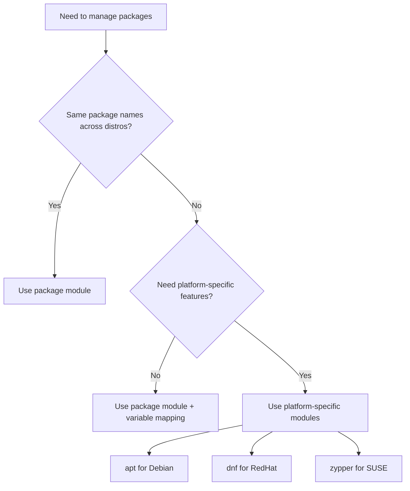

# How to Use the Ansible package Module for Cross-Platform Package Management

Author: [nawazdhandala](https://www.github.com/nawazdhandala)

Tags: Ansible, Package Management, Cross-Platform, DevOps

Description: Learn how to write cross-platform Ansible playbooks using the package module to manage packages across Debian, RHEL, and other systems.

---

If your infrastructure includes both Debian-based and Red Hat-based systems, writing separate tasks for `apt` and `dnf` gets tedious fast. The Ansible `package` module provides a unified interface that works across all supported package managers. It auto-detects the system's package manager and delegates to the appropriate backend. This post shows you how to use it effectively and when to fall back to platform-specific modules.

## Basic Usage

The `package` module has a deliberately simple interface:

```yaml
# Install a package on any Linux distribution
- name: Install git
  ansible.builtin.package:
    name: git
    state: present
```

This works on Ubuntu (uses apt), RHEL (uses dnf), SUSE (uses zypper), Arch (uses pacman), and any other distribution that Ansible supports. The module detects the package manager through the `ansible_pkg_mgr` fact and delegates accordingly.

## Installing Multiple Packages

```yaml
# Install common tools across all distributions
- name: Install base utilities
  ansible.builtin.package:
    name:
      - curl
      - wget
      - vim
      - htop
      - tmux
      - jq
    state: present
```

This works as long as the package names are the same across distributions. For packages with identical names on all your target systems, the `package` module is perfect.

## The Package Name Problem

The biggest challenge with cross-platform package management is that package names differ between distributions. The `httpd` package on RHEL is `apache2` on Ubuntu. The `python3-devel` package on RHEL is `python3-dev` on Debian. The `package` module cannot solve this naming problem by itself.

Here is how to handle it with variables:

```yaml
# Use OS-specific variables for different package names
- name: Install web server
  ansible.builtin.package:
    name: "{{ web_server_package }}"
    state: present
```

Define the variables in your group_vars:

```yaml
# group_vars/debian.yml
web_server_package: apache2
python_dev_package: python3-dev
ssl_dev_package: libssl-dev

# group_vars/redhat.yml
web_server_package: httpd
python_dev_package: python3-devel
ssl_dev_package: openssl-devel
```

## Using OS Family for Variable Resolution

A more scalable approach uses `ansible_os_family` to load the right variables automatically:

```yaml
# Load OS-specific variables based on the detected OS family
- name: Load OS-specific package names
  ansible.builtin.include_vars:
    file: "{{ ansible_os_family }}.yml"

- name: Install required packages
  ansible.builtin.package:
    name: "{{ item }}"
    state: present
  loop: "{{ required_packages }}"
```

Create variable files for each OS family:

```yaml
# vars/Debian.yml
required_packages:
  - apache2
  - python3-dev
  - libssl-dev
  - libffi-dev
  - build-essential

# vars/RedHat.yml
required_packages:
  - httpd
  - python3-devel
  - openssl-devel
  - libffi-devel
  - gcc
  - make
```

## Package Name Mapping Dictionary

For roles that need to support many distributions, a mapping dictionary is cleaner:

```yaml
# Define a package name mapping
- name: Install required packages using name mapping
  ansible.builtin.package:
    name: "{{ package_map[item][ansible_os_family] }}"
    state: present
  loop: "{{ packages_to_install }}"
  vars:
    packages_to_install:
      - web_server
      - python_dev
      - ssl_dev
    package_map:
      web_server:
        Debian: apache2
        RedHat: httpd
        Suse: apache2
      python_dev:
        Debian: python3-dev
        RedHat: python3-devel
        Suse: python3-devel
      ssl_dev:
        Debian: libssl-dev
        RedHat: openssl-devel
        Suse: libopenssl-devel
```

## Packages with Same Names Across Distributions

Many packages share the same name everywhere. For these, the `package` module is the simplest solution:

```yaml
# These package names are the same on Debian and RedHat families
- name: Install common packages (same names on all distros)
  ansible.builtin.package:
    name:
      - git
      - curl
      - wget
      - rsync
      - tar
      - unzip
      - vim
      - strace
      - lsof
      - tcpdump
      - nmap
    state: present
```

## Upgrading Packages

```yaml
# Upgrade a package to the latest version
- name: Ensure latest version of openssl
  ansible.builtin.package:
    name: openssl
    state: latest
```

## Removing Packages

```yaml
# Remove a package
- name: Remove telnet client
  ansible.builtin.package:
    name: telnet
    state: absent
```

## Combining package Module with Platform-Specific Tasks

In practice, you often use the `package` module for common packages and fall back to platform-specific modules for tasks that need platform-specific features:

```yaml
# Use the generic module for common packages
- name: Install common packages
  ansible.builtin.package:
    name:
      - git
      - curl
      - vim
    state: present

# Use apt-specific features when needed
- name: Update apt cache (Debian only)
  ansible.builtin.apt:
    update_cache: yes
    cache_valid_time: 3600
  when: ansible_os_family == "Debian"

# Use dnf-specific features when needed
- name: Install EPEL repository (RedHat only)
  ansible.builtin.dnf:
    name: epel-release
    state: present
  when: ansible_os_family == "RedHat"
```

## A Complete Cross-Platform Role

Here is a real-world example of a cross-platform role that sets up a monitoring agent:

```yaml
# roles/monitoring_agent/tasks/main.yml

# Load OS-specific variables
- name: Include OS-specific variables
  ansible.builtin.include_vars:
    file: "{{ ansible_os_family }}.yml"

# Handle repository setup (platform-specific)
- name: Set up repository (Debian)
  ansible.builtin.include_tasks: setup_repo_debian.yml
  when: ansible_os_family == "Debian"

- name: Set up repository (RedHat)
  ansible.builtin.include_tasks: setup_repo_redhat.yml
  when: ansible_os_family == "RedHat"

# Install the agent (cross-platform)
- name: Install monitoring agent
  ansible.builtin.package:
    name: "{{ monitoring_agent_package }}"
    state: present

# Configure and start (cross-platform)
- name: Deploy agent configuration
  ansible.builtin.template:
    src: agent.conf.j2
    dest: "{{ monitoring_agent_config_path }}"
    owner: root
    group: root
    mode: '0644'
  notify: restart monitoring agent

- name: Start monitoring agent
  ansible.builtin.service:
    name: "{{ monitoring_agent_service }}"
    state: started
    enabled: yes
```

With the corresponding variable files:

```yaml
# roles/monitoring_agent/vars/Debian.yml
monitoring_agent_package: datadog-agent
monitoring_agent_config_path: /etc/datadog-agent/datadog.yaml
monitoring_agent_service: datadog-agent

# roles/monitoring_agent/vars/RedHat.yml
monitoring_agent_package: datadog-agent
monitoring_agent_config_path: /etc/datadog-agent/datadog.yaml
monitoring_agent_service: datadog-agent
```

## Decision Flow for Module Selection



## Limitations of the package Module

The `package` module intentionally keeps a minimal interface. It does NOT support:

- Cache updates (`update_cache` is apt-specific)
- Repository management (use `apt_repository` or `yum_repository`)
- Package pinning/holding
- Installing from local files
- Package group installation
- Module streams (dnf-specific)

For any of these features, you need the platform-specific module. The `package` module is best for straightforward "install this package" scenarios.

## Tips for Cross-Platform Package Management

1. **Start with the package module.** Only drop down to platform-specific modules when you need features it does not support.
2. **Maintain a package name mapping.** Keep it in a well-documented variables file that your team can reference.
3. **Test on all target platforms.** A playbook that works on Ubuntu might have wrong package names on RHEL. Test early.
4. **Use `ansible_os_family` for branching.** It groups distributions into families (Debian, RedHat, Suse, Archlinux) which is usually the right level of granularity.
5. **Document platform support.** In your role's README, list which distributions you have tested against.

The `package` module is not a silver bullet for cross-platform package management, but it significantly reduces duplication in playbooks and roles that target multiple distributions. Combined with variable mapping and conditional includes, it gives you a solid foundation for managing heterogeneous infrastructure.
