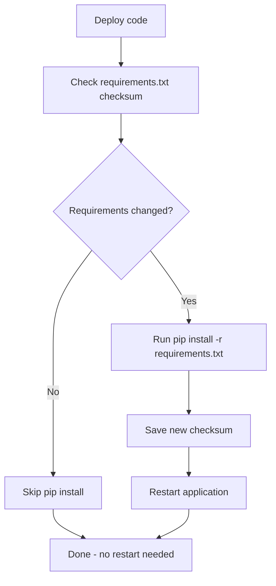

# How to Use the Ansible pip Module with requirements.txt

Author: [nawazdhandala](https://www.github.com/nawazdhandala)

Tags: Ansible, Python, pip, Requirements

Description: How to manage Python application dependencies using the Ansible pip module with requirements.txt files for reproducible deployments.

---

Every serious Python project uses a `requirements.txt` file to track its dependencies. When you deploy that project with Ansible, the `pip` module integrates directly with requirements files so you do not have to list every package in your playbook. This post covers the practical patterns for working with requirements files in Ansible, from basic usage to production-grade deployment workflows.

## Basic Usage

The `requirements` parameter points to a requirements file on the remote host:

```yaml
# Install packages from a requirements file on the target host
- name: Install application dependencies
  ansible.builtin.pip:
    requirements: /opt/myapp/requirements.txt
    executable: pip3
```

If the requirements file is on the control node and you want to transfer it first:

```yaml
# Copy requirements file and install from it
- name: Deploy requirements file
  ansible.builtin.copy:
    src: requirements.txt
    dest: /opt/myapp/requirements.txt
    mode: '0644'

- name: Install Python dependencies
  ansible.builtin.pip:
    requirements: /opt/myapp/requirements.txt
    virtualenv: /opt/myapp/venv
    virtualenv_command: python3 -m venv
```

## Requirements File Formats

pip supports several formats in requirements files. Here is a well-structured example:

```
# requirements.txt - pinned production dependencies
# Generated with: pip freeze > requirements.txt

# Web framework
Django==4.2.8
djangorestframework==3.14.0
django-cors-headers==4.3.1

# Database
psycopg2-binary==2.9.9
django-redis==5.4.0

# Task queue
celery==5.3.6
redis==5.0.1

# HTTP client
requests==2.31.0
urllib3==2.1.0

# Utilities
python-dotenv==1.0.0
gunicorn==21.2.0
```

You can also use constraint operators:

```
# requirements.txt with version ranges
Django>=4.2,<5.0
celery>=5.3.0
redis~=5.0.0
gunicorn>=21.0
```

For production, always pin exact versions. Version ranges are fine for development but lead to inconsistent deployments.

## Using Multiple Requirements Files

Many projects split their requirements into multiple files:

```yaml
# Install base requirements, then optional extras
- name: Install base requirements
  ansible.builtin.pip:
    requirements: /opt/myapp/requirements/base.txt
    virtualenv: /opt/myapp/venv
    virtualenv_command: python3 -m venv

- name: Install production requirements
  ansible.builtin.pip:
    requirements: /opt/myapp/requirements/production.txt
    virtualenv: /opt/myapp/venv
```

The production requirements file can reference the base file:

```
# requirements/production.txt
-r base.txt

# Production-only packages
gunicorn==21.2.0
gevent==23.9.1
newrelic==9.4.0
```

And you can have a separate development requirements file:

```
# requirements/dev.txt
-r base.txt

# Development tools
pytest==7.4.3
pytest-cov==4.1.0
black==23.12.0
flake8==6.1.0
```

## Deploying Requirements from a Template

Sometimes your requirements file needs to be dynamic. For example, you might want to install different optional packages in different environments:

```yaml
# Generate requirements file from a template and then install
- name: Generate requirements file
  ansible.builtin.template:
    src: requirements.txt.j2
    dest: /opt/myapp/requirements.txt
    mode: '0644'
  register: req_file

- name: Install Python dependencies
  ansible.builtin.pip:
    requirements: /opt/myapp/requirements.txt
    virtualenv: /opt/myapp/venv
    virtualenv_command: python3 -m venv
  when: req_file.changed
```

The template:

```jinja2
{# templates/requirements.txt.j2 #}
# Auto-generated by Ansible - do not edit manually
Django==4.2.8
djangorestframework==3.14.0
gunicorn==21.2.0
psycopg2-binary==2.9.9


celery==5.3.6
redis==5.0.1



newrelic==9.4.0
sentry-sdk==1.39.1



django-debug-toolbar==4.2.0
ipdb==0.13.13

```

## Handling Requirements File Changes

A key question is: when should Ansible re-install packages? The `pip` module checks if requirements are already satisfied and only installs what is missing or needs updating. But for large requirements files, this check itself can be slow.

Here is a pattern that only runs pip when the requirements file changes:

```yaml
# Track changes to the requirements file
- name: Deploy requirements file
  ansible.builtin.copy:
    src: requirements.txt
    dest: /opt/myapp/requirements.txt
    mode: '0644'
  register: requirements_changed

# Only run pip when requirements actually changed
- name: Install dependencies
  ansible.builtin.pip:
    requirements: /opt/myapp/requirements.txt
    virtualenv: /opt/myapp/venv
    virtualenv_command: python3 -m venv
  when: requirements_changed.changed
  notify: restart application
```

## Using Constraints Files

pip supports constraints files that limit which versions can be installed without requiring them. This is useful when you want to prevent certain version combinations:

```yaml
# Install with a constraints file
- name: Install packages with constraints
  ansible.builtin.pip:
    requirements: /opt/myapp/requirements.txt
    virtualenv: /opt/myapp/venv
    virtualenv_command: python3 -m venv
    extra_args: "--constraint /opt/myapp/constraints.txt"
```

The constraints file:

```
# constraints.txt - prevent problematic versions
urllib3<2.0.0
cryptography<42.0.0
setuptools<69.0.0
```

## Using a Private Package Index

If your organization hosts a private PyPI:

```yaml
# Install from a private index
- name: Install packages from internal PyPI
  ansible.builtin.pip:
    requirements: /opt/myapp/requirements.txt
    virtualenv: /opt/myapp/venv
    virtualenv_command: python3 -m venv
    extra_args: >-
      --index-url https://pypi.internal.example.com/simple/
      --extra-index-url https://pypi.org/simple/
      --trusted-host pypi.internal.example.com
```

Or configure it in a pip.conf that gets deployed alongside the application:

```yaml
# Deploy pip configuration for the virtualenv
- name: Create pip config directory
  ansible.builtin.file:
    path: /opt/myapp/venv/pip.conf
    state: absent

- name: Deploy pip configuration
  ansible.builtin.copy:
    content: |
      [global]
      index-url = https://pypi.internal.example.com/simple/
      extra-index-url = https://pypi.org/simple/
      trusted-host = pypi.internal.example.com
    dest: /opt/myapp/venv/pip.conf
    mode: '0644'
```

## Complete Production Deployment

Here is a full deployment workflow that handles requirements properly:

```yaml
# Production deployment with requirements management
- name: Deploy Python application
  hosts: app_servers
  become: yes
  vars:
    app_dir: /opt/myapp
    venv_dir: "{{ app_dir }}/venv"
    app_user: myapp
  tasks:
    - name: Ensure system dependencies are installed
      ansible.builtin.apt:
        name:
          - python3.11
          - python3.11-venv
          - python3.11-dev
          - libpq-dev
          - gcc
        state: present

    - name: Deploy application code
      ansible.builtin.synchronize:
        src: dist/
        dest: "{{ app_dir }}/src/"
      register: code_deploy

    - name: Check if requirements changed
      ansible.builtin.stat:
        path: "{{ app_dir }}/src/requirements.txt"
        checksum_algorithm: sha256
      register: new_requirements

    - name: Read previous requirements checksum
      ansible.builtin.slurp:
        src: "{{ app_dir }}/.requirements_checksum"
      register: old_checksum
      ignore_errors: yes

    - name: Install Python dependencies
      ansible.builtin.pip:
        requirements: "{{ app_dir }}/src/requirements.txt"
        virtualenv: "{{ venv_dir }}"
        virtualenv_command: python3.11 -m venv
      become_user: "{{ app_user }}"
      when: >
        old_checksum is failed or
        new_requirements.stat.checksum != (old_checksum.content | b64decode | trim)
      notify: restart application

    - name: Save requirements checksum
      ansible.builtin.copy:
        content: "{{ new_requirements.stat.checksum }}"
        dest: "{{ app_dir }}/.requirements_checksum"
        mode: '0644'

  handlers:
    - name: restart application
      ansible.builtin.systemd:
        name: myapp
        state: restarted
```

## Requirements Management Workflow



## Generating Requirements Files

A quick reminder on how to generate proper pinned requirements files for your project:

```bash
# In your development environment
pip install your-packages
pip freeze > requirements.txt

# Or use pip-compile from pip-tools for better dependency management
pip install pip-tools
pip-compile requirements.in -o requirements.txt
```

The `pip-tools` approach is better because it separates your direct dependencies (in `requirements.in`) from the full pinned dependency tree (in `requirements.txt`), making upgrades much easier to reason about.

## Tips

1. **Always use a virtualenv.** Never install application packages into the system Python. It causes conflicts and breaks system tools.
2. **Pin everything.** An unpinned `requests` today might install 2.31.0, but tomorrow it might install 3.0.0 with breaking changes.
3. **Use `pip-tools` or `poetry` for dependency management.** They give you reproducible lock files that are better than `pip freeze` output.
4. **Cache wheels for faster deploys.** Use `extra_args: "--find-links /opt/pip-cache"` with pre-downloaded wheels to speed up installation on hosts without internet access.
5. **Test your requirements file in CI.** Run `pip install -r requirements.txt` in a clean container as part of your CI pipeline to catch dependency issues before they hit production.

Working with requirements files in Ansible is straightforward once you establish the patterns. The combination of checksum tracking, virtualenvs, and handler-based restarts gives you a reliable deployment pipeline that only does work when it needs to.
