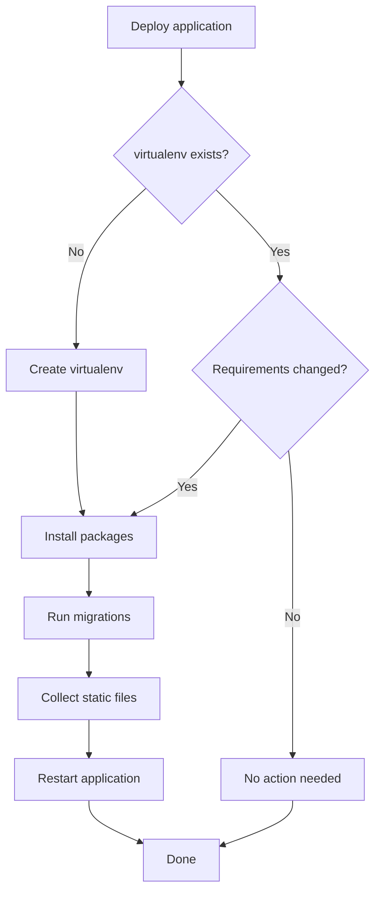

# How to Use the Ansible pip Module with virtualenv

Author: [nawazdhandala](https://www.github.com/nawazdhandala)

Tags: Ansible, Python, pip, virtualenv

Description: Learn how to create and manage Python virtual environments with the Ansible pip module for isolated application deployments.

---

Virtual environments are the standard way to isolate Python application dependencies from the system Python and from each other. If you deploy multiple Python applications on the same server, or if you want to avoid polluting the system Python installation, virtualenvs are essential. The Ansible `pip` module has built-in support for creating and managing virtualenvs, and this post shows you how to use it properly.

## Why Use virtualenvs?

Without virtualenvs, every Python application on a server shares the same set of installed packages. Application A needs `requests==2.28.0` but Application B needs `requests==2.31.0`. Without isolation, one of them breaks. Virtualenvs solve this by giving each application its own Python environment with its own package directory.

On modern Linux distributions (Ubuntu 23.04+, Fedora 38+), there is an additional reason: PEP 668 marks the system Python as externally managed, and pip refuses to install packages into it. Virtualenvs are now the only sanctioned way to install pip packages.

## Creating a virtualenv and Installing Packages

The `pip` module creates the virtualenv automatically if it does not exist:

```yaml
# Create a virtualenv and install packages into it
- name: Install Flask application dependencies
  ansible.builtin.pip:
    name:
      - flask==3.0.0
      - gunicorn==21.2.0
      - sqlalchemy==2.0.23
    virtualenv: /opt/myapp/venv
    virtualenv_command: python3 -m venv
```

The `virtualenv` parameter specifies where to create the environment. The `virtualenv_command` parameter tells Ansible which tool to use. On modern systems, `python3 -m venv` is the standard. Older systems might need the separate `virtualenv` package.

## Choosing a virtualenv Command

There are two main options for creating virtualenvs:

```yaml
# Option 1: Use the built-in venv module (recommended for Python 3.3+)
- name: Create venv with python3 -m venv
  ansible.builtin.pip:
    name: flask
    virtualenv: /opt/myapp/venv
    virtualenv_command: python3 -m venv

# Option 2: Use the virtualenv package (needed for older systems or special cases)
- name: Create venv with virtualenv command
  ansible.builtin.pip:
    name: flask
    virtualenv: /opt/myapp/venv
    virtualenv_command: virtualenv
```

If you use `virtualenv`, install it first:

```yaml
# Install virtualenv package on the target system
- name: Install virtualenv
  ansible.builtin.pip:
    name: virtualenv
    executable: pip3
```

## Specifying the Python Version

To create a virtualenv with a specific Python version:

```yaml
# Create virtualenv with Python 3.11
- name: Install packages in Python 3.11 virtualenv
  ansible.builtin.pip:
    name:
      - django==4.2.8
      - celery==5.3.6
    virtualenv: /opt/webapp/venv
    virtualenv_command: python3.11 -m venv
    virtualenv_python: python3.11
```

The `virtualenv_python` parameter specifies which Python interpreter to use inside the virtualenv. This is mainly useful with the `virtualenv` command rather than `python3 -m venv`.

## Installing from requirements.txt into a virtualenv

```yaml
# Install all application requirements into a virtualenv
- name: Install app requirements
  ansible.builtin.pip:
    requirements: /opt/myapp/requirements.txt
    virtualenv: /opt/myapp/venv
    virtualenv_command: python3 -m venv
```

## Complete Application Deployment with virtualenv

Here is a full playbook that deploys a Django application with a virtualenv:

```yaml
# Deploy a Django application with an isolated virtualenv
- name: Deploy Django application
  hosts: web_servers
  become: yes
  vars:
    app_name: mywebapp
    app_dir: /opt/{{ app_name }}
    venv_dir: "{{ app_dir }}/venv"
    app_user: "{{ app_name }}"
    python_version: python3.11
  tasks:
    - name: Install system dependencies
      ansible.builtin.apt:
        name:
          - "{{ python_version }}"
          - "{{ python_version }}-venv"
          - "{{ python_version }}-dev"
          - libpq-dev
          - gcc
        state: present
        update_cache: yes
        cache_valid_time: 3600

    - name: Create application user
      ansible.builtin.user:
        name: "{{ app_user }}"
        home: "{{ app_dir }}"
        system: yes
        shell: /bin/bash

    - name: Create application directory structure
      ansible.builtin.file:
        path: "{{ item }}"
        state: directory
        owner: "{{ app_user }}"
        group: "{{ app_user }}"
        mode: '0755'
      loop:
        - "{{ app_dir }}"
        - "{{ app_dir }}/logs"
        - "{{ app_dir }}/static"
        - "{{ app_dir }}/media"

    - name: Deploy application code
      ansible.builtin.synchronize:
        src: app/
        dest: "{{ app_dir }}/src/"
      become_user: "{{ app_user }}"
      notify: restart app

    - name: Install Python packages in virtualenv
      ansible.builtin.pip:
        requirements: "{{ app_dir }}/src/requirements.txt"
        virtualenv: "{{ venv_dir }}"
        virtualenv_command: "{{ python_version }} -m venv"
      become_user: "{{ app_user }}"
      notify: restart app

    - name: Run database migrations
      ansible.builtin.command:
        cmd: "{{ venv_dir }}/bin/python manage.py migrate --noinput"
        chdir: "{{ app_dir }}/src"
      become_user: "{{ app_user }}"
      register: migration_result
      changed_when: "'Applying' in migration_result.stdout"

    - name: Collect static files
      ansible.builtin.command:
        cmd: "{{ venv_dir }}/bin/python manage.py collectstatic --noinput"
        chdir: "{{ app_dir }}/src"
      become_user: "{{ app_user }}"
      changed_when: false

    - name: Deploy systemd service file
      ansible.builtin.template:
        src: webapp.service.j2
        dest: "/etc/systemd/system/{{ app_name }}.service"
        mode: '0644'
      notify:
        - reload systemd
        - restart app

  handlers:
    - name: reload systemd
      ansible.builtin.systemd:
        daemon_reload: yes

    - name: restart app
      ansible.builtin.systemd:
        name: "{{ app_name }}"
        state: restarted
        enabled: yes
```

The systemd service template references the virtualenv's Python:

```jinja2
{# templates/webapp.service.j2 #}
[Unit]
Description={{ app_name }} Django Application
After=network.target

[Service]
Type=notify
User={{ app_user }}
Group={{ app_user }}
WorkingDirectory={{ app_dir }}/src
ExecStart={{ venv_dir }}/bin/gunicorn \
    --bind 127.0.0.1:8000 \
    --workers 4 \
    --timeout 120 \
    config.wsgi:application
Restart=always
RestartSec=5

[Install]
WantedBy=multi-user.target
```

## Recreating a virtualenv

Sometimes you need to blow away and recreate a virtualenv, for example when upgrading Python or recovering from a corrupted environment:

```yaml
# Delete and recreate the virtualenv
- name: Remove existing virtualenv
  ansible.builtin.file:
    path: /opt/myapp/venv
    state: absent
  when: recreate_venv | default(false)

- name: Create fresh virtualenv with packages
  ansible.builtin.pip:
    requirements: /opt/myapp/requirements.txt
    virtualenv: /opt/myapp/venv
    virtualenv_command: python3 -m venv
```

Run with `-e recreate_venv=true` to trigger the recreation:

```bash
ansible-playbook deploy.yml -e recreate_venv=true
```

## Multiple virtualenvs on One Server

When running multiple applications:

```yaml
# Deploy multiple applications with separate virtualenvs
- name: Deploy application virtualenvs
  ansible.builtin.pip:
    requirements: "{{ item.app_dir }}/requirements.txt"
    virtualenv: "{{ item.app_dir }}/venv"
    virtualenv_command: "{{ item.python | default('python3') }} -m venv"
  loop:
    - app_dir: /opt/api-service
      python: python3.11
    - app_dir: /opt/worker-service
      python: python3.11
    - app_dir: /opt/legacy-tool
      python: python3.9
  loop_control:
    label: "{{ item.app_dir }}"
```

## virtualenv Lifecycle



## Upgrading Packages in an Existing virtualenv

To upgrade packages without recreating the environment:

```yaml
# Upgrade a specific package in the virtualenv
- name: Upgrade Django to latest 4.2.x
  ansible.builtin.pip:
    name: "Django>=4.2,<4.3"
    virtualenv: /opt/myapp/venv
    state: latest

# Or reinstall everything from requirements (force upgrade)
- name: Reinstall all requirements
  ansible.builtin.pip:
    requirements: /opt/myapp/requirements.txt
    virtualenv: /opt/myapp/venv
    extra_args: "--upgrade"
```

## Tips for virtualenv Management

1. **Always own the virtualenv with the application user.** Use `become_user` to run pip as the app user. This prevents permission issues when the application tries to read its packages.

2. **Never put the virtualenv inside the code directory.** If you sync code with `synchronize` and `delete: yes`, it will wipe the virtualenv. Keep the venv adjacent to the code, not inside it.

3. **Pin all your dependencies.** Use `pip freeze` to generate a fully pinned requirements file. Unpinned dependencies will give you different versions on different deployments, leading to "it works on staging but breaks in production" situations.

4. **Include `--no-cache-dir` for Docker builds.** Not relevant for server deployments, but if you are building containers with Ansible, `extra_args: "--no-cache-dir"` saves significant image size.

5. **Use `virtualenv_command: python3 -m venv`** on modern systems. The standalone `virtualenv` package is still useful for Python 2 compatibility, but `venv` is built into Python 3 and requires no extra installation.

Virtual environments are the foundation of reliable Python deployments. The Ansible `pip` module makes them easy to create and manage, and once you have the pattern down, every Python application deployment follows the same structure.
