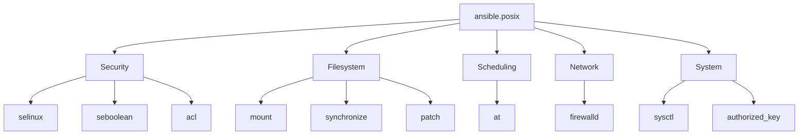

# How to Use the ansible.posix Collection

Author: [nawazdhandala](https://www.github.com/nawazdhandala)

Tags: Ansible, POSIX, Linux, System Administration, DevOps

Description: Practical guide to the ansible.posix collection covering SELinux, firewalld, mount, cron, sysctl, ACLs, and other POSIX system management modules.

---

The `ansible.posix` collection contains modules for managing POSIX-compliant systems, primarily Linux. Before Ansible 2.10, these modules were part of ansible core. Now they live in their own collection, maintained by the Ansible community team. If you manage Linux servers, you will use this collection constantly for things like SELinux, firewall rules, filesystem mounts, cron jobs, and access control lists.

## Installation

```bash
# Install the ansible.posix collection
ansible-galaxy collection install ansible.posix

# Install a specific version
ansible-galaxy collection install ansible.posix:1.5.4
```

Add it to your `requirements.yml`:

```yaml
# requirements.yml
---
collections:
  - name: ansible.posix
    version: ">=1.5.0"
```

## Managing SELinux

SELinux management is one of the most used features of this collection. The `seboolean` and `selinux` modules give you control over SELinux state and booleans.

This playbook configures SELinux for a web server:

```yaml
# selinux-setup.yml - Configure SELinux for a web application
---
- name: Configure SELinux for web server
  hosts: webservers
  become: true
  tasks:
    - name: Ensure SELinux is in enforcing mode
      ansible.posix.selinux:
        policy: targeted
        state: enforcing

    - name: Allow HTTPD to connect to the network
      ansible.posix.seboolean:
        name: httpd_can_network_connect
        state: true
        persistent: true

    - name: Allow HTTPD to connect to databases
      ansible.posix.seboolean:
        name: httpd_can_network_connect_db
        state: true
        persistent: true

    - name: Allow HTTPD to send mail
      ansible.posix.seboolean:
        name: httpd_can_sendmail
        state: true
        persistent: true

    - name: Set SELinux context for custom web directory
      community.general.sefcontext:
        target: "/var/www/myapp(/.*)?"
        setype: httpd_sys_content_t
        state: present
      notify: restore selinux context

  handlers:
    - name: restore selinux context
      ansible.builtin.command:
        cmd: restorecon -Rv /var/www/myapp
```

## Firewalld Management

The `firewalld` module manages firewall rules through the firewalld daemon. It is much cleaner than running `firewall-cmd` commands.

```yaml
# firewall-setup.yml - Configure firewall rules for application stack
---
- name: Configure firewall rules
  hosts: app_servers
  become: true
  tasks:
    - name: Allow HTTP traffic
      ansible.posix.firewalld:
        service: http
        permanent: true
        state: enabled
        immediate: true

    - name: Allow HTTPS traffic
      ansible.posix.firewalld:
        service: https
        permanent: true
        state: enabled
        immediate: true

    - name: Allow custom application port
      ansible.posix.firewalld:
        port: 8443/tcp
        permanent: true
        state: enabled
        immediate: true

    - name: Allow traffic from trusted network
      ansible.posix.firewalld:
        source: 10.0.100.0/24
        zone: trusted
        permanent: true
        state: enabled
        immediate: true

    - name: Block traffic from suspicious network
      ansible.posix.firewalld:
        rich_rule: 'rule family="ipv4" source address="192.168.50.0/24" reject'
        permanent: true
        state: enabled
        immediate: true

    - name: Forward port 80 to 8080
      ansible.posix.firewalld:
        rich_rule: 'rule family="ipv4" forward-port port="80" protocol="tcp" to-port="8080"'
        permanent: true
        state: enabled
        immediate: true
```

## Filesystem Mounts

The `mount` module manages entries in `/etc/fstab` and controls mount state:

```yaml
# mounts.yml - Configure filesystem mounts
---
- name: Configure storage mounts
  hosts: storage_servers
  become: true
  tasks:
    - name: Mount NFS share for application data
      ansible.posix.mount:
        path: /mnt/app-data
        src: nfs-server.internal:/exports/app-data
        fstype: nfs
        opts: "rw,sync,hard,intr,rsize=65536,wsize=65536"
        state: mounted

    - name: Mount dedicated data partition
      ansible.posix.mount:
        path: /data
        src: /dev/sdb1
        fstype: xfs
        opts: "defaults,noatime"
        state: mounted

    - name: Add tmpfs for application cache
      ansible.posix.mount:
        path: /var/cache/myapp
        src: tmpfs
        fstype: tmpfs
        opts: "size=2G,mode=0755"
        state: mounted

    - name: Unmount deprecated share
      ansible.posix.mount:
        path: /mnt/old-share
        state: absent
```

The `state` parameter has several values:
- `mounted` - mount and add to fstab
- `unmounted` - unmount but keep in fstab
- `present` - add to fstab but do not mount
- `absent` - unmount and remove from fstab
- `remounted` - remount the filesystem

## ACL (Access Control Lists)

The `acl` module manages POSIX ACLs, which provide finer-grained permissions than standard Unix file permissions:

```yaml
# acl-setup.yml - Set up fine-grained file permissions with ACLs
---
- name: Configure application file permissions
  hosts: app_servers
  become: true
  tasks:
    - name: Grant the deploy group read access to config directory
      ansible.posix.acl:
        path: /etc/myapp
        entity: deploy
        etype: group
        permissions: rx
        state: present

    - name: Set default ACL so new files inherit permissions
      ansible.posix.acl:
        path: /var/log/myapp
        entity: monitoring
        etype: group
        permissions: r
        default: true
        state: present

    - name: Grant specific user write access to uploads
      ansible.posix.acl:
        path: /var/www/myapp/uploads
        entity: appuser
        etype: user
        permissions: rwx
        recursive: true
        state: present

    - name: Read current ACLs
      ansible.posix.acl:
        path: /etc/myapp
      register: acl_info

    - name: Display current ACLs
      ansible.builtin.debug:
        var: acl_info.acl
```

## Sysctl Configuration

The `sysctl` module manages kernel parameters at runtime and in `/etc/sysctl.conf`:

```yaml
# sysctl-hardening.yml - Kernel parameter tuning for security and performance
---
- name: Configure kernel parameters
  hosts: all
  become: true
  tasks:
    - name: Disable IP forwarding
      ansible.posix.sysctl:
        name: net.ipv4.ip_forward
        value: "0"
        sysctl_set: true
        state: present
        reload: true

    - name: Enable SYN cookies (protection against SYN flood)
      ansible.posix.sysctl:
        name: net.ipv4.tcp_syncookies
        value: "1"
        sysctl_set: true
        state: present
        reload: true

    - name: Increase file descriptor limit
      ansible.posix.sysctl:
        name: fs.file-max
        value: "2097152"
        sysctl_set: true
        state: present
        reload: true

    - name: Tune network buffer sizes for high throughput
      ansible.posix.sysctl:
        name: "{{ item.key }}"
        value: "{{ item.value }}"
        sysctl_set: true
        state: present
        reload: true
      loop:
        - { key: "net.core.rmem_max", value: "16777216" }
        - { key: "net.core.wmem_max", value: "16777216" }
        - { key: "net.ipv4.tcp_rmem", value: "4096 87380 16777216" }
        - { key: "net.ipv4.tcp_wmem", value: "4096 65536 16777216" }

    - name: Enable kernel address space randomization
      ansible.posix.sysctl:
        name: kernel.randomize_va_space
        value: "2"
        sysctl_set: true
        state: present
        reload: true
```

## The at Module (Scheduled One-Time Jobs)

The `at` module schedules commands to run at a specific future time using the `at` daemon:

```yaml
# scheduled-maintenance.yml - Schedule one-time maintenance tasks
---
- name: Schedule maintenance tasks
  hosts: app_servers
  become: true
  tasks:
    - name: Schedule database cleanup in 2 hours
      ansible.posix.at:
        command: "/opt/scripts/cleanup-old-records.sh >> /var/log/cleanup.log 2>&1"
        count: 2
        units: hours

    - name: Schedule service restart at midnight
      ansible.posix.at:
        command: "systemctl restart myapp"
        count: 1
        units: days

    - name: Remove all scheduled at jobs
      ansible.posix.at:
        command: "dummy"
        state: absent
        unique: false
```

## The synchronize Module

The `synchronize` module wraps `rsync` for efficient file transfers:

```yaml
# deploy-files.yml - Sync application files to servers
---
- name: Deploy application files
  hosts: app_servers
  tasks:
    - name: Sync application code to servers
      ansible.posix.synchronize:
        src: /opt/builds/myapp-latest/
        dest: /var/www/myapp/
        delete: true
        recursive: true
        rsync_opts:
          - "--exclude=.git"
          - "--exclude=node_modules"
          - "--exclude=*.pyc"

    - name: Pull logs from remote server to local
      ansible.posix.synchronize:
        mode: pull
        src: /var/log/myapp/
        dest: /tmp/collected-logs/{{ inventory_hostname }}/
        rsync_opts:
          - "--compress"
```

## Modules Reference

Here is a summary of all the key modules in `ansible.posix`:



## Conclusion

The `ansible.posix` collection is essential for anyone managing Linux systems with Ansible. It covers the core system administration tasks that you need on virtually every server: SELinux configuration, firewall rules, filesystem mounts, kernel tuning, and file permissions. Install it alongside `ansible-core` as part of your base requirements, and use FQCNs like `ansible.posix.firewalld` and `ansible.posix.sysctl` in your playbooks for clarity.
