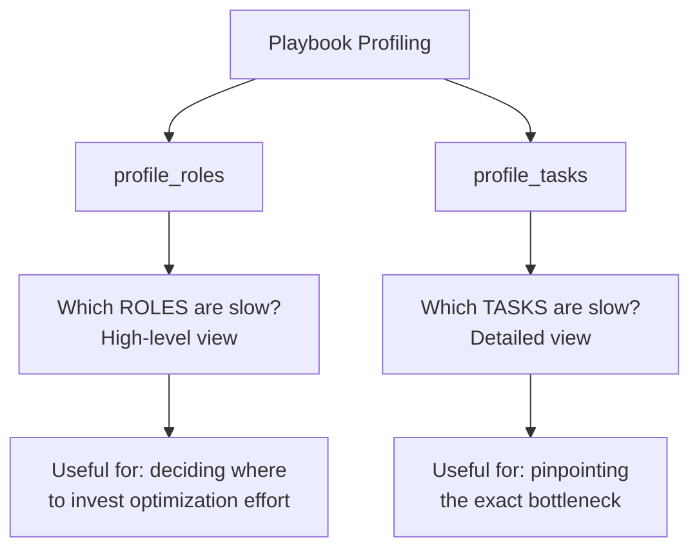

# How to Use the Ansible profile_roles Callback Plugin

Author: [nawazdhandala](https://www.github.com/nawazdhandala)

Tags: Ansible, Profiling, Roles, Performance

Description: Use the Ansible profile_roles callback plugin to measure execution time per role and identify which roles need performance optimization.

---

When your Ansible playbooks use roles (and they should if you have any complexity at all), tracking performance at the role level gives you a different perspective than per-task profiling. The `profile_roles` callback plugin aggregates execution time by role, showing you which roles consume the most time. This is particularly valuable when you have playbooks that include 10 or more roles and you need to decide where to invest optimization effort.

## Enabling profile_roles

Enable it in `ansible.cfg`:

```ini
# Enable the profile_roles callback
[defaults]
callbacks_enabled = profile_roles
```

Or combine it with other profiling callbacks:

```ini
# Full profiling suite
[defaults]
callbacks_enabled = profile_roles, profile_tasks, timer
```

For a one-off profiling run:

```bash
# Profile roles for a single run
ANSIBLE_CALLBACKS_ENABLED=profile_roles ansible-playbook site.yml
```

## What profile_roles Shows

At the end of a playbook run, profile_roles prints a summary of time spent in each role:

```
===============================================================================
postgresql ----------------------------------------------- 67.23s
app_deploy ----------------------------------------------- 45.12s
common --------------------------------------------------- 34.56s
nginx ---------------------------------------------------- 22.34s
monitoring ----------------------------------------------- 15.67s
firewall -------------------------------------------------- 8.45s
users ----------------------------------------------------- 5.23s
sshd ------------------------------------------------------ 3.12s
ntp ------------------------------------------------------- 2.34s
```

This tells you at a glance that the `postgresql` role is responsible for 67 seconds of execution time, making it the top optimization target.

## profile_roles vs profile_tasks

These two callbacks serve different purposes:



I typically start with `profile_roles` to identify the slow roles, then switch to `profile_tasks` to drill into the specific tasks within those roles.

## Practical Example

Here is a multi-role playbook for deploying a web application stack:

```yaml
---
# site.yml - Full stack deployment
- hosts: all
  become: true
  roles:
    - common
    - security
    - monitoring

- hosts: webservers
  become: true
  roles:
    - nginx
    - app_deploy
    - ssl_certificates

- hosts: databases
  become: true
  roles:
    - postgresql
    - backup_agent
```

And the roles structure:

```
roles/
  common/
    tasks/main.yml         # Package updates, NTP, timezone
  security/
    tasks/main.yml         # Firewall rules, SSH hardening
  monitoring/
    tasks/main.yml         # Install node_exporter
  nginx/
    tasks/main.yml         # Install and configure nginx
    templates/nginx.conf.j2
  app_deploy/
    tasks/main.yml         # Deploy application code
  ssl_certificates/
    tasks/main.yml         # Manage TLS certificates
  postgresql/
    tasks/main.yml         # Install and configure PostgreSQL
  backup_agent/
    tasks/main.yml         # Configure backup client
```

Run with profiling:

```bash
# Profile the full deployment
ANSIBLE_CALLBACKS_ENABLED=profile_roles,timer ansible-playbook site.yml
```

Output:

```
===============================================================================
common --------------------------------------------------- 45.67s
postgresql ----------------------------------------------- 38.23s
app_deploy ----------------------------------------------- 22.11s
nginx ---------------------------------------------------- 18.45s
monitoring ----------------------------------------------- 12.34s
security -------------------------------------------------- 9.87s
ssl_certificates ------------------------------------------ 6.54s
backup_agent ---------------------------------------------- 4.32s

Playbook run took 0 days, 0 hours, 2 minutes, 37 seconds
```

Now you know that `common` and `postgresql` together account for 84 seconds out of 157 total, which is 54% of the playbook runtime. These are the roles to optimize first.

## Drilling Down into a Slow Role

Once profile_roles identifies a slow role, use profile_tasks to find the specific bottleneck:

```bash
# Run just the slow role with detailed profiling
ANSIBLE_CALLBACKS_ENABLED=profile_tasks ansible-playbook site.yml --tags common
```

If the role is not tagged, create a temporary playbook:

```yaml
---
# profile-common.yml - Profile just the common role
- hosts: all
  become: true
  roles:
    - common
```

```bash
ANSIBLE_CALLBACKS_ENABLED=profile_tasks ansible-playbook profile-common.yml
```

The output might reveal:

```
===============================================================================
common : Update apt cache -------------------------------- 22.34s
common : Install base packages --------------------------- 15.67s
common : Configure NTP ------------------------------------ 3.45s
common : Set timezone ------------------------------------- 2.12s
common : Configure sysctl --------------------------------- 1.23s
Gathering Facts ------------------------------------------- 0.86s
```

Now you see that `Update apt cache` is the real culprit within the `common` role.

## Optimizing Based on Role Profiles

Here are optimization strategies for common role patterns:

### Package Management Roles (slow due to apt/yum)

```yaml
# roles/common/tasks/main.yml - Optimized
- name: Update apt cache (skip if recent)
  apt:
    update_cache: true
    cache_valid_time: 3600
  # Skips the update if done within the last hour

- name: Install all packages in one transaction
  apt:
    name: "{{ common_packages }}"
    state: present
  # Single apt call instead of one per package
```

### Configuration Roles (slow due to many file operations)

```yaml
# roles/security/tasks/main.yml - Optimized with block
- name: Apply security configuration
  block:
    - name: Copy all security configs at once
      copy:
        src: "{{ item.src }}"
        dest: "{{ item.dest }}"
        mode: "{{ item.mode }}"
      loop:
        - { src: sshd_config, dest: /etc/ssh/sshd_config, mode: '0644' }
        - { src: login.defs, dest: /etc/login.defs, mode: '0644' }
        - { src: limits.conf, dest: /etc/security/limits.conf, mode: '0644' }
      notify: restart sshd
  # Batching file copies reduces SSH round trips
```

### Database Roles (slow due to installation and initialization)

```yaml
# roles/postgresql/tasks/main.yml - Optimized
- name: Install PostgreSQL
  apt:
    name:
      - postgresql
      - postgresql-contrib
      - python3-psycopg2
    state: present

# Skip initialization if already done
- name: Check if database is initialized
  stat:
    path: /var/lib/postgresql/data/PG_VERSION
  register: pg_init

- name: Initialize database
  command: pg_ctlcluster 14 main start
  when: not pg_init.stat.exists
```

## Role Profiling in Multi-Play Playbooks

When a role is included in multiple plays, profile_roles aggregates the time across all plays:

```yaml
---
# The common role runs on all three host groups
- hosts: webservers
  roles:
    - common
    - nginx

- hosts: databases
  roles:
    - common
    - postgresql

- hosts: monitoring_servers
  roles:
    - common
    - prometheus
```

The profile_roles output will show `common` with the total time across all three plays. If `common` takes 15 seconds per play and runs three times, you will see:

```
common --------------------------------------------------- 45.00s
```

This helps you see the true cost of roles that are reused across many host groups.

## Custom Role Profiling

For more granular role profiling, add timing tasks at the start and end of each role:

```yaml
# roles/app_deploy/tasks/main.yml
- name: "TIMING: app_deploy role start"
  set_fact:
    role_start_time: "{{ now() }}"

- name: Deploy application code
  copy:
    src: app.tar.gz
    dest: /opt/app/

- name: Extract application
  unarchive:
    src: /opt/app/app.tar.gz
    dest: /opt/app/
    remote_src: true

- name: Install dependencies
  pip:
    requirements: /opt/app/requirements.txt
    virtualenv: /opt/app/venv

- name: Run migrations
  command: /opt/app/venv/bin/python manage.py migrate
  args:
    chdir: /opt/app

- name: "TIMING: app_deploy role end"
  debug:
    msg: "Role completed. Started at {{ role_start_time }}, ended at {{ now() }}"
```

## Comparing Role Performance Across Environments

Profile the same playbook in different environments to spot infrastructure-specific bottlenecks:

```bash
#!/bin/bash
# compare-environments.sh - Profile roles across environments

for ENV in staging production; do
    echo "=== Profiling $ENV ==="
    ANSIBLE_CALLBACKS_ENABLED=profile_roles ansible-playbook site.yml \
        -i "inventories/$ENV" 2>&1 | \
        grep -E "^={10,}$|^\w" | tee "profile-$ENV.log"
    echo ""
done

echo "=== Comparison ==="
paste -d'|' <(grep -v "^=" profile-staging.log) <(grep -v "^=" profile-production.log)
```

If a role takes 20 seconds in staging but 60 seconds in production, the difference is likely due to the number of hosts or network latency between environments.

## Tracking Role Performance Over Time

Create a script that records role-level timing data:

```bash
#!/bin/bash
# track-role-performance.sh - Log role timing data

PLAYBOOK="$1"
LOG_DIR="/var/log/ansible/role-profiles"
mkdir -p "$LOG_DIR"

TIMESTAMP=$(date +%Y%m%d-%H%M%S)

ANSIBLE_CALLBACKS_ENABLED=profile_roles ansible-playbook "$PLAYBOOK" 2>&1 | \
    tee "$LOG_DIR/roles-$TIMESTAMP.log"

# Extract and save structured data
grep -E "^[a-z_].*---" "$LOG_DIR/roles-$TIMESTAMP.log" | \
    sed 's/\s*-*\s*/,/' | \
    sed 's/s$//' > "$LOG_DIR/roles-$TIMESTAMP.csv"

echo "Profile saved to $LOG_DIR/roles-$TIMESTAMP.csv"
```

The profile_roles callback gives you the bird's eye view of where time goes in role-based playbooks. It is most valuable during the initial assessment phase when you need to decide which roles to optimize first. Combined with profile_tasks for detailed analysis and timer for total execution tracking, it forms a complete profiling toolkit for Ansible performance work.
