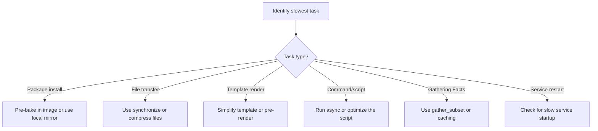

# How to Use the Ansible profile_tasks Callback Plugin

Author: [nawazdhandala](https://www.github.com/nawazdhandala)

Tags: Ansible, Profiling, Callback Plugins, Performance

Description: Use the Ansible profile_tasks callback plugin to identify slow tasks, analyze execution bottlenecks, and optimize playbook performance.

---

The `profile_tasks` callback plugin is the most detailed profiling tool built into Ansible. It timestamps every task execution and produces a sorted summary showing which tasks took the longest. If you are trying to speed up a playbook, this plugin tells you exactly where to focus your effort. This post covers setup, interpretation, and practical techniques for using the profiling data.

## Enabling profile_tasks

Enable it in `ansible.cfg`:

```ini
# Enable the profile_tasks callback
[defaults]
callbacks_enabled = profile_tasks
```

Or for a single run:

```bash
# One-time profiling without changing config
ANSIBLE_CALLBACKS_ENABLED=profile_tasks ansible-playbook deploy.yml
```

## Reading the Output

With profile_tasks enabled, each task shows two timestamps:

```
TASK [Install nginx] ***********************************************************
Thursday 21 February 2026  10:15:03 +0000 (0:00:02.345)       0:00:05.678 ****
ok: [web-01]
ok: [web-02]
```

The two values in parentheses mean:
- `(0:00:02.345)` is the elapsed time for the previous task
- `0:00:05.678` is the cumulative elapsed time since playbook start

At the end of the playbook, profile_tasks prints a sorted summary:

```
Thursday 21 February 2026  10:18:30 +0000 (0:00:01.234)       0:03:30.456 ****
===============================================================================
Install packages ----------------------------------------- 67.12s
Run database migration ----------------------------------- 42.45s
Download application archive ----------------------------- 23.34s
Copy nginx configuration --------------------------------- 12.67s
Gathering Facts ------------------------------------------- 8.21s
Restart nginx --------------------------------------------- 3.89s
Create application user ----------------------------------- 2.12s
Set file permissions -------------------------------------- 1.78s
Enable nginx service -------------------------------------- 1.45s
Verify deployment ----------------------------------------- 0.89s
```

This summary is sorted by duration (longest first), making it immediately obvious where time is spent.

## Understanding the Summary

Let us analyze a real profiling output and figure out what to optimize:

```
===============================================================================
apt: Install packages ------------------------------------ 67.12s
command: Run database migration --------------------------- 42.45s
get_url: Download application archive -------------------- 23.34s
template: Copy nginx configuration ----------------------- 12.67s
setup: Gathering Facts ------------------------------------ 8.21s
service: Restart nginx ------------------------------------ 3.89s
```

Here is what each entry tells us:

- **Install packages (67s)**: Package installation is inherently slow. Consider using `apt` with `cache_valid_time` to skip cache updates, or pre-bake packages into your AMI/image.
- **Database migration (42s)**: This is application-specific. If it runs on every deploy, check if it can be skipped when there are no schema changes.
- **Download archive (23s)**: Network transfer. Could benefit from a local mirror or pre-staging files on the host.
- **Nginx config (12s)**: Surprisingly slow for a template. Check if the template is large or if there are many hosts.
- **Gathering Facts (8s)**: Use `gather_subset` or disable facts if possible.

## Configuring Output Format

profile_tasks has configuration options to control what appears in the summary:

```ini
# Show only tasks that took longer than 5 seconds
[defaults]
callbacks_enabled = profile_tasks

[callback_profile_tasks]
task_output_limit = 20
sort_order = descending
```

The `task_output_limit` controls how many tasks appear in the summary. Default is 20. Set to 0 for unlimited.

## Saving Profiling Data

Capture the output for later analysis:

```bash
# Save profile output to a file
ANSIBLE_CALLBACKS_ENABLED=profile_tasks ansible-playbook deploy.yml 2>&1 | tee profile-$(date +%Y%m%d-%H%M%S).log
```

For structured data extraction:

```bash
#!/bin/bash
# extract-profile.sh - Extract timing data from profile_tasks output

PROFILE_FILE="$1"

# Extract the summary section (after the === line)
awk '/^={10,}/{found=1; next} found && /^$/{exit} found{print}' "$PROFILE_FILE" | \
    sed 's/\s*-*\s*/|/' | \
    awk -F'|' '{printf "%-50s %s\n", $1, $2}'
```

## Comparing Runs

Profile before and after optimization to measure improvement:

```bash
#!/bin/bash
# compare-profiles.sh - Compare two profiling runs

BEFORE="$1"
AFTER="$2"

echo "=== Before Optimization ==="
grep "Playbook run took\|^=*$" "$BEFORE" -A 100 | head -15

echo ""
echo "=== After Optimization ==="
grep "Playbook run took\|^=*$" "$AFTER" -A 100 | head -15

echo ""
echo "=== Comparison ==="

# Extract total times
BEFORE_TIME=$(grep "Playbook run took" "$BEFORE" | grep -oP '\d+ minutes, \d+ seconds')
AFTER_TIME=$(grep "Playbook run took" "$AFTER" | grep -oP '\d+ minutes, \d+ seconds')

echo "Before: $BEFORE_TIME"
echo "After:  $AFTER_TIME"
```

## Profiling a Real Deployment Playbook

Here is a practical example of profiling a multi-role deployment:

```yaml
---
# deploy.yml - Application deployment playbook
- hosts: webservers
  become: true
  roles:
    - common
    - nginx
    - app_deploy
    - monitoring

- hosts: databases
  become: true
  roles:
    - common
    - postgresql
    - backup
```

Run with profiling:

```bash
# Profile the deployment
ANSIBLE_CALLBACKS_ENABLED=profile_tasks,profile_roles ansible-playbook deploy.yml
```

The output will show timing for every task across all roles and plays. The sorted summary at the end might look like:

```
===============================================================================
postgresql : Install PostgreSQL packages ----------------- 34.21s
app_deploy : Build application --------------------------- 28.45s
common : Update package cache ---------------------------- 22.11s
nginx : Install nginx ------------------------------------ 18.67s
monitoring : Install Prometheus node_exporter ------------ 12.34s
postgresql : Initialize database cluster ------------------ 9.87s
backup : Configure automated backups ---------------------- 7.65s
app_deploy : Run migrations ------------------------------- 6.54s
common : Configure NTP ------------------------------------ 4.32s
Gathering Facts ------------------------------------------- 3.21s
```

## Optimization Strategies Based on Profile Data

Once you have profiling data, here is a decision framework:



For each common bottleneck:

**Slow package installs:**
```yaml
# Speed up apt operations
- name: Install packages with cached updates
  apt:
    name: "{{ packages }}"
    state: present
    update_cache: true
    cache_valid_time: 3600  # Skip update if done within the last hour
```

**Slow file transfers:**
```yaml
# Use synchronize instead of copy for large directories
- name: Sync application files
  synchronize:
    src: app/
    dest: /opt/myapp/
    delete: true
    rsync_opts:
      - "--compress"
      - "--exclude=.git"
```

**Slow commands:**
```yaml
# Run slow commands asynchronously
- name: Run long build process
  command: /opt/build.sh
  async: 600
  poll: 10
```

## Using profile_tasks in CI/CD

Integrate profiling into your CI/CD pipeline:

```yaml
# Jenkinsfile example
pipeline {
    agent any
    stages {
        stage('Deploy') {
            steps {
                sh '''
                    ANSIBLE_CALLBACKS_ENABLED=profile_tasks,timer \
                    ansible-playbook deploy.yml 2>&1 | tee ansible-profile.log
                '''
            }
            post {
                always {
                    archiveArtifacts artifacts: 'ansible-profile.log'
                }
            }
        }
    }
}
```

```yaml
# GitHub Actions example
- name: Deploy with profiling
  env:
    ANSIBLE_CALLBACKS_ENABLED: profile_tasks,timer
  run: |
    ansible-playbook deploy.yml 2>&1 | tee ansible-profile.log

- name: Upload profiling data
  uses: actions/upload-artifact@v3
  with:
    name: ansible-profile
    path: ansible-profile.log
```

## Building a Performance Dashboard

If you collect profiling data over time, you can build a simple dashboard:

```bash
#!/bin/bash
# performance-report.sh - Generate a weekly performance report

LOG_DIR="/var/log/ansible/profiles"
REPORT_FILE="/tmp/ansible-performance-report.txt"

echo "=== Ansible Performance Report ===" > "$REPORT_FILE"
echo "Week of $(date -d 'last monday' +%Y-%m-%d)" >> "$REPORT_FILE"
echo "" >> "$REPORT_FILE"

echo "--- Runs This Week ---" >> "$REPORT_FILE"
find "$LOG_DIR" -name "*.log" -mtime -7 | wc -l >> "$REPORT_FILE"

echo "" >> "$REPORT_FILE"
echo "--- Average Duration ---" >> "$REPORT_FILE"
find "$LOG_DIR" -name "*.log" -mtime -7 -exec grep "Playbook run took" {} \; | \
    grep -oP '\d+ minutes' | grep -oP '\d+' | \
    awk '{sum+=$1; count++} END {printf "%.1f minutes\n", sum/count}' >> "$REPORT_FILE"

echo "" >> "$REPORT_FILE"
echo "--- Top 5 Slowest Tasks (across all runs) ---" >> "$REPORT_FILE"
find "$LOG_DIR" -name "*.log" -mtime -7 -exec grep -E "^.+---+\s+[0-9]+\.[0-9]+s$" {} \; | \
    sort -t'-' -k2 -rn | head -5 >> "$REPORT_FILE"

cat "$REPORT_FILE"
```

The profile_tasks callback is an essential tool for anyone working with Ansible at scale. Enable it during development to catch performance issues early, and keep it active in CI/CD to detect regressions. The sorted summary it produces is the single fastest way to identify where your playbook's time is going.
