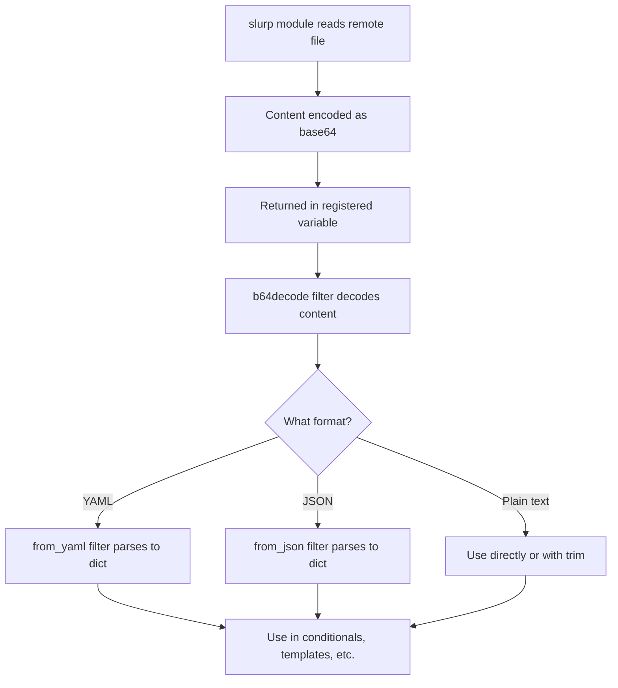

# How to Use the Ansible slurp Module to Read Remote Files

Author: [nawazdhandala](https://www.github.com/nawazdhandala)

Tags: Ansible, DevOps, Automation, Linux

Description: Learn how to use the Ansible slurp module to read file contents from remote hosts and use the data in your playbook logic and templates.

---

There are times when your Ansible playbook needs to read a file from a remote host and use its contents in subsequent tasks. Maybe you need to check a version number in a config file, read a generated password, or inspect the contents of a certificate. The `slurp` module reads a file from the remote host and returns its contents as a base64-encoded string. You can then decode it and use the data however you need.

## Basic Usage

The `slurp` module takes a single parameter: the path to the file you want to read.

```yaml
# Read the contents of a remote file
- name: Read the application version file
  ansible.builtin.slurp:
    src: /opt/myapp/VERSION
  register: version_file

- name: Display the file contents
  ansible.builtin.debug:
    msg: "Current version: {{ version_file.content | b64decode | trim }}"
```

The `content` field in the registered variable contains the base64-encoded file data. You always need to pipe it through `b64decode` to get the actual text. The `trim` filter removes trailing newlines.

## Why Base64 Encoding?

The `slurp` module returns base64-encoded content because Ansible communicates task results as JSON, and file contents can contain characters that would break JSON parsing (null bytes, binary data, unescaped quotes, etc.). Base64 encoding makes any file content safe to transport.

## Reading Configuration Values

A common use case is reading a configuration value from a remote host and using it to make decisions.

```yaml
# Read the current database configuration and extract the port
- name: Read database config
  ansible.builtin.slurp:
    src: /etc/myapp/database.yml
  register: db_config_raw

- name: Parse database configuration
  ansible.builtin.set_fact:
    db_config: "{{ db_config_raw.content | b64decode | from_yaml }}"

- name: Display current database host
  ansible.builtin.debug:
    msg: "Database host: {{ db_config.database.host }}"

- name: Update connection pool if using remote database
  ansible.builtin.lineinfile:
    path: /etc/myapp/database.yml
    regexp: '^  pool_size:'
    line: '  pool_size: 20'
  when: db_config.database.host != 'localhost'
```

This reads a YAML file, parses it into an Ansible dictionary, and then uses the values for conditional logic.

## Reading JSON Files

The same pattern works for JSON files.

```yaml
# Read a JSON status file from a remote service
- name: Read application status file
  ansible.builtin.slurp:
    src: /var/run/myapp/status.json
  register: status_raw

- name: Parse status JSON
  ansible.builtin.set_fact:
    app_status: "{{ status_raw.content | b64decode | from_json }}"

- name: Report application health
  ansible.builtin.debug:
    msg: "App is {{ app_status.state }} with {{ app_status.active_connections }} connections"

- name: Restart if application reports unhealthy
  ansible.builtin.systemd:
    name: myapp
    state: restarted
  when: app_status.state == 'unhealthy'
```

## Reading Certificates

Inspecting certificates on remote hosts is another practical use case.

```yaml
# Read a TLS certificate and check its details
- name: Read the TLS certificate
  ansible.builtin.slurp:
    src: /etc/ssl/certs/myapp.pem
  register: cert_content

- name: Write cert to local temp for inspection
  ansible.builtin.copy:
    content: "{{ cert_content.content | b64decode }}"
    dest: /tmp/inspect-cert.pem
  delegate_to: localhost

- name: Check certificate expiration
  ansible.builtin.command: >
    openssl x509 -enddate -noout -in /tmp/inspect-cert.pem
  delegate_to: localhost
  register: cert_expiry
  changed_when: false

- name: Show certificate expiration
  ansible.builtin.debug:
    msg: "{{ cert_expiry.stdout }}"
```

## Comparing Files Between Hosts

You can use `slurp` to read files from different hosts and compare them.

```yaml
# Read a config file from the primary server
- name: Read config from primary
  ansible.builtin.slurp:
    src: /etc/myapp/config.yml
  register: primary_config
  delegate_to: "{{ groups['primary'][0] }}"

# Read the same file from the current host
- name: Read config from current host
  ansible.builtin.slurp:
    src: /etc/myapp/config.yml
  register: local_config

# Compare them
- name: Check if configs match
  ansible.builtin.debug:
    msg: "Configuration is {{ 'in sync' if primary_config.content == local_config.content else 'out of sync' }}"
```

## Reading Generated Credentials

Applications sometimes generate passwords or tokens and write them to files. Use `slurp` to retrieve these values.

```yaml
# Read a generated admin password from a remote host
- name: Read generated admin password
  ansible.builtin.slurp:
    src: /opt/myapp/initial_admin_password
  register: admin_pass_raw
  no_log: true

- name: Store admin password as fact
  ansible.builtin.set_fact:
    admin_password: "{{ admin_pass_raw.content | b64decode | trim }}"
  no_log: true

- name: Configure downstream service with admin password
  ansible.builtin.template:
    src: templates/downstream-config.j2
    dest: /opt/downstream/config.yml
    mode: '0600'
  no_log: true
```

Always use `no_log: true` when working with sensitive data to prevent passwords from appearing in Ansible output.

## Working with Binary Files

The `slurp` module can read binary files too, since everything is base64-encoded.

```yaml
# Read a binary file and copy it to another location
- name: Read SSH host key from primary server
  ansible.builtin.slurp:
    src: /etc/ssh/ssh_host_rsa_key.pub
  register: host_key
  delegate_to: "{{ groups['primary'][0] }}"

- name: Deploy host key to known_hosts
  ansible.builtin.lineinfile:
    path: /etc/ssh/ssh_known_hosts
    line: "{{ groups['primary'][0] }} {{ host_key.content | b64decode | trim }}"
    create: yes
    mode: '0644'
```

## Error Handling

The `slurp` module fails if the file does not exist. Handle this gracefully.

```yaml
# Handle missing files with error handling
- name: Try to read optional config file
  block:
    - name: Read custom configuration
      ansible.builtin.slurp:
        src: /etc/myapp/custom.yml
      register: custom_config_raw

    - name: Parse custom config
      ansible.builtin.set_fact:
        custom_config: "{{ custom_config_raw.content | b64decode | from_yaml }}"

  rescue:
    - name: Set defaults when custom config is not found
      ansible.builtin.set_fact:
        custom_config:
          log_level: info
          max_connections: 100
          timeout: 30

- name: Apply configuration
  ansible.builtin.debug:
    msg: "Using log_level={{ custom_config.log_level }}, max_connections={{ custom_config.max_connections }}"
```

## slurp vs fetch vs command cat

There are several ways to read remote files in Ansible. Here is when to use each.

| Method | Best For | Returns |
|--------|----------|---------|
| slurp | Small text/config files | Base64 content in variable |
| fetch | Downloading files to controller | File on controller disk |
| command: cat | Last resort | stdout in registered variable |
| lookup('file') | Local files only | File content directly |

Use `slurp` when you need the file content as a variable for logic in your playbook. Use `fetch` when you need to actually save the file on the controller. Avoid `command: cat` because it is not idempotent and does not handle binary content well.

## Data Flow



## Size Limitations

The `slurp` module loads the entire file into memory and transports it as part of the Ansible result JSON. This works well for configuration files, certificates, and small data files. For files larger than a few megabytes, consider using `fetch` instead, or use `command` with tools like `head` or `grep` to extract just the data you need.

## Summary

The `slurp` module is your go-to tool for reading remote file contents into Ansible variables. The base64 encoding ensures safe transport of any file content, and the `b64decode`, `from_yaml`, and `from_json` filters make it easy to parse structured data. Use it for reading configuration values, checking version files, inspecting certificates, comparing files between hosts, and retrieving generated credentials. Pair it with `no_log` for sensitive data and `block/rescue` for optional files that might not exist.
