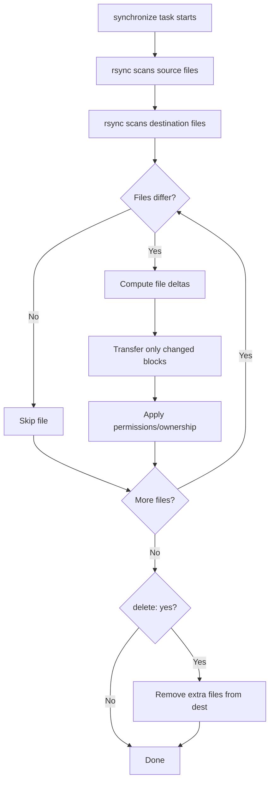

# How to Use the Ansible synchronize Module for rsync

Author: [nawazdhandala](https://www.github.com/nawazdhandala)

Tags: Ansible, DevOps, rsync, File Management

Description: Learn how to use the Ansible synchronize module to efficiently sync files and directories between hosts using rsync with delta transfer support.

---

The `synchronize` module is Ansible's wrapper around rsync, the gold standard for efficient file synchronization. While the `copy` module works fine for individual files or small directories, it falls apart when you need to sync large directory trees because it checks and transfers each file individually over SSH. The `synchronize` module leverages rsync's delta transfer algorithm, only sending the differences between source and destination files, making subsequent syncs extremely fast.

## Basic Synchronization

The simplest use case pushes files from the controller to the managed host.

```yaml
# Sync a local directory to remote hosts
- name: Deploy application files
  ansible.posix.synchronize:
    src: /opt/build/output/webapp/
    dest: /var/www/webapp/
```

Notice the trailing slash on `src`. With rsync (and `synchronize`), trailing slashes matter:
- `src: path/` syncs the **contents** of the directory
- `src: path` syncs the **directory itself** (creates `path/` at the destination)

## Push and Pull Modes

By default, `synchronize` pushes from the controller to the remote host. You can reverse the direction with `mode: pull`.

```yaml
# Pull files from remote host to controller
- name: Pull log files from remote server for analysis
  ansible.posix.synchronize:
    src: /var/log/myapp/
    dest: /opt/collected-logs/{{ inventory_hostname }}/
    mode: pull
```

## Excluding Files and Directories

Use `rsync_opts` to pass exclude patterns.

```yaml
# Sync application directory excluding build artifacts and logs
- name: Deploy application excluding unnecessary files
  ansible.posix.synchronize:
    src: /opt/build/output/
    dest: /opt/myapp/
    rsync_opts:
      - "--exclude=*.log"
      - "--exclude=*.tmp"
      - "--exclude=.git/"
      - "--exclude=node_modules/"
      - "--exclude=__pycache__/"
      - "--exclude=.env"
```

## Deleting Extra Files on Destination

The `delete` option removes files from the destination that do not exist in the source, creating an exact mirror.

```yaml
# Create an exact mirror of the source directory
- name: Mirror web content exactly
  ansible.posix.synchronize:
    src: /opt/releases/current/static/
    dest: /var/www/html/static/
    delete: yes
    recursive: yes
```

Be careful with `delete: yes`. It will remove files that were created on the destination server, including logs, uploads, or cached files that might be important.

## Setting Permissions and Ownership

Control file permissions during the sync.

```yaml
# Sync files and set specific ownership and permissions
- name: Deploy web assets with correct permissions
  ansible.posix.synchronize:
    src: /opt/build/output/static/
    dest: /var/www/html/static/
    rsync_opts:
      - "--chmod=D0755,F0644"
      - "--chown=www-data:www-data"
```

The `--chmod=D0755,F0644` sets directories to 755 and files to 644. The `--chown` sets the owner and group.

## Dry Run Mode

Test what would happen without making changes.

```yaml
# Preview what would be synced
- name: Dry run - show what would change
  ansible.posix.synchronize:
    src: /opt/releases/new/
    dest: /opt/myapp/
    rsync_opts:
      - "--dry-run"
      - "--itemize-changes"
  register: sync_preview

- name: Show planned changes
  ansible.builtin.debug:
    var: sync_preview.stdout_lines
```

## Bandwidth Limiting

For syncing over WAN links or during production hours, limit bandwidth usage.

```yaml
# Limit sync bandwidth to avoid saturating the network
- name: Sync large dataset with bandwidth limit
  ansible.posix.synchronize:
    src: /opt/data/
    dest: /opt/data/
    rsync_opts:
      - "--bwlimit=10000"
      - "--compress"
```

The `--bwlimit=10000` limits bandwidth to 10 MB/s. The `--compress` option compresses data during transfer, which helps when syncing text-heavy content.

## Archiving with Backup

Keep backups of files that are overwritten during sync.

```yaml
# Sync with backups of changed files
- name: Deploy new release with backup of changed files
  ansible.posix.synchronize:
    src: /opt/releases/v2.5.0/
    dest: /opt/myapp/
    delete: yes
    rsync_opts:
      - "--backup"
      - "--backup-dir=/opt/myapp-backup/{{ ansible_date_time.iso8601_basic_short }}"
```

Changed or deleted files are moved to the backup directory, giving you a rollback path.

## Syncing Between Two Remote Hosts

By default, `synchronize` runs between the controller and the managed host. To sync between two remote hosts, use `delegate_to`.

```yaml
# Sync from one remote host to another
- name: Sync data from primary to replica
  ansible.posix.synchronize:
    src: /opt/data/
    dest: /opt/data/
    mode: push
  delegate_to: "{{ groups['primary'][0] }}"
```

This runs rsync on the primary host and pushes to the current host (the one being managed in the play).

## Filtering with Include/Exclude

Complex filtering lets you sync only specific file types.

```yaml
# Sync only configuration files, excluding everything else
- name: Sync only YAML and JSON config files
  ansible.posix.synchronize:
    src: /opt/configs/
    dest: /etc/myapp/
    rsync_opts:
      - "--include=*/"
      - "--include=*.yml"
      - "--include=*.yaml"
      - "--include=*.json"
      - "--exclude=*"
```

The order of include/exclude rules matters. The pattern `--include=*/` keeps the directory structure, the specific includes match files you want, and the final `--exclude=*` drops everything else.

## Complete Deployment Example

Here is a full deployment playbook using `synchronize`.

```yaml
---
- name: Deploy web application
  hosts: webservers
  become: yes
  vars:
    app_src: /opt/ci/builds/webapp/latest/
    app_dest: /var/www/webapp/
    backup_dir: /opt/backups/webapp

  tasks:
    - name: Create backup directory
      ansible.builtin.file:
        path: "{{ backup_dir }}"
        state: directory
        mode: '0755'

    - name: Deploy application with sync
      ansible.posix.synchronize:
        src: "{{ app_src }}"
        dest: "{{ app_dest }}"
        delete: yes
        recursive: yes
        rsync_opts:
          - "--chmod=D0755,F0644"
          - "--chown=www-data:www-data"
          - "--exclude=.git"
          - "--exclude=*.log"
          - "--exclude=uploads/"
          - "--backup"
          - "--backup-dir={{ backup_dir }}/{{ ansible_date_time.iso8601_basic_short }}"
          - "--compress"
      notify: Reload nginx

    - name: Clean up old backups (keep last 5)
      ansible.builtin.shell: |
        ls -dt {{ backup_dir }}/*/ | tail -n +6 | xargs rm -rf
      changed_when: false

  handlers:
    - name: Reload nginx
      ansible.builtin.systemd:
        name: nginx
        state: reloaded
```

## Checksum Mode

By default, rsync uses modification time and file size to detect changes. Use `checksum: yes` for more accurate (but slower) change detection.

```yaml
# Use checksum comparison instead of timestamp
- name: Sync with checksum verification
  ansible.posix.synchronize:
    src: /opt/releases/current/
    dest: /opt/myapp/
    checksum: yes
```

## rsync Transfer Process



## synchronize vs copy Performance

| Scenario | copy module | synchronize module |
|----------|-----------|-------------------|
| 10 files, first run | ~3 seconds | ~2 seconds |
| 10 files, no changes | ~3 seconds | ~1 second |
| 1000 files, first run | ~5 minutes | ~30 seconds |
| 1000 files, 5 changed | ~5 minutes | ~3 seconds |
| 10000 files, no changes | ~45 minutes | ~5 seconds |

The performance difference grows dramatically with the number of files and becomes most apparent on subsequent runs where few files have changed.

## Prerequisites

The `synchronize` module requires rsync to be installed on both the controller and the remote host.

```yaml
# Ensure rsync is installed
- name: Install rsync
  ansible.builtin.package:
    name: rsync
    state: present
```

## Summary

The `synchronize` module is the right choice whenever you need to sync directories with more than a handful of files. Its delta transfer algorithm makes subsequent runs orders of magnitude faster than the `copy` module. The `delete` option creates exact mirrors, `rsync_opts` gives you access to rsync's full feature set including bandwidth limiting, compression, and backup, and the `delegate_to` pattern enables host-to-host synchronization. For web application deployments, large file distributions, and data synchronization tasks, `synchronize` should be your default tool.
