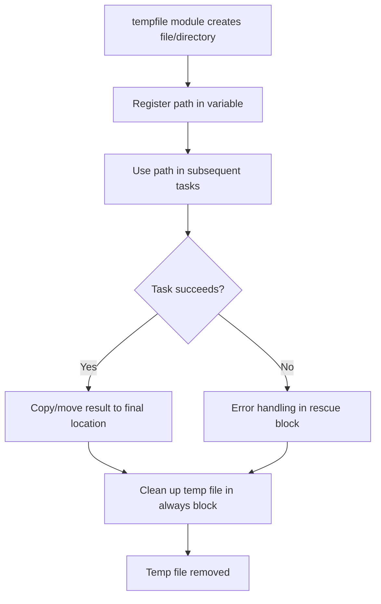

# How to Use the Ansible tempfile Module for Temporary Files

Author: [nawazdhandala](https://www.github.com/nawazdhandala)

Tags: Ansible, DevOps, Linux, Automation

Description: Learn how to use the Ansible tempfile module to safely create and manage temporary files and directories on remote hosts during playbook execution.

---

Temporary files are a frequent need in Ansible playbooks. You might need a scratch file for an intermediate computation, a temporary directory to stage files before an atomic swap, or a throwaway location to download an archive before extracting it. The Ansible `tempfile` module creates temporary files and directories in a safe, predictable way using the system's temp directory, and it gives you the path so you can use it in subsequent tasks.

## Basic Temporary File Creation

The `tempfile` module creates a temporary file and returns its path in the registered variable.

```yaml
# Create a temporary file on the remote host
- name: Create a temporary file
  ansible.builtin.tempfile:
    state: file
    suffix: .conf
  register: temp_config

- name: Show the temporary file path
  ansible.builtin.debug:
    msg: "Temporary file created at {{ temp_config.path }}"
```

The module creates the file in the system's default temp directory (usually `/tmp`). The `suffix` parameter adds an extension to make the file easier to identify.

## Creating Temporary Directories

Set `state: directory` to create a temporary directory instead.

```yaml
# Create a temporary directory for staging files
- name: Create temporary staging directory
  ansible.builtin.tempfile:
    state: directory
    prefix: deploy_
  register: staging_dir

- name: Show staging directory path
  ansible.builtin.debug:
    msg: "Staging directory: {{ staging_dir.path }}"
```

The `prefix` parameter adds a string at the beginning of the generated name. Combined with `suffix`, you can make temp paths descriptive and easy to spot.

## Controlling the Temp Location

The default temp directory is controlled by the system. If you need to use a specific location, use the `path` parameter.

```yaml
# Create a temp file in a specific directory
# Useful when /tmp is mounted noexec and you need to run a script
- name: Create temp file in application directory
  ansible.builtin.tempfile:
    state: file
    path: /opt/myapp/tmp
    suffix: .sh
  register: temp_script
```

This is important in hardened environments where `/tmp` might be mounted with `noexec`, preventing script execution.

## Practical Pattern: Atomic Configuration Deployment

One of the best uses for temp files is the atomic deployment pattern. Write to a temp file, validate it, then move it into place. If validation fails, the original file stays untouched.

```yaml
# Atomic config deployment: write to temp, validate, then move
- name: Create temporary file for nginx config
  ansible.builtin.tempfile:
    state: file
    suffix: .nginx.conf
  register: temp_nginx_conf

- name: Generate nginx configuration into temp file
  ansible.builtin.template:
    src: templates/nginx.conf.j2
    dest: "{{ temp_nginx_conf.path }}"
    mode: '0644'

- name: Validate the nginx configuration
  ansible.builtin.command: "nginx -t -c {{ temp_nginx_conf.path }}"
  register: nginx_validate
  changed_when: false

- name: Deploy validated configuration
  ansible.builtin.copy:
    src: "{{ temp_nginx_conf.path }}"
    dest: /etc/nginx/nginx.conf
    remote_src: yes
    owner: root
    group: root
    mode: '0644'
    backup: yes
  when: nginx_validate.rc == 0
  notify: Reload nginx

- name: Clean up temporary file
  ansible.builtin.file:
    path: "{{ temp_nginx_conf.path }}"
    state: absent
```

## Staging Directory for Multi-File Deployments

When deploying multiple files that need to be swapped atomically, a temporary directory is the way to go.

```yaml
# Stage a complete application deployment in a temp directory
- name: Create staging directory
  ansible.builtin.tempfile:
    state: directory
    prefix: app_deploy_
  register: staging

- name: Copy application files to staging
  ansible.builtin.copy:
    src: "{{ item }}"
    dest: "{{ staging.path }}/"
    mode: '0644'
  loop:
    - files/app.jar
    - files/config.yml
    - files/logback.xml

- name: Set executable permissions on JAR
  ansible.builtin.file:
    path: "{{ staging.path }}/app.jar"
    mode: '0755'

- name: Verify all files are present in staging
  ansible.builtin.stat:
    path: "{{ staging.path }}/{{ item }}"
  register: staged_files
  loop:
    - app.jar
    - config.yml
    - logback.xml

- name: Fail if any staged file is missing
  ansible.builtin.fail:
    msg: "Missing staged file: {{ item.item }}"
  when: not item.stat.exists
  loop: "{{ staged_files.results }}"

- name: Swap staging directory with live directory
  ansible.builtin.shell: |
    # Move current live directory to backup
    mv /opt/myapp/current /opt/myapp/previous 2>/dev/null || true
    # Move staging directory to live
    mv {{ staging.path }} /opt/myapp/current
  notify: Restart application

# No cleanup needed since we moved the staging dir to its final location
```

## Temporary Files for Script Execution

Sometimes you need to generate a script dynamically and run it on the remote host.

```yaml
# Generate and execute a dynamic cleanup script
- name: Create temp file for cleanup script
  ansible.builtin.tempfile:
    state: file
    suffix: .sh
    path: /var/tmp
  register: cleanup_script

- name: Write cleanup script content
  ansible.builtin.copy:
    dest: "{{ cleanup_script.path }}"
    content: |
      #!/bin/bash
      set -euo pipefail

      # Remove logs older than 30 days
      find /var/log/myapp -name "*.log" -mtime +30 -delete

      # Compress logs older than 7 days
      find /var/log/myapp -name "*.log" -mtime +7 -exec gzip {} \;

      # Report disk usage
      df -h /var/log/myapp
    mode: '0755'
    owner: root
    group: root

- name: Execute cleanup script
  ansible.builtin.command: "{{ cleanup_script.path }}"
  register: cleanup_result

- name: Show cleanup results
  ansible.builtin.debug:
    var: cleanup_result.stdout_lines

- name: Remove cleanup script
  ansible.builtin.file:
    path: "{{ cleanup_script.path }}"
    state: absent
```

## Cleanup with block/always

The safest way to handle temp file cleanup is with `block` and `always`. This ensures cleanup happens even if tasks fail.

```yaml
# Guaranteed cleanup with block/always
- name: Work with temporary files safely
  block:
    - name: Create temp directory for data processing
      ansible.builtin.tempfile:
        state: directory
        prefix: data_proc_
      register: work_dir

    - name: Download data files to temp directory
      ansible.builtin.get_url:
        url: "{{ item }}"
        dest: "{{ work_dir.path }}/"
        mode: '0644'
      loop: "{{ data_file_urls }}"

    - name: Process downloaded data
      ansible.builtin.command:
        cmd: "/opt/tools/process-data {{ work_dir.path }}"
      register: processing_result

    - name: Copy results to final location
      ansible.builtin.copy:
        src: "{{ work_dir.path }}/results/"
        dest: /opt/app/data/
        remote_src: yes
        owner: appuser
        group: appuser

  always:
    - name: Clean up temporary working directory
      ansible.builtin.file:
        path: "{{ work_dir.path }}"
        state: absent
      when: work_dir.path is defined
```

## Temp File Lifecycle



## Using Temp Files with ansible.builtin.command

The `tempfile` module pairs well with command-line tools that expect file paths as arguments.

```yaml
# Use temp file as intermediate storage for database operations
- name: Create temp file for SQL output
  ansible.builtin.tempfile:
    state: file
    suffix: .sql
  register: sql_temp

- name: Export database schema
  ansible.builtin.shell: >
    pg_dump --schema-only mydb > {{ sql_temp.path }}
  become_user: postgres

- name: Read exported schema
  ansible.builtin.slurp:
    src: "{{ sql_temp.path }}"
  register: schema_content

- name: Display schema size
  ansible.builtin.debug:
    msg: "Schema export is {{ schema_content.content | b64decode | length }} bytes"

- name: Remove temp SQL file
  ansible.builtin.file:
    path: "{{ sql_temp.path }}"
    state: absent
```

## Security Considerations

Temporary files can be a security concern if they contain sensitive data. Keep these points in mind:

1. Set restrictive permissions when writing to temp files
2. Use `/var/tmp` instead of `/tmp` if the data needs to survive reboots
3. Always clean up temp files, especially those containing secrets
4. Use `mode: '0600'` for files with sensitive content

```yaml
# Secure temp file handling for sensitive data
- name: Create secure temp file for credentials
  ansible.builtin.tempfile:
    state: file
    suffix: .creds
  register: temp_creds

- name: Write credentials to temp file
  ansible.builtin.copy:
    dest: "{{ temp_creds.path }}"
    content: "{{ vault_database_password }}"
    mode: '0600'
    owner: root
    group: root
  no_log: true
```

## Summary

The `tempfile` module is a small but essential tool in the Ansible toolkit. It creates files and directories safely using system temp paths, provides configurable prefixes and suffixes for identification, and integrates naturally with the register/reference pattern that Ansible playbooks rely on. The atomic deployment pattern (write to temp, validate, move to final location) is one of the most reliable ways to deploy configuration changes, and the `block/always` structure ensures cleanup happens regardless of task outcomes. Use temp files whenever you need scratch space, and always clean up after yourself.
