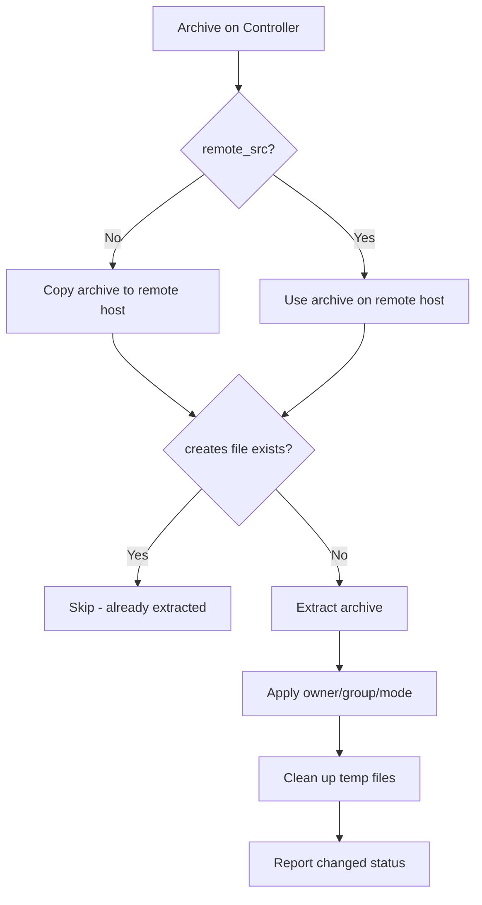

# How to Use the Ansible unarchive Module to Extract Archives

Author: [nawazdhandala](https://www.github.com/nawazdhandala)

Tags: Ansible, DevOps, Linux, Automation

Description: Learn how to use the Ansible unarchive module to extract tar, zip, and gz archives to managed hosts with full control over permissions and destinations.

---

Deploying applications often means extracting compressed archives on target servers. Whether you are installing a Java application from a tarball, deploying a pre-built frontend bundle, or extracting configuration packages, the Ansible `unarchive` module handles the job. It supports tar, tar.gz, tar.bz2, tar.xz, and zip formats out of the box, and it works with archives stored on both the controller and the managed hosts.

## Basic Usage

The simplest use case is extracting an archive from the controller machine to a remote host.

```yaml
# Extract a local tarball to a remote directory
- name: Extract application archive to remote server
  ansible.builtin.unarchive:
    src: files/myapp-2.5.0.tar.gz
    dest: /opt/myapp/
    owner: appuser
    group: appuser
    mode: '0755'
```

By default, the `unarchive` module looks for the `src` file on the Ansible controller. It copies the archive to the remote host, extracts it, and then cleans up the temporary copy.

## Extracting Archives Already on the Remote Host

If the archive is already present on the managed host (perhaps downloaded by a previous task), set `remote_src: yes`.

```yaml
# Extract an archive that already exists on the remote host
- name: Extract archive from local path on remote
  ansible.builtin.unarchive:
    src: /tmp/myapp-2.5.0.tar.gz
    dest: /opt/myapp/
    remote_src: yes
    owner: appuser
    group: appuser
```

## Controlling Extraction Behavior

### Creating the Destination Directory

The destination directory must exist before extraction. Create it first if needed.

```yaml
# Ensure destination exists and then extract
- name: Create application directory
  ansible.builtin.file:
    path: /opt/myapp
    state: directory
    owner: appuser
    group: appuser
    mode: '0755'

- name: Extract application release
  ansible.builtin.unarchive:
    src: files/myapp-2.5.0.tar.gz
    dest: /opt/myapp/
```

### Stripping Leading Directory Components

Many archives contain a top-level directory (like `myapp-2.5.0/`). The `extra_opts` parameter lets you strip that prefix using tar's `--strip-components` option.

```yaml
# Strip the top-level directory from the archive
# If archive contains myapp-2.5.0/bin, myapp-2.5.0/conf, etc.
# This extracts bin/, conf/ directly into /opt/myapp/
- name: Extract with stripped top-level directory
  ansible.builtin.unarchive:
    src: files/myapp-2.5.0.tar.gz
    dest: /opt/myapp/
    extra_opts:
      - '--strip-components=1'
    owner: appuser
    group: appuser
```

### Extracting Specific Files

You can extract only specific files from an archive using `include` (for tar) or `extra_opts`.

```yaml
# Extract only the configuration files from the archive
- name: Extract only config directory from archive
  ansible.builtin.unarchive:
    src: files/myapp-2.5.0.tar.gz
    dest: /opt/myapp/
    include:
      - 'myapp-2.5.0/conf/*'
    extra_opts:
      - '--strip-components=1'
```

For zip files, the `include` parameter works the same way.

```yaml
# Extract specific files from a zip archive
- name: Extract only the war file from deployment zip
  ansible.builtin.unarchive:
    src: files/deployment.zip
    dest: /opt/tomcat/webapps/
    include:
      - 'app.war'
```

## Handling Permissions

The `unarchive` module provides several options for managing file ownership and permissions after extraction.

```yaml
# Extract and set specific ownership recursively
- name: Extract and set permissions
  ansible.builtin.unarchive:
    src: files/webapp-1.0.tar.gz
    dest: /var/www/html/
    owner: www-data
    group: www-data
    mode: '0755'
    extra_opts:
      - '--strip-components=1'
```

Note that the `mode` parameter applies to the files extracted, not the destination directory. If you need different permissions for files and directories, apply them separately after extraction.

```yaml
# Set different permissions for files and directories after extraction
- name: Extract application
  ansible.builtin.unarchive:
    src: files/webapp-1.0.tar.gz
    dest: /var/www/html/

- name: Set directory permissions
  ansible.builtin.file:
    path: /var/www/html/
    state: directory
    recurse: yes
    mode: 'u=rwX,g=rX,o=rX'
    owner: www-data
    group: www-data
```

The uppercase `X` sets the execute bit only on directories, which is a common pattern for web deployments.

## Idempotency and the creates Parameter

The `unarchive` module is not perfectly idempotent by default because it will re-extract the archive on every run. Use the `creates` parameter to skip extraction if a specific file or directory already exists.

```yaml
# Only extract if the application binary does not already exist
- name: Extract application only if not already deployed
  ansible.builtin.unarchive:
    src: files/myapp-2.5.0.tar.gz
    dest: /opt/myapp/
    creates: /opt/myapp/bin/myapp
    extra_opts:
      - '--strip-components=1'
```

This makes your playbook truly idempotent because the task is skipped if `/opt/myapp/bin/myapp` already exists.

## A Complete Deployment Playbook

Here is a full playbook that deploys an application from a tarball.

```yaml
---
- name: Deploy MyApp from archive
  hosts: app_servers
  become: yes
  vars:
    app_version: "2.5.0"
    app_user: myapp
    app_dir: /opt/myapp

  tasks:
    - name: Create application user
      ansible.builtin.user:
        name: "{{ app_user }}"
        system: yes
        shell: /sbin/nologin
        home: "{{ app_dir }}"
        create_home: no

    - name: Create application directory
      ansible.builtin.file:
        path: "{{ app_dir }}"
        state: directory
        owner: "{{ app_user }}"
        group: "{{ app_user }}"
        mode: '0755'

    - name: Extract application archive
      ansible.builtin.unarchive:
        src: "files/myapp-{{ app_version }}.tar.gz"
        dest: "{{ app_dir }}/"
        owner: "{{ app_user }}"
        group: "{{ app_user }}"
        extra_opts:
          - '--strip-components=1'
        creates: "{{ app_dir }}/bin/myapp"
      notify: Restart MyApp

    - name: Set executable permissions on binaries
      ansible.builtin.file:
        path: "{{ app_dir }}/bin/"
        state: directory
        recurse: yes
        mode: 'u+x'
        owner: "{{ app_user }}"
        group: "{{ app_user }}"

    - name: Deploy systemd service file
      ansible.builtin.template:
        src: templates/myapp.service.j2
        dest: /etc/systemd/system/myapp.service
        owner: root
        group: root
        mode: '0644'
      notify:
        - Reload systemd
        - Restart MyApp

  handlers:
    - name: Reload systemd
      ansible.builtin.systemd:
        daemon_reload: yes

    - name: Restart MyApp
      ansible.builtin.systemd:
        name: myapp
        state: restarted
        enabled: yes
```

## Extraction Process Flow



## Common Issues and Troubleshooting

**Missing extraction tools**: The remote host needs `tar`, `gzip`, `bzip2`, or `unzip` depending on the archive format. Install these first if they are not present.

```yaml
# Ensure unzip is available for zip file extraction
- name: Install unzip
  ansible.builtin.package:
    name: unzip
    state: present
```

**Permission denied errors**: Make sure the destination directory exists and is writable by the user running the task (or use `become: yes`).

**Archive contains absolute paths**: Some archives store files with absolute paths. Use `extra_opts` to handle this.

```yaml
# Handle archives with absolute paths
- name: Extract archive with absolute paths safely
  ansible.builtin.unarchive:
    src: files/backup.tar.gz
    dest: /restore/
    extra_opts:
      - '--absolute-names'
      - '--strip-components=1'
```

## Summary

The `unarchive` module is the go-to tool for extracting archives in Ansible playbooks. The `creates` parameter handles idempotency, `extra_opts` gives you access to the full power of tar and unzip command-line options, and the `include` parameter lets you selectively extract files. Combined with proper ownership and permission settings, you can build reliable deployment workflows that handle everything from simple file extraction to complex application rollouts.
