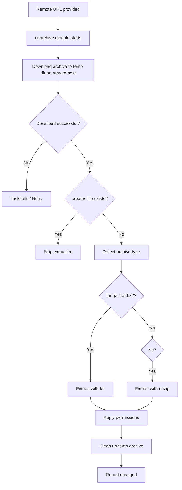

# How to Use the Ansible unarchive Module with Remote Sources

Author: [nawazdhandala](https://www.github.com/nawazdhandala)

Tags: Ansible, DevOps, Automation, Linux

Description: Learn how to use the Ansible unarchive module with remote URLs to download and extract archives directly from the internet to managed hosts.

---

Deploying software often means downloading a release archive from GitHub, an artifact repository, or a vendor's download page. Instead of downloading the file to your Ansible controller first and then copying it to every managed host, the `unarchive` module can fetch the archive directly from a URL and extract it on the target host in one step. This saves bandwidth, reduces playbook execution time, and simplifies your workflow.

## Downloading and Extracting in One Step

When you pass an HTTP or HTTPS URL as the `src` parameter, the `unarchive` module downloads the file to the remote host and extracts it there automatically.

```yaml
# Download and extract Go 1.22 directly from the official website
- name: Download and install Go
  ansible.builtin.unarchive:
    src: https://go.dev/dl/go1.22.0.linux-amd64.tar.gz
    dest: /usr/local/
    remote_src: yes
    creates: /usr/local/go/bin/go
```

The `remote_src: yes` parameter is required when using URL sources. The module downloads the archive to a temporary location, extracts it, and cleans up the temporary file.

## Installing Applications from GitHub Releases

GitHub releases are one of the most common sources for downloading tools and applications. Here is how to install several popular tools.

```yaml
# Install a specific version of Prometheus from GitHub releases
- name: Download and extract Prometheus
  ansible.builtin.unarchive:
    src: "https://github.com/prometheus/prometheus/releases/download/v2.50.0/prometheus-2.50.0.linux-amd64.tar.gz"
    dest: /opt/prometheus/
    remote_src: yes
    extra_opts:
      - '--strip-components=1'
    owner: prometheus
    group: prometheus
    creates: /opt/prometheus/prometheus
```

```yaml
# Install Node Exporter for Prometheus monitoring
- name: Download and install Node Exporter
  ansible.builtin.unarchive:
    src: "https://github.com/prometheus/node_exporter/releases/download/v1.7.0/node_exporter-1.7.0.linux-amd64.tar.gz"
    dest: /opt/node_exporter/
    remote_src: yes
    extra_opts:
      - '--strip-components=1'
    owner: node_exporter
    group: node_exporter
    creates: /opt/node_exporter/node_exporter
```

## Using Variables for Version Management

Hardcoding URLs gets messy fast. Use variables to keep your playbooks clean and version upgrades simple.

```yaml
---
- name: Deploy monitoring stack from remote sources
  hosts: monitoring
  become: yes
  vars:
    prometheus_version: "2.50.0"
    grafana_version: "10.3.1"
    alertmanager_version: "0.27.0"
    arch: "linux-amd64"

  tasks:
    - name: Create prometheus user
      ansible.builtin.user:
        name: prometheus
        system: yes
        shell: /sbin/nologin

    - name: Create prometheus directory
      ansible.builtin.file:
        path: /opt/prometheus
        state: directory
        owner: prometheus
        group: prometheus
        mode: '0755'

    - name: Download and extract Prometheus
      ansible.builtin.unarchive:
        src: "https://github.com/prometheus/prometheus/releases/download/v{{ prometheus_version }}/prometheus-{{ prometheus_version }}.{{ arch }}.tar.gz"
        dest: /opt/prometheus/
        remote_src: yes
        extra_opts:
          - '--strip-components=1'
        owner: prometheus
        group: prometheus
        creates: /opt/prometheus/prometheus

    - name: Create alertmanager directory
      ansible.builtin.file:
        path: /opt/alertmanager
        state: directory
        owner: prometheus
        group: prometheus
        mode: '0755'

    - name: Download and extract Alertmanager
      ansible.builtin.unarchive:
        src: "https://github.com/prometheus/alertmanager/releases/download/v{{ alertmanager_version }}/alertmanager-{{ alertmanager_version }}.{{ arch }}.tar.gz"
        dest: /opt/alertmanager/
        remote_src: yes
        extra_opts:
          - '--strip-components=1'
        owner: prometheus
        group: prometheus
        creates: /opt/alertmanager/alertmanager
```

## Handling Authentication for Private Repositories

Some download URLs require authentication. You can handle this by downloading with `get_url` first, then extracting separately.

```yaml
# Download from a private artifact repository with authentication
- name: Download private artifact with credentials
  ansible.builtin.get_url:
    url: "https://artifacts.company.com/releases/myapp-{{ app_version }}.tar.gz"
    dest: "/tmp/myapp-{{ app_version }}.tar.gz"
    url_username: "{{ artifact_user }}"
    url_password: "{{ artifact_password }}"
    mode: '0600'

- name: Extract private artifact
  ansible.builtin.unarchive:
    src: "/tmp/myapp-{{ app_version }}.tar.gz"
    dest: /opt/myapp/
    remote_src: yes
    extra_opts:
      - '--strip-components=1'
    owner: appuser
    group: appuser

- name: Clean up downloaded archive
  ansible.builtin.file:
    path: "/tmp/myapp-{{ app_version }}.tar.gz"
    state: absent
```

## Checksum Verification

When downloading from remote sources, you should verify the integrity of the archive. Use `get_url` with checksum verification for maximum security.

```yaml
# Download with SHA256 checksum verification, then extract
- name: Download Terraform with checksum verification
  ansible.builtin.get_url:
    url: "https://releases.hashicorp.com/terraform/1.7.3/terraform_1.7.3_linux_amd64.zip"
    dest: /tmp/terraform.zip
    checksum: "sha256:https://releases.hashicorp.com/terraform/1.7.3/terraform_1.7.3_SHA256SUMS"
    mode: '0644'

- name: Extract Terraform binary
  ansible.builtin.unarchive:
    src: /tmp/terraform.zip
    dest: /usr/local/bin/
    remote_src: yes
    creates: /usr/local/bin/terraform

- name: Clean up Terraform archive
  ansible.builtin.file:
    path: /tmp/terraform.zip
    state: absent
```

## Working with Zip Files from Remote URLs

The `unarchive` module handles zip files too, but the remote host needs `unzip` installed.

```yaml
# Ensure unzip is installed for zip file handling
- name: Install unzip
  ansible.builtin.package:
    name: unzip
    state: present

# Download and extract a zip file from a remote URL
- name: Download and extract AWS CLI v2
  ansible.builtin.unarchive:
    src: "https://awscli.amazonaws.com/awscli-exe-linux-x86_64.zip"
    dest: /tmp/
    remote_src: yes
    creates: /tmp/aws

- name: Run AWS CLI installer
  ansible.builtin.command: /tmp/aws/install
  args:
    creates: /usr/local/bin/aws
```

## Multi-Architecture Support

In environments with mixed architectures (x86_64 and ARM), use facts to pick the right archive.

```yaml
# Map Ansible architecture facts to common download naming patterns
- name: Set architecture variable
  ansible.builtin.set_fact:
    go_arch: >-
      {{ 'amd64' if ansible_architecture == 'x86_64'
         else 'arm64' if ansible_architecture == 'aarch64'
         else ansible_architecture }}

- name: Download and install Go for the correct architecture
  ansible.builtin.unarchive:
    src: "https://go.dev/dl/go{{ go_version }}.linux-{{ go_arch }}.tar.gz"
    dest: /usr/local/
    remote_src: yes
    creates: /usr/local/go/bin/go
```

## Error Handling for Remote Downloads

Remote downloads can fail for many reasons: network issues, expired URLs, rate limiting. Wrap your tasks with proper error handling.

```yaml
# Download with retry logic and error handling
- name: Download application archive with retries
  block:
    - name: Download and extract application
      ansible.builtin.unarchive:
        src: "{{ app_download_url }}"
        dest: /opt/myapp/
        remote_src: yes
        extra_opts:
          - '--strip-components=1'
        creates: /opt/myapp/bin/app
      register: download_result
      retries: 3
      delay: 10
      until: download_result is success

  rescue:
    - name: Report download failure
      ansible.builtin.fail:
        msg: >
          Failed to download application from {{ app_download_url }}
          after 3 attempts. Check network connectivity and URL validity.
```

## Download and Extract Flow



## Performance Considerations

When deploying to many hosts, downloading from a remote URL means each host fetches the archive independently. For large files or many hosts, consider setting up a local mirror or caching proxy.

```yaml
# Use a local mirror for faster downloads in your data center
- name: Download from local mirror with fallback to public URL
  ansible.builtin.unarchive:
    src: "{{ local_mirror_url | default(public_url) }}"
    dest: /opt/app/
    remote_src: yes
  vars:
    local_mirror_url: "http://mirror.internal.company.com/releases/app-{{ version }}.tar.gz"
    public_url: "https://github.com/org/app/releases/download/v{{ version }}/app-{{ version }}.tar.gz"
```

## Summary

Using the `unarchive` module with remote URLs is one of the cleanest ways to deploy software in Ansible. It removes the need to store large binary archives in your Ansible repository, downloads directly to the target hosts, and extracts everything in a single task. Pair it with the `creates` parameter for idempotency, `extra_opts` for stripping directory prefixes, and proper error handling with retries for production-ready playbooks. For sensitive downloads, combine it with `get_url` for authentication and checksum verification.
