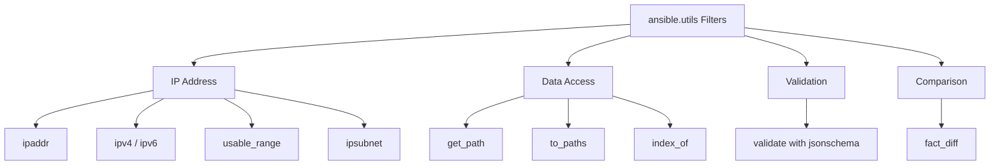

# How to Use the ansible.utils Collection

Author: [nawazdhandala](https://www.github.com/nawazdhandala)

Tags: Ansible, Utils, Data Manipulation, IP Address, DevOps

Description: How to use the ansible.utils collection for data validation, IP address manipulation, JSON path queries, and CLI output parsing in Ansible.

---

The `ansible.utils` collection is a Swiss army knife of data manipulation tools for Ansible. It provides filter plugins for IP address math, data validation against schemas, CLI output parsers, and utilities for working with structured data. If you find yourself writing complex Jinja2 expressions to manipulate data in playbooks, there is a good chance that `ansible.utils` has a cleaner solution.

## Installation

```bash
# Install the collection
ansible-galaxy collection install ansible.utils

# Install with dependencies (some filters need extra Python packages)
pip install netaddr jsonschema xmltodict
```

The `netaddr` Python library is required for IP address filters, and `jsonschema` is needed for data validation.

## IP Address Filters

Network engineers will love these. The IP address filters handle CIDR calculations, subnet math, and address manipulation without manual arithmetic.

```yaml
# ip-address-examples.yml - IP address manipulation with ansible.utils filters
---
- name: Demonstrate IP address filters
  hosts: localhost
  gather_facts: false
  vars:
    server_cidr: "192.168.10.25/24"
    subnet: "10.0.0.0/16"
  tasks:
    - name: Extract the network address
      ansible.builtin.debug:
        msg: "Network: {{ server_cidr | ansible.utils.ipaddr('network') }}"
      # Output: 192.168.10.0

    - name: Extract the netmask
      ansible.builtin.debug:
        msg: "Netmask: {{ server_cidr | ansible.utils.ipaddr('netmask') }}"
      # Output: 255.255.255.0

    - name: Get the broadcast address
      ansible.builtin.debug:
        msg: "Broadcast: {{ server_cidr | ansible.utils.ipaddr('broadcast') }}"
      # Output: 192.168.10.255

    - name: Get just the IP without the prefix
      ansible.builtin.debug:
        msg: "Address: {{ server_cidr | ansible.utils.ipaddr('address') }}"
      # Output: 192.168.10.25

    - name: Calculate the number of hosts in a subnet
      ansible.builtin.debug:
        msg: "Hosts in {{ subnet }}: {{ subnet | ansible.utils.ipaddr('size') }}"
      # Output: 65536

    - name: Get the Nth address in a subnet
      ansible.builtin.debug:
        msg: "10th host: {{ subnet | ansible.utils.ipaddr('10') }}"

    - name: Check if an address is in a subnet
      ansible.builtin.debug:
        msg: "In subnet: {{ '10.0.5.100' | ansible.utils.ipaddr(subnet) }}"
```

### IP Address Math for Real Infrastructure

Here is a practical example that calculates IP addresses for a cluster:

```yaml
# calculate-cluster-ips.yml - Dynamic IP assignment for a cluster
---
- name: Calculate cluster IP addresses
  hosts: localhost
  gather_facts: false
  vars:
    cluster_subnet: "172.16.0.0/24"
    gateway_offset: 1
    vip_offset: 10
    node_start_offset: 20
    node_count: 5
  tasks:
    - name: Calculate gateway IP
      ansible.builtin.set_fact:
        gateway_ip: "{{ cluster_subnet | ansible.utils.ipaddr(gateway_offset) | ansible.utils.ipaddr('address') }}"

    - name: Calculate virtual IP
      ansible.builtin.set_fact:
        virtual_ip: "{{ cluster_subnet | ansible.utils.ipaddr(vip_offset) | ansible.utils.ipaddr('address') }}"

    - name: Calculate node IPs
      ansible.builtin.set_fact:
        node_ips: "{{ node_ips | default([]) + [cluster_subnet | ansible.utils.ipaddr(node_start_offset + item) | ansible.utils.ipaddr('address')] }}"
      loop: "{{ range(0, node_count) | list }}"

    - name: Show calculated addresses
      ansible.builtin.debug:
        msg:
          gateway: "{{ gateway_ip }}"
          vip: "{{ virtual_ip }}"
          nodes: "{{ node_ips }}"
      # Output:
      # gateway: 172.16.0.1
      # vip: 172.16.0.10
      # nodes: [172.16.0.20, 172.16.0.21, 172.16.0.22, 172.16.0.23, 172.16.0.24]
```

## Data Validation with validate

The `validate` module checks data against JSON Schema, which is very useful for validating variable files and inventory data:

```yaml
# validate-config.yml - Validate configuration data against a schema
---
- name: Validate application configuration
  hosts: localhost
  gather_facts: false
  vars:
    app_config:
      name: myapp
      port: 8080
      database:
        host: db.internal.com
        port: 5432
        name: myapp_db
      replicas: 3
      log_level: info

    config_schema:
      type: object
      required:
        - name
        - port
        - database
      properties:
        name:
          type: string
          minLength: 1
        port:
          type: integer
          minimum: 1024
          maximum: 65535
        database:
          type: object
          required:
            - host
            - port
            - name
          properties:
            host:
              type: string
            port:
              type: integer
            name:
              type: string
        replicas:
          type: integer
          minimum: 1
          maximum: 10
        log_level:
          type: string
          enum:
            - debug
            - info
            - warning
            - error

  tasks:
    - name: Validate application configuration against schema
      ansible.utils.validate:
        data: "{{ app_config }}"
        criteria:
          - "{{ config_schema }}"
        engine: ansible.utils.jsonschema
      register: validation_result

    - name: Show validation passed
      ansible.builtin.debug:
        msg: "Configuration validation passed"
      when: validation_result is not failed
```

## CLI Parsing

The `cli_parse` module turns unstructured command output into structured data. This is invaluable for network automation:

```yaml
# parse-cli-output.yml - Parse unstructured CLI output into structured data
---
- name: Parse network device output
  hosts: routers
  gather_facts: false
  tasks:
    - name: Gather and parse interface information
      ansible.utils.cli_parse:
        command: show ip interface brief
        parser:
          name: ansible.netcommon.native
        set_fact: interfaces

    - name: Show parsed data
      ansible.builtin.debug:
        var: interfaces
```

For custom parsing with TextFSM templates:

```yaml
# parse-with-textfsm.yml - Parse CLI output using TextFSM
---
- name: Parse with TextFSM
  hosts: routers
  gather_facts: false
  tasks:
    - name: Parse show version output
      ansible.utils.cli_parse:
        command: show version
        parser:
          name: ansible.utils.textfsm
          template_path: templates/show_version.textfsm
        set_fact: version_info
```

## The to_paths Filter

The `to_paths` filter flattens nested data structures into dot-notation paths. This is helpful for comparing configurations or finding specific values:

```yaml
# flatten-data.yml - Flatten nested data to paths
---
- name: Flatten nested configuration data
  hosts: localhost
  gather_facts: false
  vars:
    nested_config:
      server:
        name: web01
        network:
          ip: 10.0.1.5
          gateway: 10.0.1.1
          dns:
            - 8.8.8.8
            - 8.8.4.4
        services:
          - name: nginx
            port: 80
          - name: app
            port: 8080
  tasks:
    - name: Convert to flat paths
      ansible.builtin.set_fact:
        flat_config: "{{ nested_config | ansible.utils.to_paths }}"

    - name: Show flat paths
      ansible.builtin.debug:
        var: flat_config
      # Output shows paths like:
      # server.name: web01
      # server.network.ip: 10.0.1.5
      # server.network.dns[0]: 8.8.8.8
```

## The get_path Filter

Retrieve values from nested data using dot notation:

```yaml
# get-nested-values.yml - Access nested values with path notation
---
- name: Access nested values
  hosts: localhost
  gather_facts: false
  vars:
    config:
      database:
        primary:
          host: db-primary.internal
          port: 5432
        replica:
          host: db-replica.internal
          port: 5432
  tasks:
    - name: Get primary database host
      ansible.builtin.debug:
        msg: "{{ config | ansible.utils.get_path('database.primary.host') }}"
      # Output: db-primary.internal

    - name: Get replica port
      ansible.builtin.debug:
        msg: "{{ config | ansible.utils.get_path('database.replica.port') }}"
      # Output: 5432
```

## Comparing Data with fact_diff

The `fact_diff` module compares two data structures and shows the differences:

```yaml
# compare-configs.yml - Compare two configuration states
---
- name: Compare configurations before and after changes
  hosts: localhost
  gather_facts: false
  vars:
    before:
      hostname: web01
      interfaces:
        eth0:
          ip: 10.0.1.5
          mtu: 1500
        eth1:
          ip: 10.0.2.5
          mtu: 1500
    after:
      hostname: web01
      interfaces:
        eth0:
          ip: 10.0.1.5
          mtu: 9000
        eth1:
          ip: 10.0.2.10
          mtu: 1500
  tasks:
    - name: Show differences between configs
      ansible.utils.fact_diff:
        before: "{{ before }}"
        after: "{{ after }}"
      register: config_diff

    - name: Display diff
      ansible.builtin.debug:
        var: config_diff
```

## The usable_range Filter

Find usable IP addresses in a range:

```yaml
# ip-range.yml - Work with IP address ranges
---
- name: IP range operations
  hosts: localhost
  gather_facts: false
  tasks:
    - name: Get usable range for a subnet
      ansible.builtin.debug:
        msg: "{{ '192.168.1.0/28' | ansible.utils.usable_range }}"
      # Returns usable IPs in the /28 subnet

    - name: Filter only IPv4 addresses from a mixed list
      ansible.builtin.set_fact:
        ipv4_only: "{{ mixed_addresses | ansible.utils.ipv4 }}"
      vars:
        mixed_addresses:
          - 10.0.1.1
          - "2001:db8::1"
          - 192.168.1.1
          - "fe80::1"

    - name: Show IPv4 addresses
      ansible.builtin.debug:
        var: ipv4_only
```

## Utility Filter Overview



## Conclusion

The `ansible.utils` collection fills in the gaps where Ansible's built-in Jinja2 filters fall short. IP address math alone makes it worth installing for anyone managing network infrastructure. Data validation with JSON Schema catches configuration errors early, before they hit production. And the CLI parsing tools are essential for turning unstructured device output into usable data. Install it, install its Python dependencies (netaddr, jsonschema), and you will find yourself reaching for it in almost every project.
