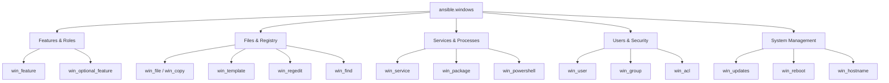

# How to Use the ansible.windows Collection

Author: [nawazdhandala](https://www.github.com/nawazdhandala)

Tags: Ansible, Windows, WinRM, PowerShell, DevOps

Description: Guide to managing Windows servers with the ansible.windows collection covering WinRM setup, Windows features, services, registry, and file management.

---

Ansible is not just for Linux. The `ansible.windows` collection provides modules specifically designed for managing Windows hosts through WinRM (Windows Remote Management) or SSH. If your infrastructure includes Windows servers, whether for IIS, Active Directory, SQL Server, or general Windows administration, this collection is how you bring them under Ansible management.

## Prerequisites

Windows management with Ansible requires some initial setup on both the control node and the Windows targets.

On the control node (Linux), install the required Python package:

```bash
# Install pywinrm for WinRM connectivity
pip install pywinrm

# Install the ansible.windows collection
ansible-galaxy collection install ansible.windows
```

On the Windows target, enable WinRM. Run this in an elevated PowerShell session:

```powershell
# Enable WinRM with HTTPS (recommended for production)
# Download and run the Ansible WinRM setup script
$url = "https://raw.githubusercontent.com/ansible/ansible-documentation/devel/examples/scripts/ConfigureRemotingForAnsible.ps1"
$file = "$env:temp\ConfigureRemotingForAnsible.ps1"
(New-Object -TypeName System.Net.WebClient).DownloadFile($url, $file)
powershell.exe -ExecutionPolicy ByPass -File $file
```

## Inventory Configuration for Windows

Windows hosts need specific connection variables. Set them in your inventory:

```yaml
# inventory/hosts.yml - Windows host configuration
---
all:
  children:
    windows:
      hosts:
        win-web01:
          ansible_host: 10.0.1.50
        win-web02:
          ansible_host: 10.0.1.51
        win-db01:
          ansible_host: 10.0.1.60
      vars:
        ansible_user: ansible_admin
        ansible_password: "{{ vault_windows_password }}"
        ansible_connection: winrm
        ansible_winrm_transport: ntlm
        ansible_winrm_server_cert_validation: ignore
        ansible_port: 5986
```

For domain-joined hosts using Kerberos:

```yaml
# inventory/group_vars/windows.yml - Kerberos authentication
---
ansible_user: ansible_admin@MYDOMAIN.COM
ansible_connection: winrm
ansible_winrm_transport: kerberos
ansible_port: 5986
```

## Managing Windows Features

The `win_feature` module installs and removes Windows Server roles and features:

```yaml
# install-iis.yml - Set up IIS web server
---
- name: Configure IIS Web Server
  hosts: windows
  tasks:
    - name: Install IIS with management tools
      ansible.windows.win_feature:
        name:
          - Web-Server
          - Web-Mgmt-Console
          - Web-Mgmt-Tools
          - Web-Asp-Net45
          - Web-Net-Ext45
          - Web-ISAPI-Ext
          - Web-ISAPI-Filter
        state: present
        include_management_tools: true
      register: iis_install

    - name: Reboot if feature install requires it
      ansible.windows.win_reboot:
        reboot_timeout: 600
      when: iis_install.reboot_required

    - name: Remove unwanted features
      ansible.windows.win_feature:
        name:
          - Telnet-Client
          - TFTP-Client
        state: absent
```

## Windows Service Management

The `win_service` module manages Windows services:

```yaml
# manage-services.yml - Configure Windows services
---
- name: Manage Windows services
  hosts: windows
  tasks:
    - name: Ensure IIS is running
      ansible.windows.win_service:
        name: W3SVC
        state: started
        start_mode: auto

    - name: Configure application service
      ansible.windows.win_service:
        name: MyAppService
        path: C:\Apps\MyApp\myapp.exe
        display_name: "My Application Service"
        description: "Runs the main application backend"
        state: started
        start_mode: delayed
        username: "DOMAIN\\svc_myapp"
        password: "{{ vault_service_password }}"
        dependencies:
          - W3SVC
          - MSSQLSERVER

    - name: Stop and disable Print Spooler on servers
      ansible.windows.win_service:
        name: Spooler
        state: stopped
        start_mode: disabled
```

## File and Directory Management

Working with files on Windows uses Windows-specific modules:

```yaml
# file-management.yml - Manage files on Windows servers
---
- name: Manage files and directories
  hosts: windows
  tasks:
    - name: Create application directory structure
      ansible.windows.win_file:
        path: "{{ item }}"
        state: directory
      loop:
        - C:\Apps\MyApp
        - C:\Apps\MyApp\config
        - C:\Apps\MyApp\logs
        - C:\Apps\MyApp\data

    - name: Copy application configuration file
      ansible.windows.win_copy:
        src: files/app-config.json
        dest: C:\Apps\MyApp\config\settings.json

    - name: Deploy configuration from template
      ansible.windows.win_template:
        src: templates/web.config.j2
        dest: C:\inetpub\wwwroot\web.config

    - name: Download application installer
      ansible.windows.win_get_url:
        url: https://releases.internal.com/myapp/myapp-2.1.0.msi
        dest: C:\Temp\myapp-2.1.0.msi
        checksum: sha256:abc123def456...

    - name: Remove old log files (older than 30 days)
      ansible.windows.win_find:
        paths: C:\Apps\MyApp\logs
        age: 30d
        recurse: true
      register: old_logs

    - name: Delete old log files
      ansible.windows.win_file:
        path: "{{ item.path }}"
        state: absent
      loop: "{{ old_logs.files }}"
```

## Windows Registry Management

The `win_regedit` module manages Windows registry keys and values:

```yaml
# registry-config.yml - Configure Windows via registry
---
- name: Configure Windows registry settings
  hosts: windows
  tasks:
    - name: Disable SMBv1 protocol
      ansible.windows.win_regedit:
        path: HKLM:\SYSTEM\CurrentControlSet\Services\LanmanServer\Parameters
        name: SMB1
        data: 0
        type: dword

    - name: Configure NTP server
      ansible.windows.win_regedit:
        path: HKLM:\SYSTEM\CurrentControlSet\Services\W32Time\Parameters
        name: NtpServer
        data: "ntp.internal.com,0x9"
        type: string

    - name: Set power plan to high performance
      ansible.windows.win_regedit:
        path: HKLM:\SYSTEM\CurrentControlSet\Control\Power
        name: CsEnabled
        data: 0
        type: dword

    - name: Remove a registry value
      ansible.windows.win_regedit:
        path: HKLM:\SOFTWARE\MyApp
        name: DeprecatedSetting
        state: absent

    - name: Remove an entire registry key
      ansible.windows.win_regedit:
        path: HKLM:\SOFTWARE\OldApplication
        state: absent
        delete_key: true
```

## Package Management

Install and manage software packages:

```yaml
# install-software.yml - Install software on Windows
---
- name: Install application software
  hosts: windows
  tasks:
    - name: Install MSI package
      ansible.windows.win_package:
        path: C:\Temp\myapp-2.1.0.msi
        state: present
        arguments:
          - /quiet
          - /norestart
          - INSTALLDIR=C:\Apps\MyApp

    - name: Install package from URL
      ansible.windows.win_package:
        path: https://releases.internal.com/tools/agent-setup.exe
        product_id: "{12345678-ABCD-EFGH-IJKL-123456789012}"
        state: present
        arguments:
          - /S
          - /D=C:\Tools\Agent

    - name: Uninstall old software
      ansible.windows.win_package:
        product_id: "{OLD-APP-GUID-HERE}"
        state: absent
```

## Running PowerShell Commands

When modules do not cover your use case, run PowerShell directly:

```yaml
# powershell-tasks.yml - Execute PowerShell scripts
---
- name: Execute PowerShell tasks
  hosts: windows
  tasks:
    - name: Get disk space information
      ansible.windows.win_powershell:
        script: |
          Get-WmiObject -Class Win32_LogicalDisk |
            Where-Object { $_.DriveType -eq 3 } |
            Select-Object DeviceID,
              @{N='SizeGB';E={[math]::Round($_.Size/1GB,2)}},
              @{N='FreeGB';E={[math]::Round($_.FreeSpace/1GB,2)}},
              @{N='PercentFree';E={[math]::Round(($_.FreeSpace/$_.Size)*100,2)}}
      register: disk_info

    - name: Show disk information
      ansible.builtin.debug:
        var: disk_info.output

    - name: Configure Windows Defender exclusions
      ansible.windows.win_powershell:
        script: |
          $paths = @(
            'C:\Apps\MyApp',
            'C:\Apps\MyApp\data'
          )
          foreach ($path in $paths) {
            Add-MpPreference -ExclusionPath $path
          }
          $result = Get-MpPreference | Select-Object ExclusionPath
          $result
      register: defender_config

    - name: Run script with parameters
      ansible.windows.win_powershell:
        script: |
          param($Name, $Environment)
          Write-Output "Configuring $Name for $Environment"
        parameters:
          Name: MyApp
          Environment: Production
```

## Windows Updates

```yaml
# windows-updates.yml - Manage Windows Updates
---
- name: Apply Windows updates
  hosts: windows
  tasks:
    - name: Install all critical and security updates
      ansible.windows.win_updates:
        category_names:
          - CriticalUpdates
          - SecurityUpdates
        state: installed
        reboot: true
        reboot_timeout: 1800
      register: update_result

    - name: Show update results
      ansible.builtin.debug:
        msg: "Installed {{ update_result.installed_update_count }} updates. Reboot required: {{ update_result.reboot_required }}"
```

## Complete Windows Server Setup Example

```yaml
# full-windows-setup.yml - Complete Windows server provisioning
---
- name: Provision Windows Application Server
  hosts: windows
  tasks:
    - name: Set computer description
      ansible.windows.win_powershell:
        script: |
          $description = "Application Server - {{ inventory_hostname }}"
          Set-CimInstance -Query 'SELECT * FROM Win32_OperatingSystem' -Property @{Description=$description}

    - name: Configure Windows firewall rules
      ansible.windows.win_powershell:
        script: |
          New-NetFirewallRule -DisplayName "Allow App Port 8443" `
            -Direction Inbound -Protocol TCP -LocalPort 8443 `
            -Action Allow -ErrorAction SilentlyContinue

    - name: Install required features
      ansible.windows.win_feature:
        name:
          - NET-Framework-45-Core
          - Web-Server
        state: present

    - name: Create local service account
      ansible.windows.win_user:
        name: svc_myapp
        password: "{{ vault_svc_password }}"
        password_never_expires: true
        user_cannot_change_password: true
        groups:
          - Users
        state: present

    - name: Set up application directory
      ansible.windows.win_file:
        path: C:\Apps\MyApp
        state: directory

    - name: Deploy application
      ansible.windows.win_copy:
        src: builds/myapp-latest/
        dest: C:\Apps\MyApp\

    - name: Register Windows service
      ansible.windows.win_service:
        name: MyAppService
        path: C:\Apps\MyApp\myapp.exe
        state: started
        start_mode: auto
```

## Module Categories



## Conclusion

The `ansible.windows` collection brings full Windows server management into Ansible. Between WinRM connectivity, PowerShell integration, and purpose-built modules for Windows features, services, registry, and packages, you can manage your entire Windows fleet alongside your Linux infrastructure. The key to success is getting WinRM configured properly on your Windows hosts and using the right connection variables in your inventory.
