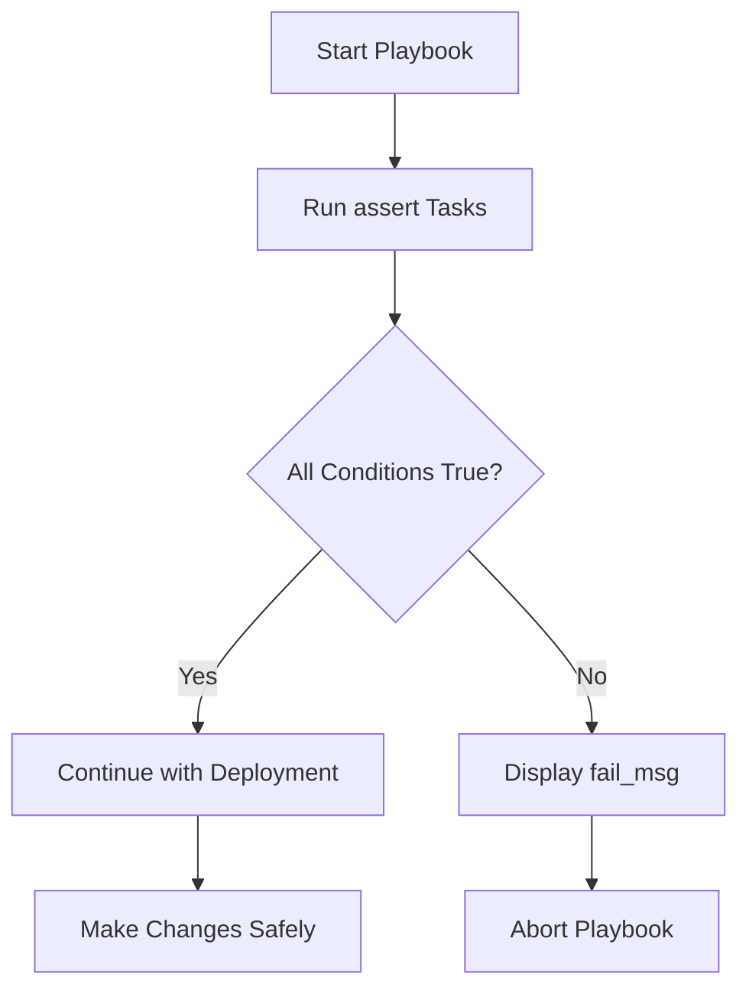

# How to Use the assert Module to Validate Variables in Ansible

Author: [nawazdhandala](https://www.github.com/nawazdhandala)

Tags: Ansible, assert, Validation, Variables, Best Practices

Description: Learn how to use the Ansible assert module to validate variable values before task execution and catch configuration errors early.

---

One of the worst things that can happen during an Ansible run is getting halfway through a deployment before discovering that a critical variable has the wrong value. The `assert` module lets you validate your assumptions at the start of a playbook, failing fast with a clear error message instead of leaving your infrastructure in a half-configured state.

## Basic assert Usage

The `assert` module evaluates one or more conditions and fails the play if any of them are false. You provide a list of Jinja2 expressions under the `that` parameter.

```yaml
# basic-assert.yml - Validate variables before proceeding
---
- name: Validate deployment variables
  hosts: all
  gather_facts: false
  vars:
    app_version: "2.5.1"
    deploy_env: "production"
    replicas: 3
  tasks:
    - name: Validate required variables
      ansible.builtin.assert:
        that:
          - app_version is defined
          - deploy_env in ['production', 'staging', 'development']
          - replicas >= 1
          - replicas <= 10
        fail_msg: "Variable validation failed. Check your configuration."
        success_msg: "All variables validated successfully."
```

## Custom Error Messages per Condition

When you have multiple assertions, a generic failure message is not helpful. You can run separate assert tasks with specific messages for each check.

```yaml
# detailed-assert.yml - Specific error messages for each validation
---
- name: Validate with detailed error messages
  hosts: localhost
  gather_facts: false
  vars:
    db_port: 5432
    db_host: ""
    db_name: "myapp"
    max_connections: -5
  tasks:
    - name: Validate database host
      ansible.builtin.assert:
        that:
          - db_host is defined
          - db_host | length > 0
        fail_msg: "db_host must be defined and non-empty. Got: '{{ db_host }}'"

    - name: Validate database port
      ansible.builtin.assert:
        that:
          - db_port is defined
          - db_port | int > 0
          - db_port | int < 65536
        fail_msg: "db_port must be between 1 and 65535. Got: {{ db_port }}"

    - name: Validate database name
      ansible.builtin.assert:
        that:
          - db_name is defined
          - db_name is match('^[a-zA-Z][a-zA-Z0-9_]*$')
        fail_msg: "db_name must start with a letter and contain only alphanumeric characters or underscores."

    - name: Validate max connections
      ansible.builtin.assert:
        that:
          - max_connections | int > 0
        fail_msg: "max_connections must be positive. Got: {{ max_connections }}"
```

## Validating Variable Types

Ansible does not enforce variable types, so incoming data might be the wrong type. The `type_debug` filter and type checks help with this.

```yaml
# type-validation.yml - Check that variables have the expected type
---
- name: Validate variable types
  hosts: localhost
  gather_facts: false
  vars:
    server_port: 8080
    server_name: "myapp"
    features_enabled:
      - auth
      - logging
    ssl_config:
      cert_path: /etc/ssl/cert.pem
      key_path: /etc/ssl/key.pem
  tasks:
    - name: Port must be an integer
      ansible.builtin.assert:
        that:
          - server_port | type_debug in ['int', 'AnsibleUnsafeText', 'str']
          - server_port | int == server_port
        fail_msg: "server_port must be an integer"

    - name: server_name must be a string
      ansible.builtin.assert:
        that:
          - server_name is string
        fail_msg: "server_name must be a string, got {{ server_name | type_debug }}"

    - name: features_enabled must be a list
      ansible.builtin.assert:
        that:
          - features_enabled is iterable
          - features_enabled is not string
          - features_enabled is not mapping
        fail_msg: "features_enabled must be a list"

    - name: ssl_config must be a dictionary
      ansible.builtin.assert:
        that:
          - ssl_config is mapping
        fail_msg: "ssl_config must be a dictionary"
```

## Pre-Deployment Validation Block

A common pattern is to put all validations in a block at the beginning of your playbook. This runs all checks before any real changes happen.

```yaml
# pre-deploy-validate.yml - Validation block before deployment
---
- name: Deploy application with validation
  hosts: app_servers
  gather_facts: true
  vars:
    app_version: "3.1.0"
    deploy_env: "production"
    min_disk_gb: 10
    min_memory_mb: 2048
  tasks:
    - name: Pre-deployment validations
      block:
        - name: Validate deployment parameters
          ansible.builtin.assert:
            that:
              - app_version is defined
              - app_version is match('^\d+\.\d+\.\d+$')
            fail_msg: "Invalid app_version: {{ app_version | default('undefined') }}"

        - name: Validate environment
          ansible.builtin.assert:
            that:
              - deploy_env in ['production', 'staging', 'development']
            fail_msg: "Unknown environment: {{ deploy_env }}"

        - name: Check available disk space
          ansible.builtin.assert:
            that:
              - (ansible_mounts | selectattr('mount', 'equalto', '/') | first).size_available > (min_disk_gb * 1073741824)
            fail_msg: "Insufficient disk space on /. Need at least {{ min_disk_gb }}GB free."

        - name: Check available memory
          ansible.builtin.assert:
            that:
              - ansible_memtotal_mb >= min_memory_mb
            fail_msg: "Insufficient memory. Need {{ min_memory_mb }}MB, have {{ ansible_memtotal_mb }}MB."
      rescue:
        - name: Validation failed
          ansible.builtin.fail:
            msg: "Pre-deployment validation failed. Deployment aborted."

    # Actual deployment tasks only run if validation passes
    - name: Deploy the application
      ansible.builtin.debug:
        msg: "Deploying {{ app_version }} to {{ deploy_env }}"
```

## Using assert in Roles

Roles should validate their input variables in the first task file. This catches misconfiguration before any changes are made.

```yaml
# roles/nginx/tasks/main.yml - Role with input validation
---
- name: Validate role variables
  ansible.builtin.assert:
    that:
      - nginx_worker_processes is defined
      - nginx_worker_processes | int >= 1
      - nginx_worker_connections is defined
      - nginx_worker_connections | int >= 64
      - nginx_server_names_hash_bucket_size in [32, 64, 128]
      - nginx_vhosts is defined
      - nginx_vhosts | length > 0
    fail_msg: >
      nginx role variable validation failed.
      worker_processes={{ nginx_worker_processes | default('undefined') }},
      worker_connections={{ nginx_worker_connections | default('undefined') }},
      vhosts count={{ nginx_vhosts | default([]) | length }}

- name: Validate each vhost entry
  ansible.builtin.assert:
    that:
      - item.server_name is defined
      - item.server_name | length > 0
      - item.listen_port | default(80) | int > 0
      - item.root is defined
    fail_msg: "Invalid vhost configuration: {{ item }}"
  loop: "{{ nginx_vhosts }}"
  loop_control:
    label: "{{ item.server_name | default('unnamed') }}"

- name: Install nginx
  ansible.builtin.apt:
    name: nginx
    state: present
  become: true
# ... rest of the role
```

## Validating Network Addresses

```yaml
# network-validation.yml - Validate IP addresses and ports
---
- name: Validate network configuration
  hosts: localhost
  gather_facts: false
  vars:
    bind_address: "10.0.1.50"
    listen_port: 8443
    allowed_cidrs:
      - "10.0.0.0/8"
      - "172.16.0.0/12"
  tasks:
    - name: Validate IP address format
      ansible.builtin.assert:
        that:
          - bind_address is match('^\d{1,3}\.\d{1,3}\.\d{1,3}\.\d{1,3}$')
        fail_msg: "bind_address must be a valid IPv4 address: {{ bind_address }}"

    - name: Validate port range
      ansible.builtin.assert:
        that:
          - listen_port | int >= 1024
          - listen_port | int <= 65535
        fail_msg: "listen_port must be between 1024 and 65535: {{ listen_port }}"

    - name: Validate CIDR notation
      ansible.builtin.assert:
        that:
          - item is match('^\d{1,3}\.\d{1,3}\.\d{1,3}\.\d{1,3}/\d{1,2}$')
        fail_msg: "Invalid CIDR notation: {{ item }}"
      loop: "{{ allowed_cidrs }}"
```

## The Validation Flow



## Using assert with quiet Mode

In Ansible 2.10+, you can use `quiet: true` to suppress the success message output. This is useful when you have many assertions and do not want verbose success output.

```yaml
# quiet-assert.yml - Suppress success messages
---
- name: Quiet validation
  hosts: localhost
  gather_facts: false
  vars:
    items_to_validate:
      - { name: "var_a", value: 10, min: 1, max: 100 }
      - { name: "var_b", value: 50, min: 1, max: 100 }
      - { name: "var_c", value: 75, min: 1, max: 100 }
  tasks:
    - name: Validate each item quietly
      ansible.builtin.assert:
        that:
          - item.value >= item.min
          - item.value <= item.max
        fail_msg: "{{ item.name }} = {{ item.value }} is out of range [{{ item.min }}, {{ item.max }}]"
        quiet: true
      loop: "{{ items_to_validate }}"
      loop_control:
        label: "{{ item.name }}"
```

## Best Practices

Put assert tasks at the very beginning of your playbook or role, before any changes are made. Use descriptive `fail_msg` values that include the actual variable value so you can diagnose problems quickly. Validate types, ranges, and formats, not just existence. Group related assertions in blocks with rescue handlers for clean error reporting. In roles, validate all required input variables in the first task file. Use `quiet: true` when you have many assertions and the success output becomes noise.

The `assert` module is your first line of defense against misconfigurations reaching your infrastructure. A few minutes spent writing validation checks at the top of your playbooks can save hours of debugging broken deployments.
