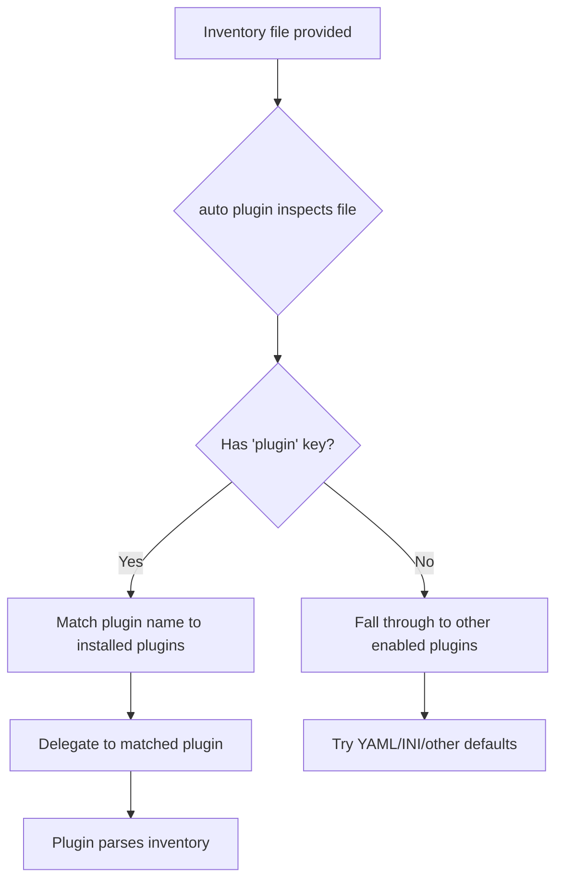

# How to Use the auto Inventory Plugin in Ansible

Author: [nawazdhandala](https://www.github.com/nawazdhandala)

Tags: Ansible, Inventory Plugin, Auto, Configuration

Description: Learn how to use the auto inventory plugin in Ansible to automatically detect and load the correct inventory plugin based on file content.

---

The `auto` inventory plugin in Ansible acts as a dispatcher. It examines your inventory files and automatically determines which specific inventory plugin should handle each one. Instead of manually enabling every plugin you might need, the `auto` plugin figures it out for you based on the file contents. This post explains how it works, when to use it, and how to configure it properly.

## What the auto Plugin Does

When Ansible encounters an inventory source, it needs to know which plugin can parse it. The `auto` plugin inspects the file and delegates to the appropriate handler. For example:

- A file containing `plugin: amazon.aws.aws_ec2` gets handed to the AWS EC2 plugin
- A file with standard YAML inventory structure gets handled by the YAML plugin
- A file with `plugin: azure.azcollection.azure_rm` goes to the Azure plugin

The `auto` plugin reads the `plugin` key in YAML files and matches it against installed inventory plugins.

## How It Works Under the Hood

Here is the flow when Ansible processes an inventory source with the `auto` plugin enabled:



The `auto` plugin is essentially a router. It does not parse inventory itself; it finds the right parser and hands off the work.

## Enabling the auto Plugin

The `auto` plugin is enabled by default in most Ansible installations. You can verify this in your `ansible.cfg`:

```ini
# ansible.cfg
[inventory]
# The auto plugin is typically first in the list
enable_plugins = ansible.builtin.auto, ansible.builtin.yaml, ansible.builtin.ini, ansible.builtin.host_list
```

If you have a custom `enable_plugins` list and the auto plugin is missing, just add it:

```ini
[inventory]
# Add auto to your existing plugin list
enable_plugins = ansible.builtin.auto, ansible.builtin.yaml, ansible.builtin.ini, ansible.builtin.constructed
```

## Using auto with Cloud Provider Plugins

The most common use case for the `auto` plugin is with cloud dynamic inventory plugins. Here is how it works with AWS EC2:

```yaml
# inventory/aws_ec2.yml
# The auto plugin detects the 'plugin' key and delegates to aws_ec2
plugin: amazon.aws.aws_ec2
regions:
  - us-east-1
  - us-west-2
keyed_groups:
  - key: tags.Environment
    prefix: env
    separator: "_"
  - key: instance_type
    prefix: type
    separator: "_"
filters:
  tag:ManagedBy: ansible
compose:
  ansible_host: private_ip_address
```

When you run Ansible with this file:

```bash
# The auto plugin reads the file, sees plugin: amazon.aws.aws_ec2, and delegates
ansible-inventory -i inventory/aws_ec2.yml --graph
```

The `auto` plugin sees `plugin: amazon.aws.aws_ec2` and automatically routes to the AWS EC2 inventory plugin. You do not need to explicitly enable `amazon.aws.aws_ec2` in your `enable_plugins` list; the `auto` plugin handles the lookup.

## Multiple Inventory Sources with auto

The real power of the `auto` plugin shows up when you have an inventory directory with mixed source types:

```
inventory/
  static_hosts.yml          # Standard YAML inventory
  aws_ec2.yml               # AWS EC2 dynamic inventory
  azure_rm.yml              # Azure dynamic inventory
  gcp_compute.yml           # GCP dynamic inventory
  constructed_groups.yml    # Constructed plugin config
```

Each file in this directory uses a different plugin. With `auto` enabled, Ansible processes each file correctly without you having to enable every individual plugin:

```yaml
# inventory/static_hosts.yml
# No 'plugin' key, so auto passes this to the YAML inventory plugin
all:
  children:
    on_premise:
      hosts:
        server01:
          ansible_host: 192.168.1.10
        server02:
          ansible_host: 192.168.1.11
```

```yaml
# inventory/azure_rm.yml
# auto detects this and delegates to the Azure RM plugin
plugin: azure.azcollection.azure_rm
include_vm_resource_groups:
  - production-rg
  - staging-rg
auth_source: auto
keyed_groups:
  - prefix: azure_loc
    key: location
```

```yaml
# inventory/gcp_compute.yml
# auto detects this and delegates to the GCP plugin
plugin: google.cloud.gcp_compute
projects:
  - my-gcp-project
zones:
  - us-central1-a
  - us-east1-b
auth_kind: serviceaccount
service_account_file: /etc/ansible/gcp_sa.json
```

Point Ansible at the entire directory:

```bash
# auto plugin handles each file in the directory with the correct plugin
ansible-inventory -i inventory/ --graph
```

## auto Plugin with Constructed Plugin

You can combine the `auto` plugin with the `constructed` plugin to create dynamic groups from any inventory source:

```yaml
# inventory/constructed.yml
# auto delegates this to the constructed plugin
plugin: ansible.builtin.constructed
strict: false
groups:
  # Group all production hosts regardless of source (AWS, Azure, static)
  production: "'prod' in (tags.Environment | default('')) or environment | default('') == 'production'"
  # Group all Linux hosts
  linux_hosts: os_type | default('linux') == 'linux'
keyed_groups:
  - key: ansible_distribution | default('unknown')
    prefix: distro
    separator: "_"
```

This constructed file processes hosts from all other inventory sources and adds them to groups based on their variables. The `auto` plugin ensures it gets routed to the constructed plugin handler.

## Controlling Plugin Priority

When the `auto` plugin tries to match an inventory file, it checks plugins in a specific order. If multiple plugins could handle a file, the first match wins. You can control this by ordering your `enable_plugins` list:

```ini
# ansible.cfg
[inventory]
# Plugins are tried in order after auto does initial detection
enable_plugins = ansible.builtin.auto, ansible.builtin.yaml, ansible.builtin.ini, ansible.builtin.host_list, ansible.builtin.constructed
```

For files with an explicit `plugin` key, the `auto` plugin does a direct lookup, so ordering does not matter. Ordering only affects files without a `plugin` key (like standard YAML or INI inventory files).

## Debugging auto Plugin Behavior

If the `auto` plugin is not routing to the expected plugin, increase verbosity to see what is happening:

```bash
# Show which plugin auto selects for each inventory source
ansible-inventory -i inventory/ --list -vvv
```

The verbose output shows lines like:

```
[DEBUG] auto: examining inventory/aws_ec2.yml
[DEBUG] auto: found plugin directive: amazon.aws.aws_ec2
[DEBUG] auto: loading inventory plugin amazon.aws.aws_ec2
```

If a file is not being recognized, check these common issues:

```bash
# Verify the plugin is installed
ansible-doc -t inventory -l | grep aws_ec2

# Check if the collection is installed
ansible-galaxy collection list | grep amazon.aws
```

## When Not to Use auto

There are situations where you might want to disable the `auto` plugin:

If you have strict control over which inventory plugins are allowed in your environment, explicitly listing each plugin gives you more control:

```ini
# ansible.cfg
[inventory]
# Explicitly list only the plugins you want, no auto
enable_plugins = ansible.builtin.yaml, ansible.builtin.ini, amazon.aws.aws_ec2
```

If you have inventory files that could be misidentified by the `auto` plugin (for example, a YAML file with a `plugin` key that is not actually an inventory plugin config), turning off `auto` prevents unexpected behavior.

## Complete Working Example

Here is a full setup showing the `auto` plugin managing a mixed-source inventory:

```ini
# ansible.cfg
[defaults]
inventory = inventory/

[inventory]
enable_plugins = ansible.builtin.auto, ansible.builtin.yaml, ansible.builtin.ini, ansible.builtin.constructed
```

```yaml
# inventory/01_static.yml
all:
  children:
    bare_metal:
      hosts:
        bm01:
          ansible_host: 192.168.1.100
          environment: production
        bm02:
          ansible_host: 192.168.1.101
          environment: staging
```

```yaml
# inventory/02_aws.yml
plugin: amazon.aws.aws_ec2
regions:
  - us-east-1
compose:
  ansible_host: private_ip_address
  environment: tags.Environment | default('unknown')
```

```yaml
# inventory/99_constructed.yml
plugin: ansible.builtin.constructed
strict: false
groups:
  production: environment == 'production'
  staging: environment == 'staging'
```

The files are numbered to control processing order. The constructed plugin file comes last (99) so it can group hosts from both the static and AWS sources.

```bash
# Verify the complete merged inventory
ansible-inventory -i inventory/ --graph

# Check a specific host from any source
ansible-inventory -i inventory/ --host bm01
```

The `auto` inventory plugin is one of those features that works best when you do not think about it. Enable it, structure your inventory directory with properly configured plugin files, and let Ansible figure out the routing. It simplifies multi-source inventory setups and reduces the configuration overhead of managing many different inventory plugins.
