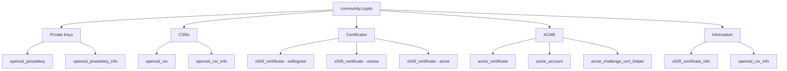

# How to Use the community.crypto Collection

Author: [nawazdhandala](https://www.github.com/nawazdhandala)

Tags: Ansible, Cryptography, TLS, SSL, Certificates, DevOps

Description: Manage TLS certificates, private keys, CSRs, and ACME certificates using the community.crypto Ansible collection with practical examples.

---

TLS certificates are everywhere in modern infrastructure: web servers, API endpoints, database connections, service mesh communication, and internal tools. Managing them manually is tedious and error-prone. Certificates expire, keys get lost, and CSRs get generated with wrong parameters. The `community.crypto` collection automates the entire certificate lifecycle with Ansible, from generating private keys to requesting Let's Encrypt certificates via ACME.

## Installation

```bash
# Install the collection
ansible-galaxy collection install community.crypto

# Install the Python cryptography library on target hosts
pip install cryptography
```

The `cryptography` Python library (version 1.6 or newer) is required. For ACME operations, you also need `cryptography >= 1.5`.

```yaml
# requirements.yml
---
collections:
  - name: community.crypto
    version: ">=2.16.0"
```

## Generating Private Keys

The `openssl_privatekey` module generates RSA, EC, and other private keys:

```yaml
# generate-keys.yml - Generate private keys for TLS
---
- name: Generate TLS private keys
  hosts: webservers
  become: true
  tasks:
    - name: Generate RSA 4096-bit private key
      community.crypto.openssl_privatekey:
        path: /etc/ssl/private/server.key
        size: 4096
        type: RSA
        owner: root
        group: root
        mode: "0600"

    - name: Generate ECDSA private key (faster, shorter)
      community.crypto.openssl_privatekey:
        path: /etc/ssl/private/server-ec.key
        type: ECC
        curve: secp384r1
        owner: root
        group: root
        mode: "0600"

    - name: Generate key with passphrase
      community.crypto.openssl_privatekey:
        path: /etc/ssl/private/ca.key
        size: 4096
        type: RSA
        passphrase: "{{ vault_ca_key_passphrase }}"
        cipher: auto
        owner: root
        group: root
        mode: "0600"
```

## Creating Certificate Signing Requests (CSRs)

The `openssl_csr` module creates CSRs that you submit to a Certificate Authority:

```yaml
# generate-csr.yml - Create certificate signing requests
---
- name: Generate CSRs for web servers
  hosts: webservers
  become: true
  tasks:
    - name: Generate CSR for the web server
      community.crypto.openssl_csr:
        path: /etc/ssl/certs/server.csr
        privatekey_path: /etc/ssl/private/server.key
        common_name: "{{ ansible_fqdn }}"
        organization_name: "My Company Inc"
        organizational_unit_name: "Engineering"
        country_name: US
        state_or_province_name: California
        locality_name: "San Francisco"
        email_address: "admin@mycompany.com"
        subject_alt_name:
          - "DNS:{{ ansible_fqdn }}"
          - "DNS:{{ ansible_hostname }}"
          - "DNS:{{ inventory_hostname }}"
          - "IP:{{ ansible_default_ipv4.address }}"

    - name: Generate CSR for wildcard certificate
      community.crypto.openssl_csr:
        path: /etc/ssl/certs/wildcard.csr
        privatekey_path: /etc/ssl/private/wildcard.key
        common_name: "*.mycompany.com"
        organization_name: "My Company Inc"
        subject_alt_name:
          - "DNS:*.mycompany.com"
          - "DNS:mycompany.com"

    - name: Generate CSR for internal service (with extended key usage)
      community.crypto.openssl_csr:
        path: /etc/ssl/certs/api-service.csr
        privatekey_path: /etc/ssl/private/api-service.key
        common_name: "api.internal.mycompany.com"
        subject_alt_name:
          - "DNS:api.internal.mycompany.com"
          - "DNS:api"
          - "IP:10.0.1.50"
        key_usage:
          - digitalSignature
          - keyEncipherment
        key_usage_critical: true
        extended_key_usage:
          - serverAuth
          - clientAuth
```

## Self-Signed Certificates

For development, testing, and internal services, self-signed certificates are often sufficient:

```yaml
# self-signed-certs.yml - Generate self-signed certificates
---
- name: Generate self-signed certificates
  hosts: all
  become: true
  tasks:
    - name: Generate private key
      community.crypto.openssl_privatekey:
        path: /etc/ssl/private/selfsigned.key
        size: 2048

    - name: Generate self-signed certificate
      community.crypto.x509_certificate:
        path: /etc/ssl/certs/selfsigned.crt
        privatekey_path: /etc/ssl/private/selfsigned.key
        provider: selfsigned
        selfsigned_not_after: "+365d"
        selfsigned_not_before: "-1d"

    - name: Generate self-signed certificate with full details
      community.crypto.x509_certificate:
        path: /etc/ssl/certs/server.crt
        csr_path: /etc/ssl/certs/server.csr
        privatekey_path: /etc/ssl/private/server.key
        provider: selfsigned
        selfsigned_not_after: "+730d"
```

## Building an Internal CA

For organizations that need an internal Certificate Authority:

```yaml
# internal-ca.yml - Set up an internal Certificate Authority
---
- name: Set up internal CA
  hosts: ca_server
  become: true
  vars:
    ca_dir: /opt/ca
  tasks:
    - name: Create CA directory structure
      ansible.builtin.file:
        path: "{{ item }}"
        state: directory
        owner: root
        group: root
        mode: "0700"
      loop:
        - "{{ ca_dir }}"
        - "{{ ca_dir }}/private"
        - "{{ ca_dir }}/certs"
        - "{{ ca_dir }}/csr"

    - name: Generate CA private key
      community.crypto.openssl_privatekey:
        path: "{{ ca_dir }}/private/ca.key"
        size: 4096
        type: RSA
        mode: "0600"

    - name: Generate CA CSR
      community.crypto.openssl_csr:
        path: "{{ ca_dir }}/csr/ca.csr"
        privatekey_path: "{{ ca_dir }}/private/ca.key"
        common_name: "My Company Internal CA"
        organization_name: "My Company Inc"
        country_name: US
        basic_constraints:
          - "CA:TRUE"
        basic_constraints_critical: true
        key_usage:
          - keyCertSign
          - cRLSign
          - digitalSignature
        key_usage_critical: true

    - name: Generate self-signed CA certificate
      community.crypto.x509_certificate:
        path: "{{ ca_dir }}/certs/ca.crt"
        csr_path: "{{ ca_dir }}/csr/ca.csr"
        privatekey_path: "{{ ca_dir }}/private/ca.key"
        provider: selfsigned
        selfsigned_not_after: "+3650d"

- name: Sign server certificates with internal CA
  hosts: webservers
  become: true
  vars:
    ca_dir: /opt/ca
  tasks:
    - name: Generate server private key
      community.crypto.openssl_privatekey:
        path: /etc/ssl/private/server.key
        size: 2048
        mode: "0600"

    - name: Generate server CSR
      community.crypto.openssl_csr:
        path: /etc/ssl/certs/server.csr
        privatekey_path: /etc/ssl/private/server.key
        common_name: "{{ ansible_fqdn }}"
        subject_alt_name:
          - "DNS:{{ ansible_fqdn }}"
          - "IP:{{ ansible_default_ipv4.address }}"

    - name: Sign server certificate with CA
      community.crypto.x509_certificate:
        path: /etc/ssl/certs/server.crt
        csr_path: /etc/ssl/certs/server.csr
        ownca_path: "{{ ca_dir }}/certs/ca.crt"
        ownca_privatekey_path: "{{ ca_dir }}/private/ca.key"
        provider: ownca
        ownca_not_after: "+365d"
      delegate_to: "{{ groups['ca_server'][0] }}"
```

## ACME/Let's Encrypt Certificates

The collection includes full ACME protocol support for Let's Encrypt and other ACME-compliant CAs:

```yaml
# letsencrypt-cert.yml - Obtain Let's Encrypt certificates
---
- name: Obtain Let's Encrypt certificate
  hosts: webservers
  become: true
  vars:
    domain: www.mycompany.com
    acme_directory: https://acme-v02.api.letsencrypt.org/directory
    acme_email: admin@mycompany.com
  tasks:
    - name: Generate account key
      community.crypto.openssl_privatekey:
        path: /etc/ssl/private/acme-account.key
        size: 4096
        mode: "0600"

    - name: Generate private key for the certificate
      community.crypto.openssl_privatekey:
        path: "/etc/ssl/private/{{ domain }}.key"
        size: 2048
        mode: "0600"

    - name: Generate CSR
      community.crypto.openssl_csr:
        path: "/etc/ssl/certs/{{ domain }}.csr"
        privatekey_path: "/etc/ssl/private/{{ domain }}.key"
        common_name: "{{ domain }}"
        subject_alt_name:
          - "DNS:{{ domain }}"
          - "DNS:mycompany.com"

    - name: Create ACME challenge
      community.crypto.acme_certificate:
        account_key_src: /etc/ssl/private/acme-account.key
        account_email: "{{ acme_email }}"
        csr: "/etc/ssl/certs/{{ domain }}.csr"
        dest: "/etc/ssl/certs/{{ domain }}.crt"
        fullchain_dest: "/etc/ssl/certs/{{ domain }}-fullchain.crt"
        acme_directory: "{{ acme_directory }}"
        acme_version: 2
        terms_agreed: true
        challenge: http-01
      register: acme_challenge

    - name: Create challenge directory
      ansible.builtin.file:
        path: /var/www/html/.well-known/acme-challenge
        state: directory
        owner: www-data
        group: www-data

    - name: Deploy HTTP challenge files
      ansible.builtin.copy:
        content: "{{ item.value['http-01']['resource_value'] }}"
        dest: "/var/www/html/{{ item.value['http-01']['resource'] }}"
      loop: "{{ acme_challenge.challenge_data | dict2items }}"
      when: acme_challenge is changed

    - name: Complete the ACME challenge
      community.crypto.acme_certificate:
        account_key_src: /etc/ssl/private/acme-account.key
        account_email: "{{ acme_email }}"
        csr: "/etc/ssl/certs/{{ domain }}.csr"
        dest: "/etc/ssl/certs/{{ domain }}.crt"
        fullchain_dest: "/etc/ssl/certs/{{ domain }}-fullchain.crt"
        acme_directory: "{{ acme_directory }}"
        acme_version: 2
        terms_agreed: true
        challenge: http-01
        data: "{{ acme_challenge }}"
      when: acme_challenge is changed
      notify: reload nginx

  handlers:
    - name: reload nginx
      ansible.builtin.service:
        name: nginx
        state: reloaded
```

## Certificate Monitoring and Validation

Check certificate expiration and validity:

```yaml
# check-certificates.yml - Monitor certificate health
---
- name: Check TLS certificate status
  hosts: webservers
  become: true
  tasks:
    - name: Get certificate information
      community.crypto.x509_certificate_info:
        path: /etc/ssl/certs/server.crt
      register: cert_info

    - name: Display certificate details
      ansible.builtin.debug:
        msg:
          subject: "{{ cert_info.subject }}"
          issuer: "{{ cert_info.issuer }}"
          not_after: "{{ cert_info.not_after }}"
          serial_number: "{{ cert_info.serial_number }}"

    - name: Check if certificate expires within 30 days
      community.crypto.x509_certificate_info:
        path: /etc/ssl/certs/server.crt
        valid_at:
          thirty_days: "+30d"
      register: cert_check

    - name: Alert if certificate expires soon
      ansible.builtin.debug:
        msg: "WARNING: Certificate expires within 30 days!"
      when: not cert_check.valid_at.thirty_days

    - name: Validate certificate against private key
      community.crypto.openssl_privatekey_info:
        path: /etc/ssl/private/server.key
      register: key_info

    - name: Verify key matches certificate
      ansible.builtin.assert:
        that:
          - cert_info.public_key_fingerprints.sha256 == key_info.public_key_fingerprints.sha256
        fail_msg: "Certificate and private key do not match!"
```

## Module Overview



## Conclusion

The `community.crypto` collection handles every aspect of certificate management in Ansible. From generating private keys and CSRs to signing certificates with an internal CA or obtaining them from Let's Encrypt via ACME, the entire TLS lifecycle can be automated. Add certificate expiration monitoring to your regular playbook runs to catch renewals before they become outages. Make sure the `cryptography` Python library is installed on your target hosts, and you have a complete PKI automation toolkit at your disposal.
