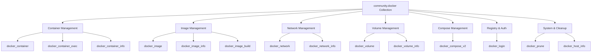

# How to Use the community.docker Collection in Ansible

Author: [nawazdhandala](https://www.github.com/nawazdhandala)

Tags: Ansible, Docker, community.docker, Automation, Containers

Description: Complete guide to the community.docker Ansible collection covering installation, key modules, and practical examples for managing Docker with Ansible.

---

The `community.docker` collection is the official Ansible collection for managing Docker containers, images, networks, volumes, and Docker Compose. It replaced the older built-in Docker modules that shipped with Ansible core, and it is actively maintained with regular updates. If you are managing Docker infrastructure with Ansible, this collection is essential. In this post, we will cover what it includes, how to install it, and how to use its most important modules.

## What is in the Collection?

The `community.docker` collection provides modules for virtually everything Docker-related:

- **docker_container**: Create, start, stop, and manage containers
- **docker_image**: Pull, build, and manage images
- **docker_network**: Create and manage Docker networks
- **docker_volume**: Create and manage Docker volumes
- **docker_compose_v2**: Run Docker Compose projects
- **docker_login**: Authenticate with container registries
- **docker_prune**: Clean up unused Docker objects
- **docker_host_info**: Get information about the Docker host
- **docker_container_info**: Get detailed info about containers

It also includes inventory plugins and connection plugins for working with Docker containers as Ansible targets.

## Installation

The collection is not included in Ansible core, so you need to install it separately.

```bash
# Install the community.docker collection
ansible-galaxy collection install community.docker

# Install a specific version
ansible-galaxy collection install community.docker:3.8.0

# Upgrade to the latest version
ansible-galaxy collection install community.docker --upgrade
```

You also need the Docker Python SDK installed on the machine where you run Ansible (or on the target host if you are running modules remotely).

```bash
# Install the Docker Python SDK
pip install docker

# For Docker Compose v2 support
pip install docker-compose
```

## Verifying the Installation

```bash
# Check if the collection is installed
ansible-galaxy collection list | grep community.docker

# Show the collection version
ansible-galaxy collection list community.docker
```

## Using a Requirements File

For project-level dependency management, create a requirements file.

```yaml
# requirements.yml - Ansible collection dependencies
---
collections:
  - name: community.docker
    version: ">=3.8.0"
  - name: community.general
    version: ">=8.0.0"
```

```bash
# Install all collections from the requirements file
ansible-galaxy collection install -r requirements.yml
```

## Module Overview

Here is a quick reference of the most commonly used modules and what they do.



## Basic Container Management

Here is a playbook that demonstrates the most common container operations.

```yaml
# container-basics.yml - Basic container operations with community.docker
---
- name: Docker Container Basics
  hosts: docker_hosts
  become: true

  tasks:
    # Pull an image before running a container
    - name: Pull the nginx image
      community.docker.docker_image:
        name: nginx
        tag: "1.25"
        source: pull

    # Run a container
    - name: Start an nginx container
      community.docker.docker_container:
        name: web-server
        image: "nginx:1.25"
        state: started
        ports:
          - "8080:80"
        restart_policy: unless-stopped
        labels:
          app: "web"
          environment: "production"
      register: container_result

    - name: Show container info
      ansible.builtin.debug:
        msg: |
          Container ID: {{ container_result.container.Id[:12] }}
          Status: {{ container_result.container.State.Status }}
          IP: {{ container_result.container.NetworkSettings.IPAddress }}

    # Get detailed info about a container
    - name: Get container details
      community.docker.docker_container_info:
        name: web-server
      register: container_info

    - name: Show container details
      ansible.builtin.debug:
        msg: "Container {{ container_info.container.Name }} is {{ container_info.container.State.Status }}"
```

## Working with Docker Networks

```yaml
# network-management.yml - Create and manage Docker networks
---
- name: Docker Network Management
  hosts: docker_hosts
  become: true

  tasks:
    # Create a custom bridge network
    - name: Create an application network
      community.docker.docker_network:
        name: app-network
        driver: bridge
        ipam_config:
          - subnet: "172.20.0.0/16"
            gateway: "172.20.0.1"
        labels:
          app: "myapp"
      register: network

    - name: Show network details
      ansible.builtin.debug:
        msg: "Network {{ network.network.Name }} created with subnet 172.20.0.0/16"

    # Run containers on the custom network
    - name: Start app container on custom network
      community.docker.docker_container:
        name: app
        image: "nginx:1.25"
        state: started
        networks:
          - name: app-network
            ipv4_address: "172.20.0.10"
        restart_policy: unless-stopped

    - name: Start Redis on the same network
      community.docker.docker_container:
        name: redis
        image: "redis:7"
        state: started
        networks:
          - name: app-network
            ipv4_address: "172.20.0.20"
        restart_policy: unless-stopped
```

## Docker Compose with Ansible

The `docker_compose_v2` module lets you manage Docker Compose projects.

```yaml
# compose-management.yml - Manage Docker Compose projects
---
- name: Docker Compose Management
  hosts: docker_hosts
  become: true

  tasks:
    # First, create the compose file on the target
    - name: Create project directory
      ansible.builtin.file:
        path: /opt/myapp
        state: directory
        mode: "0755"

    - name: Deploy docker-compose.yml
      ansible.builtin.copy:
        content: |
          services:
            web:
              image: nginx:1.25
              ports:
                - "80:80"
              volumes:
                - ./html:/usr/share/nginx/html
              depends_on:
                - api
            api:
              image: node:20-slim
              working_dir: /app
              volumes:
                - ./api:/app
              ports:
                - "3000:3000"
              environment:
                - REDIS_HOST=redis
            redis:
              image: redis:7
              volumes:
                - redis-data:/data
          volumes:
            redis-data:
        dest: /opt/myapp/docker-compose.yml
        mode: "0644"

    - name: Start the Docker Compose project
      community.docker.docker_compose_v2:
        project_src: /opt/myapp
        state: present
      register: compose_result

    - name: Show compose status
      ansible.builtin.debug:
        msg: "Compose project started with {{ compose_result.containers | length }} containers"
```

## Registry Authentication

If you use private registries, you need to authenticate before pulling images.

```yaml
# registry-auth.yml - Authenticate with Docker registries
---
- name: Docker Registry Authentication
  hosts: docker_hosts
  become: true

  tasks:
    # Login to Docker Hub
    - name: Login to Docker Hub
      community.docker.docker_login:
        username: "{{ docker_hub_username }}"
        password: "{{ docker_hub_password }}"
      no_log: true

    # Login to Google Container Registry
    - name: Login to GCR
      community.docker.docker_login:
        registry_url: "https://gcr.io"
        username: "_json_key"
        password: "{{ lookup('file', '/path/to/service-account-key.json') }}"
      no_log: true

    # Login to AWS ECR
    - name: Login to AWS ECR
      community.docker.docker_login:
        registry_url: "https://{{ aws_account_id }}.dkr.ecr.{{ aws_region }}.amazonaws.com"
        username: "AWS"
        password: "{{ ecr_token }}"
      no_log: true

    # Now pull from private registries
    - name: Pull image from private registry
      community.docker.docker_image:
        name: "gcr.io/my-project/my-app"
        tag: "latest"
        source: pull
```

## Docker System Cleanup

Over time, Docker accumulates unused images, containers, volumes, and networks. The prune module handles cleanup.

```yaml
# docker-cleanup.yml - Clean up unused Docker resources
---
- name: Docker System Cleanup
  hosts: docker_hosts
  become: true

  tasks:
    # Remove stopped containers
    - name: Prune stopped containers
      community.docker.docker_prune:
        containers: true
        containers_filters:
          # Only prune containers stopped for more than 24 hours
          until: "24h"
      register: container_prune

    # Remove unused images
    - name: Prune unused images
      community.docker.docker_prune:
        images: true
        images_filters:
          dangling: false
      register: image_prune

    # Remove unused volumes
    - name: Prune unused volumes
      community.docker.docker_prune:
        volumes: true
      register: volume_prune

    # Remove unused networks
    - name: Prune unused networks
      community.docker.docker_prune:
        networks: true
      register: network_prune

    - name: Show cleanup results
      ansible.builtin.debug:
        msg: |
          Containers removed: {{ container_prune.containers | default([]) | length }}
          Images removed: {{ image_prune.images | default([]) | length }}
          Volumes removed: {{ volume_prune.volumes | default([]) | length }}
          Space reclaimed: {{ image_prune.images_space_reclaimed | default(0) | human_readable }}
```

## Getting Host Information

```yaml
# docker-host-info.yml - Get Docker host information
---
- name: Docker Host Information
  hosts: docker_hosts
  become: true

  tasks:
    - name: Get Docker host info
      community.docker.docker_host_info:
        containers: true
        images: true
        volumes: true
      register: host_info

    - name: Show Docker host summary
      ansible.builtin.debug:
        msg: |
          Docker version: {{ host_info.host_info.ServerVersion }}
          Containers: {{ host_info.host_info.Containers }}
          Running: {{ host_info.host_info.ContainersRunning }}
          Images: {{ host_info.host_info.Images }}
          Storage driver: {{ host_info.host_info.Driver }}
```

## Connection Plugin: Running Commands Inside Containers

The collection includes a connection plugin that lets you use Ansible to configure running containers as if they were regular hosts.

```yaml
# configure-container.yml - Run Ansible tasks inside a Docker container
---
- name: Configure Running Container
  hosts: localhost
  gather_facts: false

  tasks:
    - name: Start a container to configure
      community.docker.docker_container:
        name: config-target
        image: ubuntu:22.04
        state: started
        command: sleep infinity

    - name: Add the container to the inventory
      ansible.builtin.add_host:
        name: config-target
        ansible_connection: community.docker.docker
        ansible_docker_extra_args: ""
      changed_when: false

- name: Configure the container
  hosts: config-target
  gather_facts: false

  tasks:
    - name: Install curl inside the container
      ansible.builtin.raw: apt-get update && apt-get install -y curl
      changed_when: true

    - name: Create a config file
      ansible.builtin.copy:
        content: "APP_ENV=production"
        dest: /etc/app.conf
        mode: "0644"
```

## Best Practices

1. **Pin your collection version.** Use a `requirements.yml` file with specific version constraints to avoid breaking changes when upgrading.

2. **Always install the Docker Python SDK.** The community.docker modules require the `docker` Python package. Without it, you get confusing error messages.

3. **Use `no_log` for registry credentials.** Never let Ansible print your registry passwords in the console output.

4. **Prefer `docker_compose_v2` over the older `docker_compose`.** The v2 module works with Docker Compose v2 (the Go-based plugin) which is the current standard.

5. **Use module-specific state parameters.** Each module has its own `state` options. For containers: `started`, `stopped`, `present`, `absent`. For images: `present`, `absent`. Learn the specific states for each module.

6. **Check module documentation regularly.** The collection evolves quickly. New parameters and modules are added frequently.

## Conclusion

The `community.docker` collection is the standard way to manage Docker with Ansible. It covers everything from basic container operations to complex Docker Compose deployments, registry authentication, and system cleanup. By installing this collection and learning its key modules, you get a powerful toolkit for automating your Docker infrastructure alongside the rest of your Ansible-managed systems.
