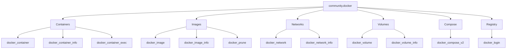

# How to Use the community.docker Collection

Author: [nawazdhandala](https://www.github.com/nawazdhandala)

Tags: Ansible, Docker, Containers, DevOps, Automation

Description: Complete guide to managing Docker containers, images, networks, and volumes with the community.docker Ansible collection and practical examples.

---

The `community.docker` collection brings Docker management into Ansible. Instead of writing shell scripts full of `docker run` commands, you can declaratively manage containers, images, networks, volumes, and Docker Compose stacks through Ansible playbooks. Everything becomes idempotent, repeatable, and version-controlled.

## Installation

```bash
# Install the collection
ansible-galaxy collection install community.docker

# The Docker SDK for Python is required on the target hosts
pip install docker
```

Add to your requirements:

```yaml
# requirements.yml
---
collections:
  - name: community.docker
    version: ">=3.8.0"
```

## Managing Docker Containers

The `docker_container` module is the workhorse of this collection. It manages the full lifecycle of containers:

```yaml
# deploy-containers.yml - Deploy application containers
---
- name: Deploy application stack
  hosts: docker_hosts
  become: true
  tasks:
    - name: Run Redis container
      community.docker.docker_container:
        name: redis
        image: redis:7-alpine
        state: started
        restart_policy: always
        ports:
          - "6379:6379"
        volumes:
          - redis_data:/data
        command: redis-server --appendonly yes
        memory: 512m
        cpus: 1.0

    - name: Run application container
      community.docker.docker_container:
        name: myapp
        image: myregistry.com/myapp:2.1.0
        state: started
        restart_policy: unless-stopped
        ports:
          - "8080:8080"
        env:
          DATABASE_URL: "postgresql://appuser:{{ vault_db_pass }}@db:5432/myapp"
          REDIS_URL: "redis://redis:6379/0"
          LOG_LEVEL: "info"
        links:
          - redis
        healthcheck:
          test: ["CMD", "curl", "-f", "http://localhost:8080/health"]
          interval: 30s
          timeout: 10s
          retries: 3
          start_period: 40s
        labels:
          app: myapp
          version: "2.1.0"
          environment: production
```

### Container State Management

The `state` parameter controls the container lifecycle:

```yaml
# container-lifecycle.yml - Different container states
---
- name: Container lifecycle examples
  hosts: docker_hosts
  become: true
  tasks:
    - name: Start a container (create if needed)
      community.docker.docker_container:
        name: myapp
        image: myapp:latest
        state: started

    - name: Stop a running container
      community.docker.docker_container:
        name: myapp
        state: stopped

    - name: Remove a container entirely
      community.docker.docker_container:
        name: myapp
        state: absent

    - name: Recreate a container (force pull new image)
      community.docker.docker_container:
        name: myapp
        image: myapp:latest
        state: started
        pull: true
        recreate: true
```

## Managing Docker Images

```yaml
# manage-images.yml - Pull, build, and manage Docker images
---
- name: Manage Docker images
  hosts: docker_hosts
  become: true
  tasks:
    - name: Pull specific image versions
      community.docker.docker_image:
        name: "{{ item.name }}"
        tag: "{{ item.tag }}"
        source: pull
      loop:
        - { name: nginx, tag: "1.25-alpine" }
        - { name: redis, tag: "7-alpine" }
        - { name: postgres, tag: "16-alpine" }

    - name: Build image from Dockerfile
      community.docker.docker_image:
        name: myapp
        tag: "{{ app_version }}"
        source: build
        build:
          path: /opt/src/myapp
          dockerfile: Dockerfile
          pull: true
          args:
            APP_VERSION: "{{ app_version }}"
            BUILD_DATE: "{{ ansible_date_time.iso8601 }}"

    - name: Tag and push image to registry
      community.docker.docker_image:
        name: myapp
        tag: "{{ app_version }}"
        repository: myregistry.com/myapp
        push: true
        source: local

    - name: Remove old images
      community.docker.docker_image:
        name: "{{ item }}"
        state: absent
      loop:
        - myapp:old-version
        - nginx:1.24-alpine

    - name: Prune unused images
      community.docker.docker_prune:
        images: true
        images_filters:
          dangling: true
```

## Docker Networks

```yaml
# docker-networks.yml - Create and manage Docker networks
---
- name: Configure Docker networks
  hosts: docker_hosts
  become: true
  tasks:
    - name: Create application network
      community.docker.docker_network:
        name: app_network
        driver: bridge
        ipam_config:
          - subnet: 172.20.0.0/24
            gateway: 172.20.0.1

    - name: Create isolated backend network
      community.docker.docker_network:
        name: backend_network
        driver: bridge
        internal: true
        ipam_config:
          - subnet: 172.21.0.0/24

    - name: Run containers on specific networks
      community.docker.docker_container:
        name: myapp
        image: myapp:latest
        state: started
        networks:
          - name: app_network
            ipv4_address: 172.20.0.10
          - name: backend_network
            ipv4_address: 172.21.0.10

    - name: Remove unused networks
      community.docker.docker_network:
        name: old_network
        state: absent
```

## Docker Volumes

```yaml
# docker-volumes.yml - Manage Docker volumes
---
- name: Manage Docker volumes
  hosts: docker_hosts
  become: true
  tasks:
    - name: Create named volumes
      community.docker.docker_volume:
        name: "{{ item }}"
        state: present
      loop:
        - postgres_data
        - redis_data
        - app_uploads

    - name: Create volume with specific driver options
      community.docker.docker_volume:
        name: nfs_share
        driver: local
        driver_options:
          type: nfs
          o: "addr=nfs-server.internal,rw"
          device: ":/exports/app-data"

    - name: Remove a volume
      community.docker.docker_volume:
        name: old_volume
        state: absent
```

## Docker Compose with docker_compose_v2

The `docker_compose_v2` module manages Docker Compose stacks:

```yaml
# compose-deploy.yml - Deploy with Docker Compose
---
- name: Deploy application stack with Compose
  hosts: docker_hosts
  become: true
  tasks:
    - name: Create project directory
      ansible.builtin.file:
        path: /opt/myapp
        state: directory

    - name: Deploy compose file
      ansible.builtin.template:
        src: docker-compose.yml.j2
        dest: /opt/myapp/docker-compose.yml

    - name: Start the stack
      community.docker.docker_compose_v2:
        project_src: /opt/myapp
        state: present
      register: compose_result

    - name: Show deployment result
      ansible.builtin.debug:
        var: compose_result

    - name: Pull new images and recreate changed services
      community.docker.docker_compose_v2:
        project_src: /opt/myapp
        state: present
        pull: always
        recreate: auto

    - name: Tear down the stack
      community.docker.docker_compose_v2:
        project_src: /opt/myapp
        state: absent
```

## Docker Registry Authentication

```yaml
# registry-login.yml - Authenticate with Docker registries
---
- name: Configure Docker registry access
  hosts: docker_hosts
  become: true
  tasks:
    - name: Log in to private registry
      community.docker.docker_login:
        registry_url: myregistry.com
        username: "{{ vault_registry_user }}"
        password: "{{ vault_registry_pass }}"

    - name: Log in to AWS ECR
      community.docker.docker_login:
        registry_url: "{{ aws_account_id }}.dkr.ecr.{{ aws_region }}.amazonaws.com"
        username: AWS
        password: "{{ ecr_token }}"

    - name: Log out from a registry
      community.docker.docker_login:
        registry_url: old-registry.com
        state: absent
```

## Gathering Docker Information

```yaml
# docker-info.yml - Gather information about Docker environment
---
- name: Gather Docker information
  hosts: docker_hosts
  become: true
  tasks:
    - name: Get Docker host information
      community.docker.docker_host_info:
      register: docker_host

    - name: Display Docker version
      ansible.builtin.debug:
        msg: "Docker {{ docker_host.host_info.ServerVersion }} on {{ docker_host.host_info.OperatingSystem }}"

    - name: List all containers
      community.docker.docker_container_info:
        name: myapp
      register: container_info

    - name: Show container details
      ansible.builtin.debug:
        msg: "{{ container_info.container.State.Status }}"
      when: container_info.exists

    - name: Get container logs
      community.docker.docker_container_exec:
        container: myapp
        command: /bin/sh -c "cat /var/log/app.log | tail -50"
      register: app_logs
```

## Full Application Deployment Example

```yaml
# full-deploy.yml - Complete Docker application deployment
---
- name: Deploy full application stack
  hosts: docker_hosts
  become: true
  vars:
    app_version: "2.1.0"
    postgres_version: "16-alpine"
    redis_version: "7-alpine"
  tasks:
    - name: Create Docker networks
      community.docker.docker_network:
        name: "{{ item }}"
      loop:
        - frontend
        - backend

    - name: Create persistent volumes
      community.docker.docker_volume:
        name: "{{ item }}"
      loop:
        - postgres_data
        - redis_data

    - name: Pull required images
      community.docker.docker_image:
        name: "{{ item }}"
        source: pull
      loop:
        - "postgres:{{ postgres_version }}"
        - "redis:{{ redis_version }}"
        - "myregistry.com/myapp:{{ app_version }}"

    - name: Run PostgreSQL
      community.docker.docker_container:
        name: postgres
        image: "postgres:{{ postgres_version }}"
        state: started
        restart_policy: always
        env:
          POSTGRES_DB: myapp
          POSTGRES_USER: appuser
          POSTGRES_PASSWORD: "{{ vault_db_password }}"
        volumes:
          - postgres_data:/var/lib/postgresql/data
        networks:
          - name: backend

    - name: Run Redis
      community.docker.docker_container:
        name: redis
        image: "redis:{{ redis_version }}"
        state: started
        restart_policy: always
        volumes:
          - redis_data:/data
        networks:
          - name: backend

    - name: Wait for PostgreSQL to be ready
      community.docker.docker_container_exec:
        container: postgres
        command: pg_isready -U appuser -d myapp
      register: pg_ready
      retries: 10
      delay: 3
      until: pg_ready.rc == 0

    - name: Run application
      community.docker.docker_container:
        name: myapp
        image: "myregistry.com/myapp:{{ app_version }}"
        state: started
        restart_policy: unless-stopped
        ports:
          - "80:8080"
        env:
          DATABASE_URL: "postgresql://appuser:{{ vault_db_password }}@postgres:5432/myapp"
          REDIS_URL: "redis://redis:6379/0"
        networks:
          - name: frontend
          - name: backend
```

## Module Overview



## Conclusion

The `community.docker` collection turns Docker management into declarative Ansible code. Containers, images, networks, volumes, and Compose stacks all become idempotent resources. The modules handle the complexity of checking current state, making changes only when needed, and providing clean output. Make sure the `docker` Python SDK is installed on your target hosts, and you have a complete Docker automation toolkit within your playbooks.
