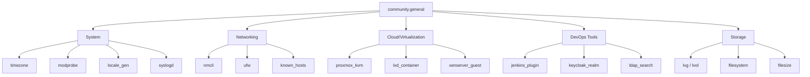

# How to Use the community.general Collection

Author: [nawazdhandala](https://www.github.com/nawazdhandala)

Tags: Ansible, Community General, System Administration, DevOps

Description: Explore the community.general collection with practical examples covering timezone, modprobe, nmcli, ufw, ldap, keycloak, and many more modules.

---

The `community.general` collection is the largest Ansible collection by module count. It is the catch-all for modules that do not fit into a more specific collection. Need to manage system timezones? It is in here. NetworkManager interfaces? In here. UFW firewall rules? In here too. Keycloak, LDAP, Jenkins, Proxmox, LXD, and dozens more. This post highlights the most practical modules and shows how to use them.

## Installation

```bash
# Install the collection
ansible-galaxy collection install community.general

# It is also included in the full 'ansible' package
pip install ansible
```

In your requirements file:

```yaml
# requirements.yml
---
collections:
  - name: community.general
    version: ">=8.0.0"
```

## System Configuration Modules

### Timezone Management

```yaml
# configure-timezone.yml - Set system timezone
---
- name: Configure system timezone
  hosts: all
  become: true
  tasks:
    - name: Set timezone to UTC
      community.general.timezone:
        name: UTC

    - name: Set timezone for US East Coast servers
      community.general.timezone:
        name: America/New_York
      when: "'us_east' in group_names"
```

### Kernel Module Management

The `modprobe` module loads and unloads kernel modules:

```yaml
# kernel-modules.yml - Manage kernel modules
---
- name: Configure kernel modules
  hosts: all
  become: true
  tasks:
    - name: Load the br_netfilter module
      community.general.modprobe:
        name: br_netfilter
        state: present

    - name: Load overlay module for containers
      community.general.modprobe:
        name: overlay
        state: present

    - name: Disable unused filesystem modules
      community.general.modprobe:
        name: "{{ item }}"
        state: absent
      loop:
        - cramfs
        - freevxfs
        - hfs
        - hfsplus
        - squashfs
```

### Locale Generation

```yaml
# locale-setup.yml - Configure system locale
---
- name: Configure system locale
  hosts: all
  become: true
  tasks:
    - name: Generate required locales
      community.general.locale_gen:
        name: "{{ item }}"
        state: present
      loop:
        - en_US.UTF-8
        - de_DE.UTF-8
```

## Network Configuration with nmcli

The `nmcli` module manages NetworkManager connections. It is one of the most feature-rich modules in the collection:

```yaml
# network-config.yml - Configure network interfaces with NetworkManager
---
- name: Configure network interfaces
  hosts: servers
  become: true
  tasks:
    - name: Configure static IP on eth0
      community.general.nmcli:
        conn_name: eth0-static
        ifname: eth0
        type: ethernet
        ip4: 10.0.1.50/24
        gw4: 10.0.1.1
        dns4:
          - 10.0.100.1
          - 10.0.100.2
        dns4_search:
          - internal.company.com
        method4: manual
        state: present
        autoconnect: true

    - name: Configure VLAN interface
      community.general.nmcli:
        conn_name: vlan100
        type: vlan
        vlandev: eth0
        vlanid: 100
        ip4: 10.100.0.50/24
        state: present

    - name: Create bond interface
      community.general.nmcli:
        conn_name: bond0
        type: bond
        mode: 802.3ad
        ip4: 10.0.2.50/24
        state: present

    - name: Add interfaces to bond
      community.general.nmcli:
        conn_name: "bond0-{{ item }}"
        type: bond-slave
        ifname: "{{ item }}"
        master: bond0
        state: present
      loop:
        - eth1
        - eth2
```

## UFW Firewall Management

For Ubuntu systems using UFW:

```yaml
# ufw-setup.yml - Configure UFW firewall
---
- name: Configure UFW firewall
  hosts: ubuntu_servers
  become: true
  tasks:
    - name: Set default deny incoming
      community.general.ufw:
        default: deny
        direction: incoming

    - name: Set default allow outgoing
      community.general.ufw:
        default: allow
        direction: outgoing

    - name: Allow SSH from management network
      community.general.ufw:
        rule: allow
        port: "22"
        proto: tcp
        from_ip: 10.0.100.0/24

    - name: Allow HTTP and HTTPS
      community.general.ufw:
        rule: allow
        port: "{{ item }}"
        proto: tcp
      loop:
        - "80"
        - "443"

    - name: Allow application port range
      community.general.ufw:
        rule: allow
        port: "8000:8100"
        proto: tcp

    - name: Enable UFW
      community.general.ufw:
        state: enabled
```

## Filesystem Operations

### Managing swap

```yaml
# swap-config.yml - Configure swap space
---
- name: Configure swap
  hosts: all
  become: true
  tasks:
    - name: Create swap file
      community.general.filesize:
        path: /swapfile
        size: 4G
      register: swap_file

    - name: Set swap file permissions
      ansible.builtin.file:
        path: /swapfile
        mode: "0600"

    - name: Format swap file
      ansible.builtin.command:
        cmd: mkswap /swapfile
      when: swap_file.changed

    - name: Enable swap
      ansible.builtin.command:
        cmd: swapon /swapfile
      when: swap_file.changed
```

### LVM Management

```yaml
# lvm-setup.yml - Configure LVM
---
- name: Set up LVM storage
  hosts: storage_servers
  become: true
  tasks:
    - name: Create volume group
      community.general.lvg:
        vg: data_vg
        pvs:
          - /dev/sdb
          - /dev/sdc

    - name: Create logical volume for application data
      community.general.lvol:
        vg: data_vg
        lv: app_data
        size: 100G

    - name: Create logical volume for logs
      community.general.lvol:
        vg: data_vg
        lv: app_logs
        size: 50G

    - name: Create filesystem on app_data
      community.general.filesystem:
        fstype: xfs
        dev: /dev/data_vg/app_data

    - name: Create filesystem on app_logs
      community.general.filesystem:
        fstype: xfs
        dev: /dev/data_vg/app_logs
```

## Jenkins Integration

```yaml
# jenkins-jobs.yml - Manage Jenkins jobs
---
- name: Configure Jenkins
  hosts: jenkins_server
  tasks:
    - name: Install Jenkins plugin
      community.general.jenkins_plugin:
        name: "{{ item }}"
        state: present
        url: "http://localhost:8080"
        url_username: admin
        url_password: "{{ vault_jenkins_password }}"
      loop:
        - git
        - pipeline
        - docker-workflow
        - credentials

    - name: Create Jenkins job from template
      community.general.jenkins_job:
        name: "deploy-myapp"
        config: "{{ lookup('template', 'jenkins-job.xml.j2') }}"
        url: "http://localhost:8080"
        user: admin
        password: "{{ vault_jenkins_password }}"
```

## Proxmox VM Management

```yaml
# proxmox-vm.yml - Manage Proxmox virtual machines
---
- name: Manage VMs on Proxmox
  hosts: localhost
  tasks:
    - name: Create a new VM
      community.general.proxmox_kvm:
        api_user: root@pam
        api_password: "{{ vault_proxmox_password }}"
        api_host: proxmox.internal.com
        name: web-server-01
        node: pve-node1
        cores: 4
        memory: 8192
        scsi:
          scsi0: "local-lvm:32"
        net:
          net0: "virtio,bridge=vmbr0"
        state: present

    - name: Start the VM
      community.general.proxmox_kvm:
        api_user: root@pam
        api_password: "{{ vault_proxmox_password }}"
        api_host: proxmox.internal.com
        name: web-server-01
        node: pve-node1
        state: started
```

## SSH Key Management

```yaml
# ssh-keys.yml - Manage SSH authorized keys and known hosts
---
- name: Configure SSH access
  hosts: all
  become: true
  tasks:
    - name: Add SSH authorized keys for admins
      ansible.posix.authorized_key:
        user: "{{ item.user }}"
        key: "{{ item.key }}"
        state: present
      loop:
        - user: deploy
          key: "ssh-ed25519 AAAA... deploy@company.com"
        - user: deploy
          key: "ssh-ed25519 BBBB... admin@company.com"

    - name: Add known hosts entries
      community.general.known_hosts:
        name: "{{ item }}"
        key: "{{ lookup('pipe', 'ssh-keyscan -t ed25519 ' + item) }}"
        state: present
      loop:
        - github.com
        - gitlab.internal.com
```

## Module Categories Overview



## Useful Filter Plugins

The collection also ships filter plugins:

```yaml
# filter-examples.yml - Useful filters from community.general
---
- name: Filter plugin examples
  hosts: localhost
  gather_facts: false
  tasks:
    - name: Use json_query to extract data
      ansible.builtin.debug:
        msg: "{{ servers | community.general.json_query('[?role==`web`].hostname') }}"
      vars:
        servers:
          - hostname: web01
            role: web
          - hostname: db01
            role: database
          - hostname: web02
            role: web
      # Output: ["web01", "web02"]
```

## Conclusion

The `community.general` collection is the toolbox you will reach into most often. Rather than memorizing all its modules (there are hundreds), know that it covers system configuration (timezone, modprobe, locale), networking (nmcli, ufw, known_hosts), storage (LVM, filesystem), and integrations with tools like Jenkins, Keycloak, Proxmox, and LDAP. When you need a module for something that is not in `ansible.builtin` or a vendor-specific collection, check `community.general` first.
