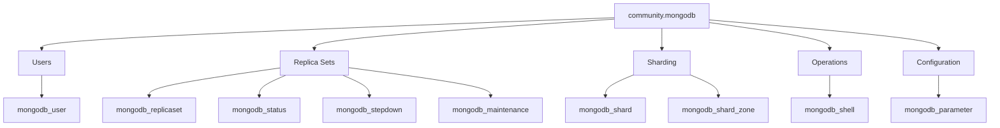

# How to Use the community.mongodb Collection

Author: [nawazdhandala](https://www.github.com/nawazdhandala)

Tags: Ansible, MongoDB, NoSQL, Database, DevOps

Description: Managing MongoDB deployments with the community.mongodb Ansible collection including users, replica sets, sharding, and database operations.

---

MongoDB is one of the most popular NoSQL databases, and managing it at scale requires automation. The `community.mongodb` collection provides Ansible modules for user management, replica set configuration, sharding, database operations, and server parameter tuning. Whether you run standalone instances or large sharded clusters, this collection helps you automate the operational tasks that would otherwise require manual mongo shell sessions.

## Installation

```bash
# Install the collection
ansible-galaxy collection install community.mongodb

# Install the Python MongoDB driver on target hosts
pip install pymongo
```

The `pymongo` library must be installed on the host where the MongoDB modules execute. For most setups, that means installing it on the MongoDB servers themselves.

```yaml
# requirements.yml
---
collections:
  - name: community.mongodb
    version: ">=1.6.0"
```

## User Management

MongoDB uses role-based access control. The `mongodb_user` module creates and manages database users:

```yaml
# manage-users.yml - Create and manage MongoDB users
---
- name: Manage MongoDB users
  hosts: mongodb_servers
  become: true
  tasks:
    - name: Create admin user
      community.mongodb.mongodb_user:
        database: admin
        name: admin_user
        password: "{{ vault_mongo_admin_password }}"
        roles:
          - role: root
            db: admin
        state: present
        login_host: localhost
        login_port: 27017

    - name: Create application user
      community.mongodb.mongodb_user:
        database: myapp
        name: app_user
        password: "{{ vault_mongo_app_password }}"
        roles:
          - role: readWrite
            db: myapp
        state: present
        login_user: admin_user
        login_password: "{{ vault_mongo_admin_password }}"
        login_database: admin

    - name: Create read-only user for reporting
      community.mongodb.mongodb_user:
        database: myapp
        name: reporting_user
        password: "{{ vault_mongo_reporting_password }}"
        roles:
          - role: read
            db: myapp
          - role: read
            db: analytics
        state: present
        login_user: admin_user
        login_password: "{{ vault_mongo_admin_password }}"
        login_database: admin

    - name: Create monitoring user
      community.mongodb.mongodb_user:
        database: admin
        name: monitoring_user
        password: "{{ vault_mongo_monitoring_password }}"
        roles:
          - role: clusterMonitor
            db: admin
          - role: read
            db: local
        state: present
        login_user: admin_user
        login_password: "{{ vault_mongo_admin_password }}"
        login_database: admin

    - name: Create backup user
      community.mongodb.mongodb_user:
        database: admin
        name: backup_user
        password: "{{ vault_mongo_backup_password }}"
        roles:
          - role: backup
            db: admin
          - role: restore
            db: admin
        state: present
        login_user: admin_user
        login_password: "{{ vault_mongo_admin_password }}"
        login_database: admin

    - name: Remove deprecated user
      community.mongodb.mongodb_user:
        database: myapp
        name: old_user
        state: absent
        login_user: admin_user
        login_password: "{{ vault_mongo_admin_password }}"
        login_database: admin
```

## Replica Set Configuration

The `mongodb_replicaset` module configures MongoDB replica sets for high availability:

```yaml
# setup-replicaset.yml - Configure MongoDB replica set
---
- name: Initialize MongoDB replica set
  hosts: mongodb_primary
  become: true
  tasks:
    - name: Initialize the replica set
      community.mongodb.mongodb_replicaset:
        login_host: localhost
        login_port: 27017
        replica_set: rs0
        members:
          - host: mongo1.internal:27017
            priority: 10
          - host: mongo2.internal:27017
            priority: 5
          - host: mongo3.internal:27017
            priority: 5
        validate: true

- name: Verify replica set status
  hosts: mongodb_servers
  become: true
  tasks:
    - name: Check replica set status
      community.mongodb.mongodb_status:
        login_host: localhost
        login_port: 27017
        replica_set: rs0
        poll: 10
        interval: 5
      register: rs_status

    - name: Display replica set status
      ansible.builtin.debug:
        msg: "Member {{ inventory_hostname }} is {{ rs_status.msg }}"

    - name: Wait for replica set to be healthy
      community.mongodb.mongodb_status:
        login_host: localhost
        login_port: 27017
        replica_set: rs0
        validate: minimal
        poll: 30
        interval: 5
```

Adding or removing members from an existing replica set:

```yaml
# modify-replicaset.yml - Add or remove replica set members
---
- name: Modify replica set membership
  hosts: mongodb_primary
  become: true
  tasks:
    - name: Add a new member to the replica set
      community.mongodb.mongodb_replicaset:
        login_host: localhost
        login_port: 27017
        replica_set: rs0
        members:
          - host: mongo1.internal:27017
            priority: 10
          - host: mongo2.internal:27017
            priority: 5
          - host: mongo3.internal:27017
            priority: 5
          - host: mongo4.internal:27017
            priority: 3
        reconfigure: true
```

## Server Parameter Configuration

The `mongodb_parameter` module sets MongoDB server parameters at runtime:

```yaml
# configure-params.yml - Set MongoDB server parameters
---
- name: Configure MongoDB parameters
  hosts: mongodb_servers
  become: true
  tasks:
    - name: Set logging verbosity
      community.mongodb.mongodb_parameter:
        login_host: localhost
        login_port: 27017
        login_user: admin_user
        login_password: "{{ vault_mongo_admin_password }}"
        login_database: admin
        param: logLevel
        value: 1
        param_type: int

    - name: Enable profiling for slow queries
      community.mongodb.mongodb_parameter:
        login_host: localhost
        login_port: 27017
        login_user: admin_user
        login_password: "{{ vault_mongo_admin_password }}"
        login_database: admin
        param: slowOpThresholdMs
        value: 100
        param_type: int

    - name: Set write concern
      community.mongodb.mongodb_parameter:
        login_host: localhost
        login_port: 27017
        login_user: admin_user
        login_password: "{{ vault_mongo_admin_password }}"
        login_database: admin
        param: wiredTigerEngineRuntimeConfig
        value: "cache_size=2G"
        param_type: str
```

## Sharding Configuration

For large-scale deployments that need horizontal scaling:

```yaml
# setup-sharding.yml - Configure MongoDB sharding
---
- name: Add shards to the cluster
  hosts: mongos_servers
  become: true
  tasks:
    - name: Add shard replica sets
      community.mongodb.mongodb_shard:
        login_host: localhost
        login_port: 27017
        login_user: admin_user
        login_password: "{{ vault_mongo_admin_password }}"
        shard: "{{ item }}"
        state: present
      loop:
        - "shard1/shard1-node1:27018,shard1-node2:27018,shard1-node3:27018"
        - "shard2/shard2-node1:27018,shard2-node2:27018,shard2-node3:27018"

    - name: Enable sharding on database
      community.mongodb.mongodb_shard_zone:
        login_host: localhost
        login_port: 27017
        login_user: admin_user
        login_password: "{{ vault_mongo_admin_password }}"
        name: zone_us_east
        namespace: myapp.orders
        state: present
```

## Database Operations with mongodb_shell

The `mongodb_shell` module runs commands through the mongo shell:

```yaml
# database-operations.yml - Run MongoDB operations
---
- name: Perform database operations
  hosts: mongodb_primary
  become: true
  tasks:
    - name: Create indexes
      community.mongodb.mongodb_shell:
        login_host: localhost
        login_port: 27017
        login_user: admin_user
        login_password: "{{ vault_mongo_admin_password }}"
        login_database: admin
        db: myapp
        eval: |
          db.users.createIndex({ email: 1 }, { unique: true });
          db.users.createIndex({ created_at: -1 });
          db.orders.createIndex({ user_id: 1, status: 1 });
          db.orders.createIndex({ created_at: -1 }, { expireAfterSeconds: 7776000 });

    - name: Get collection statistics
      community.mongodb.mongodb_shell:
        login_host: localhost
        login_port: 27017
        login_user: admin_user
        login_password: "{{ vault_mongo_admin_password }}"
        login_database: admin
        db: myapp
        eval: "db.users.stats()"
      register: user_stats

    - name: Display collection stats
      ansible.builtin.debug:
        var: user_stats

    - name: Run aggregation pipeline
      community.mongodb.mongodb_shell:
        login_host: localhost
        login_port: 27017
        login_user: admin_user
        login_password: "{{ vault_mongo_admin_password }}"
        login_database: admin
        db: myapp
        eval: |
          db.orders.aggregate([
            { $match: { status: "completed" } },
            { $group: { _id: "$product_id", total: { $sum: "$amount" } } },
            { $sort: { total: -1 } },
            { $limit: 10 }
          ]).toArray()
      register: top_products
```

## MongoDB Maintenance Tasks

```yaml
# maintenance.yml - MongoDB maintenance automation
---
- name: MongoDB maintenance tasks
  hosts: mongodb_primary
  become: true
  tasks:
    - name: Perform stepdown (for maintenance)
      community.mongodb.mongodb_stepdown:
        login_host: localhost
        login_port: 27017
        login_user: admin_user
        login_password: "{{ vault_mongo_admin_password }}"
        login_database: admin
        stepdown_seconds: 60
        secondary_catch_up: 10
      when: maintenance_mode | default(false)

    - name: Enable maintenance mode
      community.mongodb.mongodb_maintenance:
        login_host: localhost
        login_port: 27017
        login_user: admin_user
        login_password: "{{ vault_mongo_admin_password }}"
        login_database: admin
        state: present
      when: maintenance_mode | default(false)

    - name: Compact a collection (reclaim space)
      community.mongodb.mongodb_shell:
        login_host: localhost
        login_port: 27017
        login_user: admin_user
        login_password: "{{ vault_mongo_admin_password }}"
        login_database: admin
        db: myapp
        eval: "db.runCommand({ compact: 'old_events' })"
```

## Full MongoDB Deployment Example

```yaml
# deploy-mongodb.yml - Complete MongoDB setup
---
- name: Deploy MongoDB with replica set
  hosts: mongodb_servers
  become: true
  vars:
    mongodb_port: 27017
    replica_set_name: rs0
  tasks:
    - name: Deploy MongoDB configuration
      ansible.builtin.template:
        src: mongod.conf.j2
        dest: /etc/mongod.conf
        owner: root
        group: root
        mode: "0644"
      notify: restart mongod

    - name: Start MongoDB service
      ansible.builtin.service:
        name: mongod
        state: started
        enabled: true

    - name: Wait for MongoDB to be ready
      community.mongodb.mongodb_shell:
        login_host: localhost
        login_port: "{{ mongodb_port }}"
        eval: "db.adminCommand('ping')"
      retries: 10
      delay: 5
      register: mongo_ping
      until: mongo_ping is succeeded

  handlers:
    - name: restart mongod
      ansible.builtin.service:
        name: mongod
        state: restarted

- name: Initialize replica set and users
  hosts: mongodb_primary
  become: true
  tasks:
    - name: Initialize replica set
      community.mongodb.mongodb_replicaset:
        login_host: localhost
        replica_set: rs0
        members:
          - host: "mongo1.internal:27017"
          - host: "mongo2.internal:27017"
          - host: "mongo3.internal:27017"

    - name: Wait for replica set to stabilize
      community.mongodb.mongodb_status:
        login_host: localhost
        replica_set: rs0
        poll: 30
        interval: 5

    - name: Create admin user
      community.mongodb.mongodb_user:
        database: admin
        name: admin_user
        password: "{{ vault_mongo_admin_password }}"
        roles:
          - { role: root, db: admin }
        state: present
```

## Module Overview



## Conclusion

The `community.mongodb` collection covers the core MongoDB administration tasks: user and role management, replica set initialization and modification, sharding, server parameter tuning, and arbitrary shell operations. Install `pymongo` on your target hosts, start with user management and replica set configuration, and build from there. For production deployments, always set up authentication first and use Ansible Vault for passwords. The combination of declarative replica set management and shell operations gives you both structured automation and the flexibility to run any MongoDB command when needed.
