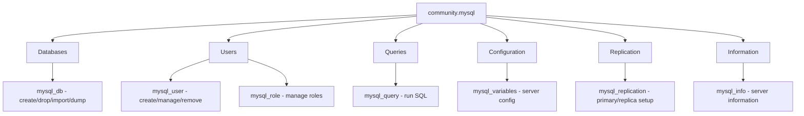

# How to Use the community.mysql Collection

Author: [nawazdhandala](https://www.github.com/nawazdhandala)

Tags: Ansible, MySQL, MariaDB, Database, DevOps

Description: Manage MySQL and MariaDB databases, users, permissions, replication, and configuration using the community.mysql Ansible collection.

---

MySQL and MariaDB remain among the most widely deployed databases, powering everything from WordPress sites to enterprise applications. The `community.mysql` collection brings full database management into Ansible, letting you automate database creation, user management, permission grants, replication setup, and query execution. The modules work with both MySQL and MariaDB.

## Installation

```bash
# Install the collection
ansible-galaxy collection install community.mysql

# Install the Python MySQL connector on target hosts
pip install PyMySQL
```

The `PyMySQL` library is the recommended Python connector. Alternatively, you can use `mysqlclient` (the C extension), but PyMySQL is pure Python and easier to install.

```yaml
# requirements.yml
---
collections:
  - name: community.mysql
    version: ">=3.8.0"
```

## Database Management

The `mysql_db` module handles database creation, deletion, import, and export:

```yaml
# manage-databases.yml - Create and manage MySQL databases
---
- name: Manage MySQL databases
  hosts: db_servers
  become: true
  tasks:
    - name: Create application database
      community.mysql.mysql_db:
        name: myapp_production
        encoding: utf8mb4
        collation: utf8mb4_unicode_ci
        state: present
        login_unix_socket: /var/run/mysqld/mysqld.sock

    - name: Create multiple databases
      community.mysql.mysql_db:
        name: "{{ item }}"
        encoding: utf8mb4
        collation: utf8mb4_unicode_ci
        state: present
        login_unix_socket: /var/run/mysqld/mysqld.sock
      loop:
        - myapp_staging
        - myapp_analytics
        - myapp_sessions

    - name: Import database from SQL dump
      community.mysql.mysql_db:
        name: myapp_production
        state: import
        target: /tmp/backup/myapp_dump.sql
        login_unix_socket: /var/run/mysqld/mysqld.sock

    - name: Export database to file
      community.mysql.mysql_db:
        name: myapp_production
        state: dump
        target: "/tmp/backup/myapp_{{ ansible_date_time.date }}.sql"
        login_unix_socket: /var/run/mysqld/mysqld.sock

    - name: Export with specific tables only
      community.mysql.mysql_db:
        name: myapp_production
        state: dump
        target: /tmp/backup/users_table.sql
        dump_extra_args: "--tables users profiles"
        login_unix_socket: /var/run/mysqld/mysqld.sock

    - name: Drop deprecated database
      community.mysql.mysql_db:
        name: myapp_test_old
        state: absent
        login_unix_socket: /var/run/mysqld/mysqld.sock
```

## User Management

```yaml
# manage-users.yml - Create and configure MySQL users
---
- name: Manage MySQL users
  hosts: db_servers
  become: true
  tasks:
    - name: Create application user with password
      community.mysql.mysql_user:
        name: app_user
        host: "10.0.1.%"
        password: "{{ vault_app_db_password }}"
        priv: "myapp_production.*:ALL"
        state: present
        login_unix_socket: /var/run/mysqld/mysqld.sock

    - name: Create read-only user
      community.mysql.mysql_user:
        name: readonly_user
        host: "10.0.%"
        password: "{{ vault_readonly_password }}"
        priv: "myapp_production.*:SELECT"
        state: present
        login_unix_socket: /var/run/mysqld/mysqld.sock

    - name: Create backup user with specific privileges
      community.mysql.mysql_user:
        name: backup_user
        host: localhost
        password: "{{ vault_backup_password }}"
        priv: "*.*:SELECT,SHOW DATABASES,LOCK TABLES,EVENT,TRIGGER,SHOW VIEW,PROCESS,RELOAD"
        state: present
        login_unix_socket: /var/run/mysqld/mysqld.sock

    - name: Create user with access from multiple hosts
      community.mysql.mysql_user:
        name: monitoring_user
        host: "{{ item }}"
        password: "{{ vault_monitoring_password }}"
        priv: "*.*:PROCESS,REPLICATION CLIENT,SELECT"
        state: present
        login_unix_socket: /var/run/mysqld/mysqld.sock
      loop:
        - "10.0.100.10"
        - "10.0.100.11"
        - localhost

    - name: Create admin user
      community.mysql.mysql_user:
        name: admin_user
        host: "10.0.100.%"
        password: "{{ vault_admin_password }}"
        priv: "*.*:ALL,GRANT"
        state: present
        login_unix_socket: /var/run/mysqld/mysqld.sock

    - name: Remove deprecated user
      community.mysql.mysql_user:
        name: old_user
        host_all: true
        state: absent
        login_unix_socket: /var/run/mysqld/mysqld.sock
```

## Complex Permission Management

For more complex privilege setups, you can specify multiple database-level permissions:

```yaml
# manage-permissions.yml - Fine-grained MySQL permissions
---
- name: Configure granular MySQL permissions
  hosts: db_servers
  become: true
  tasks:
    - name: Create user with multi-database access
      community.mysql.mysql_user:
        name: analytics_user
        host: "10.0.1.%"
        password: "{{ vault_analytics_password }}"
        priv:
          "myapp_production.*": "SELECT"
          "myapp_analytics.*": "ALL"
          "myapp_sessions.*": "SELECT,DELETE"
        state: present
        login_unix_socket: /var/run/mysqld/mysqld.sock

    - name: Grant column-level privileges
      community.mysql.mysql_query:
        login_db: myapp_production
        query: >
          GRANT SELECT (id, username, email, created_at)
          ON myapp_production.users
          TO 'restricted_user'@'10.0.1.%'
        login_unix_socket: /var/run/mysqld/mysqld.sock
```

## Running Queries

The `mysql_query` module executes SQL statements:

```yaml
# run-queries.yml - Execute SQL queries and migrations
---
- name: Run MySQL queries
  hosts: db_servers
  become: true
  tasks:
    - name: Check database size
      community.mysql.mysql_query:
        login_db: myapp_production
        query: |
          SELECT
            table_schema AS 'Database',
            ROUND(SUM(data_length + index_length) / 1024 / 1024, 2) AS 'Size (MB)'
          FROM information_schema.tables
          WHERE table_schema = 'myapp_production'
          GROUP BY table_schema
        login_unix_socket: /var/run/mysqld/mysqld.sock
      register: db_size

    - name: Display database size
      ansible.builtin.debug:
        var: db_size.query_result

    - name: Get largest tables
      community.mysql.mysql_query:
        login_db: myapp_production
        query: |
          SELECT
            table_name,
            table_rows,
            ROUND(data_length / 1024 / 1024, 2) AS data_mb,
            ROUND(index_length / 1024 / 1024, 2) AS index_mb
          FROM information_schema.tables
          WHERE table_schema = 'myapp_production'
          ORDER BY data_length + index_length DESC
          LIMIT 10
        login_unix_socket: /var/run/mysqld/mysqld.sock
      register: large_tables

    - name: Run parameterized query
      community.mysql.mysql_query:
        login_db: myapp_production
        query: "SELECT * FROM users WHERE status = %s AND created_at > %s LIMIT %s"
        positional_args:
          - active
          - "2024-01-01"
          - 10
        login_unix_socket: /var/run/mysqld/mysqld.sock

    - name: Run multiple queries
      community.mysql.mysql_query:
        login_db: myapp_production
        query:
          - "CREATE INDEX idx_users_email ON users(email)"
          - "CREATE INDEX idx_orders_user_id ON orders(user_id)"
          - "ANALYZE TABLE users, orders"
        login_unix_socket: /var/run/mysqld/mysqld.sock
      ignore_errors: true
```

## MySQL Configuration Variables

```yaml
# configure-mysql.yml - Set MySQL server variables
---
- name: Configure MySQL server
  hosts: db_servers
  become: true
  tasks:
    - name: Set global variables for performance
      community.mysql.mysql_variables:
        variable: "{{ item.name }}"
        value: "{{ item.value }}"
        login_unix_socket: /var/run/mysqld/mysqld.sock
      loop:
        - { name: innodb_buffer_pool_size, value: "2147483648" }  # 2GB
        - { name: max_connections, value: "500" }
        - { name: slow_query_log, value: "ON" }
        - { name: long_query_time, value: "1" }
        - { name: innodb_flush_log_at_trx_commit, value: "2" }

    - name: Get current variable value
      community.mysql.mysql_variables:
        variable: innodb_buffer_pool_size
        login_unix_socket: /var/run/mysqld/mysqld.sock
      register: pool_size

    - name: Display current pool size
      ansible.builtin.debug:
        msg: "InnoDB buffer pool: {{ pool_size.msg }}"
```

## Replication Setup

```yaml
# setup-replication.yml - Configure MySQL replication
---
- name: Configure MySQL replication (run on replica)
  hosts: mysql_replicas
  become: true
  tasks:
    - name: Configure replica to follow primary
      community.mysql.mysql_replication:
        mode: changeprimary
        primary_host: "{{ mysql_primary_host }}"
        primary_port: 3306
        primary_user: repl_user
        primary_password: "{{ vault_repl_password }}"
        primary_auto_position: true
        login_unix_socket: /var/run/mysqld/mysqld.sock

    - name: Start replication
      community.mysql.mysql_replication:
        mode: startreplica
        login_unix_socket: /var/run/mysqld/mysqld.sock

    - name: Check replication status
      community.mysql.mysql_replication:
        mode: getreplica
        login_unix_socket: /var/run/mysqld/mysqld.sock
      register: repl_status

    - name: Verify replication is running
      ansible.builtin.assert:
        that:
          - repl_status.Slave_IO_Running == "Yes"
          - repl_status.Slave_SQL_Running == "Yes"
          - repl_status.Seconds_Behind_Master | int < 60
        fail_msg: "Replication is not healthy"
        success_msg: "Replication is running normally"
```

## Full Database Setup Playbook

Here is a complete example that sets up a MySQL server for a new application:

```yaml
# full-mysql-setup.yml - Complete MySQL setup for an application
---
- name: Full MySQL database setup
  hosts: db_servers
  become: true
  vars:
    app_name: myapp
    db_name: "{{ app_name }}_production"
  tasks:
    - name: Create application database
      community.mysql.mysql_db:
        name: "{{ db_name }}"
        encoding: utf8mb4
        collation: utf8mb4_unicode_ci
        state: present
        login_unix_socket: /var/run/mysqld/mysqld.sock

    - name: Create application user
      community.mysql.mysql_user:
        name: "{{ app_name }}_user"
        host: "10.0.1.%"
        password: "{{ vault_app_password }}"
        priv: "{{ db_name }}.*:SELECT,INSERT,UPDATE,DELETE,CREATE,ALTER,INDEX,DROP,CREATE TEMPORARY TABLES"
        state: present
        login_unix_socket: /var/run/mysqld/mysqld.sock

    - name: Create migration user (for schema changes)
      community.mysql.mysql_user:
        name: "{{ app_name }}_migrate"
        host: "10.0.100.%"
        password: "{{ vault_migrate_password }}"
        priv: "{{ db_name }}.*:ALL"
        state: present
        login_unix_socket: /var/run/mysqld/mysqld.sock

    - name: Create read-only reporting user
      community.mysql.mysql_user:
        name: "{{ app_name }}_readonly"
        host: "10.0.%"
        password: "{{ vault_readonly_password }}"
        priv: "{{ db_name }}.*:SELECT"
        state: present
        login_unix_socket: /var/run/mysqld/mysqld.sock

    - name: Flush privileges
      community.mysql.mysql_query:
        query: FLUSH PRIVILEGES
        login_unix_socket: /var/run/mysqld/mysqld.sock

    - name: Verify setup
      community.mysql.mysql_query:
        login_db: "{{ db_name }}"
        query: "SELECT 1 AS connection_test"
        login_user: "{{ app_name }}_user"
        login_password: "{{ vault_app_password }}"
        login_host: "{{ ansible_host }}"
      register: conn_test
      delegate_to: localhost

    - name: Report setup status
      ansible.builtin.debug:
        msg: "Database {{ db_name }} is ready and accessible"
      when: conn_test is succeeded
```

## Module Overview



## Conclusion

The `community.mysql` collection provides everything you need to manage MySQL and MariaDB through Ansible. Database and user creation, permission management, query execution, server configuration, and replication setup are all covered. The key to smooth operation is having `PyMySQL` installed on the target hosts and using `login_unix_socket` for local connections to avoid password-based authentication for the root user. Keep your database passwords in Ansible Vault, and your MySQL administration becomes as repeatable and auditable as your server configuration.
