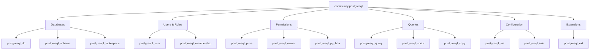

# How to Use the community.postgresql Collection

Author: [nawazdhandala](https://www.github.com/nawazdhandala)

Tags: Ansible, PostgreSQL, Database, DevOps, Automation

Description: Manage PostgreSQL databases, users, permissions, schemas, and extensions using the community.postgresql Ansible collection with working examples.

---

Managing PostgreSQL databases with Ansible gives you repeatable, auditable database administration. The `community.postgresql` collection provides modules for creating databases and users, managing permissions, running queries, configuring replication, and more. Instead of logging into psql and running commands manually, you define the desired state in a playbook and let Ansible make it happen.

## Installation

```bash
# Install the collection
ansible-galaxy collection install community.postgresql

# Install the Python PostgreSQL adapter on target hosts
pip install psycopg2-binary
```

The `psycopg2` library (or `psycopg2-binary`) must be installed on the machine running the PostgreSQL modules. If you are running modules on the database server itself, install it there. If you are delegating to localhost, install it on your control node.

```yaml
# requirements.yml
---
collections:
  - name: community.postgresql
    version: ">=3.2.0"
```

## Database Management

The `postgresql_db` module creates, drops, and manages databases:

```yaml
# manage-databases.yml - Create and configure PostgreSQL databases
---
- name: Manage PostgreSQL databases
  hosts: db_servers
  become: true
  become_user: postgres
  tasks:
    - name: Create application database
      community.postgresql.postgresql_db:
        name: myapp_production
        encoding: UTF-8
        lc_collate: en_US.UTF-8
        lc_ctype: en_US.UTF-8
        template: template0
        state: present

    - name: Create staging database
      community.postgresql.postgresql_db:
        name: myapp_staging
        encoding: UTF-8
        owner: staging_user
        state: present

    - name: Drop old test database
      community.postgresql.postgresql_db:
        name: myapp_test_old
        state: absent

    - name: Create database from a dump file
      community.postgresql.postgresql_db:
        name: myapp_restored
        state: restore
        target: /tmp/myapp_backup.sql
```

## User Management

The `postgresql_user` module handles database user (role) management:

```yaml
# manage-users.yml - Create and configure PostgreSQL users
---
- name: Manage PostgreSQL users
  hosts: db_servers
  become: true
  become_user: postgres
  tasks:
    - name: Create application user
      community.postgresql.postgresql_user:
        name: app_user
        password: "{{ vault_app_db_password }}"
        encrypted: true
        state: present

    - name: Create read-only user
      community.postgresql.postgresql_user:
        name: readonly_user
        password: "{{ vault_readonly_password }}"
        encrypted: true
        role_attr_flags: NOSUPERUSER,NOCREATEDB,NOCREATEROLE
        state: present

    - name: Create replication user
      community.postgresql.postgresql_user:
        name: repl_user
        password: "{{ vault_repl_password }}"
        encrypted: true
        role_attr_flags: REPLICATION,LOGIN
        state: present

    - name: Create admin user with full privileges
      community.postgresql.postgresql_user:
        name: admin_user
        password: "{{ vault_admin_password }}"
        encrypted: true
        role_attr_flags: SUPERUSER
        state: present

    - name: Set connection limit for a user
      community.postgresql.postgresql_user:
        name: app_user
        conn_limit: 50

    - name: Remove deprecated user
      community.postgresql.postgresql_user:
        name: old_user
        state: absent
```

## Permission Management

The `postgresql_privs` module is where the real power lies. It manages fine-grained database permissions:

```yaml
# manage-permissions.yml - Configure database permissions
---
- name: Configure PostgreSQL permissions
  hosts: db_servers
  become: true
  become_user: postgres
  vars:
    app_db: myapp_production
  tasks:
    - name: Grant all privileges on database to app_user
      community.postgresql.postgresql_privs:
        database: "{{ app_db }}"
        type: database
        privs: ALL
        role: app_user
        state: present

    - name: Grant read-only access to all tables in public schema
      community.postgresql.postgresql_privs:
        database: "{{ app_db }}"
        schema: public
        type: table
        objs: ALL_IN_SCHEMA
        privs: SELECT
        role: readonly_user
        state: present

    - name: Grant read-only access to sequences (for serial columns)
      community.postgresql.postgresql_privs:
        database: "{{ app_db }}"
        schema: public
        type: sequence
        objs: ALL_IN_SCHEMA
        privs: SELECT,USAGE
        role: readonly_user
        state: present

    - name: Set default privileges for future tables
      community.postgresql.postgresql_privs:
        database: "{{ app_db }}"
        schema: public
        type: default_privs
        objs: TABLES
        privs: SELECT
        role: readonly_user
        target_roles: app_user
        state: present

    - name: Grant specific table permissions
      community.postgresql.postgresql_privs:
        database: "{{ app_db }}"
        schema: public
        type: table
        objs: users,orders,products
        privs: SELECT,INSERT,UPDATE
        role: app_user
        state: present

    - name: Revoke public access
      community.postgresql.postgresql_privs:
        database: "{{ app_db }}"
        type: database
        privs: ALL
        role: PUBLIC
        state: absent
```

## Running SQL Queries

The `postgresql_query` module lets you run arbitrary SQL:

```yaml
# run-queries.yml - Execute SQL queries
---
- name: Run database queries
  hosts: db_servers
  become: true
  become_user: postgres
  tasks:
    - name: Check database size
      community.postgresql.postgresql_query:
        db: myapp_production
        query: "SELECT pg_size_pretty(pg_database_size('myapp_production')) as db_size"
      register: db_size

    - name: Show database size
      ansible.builtin.debug:
        msg: "Database size: {{ db_size.query_result[0].db_size }}"

    - name: Get table row counts
      community.postgresql.postgresql_query:
        db: myapp_production
        query: |
          SELECT schemaname, relname as table_name,
                 n_live_tup as row_count
          FROM pg_stat_user_tables
          ORDER BY n_live_tup DESC
          LIMIT 10
      register: table_counts

    - name: Display top tables
      ansible.builtin.debug:
        var: table_counts.query_result

    - name: Run parameterized query
      community.postgresql.postgresql_query:
        db: myapp_production
        query: "SELECT * FROM users WHERE created_at > %(date)s LIMIT %(limit)s"
        named_args:
          date: "2024-01-01"
          limit: 10
      register: recent_users

    - name: Run migration script
      community.postgresql.postgresql_query:
        db: myapp_production
        path_to_script: /opt/migrations/002_add_email_index.sql
        as_single_query: false
```

## Schema Management

```yaml
# manage-schemas.yml - Create and configure database schemas
---
- name: Manage database schemas
  hosts: db_servers
  become: true
  become_user: postgres
  tasks:
    - name: Create schemas for multi-tenant app
      community.postgresql.postgresql_schema:
        name: "{{ item }}"
        database: myapp_production
        owner: app_user
        state: present
      loop:
        - tenant_alpha
        - tenant_beta
        - tenant_gamma
        - shared

    - name: Drop deprecated schema
      community.postgresql.postgresql_schema:
        name: old_tenant
        database: myapp_production
        state: absent
        cascade_drop: true
```

## Extension Management

```yaml
# manage-extensions.yml - Install and manage PostgreSQL extensions
---
- name: Manage PostgreSQL extensions
  hosts: db_servers
  become: true
  become_user: postgres
  tasks:
    - name: Install commonly needed extensions
      community.postgresql.postgresql_ext:
        name: "{{ item }}"
        database: myapp_production
        state: present
      loop:
        - pg_stat_statements
        - uuid-ossp
        - pgcrypto
        - hstore
        - pg_trgm
        - citext

    - name: Install PostGIS for spatial data
      community.postgresql.postgresql_ext:
        name: postgis
        database: myapp_production
        state: present

    - name: Update extension to latest version
      community.postgresql.postgresql_ext:
        name: pg_stat_statements
        database: myapp_production
        version: latest
```

## PostgreSQL Configuration

```yaml
# configure-postgres.yml - Set PostgreSQL configuration parameters
---
- name: Configure PostgreSQL server
  hosts: db_servers
  become: true
  become_user: postgres
  tasks:
    - name: Set performance parameters
      community.postgresql.postgresql_set:
        name: "{{ item.name }}"
        value: "{{ item.value }}"
      loop:
        - { name: shared_buffers, value: "2GB" }
        - { name: effective_cache_size, value: "6GB" }
        - { name: work_mem, value: "64MB" }
        - { name: maintenance_work_mem, value: "512MB" }
        - { name: max_connections, value: "200" }
        - { name: wal_buffers, value: "64MB" }
        - { name: checkpoint_completion_target, value: "0.9" }
        - { name: random_page_cost, value: "1.1" }
      notify: restart postgresql

    - name: Configure logging
      community.postgresql.postgresql_set:
        name: "{{ item.name }}"
        value: "{{ item.value }}"
      loop:
        - { name: log_min_duration_statement, value: "1000" }
        - { name: log_checkpoints, value: "on" }
        - { name: log_connections, value: "on" }
        - { name: log_disconnections, value: "on" }
        - { name: log_lock_waits, value: "on" }

    - name: Get current setting value
      community.postgresql.postgresql_info:
        filter:
          - settings
      register: pg_info

  handlers:
    - name: restart postgresql
      ansible.builtin.service:
        name: postgresql
        state: restarted
      become: true
      become_user: root
```

## pg_hba.conf Management

```yaml
# manage-hba.yml - Configure PostgreSQL host-based authentication
---
- name: Configure pg_hba.conf
  hosts: db_servers
  become: true
  become_user: postgres
  tasks:
    - name: Allow local connections
      community.postgresql.postgresql_pg_hba:
        dest: /etc/postgresql/16/main/pg_hba.conf
        contype: local
        databases: all
        users: all
        method: peer

    - name: Allow application servers
      community.postgresql.postgresql_pg_hba:
        dest: /etc/postgresql/16/main/pg_hba.conf
        contype: host
        databases: myapp_production
        users: app_user
        source: 10.0.1.0/24
        method: scram-sha-256

    - name: Allow replication connections
      community.postgresql.postgresql_pg_hba:
        dest: /etc/postgresql/16/main/pg_hba.conf
        contype: host
        databases: replication
        users: repl_user
        source: 10.0.2.0/24
        method: scram-sha-256

    - name: Deny all other connections
      community.postgresql.postgresql_pg_hba:
        dest: /etc/postgresql/16/main/pg_hba.conf
        contype: host
        databases: all
        users: all
        source: 0.0.0.0/0
        method: reject
      notify: reload postgresql

  handlers:
    - name: reload postgresql
      ansible.builtin.service:
        name: postgresql
        state: reloaded
      become: true
      become_user: root
```

## Module Overview



## Conclusion

The `community.postgresql` collection gives you complete database lifecycle management through Ansible. From creating databases and users to fine-grained permission control and server configuration, every aspect of PostgreSQL administration can be codified in playbooks. Make sure `psycopg2-binary` is installed on your target hosts, use `become_user: postgres` for local connections, and keep sensitive passwords in Ansible Vault. The combination of idempotent modules and version-controlled playbooks means your database configuration is always documented and reproducible.
