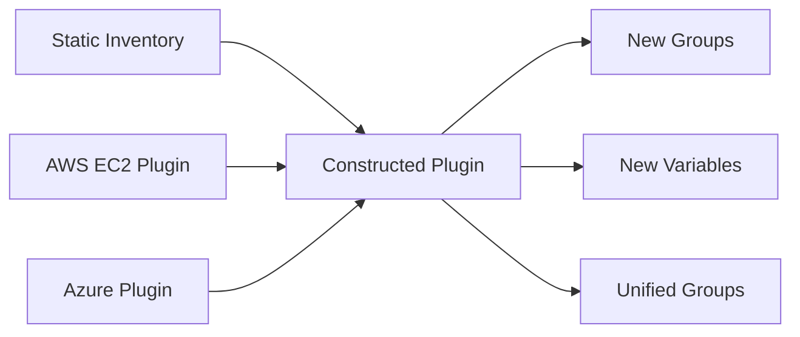

# How to Use the Constructed Inventory Plugin in Ansible

Author: [nawazdhandala](https://www.github.com/nawazdhandala)

Tags: Ansible, Inventory, Constructed Plugin, DevOps, Automation

Description: Learn how to use the Ansible constructed inventory plugin to create dynamic groups, compose variables, and build sophisticated host classifications from existing inventory data.

---

The constructed inventory plugin is one of the most underused tools in Ansible. It does not discover hosts or talk to cloud APIs. Instead, it takes hosts from your existing inventory sources and creates new groups, composes new variables, and builds classifications based on conditions. Think of it as a post-processing layer that sits on top of your other inventories.

## What the Constructed Plugin Does

The constructed plugin runs after all other inventory sources are loaded. It has access to every host and all their variables, and it can:

- Create new groups based on Jinja2 expressions
- Add hosts to groups conditionally
- Compose new variables from existing ones
- Build keyed groups from variable values



## Basic Setup

Create a file ending in `.yml` with `plugin: ansible.builtin.constructed`:

```yaml
# inventory/constructed.yml
# Constructed inventory plugin configuration
plugin: ansible.builtin.constructed
strict: false
```

The `strict: false` setting tells the plugin to skip hosts where an expression fails rather than throwing an error. This is important when not all hosts have the same variables.

Place this file in your inventory directory alongside your other inventory sources:

```
inventory/
  01-static.ini
  02-aws_ec2.yml
  99-constructed.yml    # Runs last (highest alphabetical number)
```

The numeric prefix `99-` ensures the constructed plugin runs after all other sources, so it has access to all hosts and variables.

## Creating Groups from Variables

The `groups` option creates groups based on Jinja2 conditions:

```yaml
# inventory/99-constructed.yml
# Create groups based on host variables
plugin: ansible.builtin.constructed
strict: false

groups:
  # Group all Linux hosts together
  linux_hosts: ansible_os_family is defined and ansible_os_family == 'Debian'

  # Group all hosts with a specific application installed
  has_nginx: "'nginx' in installed_packages | default([])"

  # Group by environment variable
  production: env is defined and env == 'production'
  staging: env is defined and env == 'staging'

  # Group hosts with high memory
  high_memory: ram_gb is defined and ram_gb | int >= 16

  # Group hosts that need patching
  needs_patching: patch_level is defined and patch_level < required_patch_level | default(0)
```

After running, you can target these new groups:

```bash
# List hosts in the dynamically created production group
ansible production -i inventory/ --list-hosts

# Target high-memory servers
ansible high_memory -i inventory/ -m debug -a "var=ram_gb"
```

## Creating Keyed Groups

The `keyed_groups` option creates groups based on variable values, similar to what cloud inventory plugins do:

```yaml
# inventory/99-constructed.yml
# Create keyed groups from variable values
plugin: ansible.builtin.constructed
strict: false

keyed_groups:
  # Group by operating system: os_ubuntu, os_centos, os_debian
  - key: os_type | default('unknown')
    prefix: os
    separator: "_"

  # Group by datacenter: dc_east, dc_west, dc_central
  - key: datacenter | default('unknown')
    prefix: dc
    separator: "_"

  # Group by team ownership: team_platform, team_app, team_data
  - key: team | default('unknown')
    prefix: team
    separator: "_"

  # Group by application tier: tier_web, tier_app, tier_db, tier_cache
  - key: app_tier | default('unknown')
    prefix: tier
    separator: "_"
```

## Composing New Variables

The `compose` option creates new variables from existing ones:

```yaml
# inventory/99-constructed.yml
# Compose new variables from existing data
plugin: ansible.builtin.constructed
strict: false

compose:
  # Create a display name combining hostname and environment
  display_name: inventory_hostname ~ ' (' ~ env | default('unknown') ~ ')'

  # Calculate total storage from disk list
  total_storage_gb: disks | default([]) | map(attribute='size_gb') | sum

  # Generate a monitoring URL
  monitoring_url: "'https://monitor.example.com/host/' ~ inventory_hostname"

  # Set ansible_become based on user
  ansible_become: ansible_user != 'root'

  # Create a backup priority based on server role
  backup_priority: >-
    'critical' if server_role | default('') == 'database'
    else 'high' if server_role | default('') == 'web'
    else 'normal'
```

## Unifying Groups Across Inventory Sources

This is where the constructed plugin really shines. When you combine static and dynamic inventories, hosts from different sources end up in different groups. The constructed plugin unifies them.

```yaml
# inventory/99-constructed.yml
# Unify groups from different inventory sources
plugin: ansible.builtin.constructed
strict: false

groups:
  # Unified web server group (static + AWS + Azure + GCP)
  webservers: >-
    'static_web' in group_names or
    'aws_role_web' in group_names or
    'azure_role_web' in group_names or
    'gcp_role_web' in group_names

  # Unified database group
  databases: >-
    'static_db' in group_names or
    'aws_role_db' in group_names or
    'azure_role_db' in group_names or
    'gcp_role_db' in group_names

  # Unified production group
  production: >-
    'static_production' in group_names or
    'aws_env_production' in group_names or
    'azure_env_production' in group_names or
    'env_production' in group_names

  # All cache servers
  cache_servers: >-
    'redis' in group_names or
    'memcached' in group_names or
    'aws_role_cache' in group_names
```

Now playbooks can target `webservers` and get every web server from every source:

```yaml
# deploy.yml
- hosts: webservers
  become: true
  tasks:
    - name: Deploy app to all web servers regardless of source
      include_role:
        name: webapp
```

## Practical Example: Multi-Cloud Inventory

Here is a complete inventory directory for a multi-cloud setup:

```
inventory/
  01-onprem.ini
  02-aws_ec2.yml
  03-azure_rm.yml
  99-constructed.yml
  group_vars/
    all.yml
    webservers.yml
    databases.yml
    production.yml
```

```ini
# inventory/01-onprem.ini
[onprem_web]
web-dc-01.local ansible_host=192.168.1.10
web-dc-02.local ansible_host=192.168.1.11

[onprem_db]
db-dc-01.local ansible_host=192.168.1.20

[onprem_web:vars]
location=datacenter
provider=onprem

[onprem_db:vars]
location=datacenter
provider=onprem
```

```yaml
# inventory/99-constructed.yml
# Post-processing: create unified groups and variables
plugin: ansible.builtin.constructed
strict: false

# Unified groups across all providers
groups:
  webservers: >-
    'onprem_web' in group_names or
    'aws_role_web' in group_names or
    'azure_role_web' in group_names

  databases: >-
    'onprem_db' in group_names or
    'aws_role_db' in group_names or
    'azure_role_db' in group_names

  production: >-
    'onprem_web' in group_names or
    'onprem_db' in group_names or
    'aws_env_production' in group_names or
    'azure_env_production' in group_names

# Additional classifications
keyed_groups:
  - key: provider | default('unknown')
    prefix: provider
    separator: "_"

# Computed variables
compose:
  provider: >-
    'aws' if 'aws' in (group_names | join(','))
    else 'azure' if 'azure' in (group_names | join(','))
    else 'onprem'

  backup_enabled: "'databases' in group_names or 'webservers' in group_names"
```

## Debugging Constructed Groups

Verify the constructed plugin's output:

```bash
# Show all groups including constructed ones
ansible-inventory -i inventory/ --graph

# Check if a host ended up in the right constructed group
ansible-inventory -i inventory/ --host web-dc-01.local

# List hosts in the unified webservers group
ansible webservers -i inventory/ --list-hosts

# See what variables were composed
ansible web-dc-01.local -i inventory/ -m debug -a "var=hostvars[inventory_hostname]"
```

## Ordering Matters

The constructed plugin needs all other inventory data loaded first. If your files are processed alphabetically:

```
inventory/
  01-static.ini          # Loaded first
  02-aws_ec2.yml         # Loaded second
  03-azure_rm.yml        # Loaded third
  99-constructed.yml     # Loaded last (has access to everything)
```

If you name it without a prefix, make sure it sorts after your other files alphabetically.

## Strict Mode

Setting `strict: true` causes the plugin to fail if any Jinja2 expression encounters an undefined variable. This is useful for catching misconfigurations but can break things when hosts from different sources have different variable sets.

```yaml
# inventory/99-constructed.yml
# Strict mode for catching errors (use in development, not production)
plugin: ansible.builtin.constructed
strict: true

groups:
  # This will fail if any host is missing the 'env' variable
  production: env == 'production'
```

For production, stick with `strict: false` and use `default()` filters in your expressions.

## Wrapping Up

The constructed plugin is the glue that holds multi-source inventories together. It runs after everything else, has access to all hosts and variables, and lets you build unified groups and computed variables that work across your entire infrastructure. If you are combining static and dynamic inventories, the constructed plugin should be the last file in your inventory directory.
