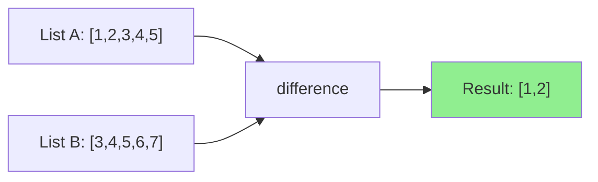

# How to Use the difference Filter in Ansible

Author: [nawazdhandala](https://www.github.com/nawazdhandala)

Tags: Ansible, Filters, Set Operations, Automation, Configuration Management

Description: Learn how to use the difference filter in Ansible to find items present in one list but not another for precise configuration management.

---

Set operations are fundamental to configuration management. You need to know what packages should be removed (present on the system but not in your desired state), which users to delete (exist on the server but not in your approved list), or which firewall rules are outdated. The `difference` filter in Ansible handles exactly this by returning items from the first list that are not in the second list.

Think of it as subtraction for lists. If list A contains `[1, 2, 3, 4, 5]` and list B contains `[3, 4, 5, 6, 7]`, then `A | difference(B)` gives you `[1, 2]`.

## Basic Usage

```yaml
# Find items in list A that are not in list B
- name: Basic difference example
  ansible.builtin.debug:
    msg: "{{ list_a | difference(list_b) }}"
  vars:
    list_a: [1, 2, 3, 4, 5]
    list_b: [3, 4, 5, 6, 7]
```

Output: `[1, 2]`

The order matters. `A | difference(B)` is not the same as `B | difference(A)`:

```yaml
# Order matters - B difference A gives different results
- name: Reverse difference
  ansible.builtin.debug:
    msg: "{{ list_b | difference(list_a) }}"
  vars:
    list_a: [1, 2, 3, 4, 5]
    list_b: [3, 4, 5, 6, 7]
```

Output: `[6, 7]`

## Practical Example: Removing Unwanted Packages

One of the most useful applications is ensuring only approved packages are installed:

```yaml
# Remove packages that are installed but not in the approved list
- name: Get list of installed packages
  ansible.builtin.shell: dpkg --get-selections | awk '{print $1}'
  register: installed_raw
  changed_when: false

- name: Calculate packages to remove
  ansible.builtin.set_fact:
    packages_to_remove: "{{ installed_raw.stdout_lines | difference(approved_packages) }}"
  vars:
    approved_packages:
      - nginx
      - curl
      - git
      - vim
      - openssh-server
      - python3

- name: Remove unauthorized packages
  ansible.builtin.apt:
    name: "{{ item }}"
    state: absent
    purge: true
  loop: "{{ packages_to_remove }}"
  when: packages_to_remove | length > 0
```

This approach lets you enforce a whitelist of packages. Anything installed that is not on the approved list gets flagged for removal.

## Managing User Accounts

A classic scenario is keeping system users in sync with your approved list:

```yaml
# Ensure only approved users exist on the system
- name: Get current system users (UID >= 1000)
  ansible.builtin.shell: |
    awk -F: '$3 >= 1000 && $3 < 65000 {print $1}' /etc/passwd
  register: current_users_raw
  changed_when: false

- name: Determine users to remove
  ansible.builtin.set_fact:
    users_to_remove: "{{ current_users_raw.stdout_lines | difference(approved_users) }}"
  vars:
    approved_users:
      - alice
      - bob
      - charlie
      - deploy

- name: Remove unauthorized users
  ansible.builtin.user:
    name: "{{ item }}"
    state: absent
    remove: true
  loop: "{{ users_to_remove }}"

- name: Report removed users
  ansible.builtin.debug:
    msg: "Removed {{ users_to_remove | length }} unauthorized users: {{ users_to_remove | join(', ') }}"
  when: users_to_remove | length > 0
```

## Firewall Rule Cleanup

When you want to remove old firewall rules that are no longer needed:

```yaml
# Clean up stale firewall rules
- name: Define desired and current rules
  ansible.builtin.set_fact:
    desired_ports: [22, 80, 443, 8080]
    current_ports: [22, 80, 443, 3306, 5432, 8080, 9090]

- name: Identify ports to close
  ansible.builtin.debug:
    msg: "Ports to close: {{ current_ports | difference(desired_ports) }}"

- name: Identify ports to open
  ansible.builtin.debug:
    msg: "Ports to open: {{ desired_ports | difference(current_ports) }}"

- name: Close stale firewall ports
  community.general.ufw:
    rule: deny
    port: "{{ item }}"
    proto: tcp
  loop: "{{ current_ports | difference(desired_ports) }}"

- name: Ensure desired ports are open
  community.general.ufw:
    rule: allow
    port: "{{ item }}"
    proto: tcp
  loop: "{{ desired_ports | difference(current_ports) }}"
```

This two-way difference check gives you a complete picture: which ports need to be closed and which need to be opened.

## Using difference in Templates

The difference filter works inside Jinja2 templates as well:

```jinja2
{# templates/cleanup_report.txt.j2 - Report what needs to be cleaned up #}
Configuration Drift Report
===========================
Generated: {{ ansible_date_time.iso8601 }}
Host: {{ inventory_hostname }}

Unauthorized Packages (to remove):

  - {{ pkg }}


Missing Packages (to install):

  - {{ pkg }}


Compliant Packages:

  - {{ pkg }}

```

## Comparing Configuration States

You can use difference to detect configuration drift:

```yaml
# Detect drift between desired and actual cron jobs
- name: Get current cron jobs
  ansible.builtin.shell: crontab -l 2>/dev/null | grep -v '^#' | grep -v '^$'
  register: current_crons
  changed_when: false
  failed_when: false

- name: Check for unexpected cron jobs
  ansible.builtin.debug:
    msg: >
      Found {{ (current_crons.stdout_lines | difference(desired_crons)) | length }}
      unexpected cron jobs:
      {{ current_crons.stdout_lines | difference(desired_crons) }}
  vars:
    desired_crons:
      - "0 2 * * * /usr/local/bin/backup.sh"
      - "*/5 * * * * /usr/local/bin/health-check.sh"
      - "0 0 * * 0 /usr/local/bin/weekly-cleanup.sh"
```

## Difference with Complex Data

For lists of dictionaries, difference compares entire objects. If you need to compare by a specific attribute, extract that attribute first:

```yaml
# Compare server lists by hostname only
- name: Find servers to decommission
  ansible.builtin.debug:
    msg: "Servers to decommission: {{ current_names | difference(desired_names) }}"
  vars:
    current_servers:
      - name: web01
        ip: 10.0.1.10
      - name: web02
        ip: 10.0.1.11
      - name: db01
        ip: 10.0.2.10
      - name: legacy01
        ip: 10.0.3.10
    desired_servers:
      - name: web01
        ip: 10.0.1.10
      - name: web02
        ip: 10.0.1.11
      - name: db01
        ip: 10.0.2.10
    current_names: "{{ current_servers | map(attribute='name') | list }}"
    desired_names: "{{ desired_servers | map(attribute='name') | list }}"
```

Output: `Servers to decommission: ['legacy01']`

## Building Conditional Logic

Difference is useful for conditional task execution:

```yaml
# Only run migration tasks if there are schema changes to apply
- name: Get applied migrations
  ansible.builtin.shell: ls /var/app/migrations/applied/
  register: applied_migrations
  changed_when: false

- name: Get available migrations
  ansible.builtin.shell: ls /var/app/migrations/available/
  register: available_migrations
  changed_when: false

- name: Apply pending migrations
  ansible.builtin.command: "/var/app/migrate.sh {{ item }}"
  loop: "{{ available_migrations.stdout_lines | difference(applied_migrations.stdout_lines) | sort }}"
  when: (available_migrations.stdout_lines | difference(applied_migrations.stdout_lines)) | length > 0
```

## Chaining with Other Set Filters

Difference works well with other set operation filters:

```yaml
# Complex set operations for role-based access control
- name: Calculate effective permissions
  ansible.builtin.debug:
    msg: |
      Granted permissions: {{ (base_perms + role_perms) | unique | difference(denied_perms) | sort }}
  vars:
    base_perms: [read, list, browse]
    role_perms: [read, write, execute, delete]
    denied_perms: [delete, execute]
```

Output: `Granted permissions: ['browse', 'list', 'read', 'write']`

## Visualizing Difference

Here is a diagram showing how the difference filter works:



## Summary

The difference filter is your go-to tool for identifying what is in one list but not another. Use it for cleanup tasks (finding things to remove), drift detection (spotting unauthorized changes), and synchronization (keeping desired state and actual state aligned). Remember that order matters and that it compares complete objects for dictionaries. Pair it with `intersect` and `union` for a full set of operations that cover virtually any list comparison scenario in your automation workflows.
