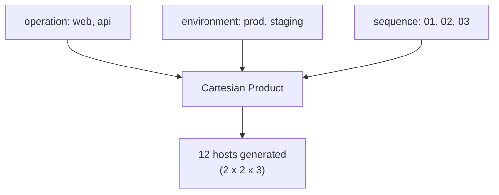

# How to Use the Generator Inventory Plugin in Ansible

Author: [nawazdhandala](https://www.github.com/nawazdhandala)

Tags: Ansible, Inventory Plugin, Generator, Testing, Automation

Description: Learn how to use the Ansible generator inventory plugin to create large inventories from patterns for testing and development.

---

The `generator` inventory plugin in Ansible lets you create inventories programmatically from patterns. Instead of listing every host manually, you define a naming pattern and the plugin generates all the combinations. This is particularly useful for testing playbooks against large inventories, creating lab environments, or building inventories that follow strict naming conventions.

## What the Generator Plugin Does

The generator plugin takes a pattern template with layers and produces hosts by expanding all possible combinations. Think of it like a nested loop: you define multiple layers (like data centers, environments, and host numbers), and the plugin generates every valid combination as a host entry.

For example, if you have 3 data centers, 2 environments, and 5 servers per combination, the generator creates 30 host entries without you typing each one.

## Enabling the Plugin

The generator plugin ships with Ansible but is not enabled by default. You need to enable it in your `ansible.cfg`:

```ini
# ansible.cfg
[inventory]
# Enable the generator plugin alongside the default ones
enable_plugins = ansible.builtin.generator, ansible.builtin.yaml, ansible.builtin.ini
```

## Basic Generator Configuration

Create a generator inventory file with the `.yml` extension. The file must start with `plugin: ansible.builtin.generator`:

```yaml
# inventory/generator.yml
# Generate a simple set of web server hostnames
plugin: ansible.builtin.generator
strict: false
hosts:
  name: "{{ operation }}-{{ environment }}-web{{ sequence }}.example.com"
  parents:
    - name: "{{ operation }}-{{ environment }}"
      parents:
        - name: "{{ operation }}"
          vars:
            operation: "{{ operation }}"
        - name: "{{ environment }}"
          vars:
            environment: "{{ environment }}"
layers:
  operation:
    - web
    - api
  environment:
    - prod
    - staging
  sequence:
    - "01"
    - "02"
    - "03"
```

This generates the following hosts:

```
web-prod-web01.example.com
web-prod-web02.example.com
web-prod-web03.example.com
web-staging-web01.example.com
web-staging-web02.example.com
web-staging-web03.example.com
api-prod-web01.example.com
api-prod-web02.example.com
api-prod-web03.example.com
api-staging-web01.example.com
api-staging-web02.example.com
api-staging-web03.example.com
```

## Understanding the Structure

The generator config has three main sections:

**hosts**: Defines the hostname pattern and parent group hierarchy. The `name` field uses Jinja2 templates with layer variables.

**parents**: Defines group assignments. Each host gets placed into groups based on the layer values. The nesting creates parent-child group relationships.

**layers**: Defines the variables and their possible values. Each layer is like a dimension, and the plugin generates the Cartesian product of all layer values.

Here is how the layers combine:



## Adding Host Variables

You can attach variables at any level of the group hierarchy:

```yaml
# inventory/generator-with-vars.yml
plugin: ansible.builtin.generator
strict: false
hosts:
  name: "{{ region }}-{{ role }}-{{ num }}.infra.example.com"
  parents:
    - name: "{{ role }}"
      vars:
        server_role: "{{ role }}"
    - name: "{{ region }}"
      vars:
        aws_region: "{{ region }}"
        # Set variables based on region
layers:
  region:
    - us-east-1
    - eu-west-1
  role:
    - frontend
    - backend
    - worker
  num:
    - "01"
    - "02"
```

With this configuration, a host like `us-east-1-frontend-01.infra.example.com` will belong to both the `frontend` and `us-east-1` groups, inheriting variables from each.

## Verifying Generated Inventory

Use the `ansible-inventory` command to see what the generator produces:

```bash
# Show the generated inventory as a tree
ansible-inventory -i inventory/generator.yml --graph

# Show the full inventory with all variables as JSON
ansible-inventory -i inventory/generator.yml --list

# Check variables for a specific generated host
ansible-inventory -i inventory/generator.yml --host us-east-1-frontend-01.infra.example.com
```

The `--graph` output will show you the group hierarchy:

```
@all:
  |--@ungrouped:
  |--@frontend:
  |  |--us-east-1-frontend-01.infra.example.com
  |  |--us-east-1-frontend-02.infra.example.com
  |  |--eu-west-1-frontend-01.infra.example.com
  |  |--eu-west-1-frontend-02.infra.example.com
  |--@backend:
  |  |--us-east-1-backend-01.infra.example.com
  |  |--...
  |--@us-east-1:
  |  |--us-east-1-frontend-01.infra.example.com
  |  |--us-east-1-backend-01.infra.example.com
  |  |--...
  |--@eu-west-1:
  |  |--eu-west-1-frontend-01.infra.example.com
  |  |--...
```

## Real-World Use Case: Testing at Scale

One of the best uses for the generator plugin is creating large test inventories. Suppose you want to test how your playbooks perform with 1000 hosts:

```yaml
# inventory/test-scale.yml
# Generate 1000 hosts for scale testing
plugin: ansible.builtin.generator
strict: false
hosts:
  name: "test-{{ dc }}-{{ tier }}-{{ seq }}"
  parents:
    - name: "{{ tier }}"
    - name: "{{ dc }}"
layers:
  dc:
    - dc1
    - dc2
    - dc3
    - dc4
    - dc5
  tier:
    - web
    - app
    - db
    - cache
  seq:
    - "001"
    - "002"
    - "003"
    - "004"
    - "005"
    - "006"
    - "007"
    - "008"
    - "009"
    - "010"
    - "011"
    - "012"
    - "013"
    - "014"
    - "015"
    - "016"
    - "017"
    - "018"
    - "019"
    - "020"
    - "021"
    - "022"
    - "023"
    - "024"
    - "025"
    - "026"
    - "027"
    - "028"
    - "029"
    - "030"
    - "031"
    - "032"
    - "033"
    - "034"
    - "035"
    - "036"
    - "037"
    - "038"
    - "039"
    - "040"
    - "041"
    - "042"
    - "043"
    - "044"
    - "045"
    - "046"
    - "047"
    - "048"
    - "049"
    - "050"
```

That gives you 5 x 4 x 50 = 1000 hosts spread across 5 data centers and 4 tiers. You can then test your playbooks with `--check` mode to see how they handle a large inventory.

## Combining Generator with Other Inventory Sources

The generator plugin works alongside other inventory sources. You can combine it with a static inventory:

```ini
# ansible.cfg
[defaults]
inventory = inventory/static.yml,inventory/generator.yml
```

Or pass multiple inventories on the command line:

```bash
# Merge generated inventory with a real static inventory
ansible-playbook -i inventory/static.yml -i inventory/generator.yml site.yml
```

## Generator for Lab and Dev Environments

The generator is great for spinning up consistent lab environments. Here is a configuration that mirrors a production layout but with fewer hosts:

```yaml
# inventory/lab-generator.yml
plugin: ansible.builtin.generator
strict: false
hosts:
  name: "lab-{{ service }}-{{ instance }}.dev.internal"
  parents:
    - name: "lab_{{ service }}"
      vars:
        ansible_host: "127.0.0.1"
        ansible_connection: "local"
        service_name: "{{ service }}"
    - name: "lab_all"
layers:
  service:
    - nginx
    - postgres
    - redis
    - rabbitmq
    - elasticsearch
  instance:
    - "a"
    - "b"
```

Setting `ansible_connection: local` and `ansible_host: 127.0.0.1` means you can run playbooks in check mode without needing actual remote hosts. This lets you validate your playbook logic against a realistic inventory structure.

## Limitations to Keep in Mind

The generator plugin has some constraints worth knowing about:

You cannot use conditional logic within the layers. Every combination of layer values produces a host. If you need to skip certain combinations, you will need to use `--limit` when running playbooks or create a custom inventory plugin.

The layer values must be strings. You cannot generate numeric ranges directly; instead, you list out each value (like "01", "02", etc.).

The plugin generates host names but does not create actual infrastructure. It is purely an inventory generation tool. For actually provisioning the machines, you would pair it with a tool like Terraform or a cloud provisioning playbook.

The generator plugin fills a useful niche in the Ansible inventory ecosystem. It is not something you will use every day, but when you need to create large, patterned inventories for testing or when your infrastructure follows strict naming conventions, it saves a lot of manual work. Start with a simple two-layer configuration, verify the output with `ansible-inventory --graph`, and expand from there.
