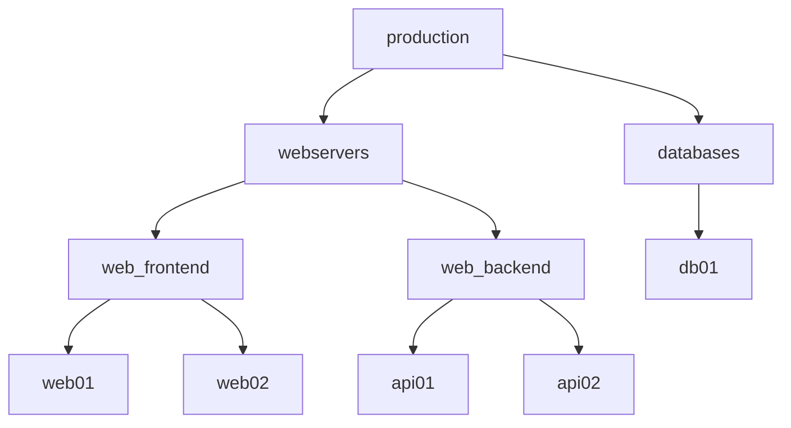

# How to Use the ini Inventory Plugin Options in Ansible

Author: [nawazdhandala](https://www.github.com/nawazdhandala)

Tags: Ansible, Inventory, INI, Configuration, Best Practices

Description: Learn how to use all the options and features of the Ansible INI inventory plugin for static inventory files, including groups, variables, and ranges.

---

The INI format is the original Ansible inventory format and remains the most commonly used for static inventories. While it looks simple on the surface, the INI inventory plugin has a lot of features and options that many people never discover. This post is a comprehensive guide to everything the INI format supports.

## Basic INI Structure

At its simplest, an INI inventory file is a list of hostnames organized into groups:

```ini
# inventory/hosts.ini
# Ungrouped hosts (appear before any group header)
mail.example.com

# Groups start with a [group_name] header
[webservers]
web01.example.com
web02.example.com
web03.example.com

[databases]
db01.example.com
db02.example.com
```

Lines starting with `#` or `;` are comments. Blank lines are ignored.

## Host Variables Inline

You can assign variables to individual hosts on the same line:

```ini
[webservers]
# Set connection and application variables per host
web01.example.com ansible_host=10.0.1.10 ansible_port=22 http_port=80
web02.example.com ansible_host=10.0.1.11 ansible_port=22 http_port=8080
web03.example.com ansible_host=10.0.1.12 ansible_port=2222 http_port=80
```

Values can be strings, numbers, or booleans. For values containing spaces, quote them:

```ini
[webservers]
web01 ansible_host=10.0.1.10 server_description="Primary web server" tags="web,production"
```

## Group Variables

The `:vars` suffix defines variables that apply to all hosts in a group:

```ini
[webservers]
web01 ansible_host=10.0.1.10
web02 ansible_host=10.0.1.11
web03 ansible_host=10.0.1.12

[webservers:vars]
# These variables apply to all hosts in the webservers group
ansible_user=deploy
ansible_port=22
http_port=80
ssl_enabled=true
max_connections=1000
```

## Child Groups with :children

The `:children` suffix creates group hierarchies. A parent group contains all hosts from its child groups:

```ini
[web_frontend]
web01 ansible_host=10.0.1.10
web02 ansible_host=10.0.1.11

[web_backend]
api01 ansible_host=10.0.2.20
api02 ansible_host=10.0.2.21

[databases]
db01 ansible_host=10.0.3.30

# Parent group that includes all web-related groups
[webservers:children]
web_frontend
web_backend

# Top-level group that includes everything
[production:children]
webservers
databases

[production:vars]
environment=production
monitoring_enabled=true
```

The hierarchy looks like this:



Variables from parent groups are inherited by all hosts in child groups. If the same variable is defined at multiple levels, the most specific (closest to the host) wins.

## Numeric Ranges

The INI format supports numeric ranges with the `[start:end]` syntax:

```ini
[webservers]
# Generates web01 through web20
web[01:20].example.com

[databases]
# Generates db1 through db5 (no zero-padding)
db[1:5].example.com

[cache_servers]
# Generates cache001 through cache050 (zero-padded to 3 digits)
cache[001:050].example.com
```

The zero-padding is determined by the format of the start number. `[01:20]` produces `01, 02, ... 20`. `[1:20]` produces `1, 2, ... 20`.

## Alphabetic Ranges

You can also use alphabetic ranges:

```ini
[load_balancers]
# Generates lb-a through lb-f
lb-[a:f].example.com

[racks]
# Generates rack-A through rack-H
rack-[A:H]-server01.example.com
```

## Multiple Ranges in One Pattern

Combine multiple ranges in a single hostname pattern:

```ini
[datacenter_servers]
# Generates dc1-web01, dc1-web02, ..., dc3-web05 (15 hosts total)
dc[1:3]-web[01:05].example.com
```

## Host Aliases

Use a short alias followed by `ansible_host` to give hosts friendly names:

```ini
[webservers]
# Short alias on the left, actual connection info on the right
primary   ansible_host=10.0.1.10 ansible_port=22
secondary ansible_host=10.0.1.11 ansible_port=22
canary    ansible_host=10.0.1.12 ansible_port=2222
```

In playbooks and commands, you reference these hosts by their alias (`primary`, `secondary`, `canary`).

## A Host in Multiple Groups

A host can belong to multiple groups. Just list it under each group:

```ini
[webservers]
server01 ansible_host=10.0.1.10

[monitoring]
server01

[production]
server01
```

`server01` is now a member of `webservers`, `monitoring`, and `production`. Its variables from all three groups are merged.

## Variable Types in INI Format

The INI format has some quirks with variable types that are worth knowing:

```ini
[servers:vars]
# Strings
server_name=myserver

# Numbers are parsed as strings in INI format
http_port=80
# In playbooks, you may need to use {{ http_port | int }} for arithmetic

# Booleans
ssl_enabled=true
debug_mode=false
# These are actually strings "true" and "false" in INI format
# YAML format handles types better

# Lists and dicts as JSON strings
allowed_ips=["10.0.0.1", "10.0.0.2"]
server_config={"workers": 4, "timeout": 30}
```

This is one area where the YAML format is genuinely better. In YAML, numbers are numbers, booleans are booleans, and lists are lists. In INI format, everything is a string, and Ansible does its best to interpret types.

## The all Group

The special `[all:vars]` section sets variables for every host in the inventory:

```ini
[all:vars]
# These apply to every host, regardless of group
ansible_python_interpreter=/usr/bin/python3
ntp_server=ntp.example.com
dns_servers=["10.0.0.53", "10.0.0.54"]
```

## Complex Variable Structures

For complex data structures, the INI format supports JSON-encoded values:

```ini
[webservers:vars]
# JSON list
upstream_servers=["10.0.2.20:8080", "10.0.2.21:8080"]

# JSON dictionary
ssl_config={"cert_path": "/etc/ssl/cert.pem", "key_path": "/etc/ssl/key.pem", "protocols": ["TLSv1.2", "TLSv1.3"]}
```

However, complex structures like these are much easier to read and maintain in `group_vars` YAML files. Keep the INI file for simple host and group definitions, and move complex variables to `group_vars/`:

```
inventory/
  hosts.ini
  group_vars/
    webservers.yml    # Complex variables go here
  host_vars/
    web01.yml         # Per-host overrides
```

## Connection-Related Variables

The INI format supports all standard Ansible connection variables:

```ini
[linux_servers]
server01 ansible_host=10.0.1.10 ansible_user=admin ansible_port=22 ansible_ssh_private_key_file=~/.ssh/server01.pem

[windows_servers]
win01 ansible_host=10.0.4.40 ansible_user=Administrator ansible_password=P@ssw0rd ansible_connection=winrm ansible_winrm_transport=ntlm

[network_devices]
switch01 ansible_host=10.0.5.50 ansible_user=netadmin ansible_connection=ansible.netcommon.network_cli ansible_network_os=cisco.ios.ios

[local_tasks]
localhost ansible_connection=local
```

## INI Plugin Options in ansible.cfg

The INI inventory plugin itself has configuration options you can set in `ansible.cfg`:

```ini
# ansible.cfg
[inventory]
# Enable the INI plugin
enable_plugins = ansible.builtin.ini, ansible.builtin.yaml

# Make Ansible fail if an inventory file has syntax errors
any_unparsed_is_failed = true
```

The `any_unparsed_is_failed` setting is important. By default, if Ansible cannot parse a line in an INI inventory, it silently skips it. Setting this to `true` makes it an error, which helps catch typos.

## Practical Full Example

Here is a complete real-world INI inventory:

```ini
# inventory/production.ini
# Production environment inventory

# =====================
# Bastion / Jump Hosts
# =====================
[bastion]
jump01.example.com ansible_user=admin

# =====================
# Web Tier
# =====================
[web_frontend]
web[01:04].example.com

[web_frontend:vars]
ansible_user=www
http_port=80
https_port=443

[web_api]
api[01:03].example.com

[web_api:vars]
ansible_user=api
api_port=8080

# =====================
# Application Tier
# =====================
[app_workers]
worker[01:08].example.com

[app_workers:vars]
ansible_user=worker
worker_concurrency=4

[app_scheduler]
scheduler01.example.com ansible_user=scheduler

# =====================
# Data Tier
# =====================
[databases]
db-primary.example.com ansible_user=dbadmin db_role=primary
db-replica[01:02].example.com ansible_user=dbadmin db_role=replica

[cache]
redis[01:03].example.com ansible_user=redis

[search]
elastic[01:03].example.com ansible_user=elastic

# =====================
# Group Hierarchies
# =====================
[webservers:children]
web_frontend
web_api

[appservers:children]
app_workers
app_scheduler

[dataservers:children]
databases
cache
search

[all_servers:children]
bastion
webservers
appservers
dataservers

# =====================
# Cross-cutting Groups
# =====================
[monitored:children]
webservers
appservers
dataservers

[backed_up:children]
databases
app_workers

# =====================
# Global Variables
# =====================
[all:vars]
ansible_python_interpreter=/usr/bin/python3
environment=production
domain=example.com
ntp_server=ntp.example.com
monitoring_endpoint=https://monitoring.example.com

[webservers:vars]
ansible_ssh_common_args=-o ProxyJump=admin@jump01.example.com

[appservers:vars]
ansible_ssh_common_args=-o ProxyJump=admin@jump01.example.com

[dataservers:vars]
ansible_ssh_common_args=-o ProxyJump=admin@jump01.example.com
```

## When to Use INI vs YAML

The INI format works best when:
- Your inventory is simple (flat structure, few variables)
- You want something that is quick to read and edit
- Your team is familiar with INI-style configuration files
- You use `group_vars` and `host_vars` for complex variables

Switch to YAML when:
- You need complex data structures (nested dicts, lists of dicts)
- Variable types matter (numbers, booleans, lists)
- The group hierarchy is deeply nested
- You want a single file with everything (no separate group_vars)

Both formats are first-class citizens in Ansible. The INI format's simplicity is its strength for straightforward inventories, while its limitations with data types and complex structures are easily addressed by pairing it with `group_vars` YAML files.
