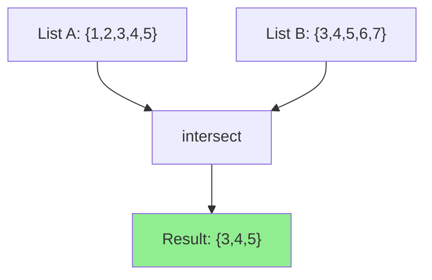

# How to Use the intersect Filter in Ansible

Author: [nawazdhandala](https://www.github.com/nawazdhandala)

Tags: Ansible, Filters, Set Operations, Automation, DevOps

Description: Learn how to use the intersect filter in Ansible to find common elements between two lists for access control and compliance checks.

---

When managing infrastructure, you frequently need to find what two lists have in common. Which packages are both installed and approved? Which users exist in both the local system and the LDAP directory? Which servers belong to both the "webservers" and "monitoring" groups? The `intersect` filter in Ansible answers these questions by returning only the items that appear in both lists.

If you know set theory, this is the intersection operation. Given two sets, you get back only the elements they share.

## Basic Usage

```yaml
# Find common elements between two lists
- name: Basic intersection
  ansible.builtin.debug:
    msg: "{{ list_a | intersect(list_b) }}"
  vars:
    list_a: [1, 2, 3, 4, 5]
    list_b: [3, 4, 5, 6, 7]
```

Output: `[3, 4, 5]`

Unlike `difference`, the `intersect` filter is commutative. `A | intersect(B)` gives the same result as `B | intersect(A)`.

## Practical Example: Compliance Checking

One of the most valuable uses of intersect is verifying compliance. You can check which required packages are actually installed:

```yaml
# Check compliance: which required packages are already installed
- name: Get installed packages
  ansible.builtin.shell: dpkg --get-selections | awk '{print $1}'
  register: installed_raw
  changed_when: false

- name: Check compliance status
  ansible.builtin.set_fact:
    compliant_packages: "{{ required_packages | intersect(installed_raw.stdout_lines) }}"
    missing_packages: "{{ required_packages | difference(installed_raw.stdout_lines) }}"
  vars:
    required_packages:
      - auditd
      - fail2ban
      - ufw
      - unattended-upgrades
      - clamav

- name: Report compliance
  ansible.builtin.debug:
    msg: |
      Compliance Report:
      Installed (compliant): {{ compliant_packages | join(', ') }}
      Missing (non-compliant): {{ missing_packages | join(', ') }}
      Score: {{ compliant_packages | length }}/{{ required_packages | length }}
```

## Access Control with intersect

You can use intersect to determine effective permissions based on role overlap:

```yaml
# Determine effective access by intersecting user roles with required roles
- name: Check if user has access
  ansible.builtin.debug:
    msg: >
      User {{ username }} {{ 'HAS' if matching_roles | length > 0 else 'DOES NOT HAVE' }}
      access. Matching roles: {{ matching_roles | join(', ') }}
  vars:
    username: alice
    user_roles:
      - developer
      - deployer
      - viewer
    required_roles:
      - admin
      - deployer
      - operator
    matching_roles: "{{ user_roles | intersect(required_roles) }}"
```

Output: `User alice HAS access. Matching roles: deployer`

## Multi-Group Host Selection

If you need to find hosts that belong to multiple inventory groups:

```yaml
# Find hosts that are in both webservers and monitored groups
- name: Identify monitored web servers
  ansible.builtin.debug:
    msg: "Monitored web servers: {{ groups['webservers'] | intersect(groups['monitored']) }}"

- name: Run tasks only on monitored web servers
  ansible.builtin.command: /usr/local/bin/check_health.sh
  delegate_to: "{{ item }}"
  loop: "{{ groups['webservers'] | intersect(groups['monitored']) }}"
```

## Feature Flag Validation

Intersect can validate that requested features are actually available:

```yaml
# Validate requested features against available ones
- name: Enable only valid features
  ansible.builtin.template:
    src: templates/app_config.j2
    dest: /etc/myapp/config.yml
  vars:
    available_features:
      - caching
      - rate_limiting
      - websockets
      - clustering
      - metrics
      - tracing
    requested_features:
      - caching
      - rate_limiting
      - dark_mode
      - websockets
      - auto_scaling
    enabled_features: "{{ requested_features | intersect(available_features) }}"
    invalid_features: "{{ requested_features | difference(available_features) }}"

- name: Warn about invalid features
  ansible.builtin.debug:
    msg: "WARNING: These requested features do not exist: {{ invalid_features | join(', ') }}"
  when: invalid_features | length > 0
```

The template:

```jinja2
{# templates/app_config.j2 - Only enable validated features #}
# Application Configuration - Managed by Ansible
app:
  features:

    {{ feature }}: true


    {{ feature }}: false

```

## Using intersect in Templates

```jinja2
{# templates/shared_services.conf.j2 - Configure services that both teams need #}
# Shared services between frontend and backend teams


[shared_services]

{{ service }}.enabled = true
{{ service }}.shared = true



[frontend_only]

{{ service }}.enabled = true
{{ service }}.team = frontend


[backend_only]

{{ service }}.enabled = true
{{ service }}.team = backend

```

## Network Security: Common Subnets

Finding overlapping network access between security zones:

```yaml
# Find subnets that have access to both DMZ and internal networks
- name: Identify subnets with cross-zone access
  ansible.builtin.debug:
    msg: |
      Subnets with DMZ access: {{ dmz_allowed }}
      Subnets with internal access: {{ internal_allowed }}
      Cross-zone subnets (review needed): {{ cross_zone }}
  vars:
    dmz_allowed:
      - 10.0.1.0/24
      - 10.0.2.0/24
      - 192.168.1.0/24
    internal_allowed:
      - 10.0.2.0/24
      - 10.0.3.0/24
      - 192.168.1.0/24
    cross_zone: "{{ dmz_allowed | intersect(internal_allowed) }}"
```

## Building Audit Reports

Combine intersect with other filters for comprehensive audit reports:

```yaml
# Generate a security audit report
- name: Collect audit data
  ansible.builtin.set_fact:
    open_ports: [22, 80, 443, 3306, 5432, 8080, 9090]
    approved_ports: [22, 80, 443, 8080]
    sensitive_ports: [3306, 5432, 6379, 27017]

- name: Generate audit findings
  ansible.builtin.debug:
    msg: |
      === Port Audit Report ===
      Approved and open: {{ open_ports | intersect(approved_ports) | sort }}
      Open but not approved: {{ open_ports | difference(approved_ports) | sort }}
      Sensitive ports exposed: {{ open_ports | intersect(sensitive_ports) | sort }}
      Critical finding: {{ 'YES' if (open_ports | intersect(sensitive_ports) | length > 0) else 'NO' }}
```

## Visualizing intersect



## Comparing Inventory States

Use intersect to find hosts that are in both your old and new inventory, indicating hosts that are stable (not being added or removed):

```yaml
# Find stable hosts during a migration
- name: Identify migration status
  ansible.builtin.debug:
    msg: |
      Stable hosts (no change): {{ old_inventory | intersect(new_inventory) | sort }}
      Being decommissioned: {{ old_inventory | difference(new_inventory) | sort }}
      Being provisioned: {{ new_inventory | difference(old_inventory) | sort }}
  vars:
    old_inventory:
      - web01
      - web02
      - db01
      - cache01
    new_inventory:
      - web01
      - web02
      - web03
      - db01
      - db02
```

## Conditional Execution Based on intersect

You can use intersect in `when` conditions:

```yaml
# Only run task if the host has any of the required tags
- name: Apply security hardening
  ansible.builtin.include_role:
    name: security_hardening
  when: (host_tags | intersect(security_required_tags)) | length > 0
  vars:
    host_tags: "{{ hostvars[inventory_hostname].tags | default([]) }}"
    security_required_tags:
      - production
      - pci
      - hipaa
```

## Summary

The intersect filter finds the common ground between two lists. It is invaluable for compliance checking (what required items are present), access control (what roles does a user share with the requirement), audit reporting (what sensitive resources are exposed), and migration planning (what stays the same between old and new states). Combine it with `difference` for a complete picture of what is shared, what is only in A, and what is only in B. Together, these set operation filters give you precise control over list comparisons throughout your Ansible automation.
