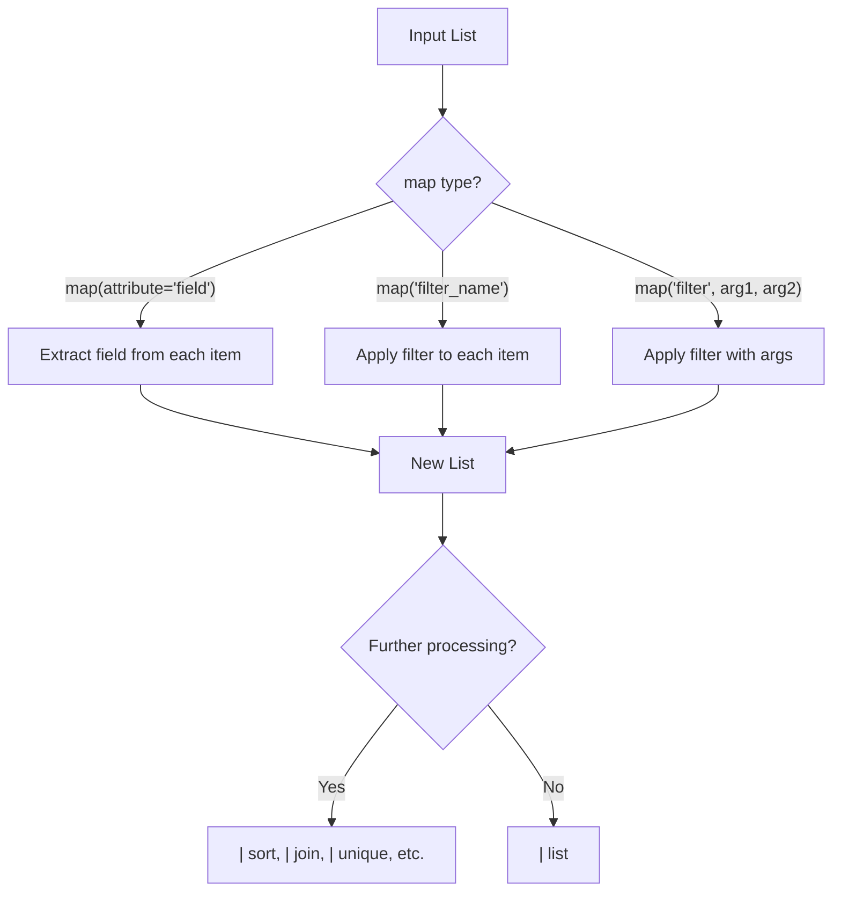

# How to Use the map Filter for Data Transformation in Ansible

Author: [nawazdhandala](https://www.github.com/nawazdhandala)

Tags: Ansible, Filters, Jinja2, Data Transformation

Description: Learn how to use the Ansible map filter to transform lists by extracting attributes, applying filters, and performing bulk operations on collection elements.

---

The `map` filter is one of the most versatile tools in Ansible's data manipulation toolkit. It applies a function or extracts an attribute across every element in a list, producing a new list of transformed values. If you are familiar with `map()` in Python or JavaScript, the concept is the same.

## Extracting Attributes from a List of Dictionaries

The most common use of `map` is extracting a single field from a list of objects:

```yaml
# playbook-extract-attr.yml
# Extracts the hostname field from a list of server objects
- name: Extract attributes with map
  hosts: localhost
  gather_facts: false
  vars:
    servers:
      - hostname: web-01
        ip: 10.0.1.10
        role: webserver
      - hostname: db-01
        ip: 10.0.2.10
        role: database
      - hostname: cache-01
        ip: 10.0.3.10
        role: cache

  tasks:
    - name: Get all hostnames
      ansible.builtin.debug:
        msg: "{{ servers | map(attribute='hostname') | list }}"

    - name: Get all IPs
      ansible.builtin.debug:
        msg: "{{ servers | map(attribute='ip') | list }}"

    - name: Get all roles
      ansible.builtin.debug:
        msg: "{{ servers | map(attribute='role') | list }}"
```

Output for hostnames: `["web-01", "db-01", "cache-01"]`

Always add `| list` at the end. The `map` filter returns a generator, not a list.

## Applying Filters to Every Element

You can use `map` to apply any Jinja2 filter to each element:

```yaml
# playbook-apply-filter.yml
# Applies string transformations to every element in a list
- name: Apply filters with map
  hosts: localhost
  gather_facts: false
  vars:
    hostnames:
      - web-server-01
      - database-primary
      - cache-node-alpha

  tasks:
    - name: Convert all to uppercase
      ansible.builtin.debug:
        msg: "{{ hostnames | map('upper') | list }}"

    - name: Get string lengths
      ansible.builtin.debug:
        msg: "{{ hostnames | map('length') | list }}"

    - name: Replace dashes with underscores
      ansible.builtin.debug:
        msg: "{{ hostnames | map('replace', '-', '_') | list }}"

    - name: Truncate to 10 characters
      ansible.builtin.debug:
        msg: "{{ hostnames | map('truncate', 10, true, '...') | list }}"
```

## Chaining map with Other Filters

The real power comes from chaining `map` with other filters:

```yaml
# playbook-chain-map.yml
# Chains map with selectattr and sort for a multi-step transformation
- name: Chain map with other filters
  hosts: localhost
  gather_facts: false
  vars:
    services:
      - name: nginx
        status: running
        port: 80
      - name: postgresql
        status: stopped
        port: 5432
      - name: redis
        status: running
        port: 6379
      - name: memcached
        status: running
        port: 11211

  tasks:
    - name: Get sorted names of running services
      ansible.builtin.debug:
        msg: >-
          {{ services
             | selectattr('status', 'equalto', 'running')
             | map(attribute='name')
             | sort
             | list }}

    - name: Get ports of running services as strings
      ansible.builtin.debug:
        msg: >-
          {{ services
             | selectattr('status', 'equalto', 'running')
             | map(attribute='port')
             | map('string')
             | list }}

    - name: Build connection strings
      ansible.builtin.debug:
        msg: >-
          {{ services
             | selectattr('status', 'equalto', 'running')
             | map(attribute='name')
             | map('regex_replace', '(.*)', 'connect to \1')
             | list }}
```

## Using map with the regex_replace Filter

A very useful combination for string transformations:

```yaml
# playbook-map-regex.yml
# Uses map with regex_replace to build formatted strings from list elements
- name: Transform strings with map and regex
  hosts: localhost
  gather_facts: false
  vars:
    domain_names:
      - api
      - www
      - admin
      - docs

  tasks:
    - name: Build full domain names
      ansible.builtin.debug:
        msg: "{{ domain_names | map('regex_replace', '^(.*)$', '\\1.example.com') | list }}"

    - name: Build URLs
      ansible.builtin.debug:
        msg: "{{ domain_names | map('regex_replace', '^(.*)$', 'https://\\1.example.com') | list }}"
```

## map with Nested Attributes

You can access nested attributes using dot notation:

```yaml
# playbook-nested-map.yml
# Extracts nested attributes from complex objects using dot notation in map
- name: Map nested attributes
  hosts: localhost
  gather_facts: false
  vars:
    instances:
      - name: web-01
        network:
          private_ip: 10.0.1.10
          public_ip: 54.23.1.5
      - name: web-02
        network:
          private_ip: 10.0.1.11
          public_ip: 54.23.1.6
      - name: web-03
        network:
          private_ip: 10.0.1.12
          public_ip: 54.23.1.7

  tasks:
    - name: Get all private IPs
      ansible.builtin.debug:
        msg: "{{ instances | map(attribute='network.private_ip') | list }}"

    - name: Get all public IPs
      ansible.builtin.debug:
        msg: "{{ instances | map(attribute='network.public_ip') | list }}"
```

## Map Transformation Flow



## Applying Mathematical Operations

Map numeric values through mathematical operations:

```yaml
# playbook-map-math.yml
# Applies mathematical transformations to numeric list elements
- name: Mathematical transformations with map
  hosts: localhost
  gather_facts: false
  vars:
    cpu_percentages:
      - 45
      - 82
      - 23
      - 91
      - 67

  tasks:
    - name: Convert percentages to decimals (using Jinja2)
      ansible.builtin.set_fact:
        decimals: >-
          
          
          
          
          {{ result }}

    - name: Show results
      ansible.builtin.debug:
        var: decimals

    - name: Calculate total and average
      ansible.builtin.debug:
        msg:
          total: "{{ cpu_percentages | sum }}"
          average: "{{ (cpu_percentages | sum) / (cpu_percentages | length) }}"
          max: "{{ cpu_percentages | max }}"
          min: "{{ cpu_percentages | min }}"
```

## Practical Example: Building Configuration Lines

```yaml
# playbook-config-lines.yml
# Uses map to transform a list of allowed networks into firewall config lines
- name: Generate config lines from data
  hosts: localhost
  gather_facts: false
  vars:
    allowed_networks:
      - 10.0.0.0/8
      - 172.16.0.0/12
      - 192.168.0.0/16
    dns_servers:
      - 8.8.8.8
      - 8.8.4.4
      - 1.1.1.1

  tasks:
    - name: Build iptables allow rules
      ansible.builtin.debug:
        msg: >-
          {{ allowed_networks |
             map('regex_replace', '^(.*)$', '-A INPUT -s \\1 -j ACCEPT') |
             list }}

    - name: Build resolv.conf lines
      ansible.builtin.copy:
        content: |
          # Generated by Ansible
          {{ dns_servers | map('regex_replace', '^(.*)$', 'nameserver \\1') | join('\n') }}
        dest: /tmp/resolv.conf

    - name: Build Nginx upstream block
      ansible.builtin.debug:
        msg: >-
          {{ ['10.0.1.10:8080', '10.0.1.11:8080', '10.0.1.12:8080'] |
             map('regex_replace', '^(.*)$', '  server \\1;') |
             join('\n') }}
```

## Using map with dict2items

Transform dictionary entries:

```yaml
# playbook-map-dict.yml
# Converts dictionary items and transforms them using map
- name: Map over dictionary items
  hosts: localhost
  gather_facts: false
  vars:
    environment_vars:
      APP_NAME: myapp
      APP_PORT: "8080"
      DB_HOST: db.internal
      LOG_LEVEL: info

  tasks:
    - name: Build export statements
      ansible.builtin.debug:
        msg: >-
          {{ environment_vars | dict2items |
             map('regex_replace', '(.*)$', 'export \\1') |
             list }}

    - name: Alternative approach with Jinja2
      ansible.builtin.debug:
        msg: >-
          
          export {{ k }}={{ v }}
          
```

## Summary

The `map` filter is essential for batch operations on lists. Use `map(attribute='field')` to extract a single field from each item, and `map('filter_name')` to apply a transformation filter to each element. Chain it with `selectattr` for filtering before transformation, `sort` for ordering, `join` for combining into strings, and `unique` for deduplication. Always end your map chain with `| list` to materialize the result. For operations that cannot be expressed as a simple filter application, fall back to Jinja2 loops with namespace variables.
