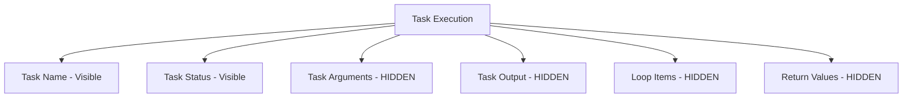

# How to Use the no_log Directive to Hide Sensitive Output

Author: [nawazdhandala](https://www.github.com/nawazdhandala)

Tags: Ansible, Security, DevOps, Secrets Management

Description: Learn how to use the no_log directive in Ansible to prevent sensitive data like passwords and API keys from appearing in playbook output and logs.

---

When Ansible runs a task, it prints the task result to the console and any configured log destinations. This is great for debugging, but it becomes a security problem when tasks handle passwords, API keys, tokens, or other secrets. The `no_log` directive tells Ansible to suppress the output of a task, keeping sensitive data out of terminal output, log files, and callback plugin output.

## The Problem

Consider this playbook that creates a database user:

```yaml
# WITHOUT no_log - password visible in output
- name: Create database user
  mysql_user:
    name: app_user
    password: "SuperSecret123!"
    priv: "mydb.*:ALL"
    state: present
```

When this runs, the full task result including the password appears in the terminal output. If you are running this in a CI/CD pipeline, that password is now in your build logs. Anyone with access to those logs can see it.

## Basic Usage

Adding `no_log: true` to a task hides its output:

```yaml
# secure-db-setup.yml - Create database users without exposing passwords
---
- name: Setup database users securely
  hosts: db_servers
  become: yes

  vars:
    db_users:
      - name: app_user
        password: "{{ vault_app_db_password }}"
        priv: "mydb.*:ALL"
      - name: readonly_user
        password: "{{ vault_readonly_db_password }}"
        priv: "mydb.*:SELECT"

  tasks:
    - name: Create database users
      mysql_user:
        name: "{{ item.name }}"
        password: "{{ item.password }}"
        priv: "{{ item.priv }}"
        state: present
      loop: "{{ db_users }}"
      no_log: true  # Prevents passwords from showing in output
```

With `no_log: true`, the output looks like this instead:

```
TASK [Create database users] **************************************************
ok: [db1.example.com] => (item=CENSORED)
ok: [db1.example.com] => (item=CENSORED)
```

## What no_log Actually Hides

The `no_log` directive suppresses:

- Task arguments (the module parameters)
- Task results (stdout, stderr, return values)
- Loop items (when used with `loop` or `with_items`)
- The full invocation details

It does NOT hide:

- The task name
- Whether the task succeeded, failed, or changed
- Handler notifications



## Common Use Cases

Here are the most frequent scenarios where you need `no_log`:

```yaml
# common-secrets.yml - Protect various types of sensitive data
---
- name: Configure services with secrets
  hosts: all
  become: yes

  tasks:
    # API key configuration
    - name: Set API key in environment file
      lineinfile:
        path: /etc/myapp/env
        regexp: '^API_KEY='
        line: "API_KEY={{ vault_api_key }}"
      no_log: true

    # SSL certificate private keys
    - name: Deploy SSL private key
      copy:
        content: "{{ vault_ssl_private_key }}"
        dest: /etc/ssl/private/myapp.key
        mode: '0600'
        owner: root
        group: root
      no_log: true

    # OAuth tokens
    - name: Configure OAuth credentials
      template:
        src: oauth.conf.j2
        dest: /etc/myapp/oauth.conf
        mode: '0640'
      no_log: true

    # Docker registry login
    - name: Log in to private Docker registry
      command: docker login -u {{ docker_user }} -p {{ vault_docker_password }} registry.example.com
      no_log: true
      changed_when: false
```

## Conditional no_log

You might want to show output during development but hide it in production. Use a variable to control this:

```yaml
# conditional-nolog.yml - Toggle logging based on environment
---
- name: Deploy application
  hosts: all
  become: yes

  vars:
    # Set to false for debugging, true for production
    hide_sensitive: "{{ lookup('env', 'ANSIBLE_HIDE_SENSITIVE') | default('true') }}"

  tasks:
    - name: Configure database connection string
      template:
        src: database.yml.j2
        dest: /etc/myapp/database.yml
      no_log: "{{ hide_sensitive | bool }}"

    - name: Set application secrets
      copy:
        content: |
          SECRET_KEY={{ vault_secret_key }}
          JWT_SECRET={{ vault_jwt_secret }}
          ENCRYPTION_KEY={{ vault_encryption_key }}
        dest: /etc/myapp/secrets.env
        mode: '0600'
      no_log: "{{ hide_sensitive | bool }}"
```

Run with logging enabled for debugging:

```bash
# Enable sensitive output for debugging
ANSIBLE_HIDE_SENSITIVE=false ansible-playbook -v conditional-nolog.yml

# Disable for production (default)
ansible-playbook conditional-nolog.yml
```

## Debugging no_log Tasks

When a task with `no_log: true` fails, debugging becomes difficult because you cannot see the error details. Here are strategies to work around this:

```yaml
# debug-nolog.yml - Strategies for debugging hidden tasks
---
- name: Debug no_log tasks safely
  hosts: all
  become: yes

  tasks:
    # Strategy 1: Use block/rescue to catch the error
    - name: Handle API configuration with error capture
      block:
        - name: Configure API credentials
          uri:
            url: "https://api.example.com/configure"
            method: POST
            headers:
              Authorization: "Bearer {{ vault_api_token }}"
            body_format: json
            body:
              setting: "enabled"
          register: api_result
          no_log: true

      rescue:
        # Show sanitized error info (strip the sensitive parts manually)
        - name: Show error status code
          debug:
            msg: "API call failed with status: {{ api_result.status | default('unknown') }}"

        - name: Show error message without sensitive headers
          debug:
            msg: "Error: {{ api_result.msg | default('No error message') }}"

    # Strategy 2: Temporarily remove no_log during development
    - name: Set up service account
      command: /opt/scripts/setup-service-account.sh
      environment:
        SERVICE_PASSWORD: "{{ vault_service_password }}"
      no_log: "{{ not (debug_mode | default(false) | bool) }}"
      register: setup_result
```

## Play-Level no_log

You can set `no_log` at the play level to apply it to all tasks:

```yaml
# play-level-nolog.yml - Hide all task output in a play
---
- name: Secret rotation (all output hidden)
  hosts: all
  become: yes
  no_log: true  # Applies to ALL tasks in this play

  tasks:
    - name: Rotate database password
      mysql_user:
        name: app_user
        password: "{{ new_db_password }}"
        state: present

    - name: Update application config
      template:
        src: db-config.j2
        dest: /etc/myapp/db.conf

    - name: Restart application
      systemd:
        name: myapp
        state: restarted
      no_log: false  # Override to show this task's output
```

## no_log in Roles

When writing roles that handle secrets, set `no_log` in the role tasks:

```yaml
# roles/certificate-manager/tasks/main.yml
---
- name: Deploy certificate files
  copy:
    content: "{{ item.content }}"
    dest: "{{ item.dest }}"
    mode: "{{ item.mode }}"
    owner: root
    group: root
  loop:
    - content: "{{ ssl_certificate }}"
      dest: "/etc/ssl/certs/{{ domain }}.crt"
      mode: '0644'
    - content: "{{ ssl_private_key }}"
      dest: "/etc/ssl/private/{{ domain }}.key"
      mode: '0600'
    - content: "{{ ssl_chain }}"
      dest: "/etc/ssl/certs/{{ domain }}-chain.crt"
      mode: '0644'
  no_log: true
  notify: Reload nginx

- name: Verify certificate is valid
  command: openssl x509 -in /etc/ssl/certs/{{ domain }}.crt -noout -dates
  register: cert_check
  changed_when: false
  # This task does NOT need no_log since it only shows dates, not the cert content
```

## Combining no_log with Ansible Vault

The best practice is to use Ansible Vault for storing secrets and `no_log` for preventing them from appearing in output:

```yaml
# vault-with-nolog.yml - Defense in depth for secrets
---
- name: Deploy with vault-encrypted secrets
  hosts: all
  become: yes
  vars_files:
    - vault/secrets.yml  # Encrypted with ansible-vault

  tasks:
    - name: Set application environment variables
      template:
        src: env.j2
        dest: /etc/myapp/.env
        mode: '0600'
        owner: appuser
        group: appuser
      no_log: true  # Even though vault protects at rest, no_log protects at runtime
```

Encrypt the secrets file:

```bash
# Create encrypted secrets file
ansible-vault create vault/secrets.yml

# Run the playbook (will prompt for vault password)
ansible-playbook --ask-vault-pass vault-with-nolog.yml
```

## Common Mistakes

**Forgetting no_log on debug tasks**: If you register a variable from a no_log task and then debug it, the secret is exposed:

```yaml
# BAD - leaks the password through debug
- name: Create user
  mysql_user:
    name: admin
    password: "{{ vault_password }}"
  register: user_result
  no_log: true

- name: Show result
  debug:
    var: user_result  # This will show the password!

# GOOD - only show non-sensitive parts
- name: Show status
  debug:
    msg: "User creation: {{ 'success' if user_result is succeeded else 'failed' }}"
```

## Summary

The `no_log` directive is essential for any playbook that handles secrets. Apply it to every task that processes passwords, API keys, tokens, or certificates. Use conditional `no_log` for development flexibility, combine it with Ansible Vault for defense in depth, and be careful not to leak secrets through subsequent debug tasks. Security in automation is about protecting data at every stage, not just at rest.
