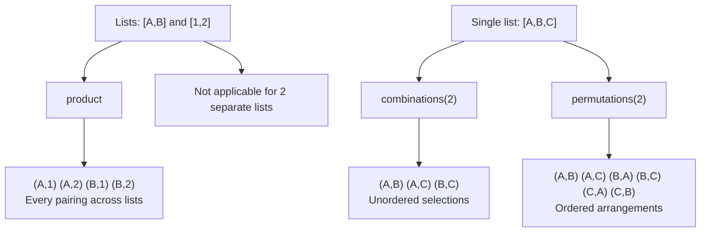

# How to Use the product Filter for Cartesian Products in Ansible

Author: [nawazdhandala](https://www.github.com/nawazdhandala)

Tags: Ansible, Filters, Cartesian Product, Testing

Description: Learn how to use the product filter in Ansible to generate Cartesian products from multiple lists for test matrices, configuration generation, and more.

---

The `product` filter generates the Cartesian product of two or more lists. That means every possible combination where you pick one element from each input list. This is the go-to tool for building test matrices, generating multi-dimensional configurations, and creating exhaustive pairings between groups of items.

## Basic product Usage

```yaml
# playbook-basic-product.yml
# Generates all possible OS + Python version combinations
- name: Basic Cartesian product
  hosts: localhost
  gather_facts: false
  vars:
    operating_systems:
      - ubuntu
      - centos
      - debian
    python_versions:
      - "3.9"
      - "3.10"
      - "3.11"

  tasks:
    - name: Generate all OS + Python combinations
      ansible.builtin.debug:
        msg: "{{ operating_systems | product(python_versions) | list }}"
```

Output (9 combinations = 3 x 3):

```json
[
    ["ubuntu", "3.9"], ["ubuntu", "3.10"], ["ubuntu", "3.11"],
    ["centos", "3.9"], ["centos", "3.10"], ["centos", "3.11"],
    ["debian", "3.9"], ["debian", "3.10"], ["debian", "3.11"]
]
```

## Three-Way Cartesian Product

You can pass multiple lists to create higher-dimensional products:

```yaml
# playbook-three-way.yml
# Creates a 3-dimensional test matrix from OS, Python, and database options
- name: Three-way product
  hosts: localhost
  gather_facts: false
  vars:
    os_list:
      - ubuntu-22.04
      - debian-12
    python_list:
      - "3.10"
      - "3.11"
    db_list:
      - postgresql
      - mysql

  tasks:
    - name: Generate all (OS, Python, DB) combinations
      ansible.builtin.debug:
        msg: "OS={{ item.0 }}, Python={{ item.1 }}, DB={{ item.2 }}"
      loop: "{{ os_list | product(python_list, db_list) | list }}"
      loop_control:
        label: "{{ item.0 }}/{{ item.1 }}/{{ item.2 }}"

    - name: Total combinations
      ansible.builtin.debug:
        msg: "{{ os_list | product(python_list, db_list) | list | length }} total combinations"
```

Output: 8 combinations (2 x 2 x 2).

## Product vs Combinations vs Permutations

Here is how these three filters compare:



## CI/CD Test Matrix Generation

The most practical use case is generating CI/CD test matrices:

```yaml
# playbook-ci-matrix.yml
# Generates a CI test matrix with all possible environment configurations
- name: Generate CI test matrix
  hosts: localhost
  gather_facts: false
  vars:
    browsers:
      - chrome
      - firefox
      - safari
    screen_sizes:
      - "1920x1080"
      - "1366x768"
      - "375x812"
    environments:
      - staging
      - production

  tasks:
    - name: Build test matrix
      ansible.builtin.set_fact:
        test_matrix: >-
          
          
          
          
          {{ result }}

    - name: Show matrix size
      ansible.builtin.debug:
        msg: "Generated {{ test_matrix | length }} test configurations"

    - name: Write matrix to JSON file
      ansible.builtin.copy:
        content: "{{ test_matrix | to_nice_json(indent=2) }}"
        dest: /tmp/test_matrix.json
```

## Multi-Region Multi-Service Deployment

```yaml
# playbook-multi-deploy.yml
# Plans deployment of services across all regions using product
- name: Plan multi-region deployment
  hosts: localhost
  gather_facts: false
  vars:
    regions:
      - us-east-1
      - eu-west-1
      - ap-south-1
    services:
      - api
      - worker
      - scheduler
    tiers:
      - primary
      - replica

  tasks:
    - name: Generate deployment targets
      ansible.builtin.debug:
        msg: "Deploy {{ item.1 }} ({{ item.2 }}) to {{ item.0 }}"
      loop: "{{ regions | product(services, tiers) | list }}"
      loop_control:
        label: "{{ item.0 }}/{{ item.1 }}/{{ item.2 }}"

    - name: Count total deployment targets
      ansible.builtin.debug:
        msg: "{{ regions | length }} regions x {{ services | length }} services x {{ tiers | length }} tiers = {{ regions | product(services, tiers) | list | length }} targets"
```

## Generating Configuration Pairs

```yaml
# playbook-config-pairs.yml
# Creates all possible network security group rules from source and destination lists
- name: Generate security group rules
  hosts: localhost
  gather_facts: false
  vars:
    source_cidrs:
      - 10.0.1.0/24
      - 10.0.2.0/24
    destination_ports:
      - 80
      - 443
      - 8080
    protocols:
      - tcp

  tasks:
    - name: Generate all firewall rules
      ansible.builtin.set_fact:
        firewall_rules: >-
          
          
          
          
          {{ result }}

    - name: Show generated rules
      ansible.builtin.debug:
        msg: "{{ firewall_rules | length }} rules generated"

    - name: Apply rules
      ansible.builtin.debug:
        msg: "Allow {{ item.protocol }} from {{ item.source }} to port {{ item.port }}"
      loop: "{{ firewall_rules }}"
      loop_control:
        label: "{{ item.source }} -> :{{ item.port }}"
```

## Filtering Product Results

You often do not want every combination. Filter after generating:

```yaml
# playbook-filtered-product.yml
# Generates all combinations then filters out incompatible ones
- name: Filtered Cartesian product
  hosts: localhost
  gather_facts: false
  vars:
    databases:
      - name: postgresql
        versions: ["14", "15", "16"]
      - name: mysql
        versions: ["8.0", "8.1"]
    app_versions:
      - "2.0"
      - "2.1"
      - "3.0"
    incompatible:
      - db: mysql
        app: "3.0"

  tasks:
    - name: Generate all DB version + app version combos
      ansible.builtin.set_fact:
        all_combos: >-
          
          
          
          
          
          
          
          
          {{ result }}

    - name: Filter out incompatible combinations
      ansible.builtin.set_fact:
        valid_combos: >-
          {{ all_combos | rejectattr('db', 'equalto', 'mysql') |
             list + (all_combos | selectattr('db', 'equalto', 'mysql') |
             rejectattr('app_version', 'equalto', '3.0') | list) }}

    - name: Show valid combinations
      ansible.builtin.debug:
        msg: "{{ valid_combos | length }} valid out of {{ all_combos | length }} total"
```

## Scaling Considerations

The product grows multiplicatively. Be careful with large inputs:

```yaml
# playbook-scaling.yml
# Shows how Cartesian product size grows with list sizes
- name: Product scaling
  hosts: localhost
  gather_facts: false

  tasks:
    - name: Show growth pattern
      ansible.builtin.debug:
        msg: |
          2 x 2 = {{ range(2) | product(range(2)) | list | length }}
          3 x 3 = {{ range(3) | product(range(3)) | list | length }}
          5 x 5 = {{ range(5) | product(range(5)) | list | length }}
          10 x 10 = {{ range(10) | product(range(10)) | list | length }}
          3 x 3 x 3 = {{ range(3) | product(range(3), range(3)) | list | length }}
          5 x 5 x 5 = {{ range(5) | product(range(5), range(5)) | list | length }}
```

## Summary

The `product` filter is essential for generating all possible combinations across multiple lists. Use it for test matrix generation, multi-dimensional deployment planning, exhaustive configuration testing, and security rule generation. Remember that results grow multiplicatively, so filter the output when you do not need every combination. Combine it with Jinja2 loops for restructuring the tuples into proper objects, and with `selectattr`/`rejectattr` for removing invalid combinations from the output.
