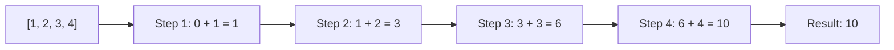

# How to Use the reduce Filter in Ansible

Author: [nawazdhandala](https://www.github.com/nawazdhandala)

Tags: Ansible, Filters, Jinja2, Data Aggregation

Description: Learn how to use the reduce filter in Ansible to aggregate list data into single values, build dictionaries from lists, and perform cumulative computations.

---

The `reduce` filter takes a list and collapses it into a single value by applying an operation cumulatively. If you have used `reduce()` in Python or `Array.reduce()` in JavaScript, the concept is the same. In Ansible and Jinja2, the `reduce` filter was not available natively for a long time, so people used workarounds. But since Jinja2 2.11+ and Ansible 2.10+, you have access to this through custom approaches. Let me walk you through how to achieve reduce-style operations in Ansible.

## The Concept of Reduce

A reduce operation takes a list and an accumulator function, and processes each element to produce a single result. For example, reducing `[1, 2, 3, 4]` with addition gives `10`.



## Simple Aggregation with Built-in Filters

For common reduce operations, Ansible has built-in shortcuts:

```yaml
# playbook-builtins.yml
# Uses built-in aggregation filters that work like specialized reduce operations
- name: Built-in aggregation filters
  hosts: localhost
  gather_facts: false
  vars:
    numbers:
      - 15
      - 42
      - 8
      - 73
      - 31
    names:
      - alice
      - bob
      - carol

  tasks:
    - name: Sum (reduce with addition)
      ansible.builtin.debug:
        msg: "Sum: {{ numbers | sum }}"

    - name: Min (reduce keeping minimum)
      ansible.builtin.debug:
        msg: "Min: {{ numbers | min }}"

    - name: Max (reduce keeping maximum)
      ansible.builtin.debug:
        msg: "Max: {{ numbers | max }}"

    - name: Join (reduce with string concatenation)
      ansible.builtin.debug:
        msg: "Names: {{ names | join(', ') }}"

    - name: Length (count reduction)
      ansible.builtin.debug:
        msg: "Count: {{ numbers | length }}"
```

## Reduce with Loop and set_fact

The most common way to implement a custom reduce in Ansible is using a loop with `set_fact` and an accumulator variable:

```yaml
# playbook-reduce-loop.yml
# Implements reduce by accumulating values through a loop with set_fact
- name: Reduce with loop and set_fact
  hosts: localhost
  gather_facts: false
  vars:
    items:
      - name: widget
        price: 9.99
        quantity: 3
      - name: gadget
        price: 24.99
        quantity: 1
      - name: doohickey
        price: 4.50
        quantity: 5

  tasks:
    - name: Calculate total cost (price * quantity for each item, then sum)
      ansible.builtin.set_fact:
        total_cost: "{{ (total_cost | default(0) | float) + (item.price * item.quantity) }}"
      loop: "{{ items }}"

    - name: Show total
      ansible.builtin.debug:
        msg: "Total cost: ${{ total_cost }}"
```

## Building a Dictionary with Reduce Pattern

One of the most useful reduce patterns is building a dictionary from a list:

```yaml
# playbook-reduce-dict.yml
# Builds a dictionary incrementally by reducing a list with combine
- name: Build dictionary with reduce pattern
  hosts: localhost
  gather_facts: false
  vars:
    users:
      - username: alice
        uid: 1001
        shell: /bin/bash
      - username: bob
        uid: 1002
        shell: /bin/zsh
      - username: carol
        uid: 1003
        shell: /bin/bash

  tasks:
    - name: Build username-to-UID mapping
      ansible.builtin.set_fact:
        uid_map: "{{ uid_map | default({}) | combine({item.username: item.uid}) }}"
      loop: "{{ users }}"

    - name: Show UID map
      ansible.builtin.debug:
        var: uid_map

    - name: Build username-to-full-info mapping
      ansible.builtin.set_fact:
        user_map: >-
          {{ user_map | default({}) |
             combine({item.username: {'uid': item.uid, 'shell': item.shell}}) }}
      loop: "{{ users }}"

    - name: Show user map
      ansible.builtin.debug:
        var: user_map
```

## Reduce with Jinja2 Namespace

For more complex reductions within a single expression, use Jinja2's `namespace`:

```yaml
# playbook-jinja2-reduce.yml
# Uses Jinja2 namespace to perform inline reduce operations
- name: Reduce with Jinja2 namespace
  hosts: localhost
  gather_facts: false
  vars:
    orders:
      - product: laptop
        amount: 999.99
        tax_rate: 0.08
      - product: mouse
        amount: 29.99
        tax_rate: 0.08
      - product: keyboard
        amount: 79.99
        tax_rate: 0.08

  tasks:
    - name: Calculate total with tax
      ansible.builtin.set_fact:
        order_summary: >-
          
          
          
          
          
          {{ {'subtotal': ns.subtotal | round(2),
              'tax': ns.total_tax | round(2),
              'total': (ns.subtotal + ns.total_tax) | round(2)} }}

    - name: Show order summary
      ansible.builtin.debug:
        var: order_summary
```

## Concatenating Lists (Reduce with +)

Building a flat list from multiple sources:

```yaml
# playbook-reduce-concat.yml
# Concatenates multiple lists into one using reduce pattern
- name: Concatenate lists with reduce
  hosts: localhost
  gather_facts: false
  vars:
    team_permissions:
      - team: devops
        permissions:
          - deploy
          - configure
          - monitor
      - team: developers
        permissions:
          - deploy
          - read_logs
      - team: security
        permissions:
          - audit
          - monitor
          - configure

  tasks:
    - name: Collect all unique permissions
      ansible.builtin.set_fact:
        all_permissions: "{{ all_permissions | default([]) | union(item.permissions) }}"
      loop: "{{ team_permissions }}"

    - name: Show all unique permissions
      ansible.builtin.debug:
        var: all_permissions
```

## Conditional Reduce

Reduce with conditions, only accumulating items that match criteria:

```yaml
# playbook-conditional-reduce.yml
# Reduces a list but only includes items that meet specific conditions
- name: Conditional reduce
  hosts: localhost
  gather_facts: false
  vars:
    transactions:
      - type: credit
        amount: 500
      - type: debit
        amount: 200
      - type: credit
        amount: 300
      - type: debit
        amount: 150
      - type: credit
        amount: 100

  tasks:
    - name: Sum only credits
      ansible.builtin.set_fact:
        total_credits: >-
          {{ transactions |
             selectattr('type', 'equalto', 'credit') |
             map(attribute='amount') |
             sum }}

    - name: Sum only debits
      ansible.builtin.set_fact:
        total_debits: >-
          {{ transactions |
             selectattr('type', 'equalto', 'debit') |
             map(attribute='amount') |
             sum }}

    - name: Show balance
      ansible.builtin.debug:
        msg:
          credits: "{{ total_credits }}"
          debits: "{{ total_debits }}"
          balance: "{{ total_credits | int - total_debits | int }}"
```

## Practical Example: Building a Summary Report

```yaml
# playbook-summary-report.yml
# Reduces monitoring data into a summary report with per-host statistics
- name: Build summary from collected data
  hosts: localhost
  gather_facts: false
  vars:
    host_metrics:
      - host: web-01
        cpu: 45
        memory: 62
        disk: 30
      - host: web-02
        cpu: 78
        memory: 85
        disk: 55
      - host: db-01
        cpu: 92
        memory: 88
        disk: 72
      - host: cache-01
        cpu: 15
        memory: 45
        disk: 20

  tasks:
    - name: Build comprehensive summary
      ansible.builtin.set_fact:
        summary: >-
          
          
          
          
          
          
          
          
          
          
          {{
            {
              'avg_cpu': (ns.total_cpu / ns.count) | round(1),
              'avg_memory': (ns.total_mem / ns.count) | round(1),
              'avg_disk': (ns.total_disk / ns.count) | round(1),
              'critical_hosts': ns.critical,
              'host_count': ns.count
            }
          }}

    - name: Display summary
      ansible.builtin.debug:
        var: summary
```

## String Building Reduce

Building a string incrementally:

```yaml
# playbook-string-reduce.yml
# Builds a formatted configuration string by reducing over items
- name: Build string with reduce
  hosts: localhost
  gather_facts: false
  vars:
    vhosts:
      - domain: app.example.com
        port: 8080
      - domain: api.example.com
        port: 9090
      - domain: admin.example.com
        port: 7070

  tasks:
    - name: Build Nginx upstream config
      ansible.builtin.set_fact:
        upstream_block: >-
          
          
          
          
          
          {{ ns.config }}

    - name: Show config
      ansible.builtin.debug:
        msg: "{{ upstream_block }}"
```

## Summary

While Ansible does not have a native `reduce` filter like some programming languages, the pattern is easy to replicate. For simple numeric aggregations, use built-in filters like `sum`, `min`, `max`, and `join`. For custom reductions, use `set_fact` with a loop and a `default({})` or `default(0)` accumulator. For complex inline reductions without loops, use Jinja2 `namespace` objects. The combination of `selectattr`, `map`, and `sum` covers most filtering-then-aggregating scenarios without needing an explicit loop at all.
