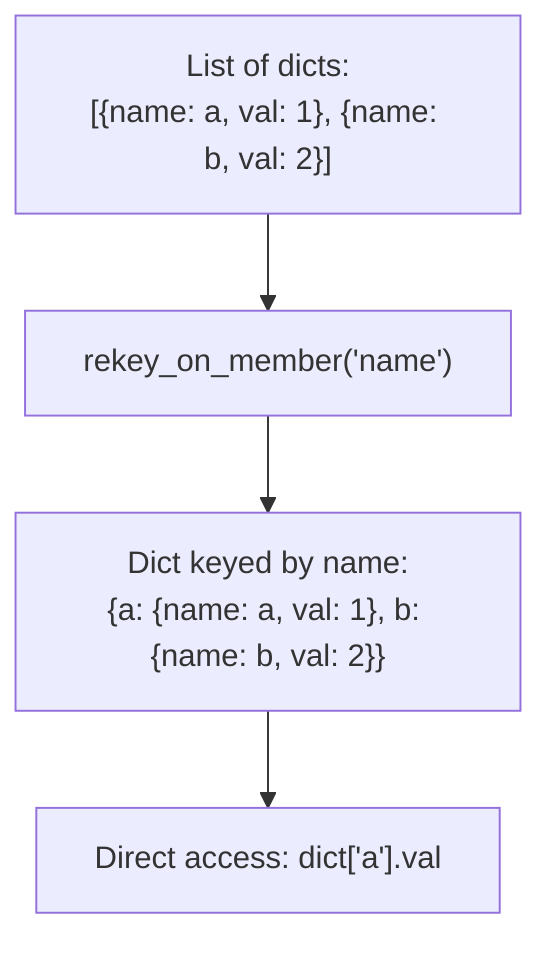

# How to Use the rekey_on_member Filter in Ansible

Author: [nawazdhandala](https://www.github.com/nawazdhandala)

Tags: Ansible, Filters, Data Transformation, Dictionary

Description: Learn how to use the rekey_on_member filter in Ansible to transform a list of dictionaries into a dictionary keyed by a specified member field.

---

The `community.general.lists_mergeby` and the concept of rekeying data are common needs in Ansible. The `rekey_on_member` filter (available in `community.general`) takes a list of dictionaries and transforms it into a dictionary where the keys are taken from a specified member field of each list item. This is incredibly handy when you have list-formatted data but need dictionary-based lookups.

## Understanding rekey_on_member

Say you have a list of servers, and you want to look them up by hostname. Instead of looping through the list every time, you can rekey the list into a dictionary:

```yaml
# playbook-basic-rekey.yml
# Transforms a list of servers into a dictionary keyed by hostname
- name: Basic rekey_on_member usage
  hosts: localhost
  gather_facts: false
  vars:
    servers_list:
      - hostname: web-01
        ip: 10.0.1.10
        role: webserver
      - hostname: db-01
        ip: 10.0.2.10
        role: database
      - hostname: cache-01
        ip: 10.0.3.10
        role: cache

  tasks:
    - name: Rekey list by hostname
      ansible.builtin.set_fact:
        servers_dict: "{{ servers_list | community.general.rekey_on_member('hostname') }}"

    - name: Access server by hostname
      ansible.builtin.debug:
        msg: "web-01 IP is {{ servers_dict['web-01'].ip }}"

    - name: Show full dictionary
      ansible.builtin.debug:
        var: servers_dict
```

Output:

```json
{
    "web-01": {
        "hostname": "web-01",
        "ip": "10.0.1.10",
        "role": "webserver"
    },
    "db-01": {
        "hostname": "db-01",
        "ip": "10.0.2.10",
        "role": "database"
    },
    "cache-01": {
        "hostname": "cache-01",
        "ip": "10.0.3.10",
        "role": "cache"
    }
}
```

## Alternative: Using items2dict

If you just want simple key-value pairs, `items2dict` with custom key/value names works:

```yaml
# playbook-items2dict-alt.yml
# Shows the simpler items2dict approach for basic key-value mapping
- name: Alternative with items2dict
  hosts: localhost
  gather_facts: false
  vars:
    servers_list:
      - hostname: web-01
        ip: 10.0.1.10
      - hostname: db-01
        ip: 10.0.2.10

  tasks:
    - name: Simple key-value mapping with items2dict
      ansible.builtin.set_fact:
        ip_map: "{{ servers_list | items2dict(key_name='hostname', value_name='ip') }}"

    - name: Show result (flat dictionary, no nested objects)
      ansible.builtin.debug:
        var: ip_map
```

Output: `{"web-01": "10.0.1.10", "db-01": "10.0.2.10"}`

The difference is that `items2dict` creates flat key-value pairs, while `rekey_on_member` preserves the full object as the value.

## Manual rekey_on_member Implementation

If you do not have the community.general collection installed, here is how to do it manually:

```yaml
# playbook-manual-rekey.yml
# Implements rekey_on_member behavior manually using a loop
- name: Manual rekey implementation
  hosts: localhost
  gather_facts: false
  vars:
    users:
      - username: alice
        uid: 1001
        shell: /bin/bash
        groups:
          - sudo
          - developers
      - username: bob
        uid: 1002
        shell: /bin/zsh
        groups:
          - developers
      - username: carol
        uid: 1003
        shell: /bin/bash
        groups:
          - sudo
          - ops

  tasks:
    - name: Rekey manually using combine in a loop
      ansible.builtin.set_fact:
        users_dict: "{{ users_dict | default({}) | combine({item.username: item}) }}"
      loop: "{{ users }}"

    - name: Access user by name
      ansible.builtin.debug:
        msg: "Alice's UID is {{ users_dict.alice.uid }} and shell is {{ users_dict.alice.shell }}"

    - name: Another manual approach using Jinja2
      ansible.builtin.set_fact:
        users_by_name: >-
          
          
          
          
          {{ result }}
```

## Rekey Transformation Flow



## Practical Example: Service Registry

```yaml
# playbook-service-registry.yml
# Builds a service registry dictionary from a list for quick lookups
- name: Build service registry
  hosts: localhost
  gather_facts: false
  vars:
    services_list:
      - service_name: user-api
        port: 8081
        health_check: /health
        replicas: 3
        dependencies:
          - database
          - cache
      - service_name: order-api
        port: 8082
        health_check: /health
        replicas: 2
        dependencies:
          - database
          - user-api
      - service_name: notification-service
        port: 8083
        health_check: /status
        replicas: 1
        dependencies:
          - message-queue

  tasks:
    - name: Build registry keyed by service name
      ansible.builtin.set_fact:
        registry: "{{ services_list | community.general.rekey_on_member('service_name') }}"

    - name: Look up order-api details
      ansible.builtin.debug:
        msg:
          port: "{{ registry['order-api'].port }}"
          health: "{{ registry['order-api'].health_check }}"
          deps: "{{ registry['order-api'].dependencies }}"

    - name: Check if a service exists
      ansible.builtin.debug:
        msg: "payment-service exists: {{ 'payment-service' in registry }}"
```

## Handling Duplicate Keys

When multiple items have the same value for the key field, the last one wins:

```yaml
# playbook-duplicates.yml
# Shows that duplicate keys result in the last value winning
- name: Handle duplicate keys during rekey
  hosts: localhost
  gather_facts: false
  vars:
    entries:
      - name: config_a
        value: original
        source: file1
      - name: config_b
        value: only_one
        source: file1
      - name: config_a
        value: override
        source: file2

  tasks:
    - name: Rekey with duplicates (last wins)
      ansible.builtin.set_fact:
        config: "{{ entries | community.general.rekey_on_member('name') }}"

    - name: Show result - config_a has the override value
      ansible.builtin.debug:
        msg: "config_a value: {{ config.config_a.value }} from {{ config.config_a.source }}"
```

## Using Rekeyed Data for Lookups

```yaml
# playbook-lookup-pattern.yml
# Uses rekeyed data to efficiently look up package info during installation
- name: Efficient lookups with rekeyed data
  hosts: webservers
  vars:
    all_packages:
      - name: nginx
        version: "1.24.0"
        config_template: nginx.conf.j2
        service_name: nginx
      - name: postgresql
        version: "15.4"
        config_template: postgresql.conf.j2
        service_name: postgresql
      - name: redis
        version: "7.2"
        config_template: redis.conf.j2
        service_name: redis

    host_packages:
      - nginx
      - redis

  tasks:
    - name: Build package lookup dictionary
      ansible.builtin.set_fact:
        pkg_info: "{{ all_packages | community.general.rekey_on_member('name') }}"

    - name: Install packages with specific versions
      ansible.builtin.package:
        name: "{{ item }}-{{ pkg_info[item].version }}"
        state: present
      loop: "{{ host_packages }}"

    - name: Deploy config for each package
      ansible.builtin.template:
        src: "{{ pkg_info[item].config_template }}"
        dest: "/etc/{{ item }}/{{ item }}.conf"
      loop: "{{ host_packages }}"

    - name: Ensure services are running
      ansible.builtin.service:
        name: "{{ pkg_info[item].service_name }}"
        state: started
        enabled: true
      loop: "{{ host_packages }}"
```

## Rekeying Inventory Data

```yaml
# playbook-rekey-inventory.yml
# Rekeys a CMDB export list by hostname for fast inventory lookups
- name: Rekey inventory for fast lookups
  hosts: localhost
  gather_facts: false

  tasks:
    - name: Read CMDB data
      ansible.builtin.set_fact:
        cmdb_data:
          - hostname: app-01
            environment: production
            team: platform
            cost_center: CC-100
          - hostname: app-02
            environment: staging
            team: platform
            cost_center: CC-100
          - hostname: db-01
            environment: production
            team: data
            cost_center: CC-200

    - name: Rekey by hostname for fast lookups
      ansible.builtin.set_fact:
        cmdb: "{{ cmdb_data | community.general.rekey_on_member('hostname') }}"

    - name: Quick lookup
      ansible.builtin.debug:
        msg: "app-01 is in {{ cmdb['app-01'].environment }}, managed by {{ cmdb['app-01'].team }}"
```

## Summary

The `rekey_on_member` filter from community.general converts a list of dictionaries into a dictionary keyed by a specified field, preserving the full object as each value. This is much more useful than `items2dict` when you need to retain all the fields from the original objects. Use it for building lookup tables, service registries, and any scenario where you need O(1) access to items by a specific key instead of searching through a list. If you do not have the collection installed, the pattern of combining in a loop with `set_fact` achieves the same result.
