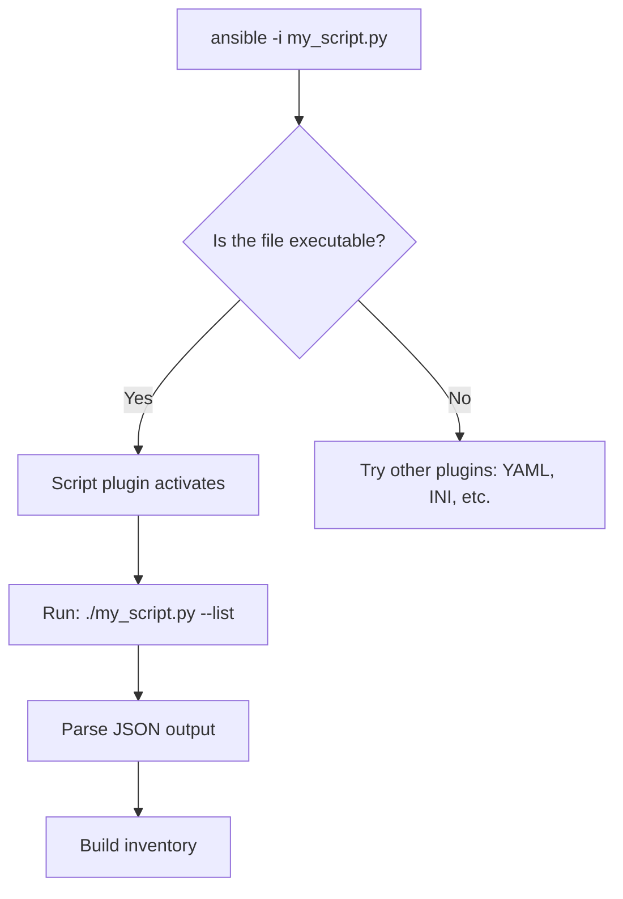

# How to Use the Script Inventory Plugin in Ansible

Author: [nawazdhandala](https://www.github.com/nawazdhandala)

Tags: Ansible, Inventory Plugin, Script, Dynamic Inventory, Python

Description: Learn how to use the Ansible script inventory plugin to run custom executable scripts that generate inventory data dynamically.

---

The `script` inventory plugin is Ansible's mechanism for running external programs that produce inventory data. Any executable file (Python, Bash, Ruby, Go binary, or anything else) can serve as a dynamic inventory source as long as it outputs the right JSON format. This post covers how the script plugin works, the expected output format, and practical examples in multiple languages.

## How the Script Plugin Works

When you pass an executable file to Ansible's `-i` flag, the script inventory plugin kicks in. It runs the file with `--list` to get all inventory data, and optionally with `--host <hostname>` to get variables for a specific host.



The script must:
1. Be executable (`chmod +x`)
2. Output valid JSON to stdout
3. Support the `--list` argument
4. Optionally support `--host <hostname>`

## The Required JSON Format

The `--list` output must follow this structure:

```json
{
    "group_name": {
        "hosts": ["host1", "host2"],
        "vars": {
            "group_var1": "value1"
        },
        "children": ["child_group"]
    },
    "another_group": {
        "hosts": ["host3"]
    },
    "_meta": {
        "hostvars": {
            "host1": {
                "ansible_host": "10.0.1.10",
                "custom_var": "value"
            },
            "host2": {
                "ansible_host": "10.0.1.11"
            },
            "host3": {
                "ansible_host": "10.0.2.20"
            }
        }
    }
}
```

The `_meta` section with `hostvars` is important for performance. When included, Ansible does not need to call the script with `--host` for each individual host. This is a single call instead of N+1 calls.

## Python Example

Here is a complete Python inventory script:

```python
#!/usr/bin/env python3
# my_inventory.py
# Custom dynamic inventory script

import json
import sys

def get_inventory():
    """Return the full inventory."""
    return {
        "webservers": {
            "hosts": ["web01", "web02", "web03"],
            "vars": {
                "http_port": 80,
                "ansible_user": "deploy"
            }
        },
        "databases": {
            "hosts": ["db01", "db02"],
            "vars": {
                "db_port": 5432,
                "ansible_user": "dbadmin"
            }
        },
        "production": {
            "children": ["webservers", "databases"],
            "vars": {
                "environment": "production"
            }
        },
        "_meta": {
            "hostvars": {
                "web01": {
                    "ansible_host": "10.0.1.10",
                    "rack": "A1"
                },
                "web02": {
                    "ansible_host": "10.0.1.11",
                    "rack": "A2"
                },
                "web03": {
                    "ansible_host": "10.0.1.12",
                    "rack": "B1"
                },
                "db01": {
                    "ansible_host": "10.0.2.20",
                    "db_role": "primary"
                },
                "db02": {
                    "ansible_host": "10.0.2.21",
                    "db_role": "replica"
                }
            }
        }
    }

def get_host(hostname):
    """Return variables for a specific host."""
    inventory = get_inventory()
    return inventory.get("_meta", {}).get("hostvars", {}).get(hostname, {})

if __name__ == "__main__":
    if len(sys.argv) == 2 and sys.argv[1] == "--list":
        print(json.dumps(get_inventory(), indent=2))
    elif len(sys.argv) == 3 and sys.argv[1] == "--host":
        print(json.dumps(get_host(sys.argv[2]), indent=2))
    else:
        print(json.dumps(get_inventory(), indent=2))
```

```bash
# Make it executable and test
chmod +x my_inventory.py
./my_inventory.py --list | python3 -m json.tool

# Use with Ansible
ansible -i my_inventory.py webservers -m ping
ansible-inventory -i my_inventory.py --graph
```

## Bash Example

You can write inventory scripts in Bash too:

```bash
#!/bin/bash
# bash_inventory.sh
# Dynamic inventory script in Bash

if [ "$1" == "--list" ] || [ -z "$1" ]; then
    # Return full inventory
    cat <<'EOF'
{
    "webservers": {
        "hosts": ["web01", "web02"],
        "vars": {
            "ansible_user": "deploy"
        }
    },
    "databases": {
        "hosts": ["db01"],
        "vars": {
            "ansible_user": "dbadmin"
        }
    },
    "_meta": {
        "hostvars": {
            "web01": {"ansible_host": "10.0.1.10"},
            "web02": {"ansible_host": "10.0.1.11"},
            "db01": {"ansible_host": "10.0.2.20"}
        }
    }
}
EOF
elif [ "$1" == "--host" ]; then
    # Return empty dict; all vars are in _meta
    echo "{}"
fi
```

## Bash Script that Queries an API

A more practical Bash script that pulls from an API:

```bash
#!/bin/bash
# api_inventory.sh
# Query an API endpoint and format as Ansible inventory

API_URL="${INVENTORY_API_URL:-https://api.example.com/servers}"
API_TOKEN="${INVENTORY_API_TOKEN:-}"

if [ "$1" == "--list" ] || [ -z "$1" ]; then
    # Fetch server list from API and transform with jq
    curl -s -H "Authorization: Bearer $API_TOKEN" "$API_URL" | \
    jq '{
        "webservers": {
            "hosts": [.[] | select(.role == "web") | .hostname],
            "vars": {"ansible_user": "deploy"}
        },
        "databases": {
            "hosts": [.[] | select(.role == "db") | .hostname],
            "vars": {"ansible_user": "dbadmin"}
        },
        "_meta": {
            "hostvars": (
                [.[] | {(.hostname): {"ansible_host": .ip_address}}] | add
            )
        }
    }'
elif [ "$1" == "--host" ]; then
    echo "{}"
fi
```

## Script Plugin Configuration File

While scripts can be passed directly to `-i`, you can also create a plugin configuration file that references the script:

```yaml
# inventory/custom_script.yml
plugin: ansible.builtin.script
path: /path/to/my_inventory.py
```

This is useful when you want to include a script-based inventory source alongside other inventory plugin configurations in a directory.

## Error Handling

Your script should handle errors gracefully. If the script fails, Ansible gets no inventory and the playbook cannot run:

```python
#!/usr/bin/env python3
# robust_inventory.py
# Inventory script with proper error handling

import json
import sys
import os
import requests

API_URL = os.environ.get('INVENTORY_API', 'https://api.example.com/inventory')

def get_inventory():
    try:
        response = requests.get(API_URL, timeout=30)
        response.raise_for_status()
        data = response.json()
    except requests.exceptions.ConnectionError:
        print("Error: Cannot connect to inventory API", file=sys.stderr)
        # Return empty but valid inventory so Ansible does not crash
        return {"_meta": {"hostvars": {}}}
    except requests.exceptions.Timeout:
        print("Error: Inventory API timed out", file=sys.stderr)
        return {"_meta": {"hostvars": {}}}
    except requests.exceptions.HTTPError as e:
        print(f"Error: API returned {e.response.status_code}", file=sys.stderr)
        return {"_meta": {"hostvars": {}}}

    # Transform API data to Ansible inventory format
    inventory = transform_to_inventory(data)
    return inventory

def transform_to_inventory(data):
    """Convert API response to Ansible inventory JSON."""
    groups = {}
    hostvars = {}

    for server in data.get('servers', []):
        hostname = server['name']
        group = server.get('group', 'ungrouped')

        if group not in groups:
            groups[group] = {'hosts': [], 'vars': {}}
        groups[group]['hosts'].append(hostname)

        hostvars[hostname] = {
            'ansible_host': server.get('ip', ''),
            'ansible_user': server.get('ssh_user', 'root'),
        }

    groups['_meta'] = {'hostvars': hostvars}
    return groups

if __name__ == '__main__':
    if '--list' in sys.argv or len(sys.argv) == 1:
        print(json.dumps(get_inventory(), indent=2))
    elif '--host' in sys.argv:
        print(json.dumps({}))
    else:
        print(json.dumps(get_inventory(), indent=2))
```

## Performance: _meta vs --host

There are two ways the script plugin gets host variables:

**With _meta (recommended)**: The script returns all host variables in the `_meta.hostvars` section of the `--list` response. Ansible makes a single call to the script.

**Without _meta**: If `_meta` is missing, Ansible calls `--host <hostname>` for every single host. For 100 hosts, that is 101 script invocations.

Always include `_meta` in your `--list` output:

```python
# Good: all vars in _meta, single script call
{
    "webservers": {"hosts": ["web01", "web02"]},
    "_meta": {
        "hostvars": {
            "web01": {"ansible_host": "10.0.1.10"},
            "web02": {"ansible_host": "10.0.1.11"}
        }
    }
}
```

## Testing Inventory Scripts

Always validate your script output before using it with Ansible:

```bash
# Check that --list produces valid JSON
./my_inventory.py --list | python3 -m json.tool

# Verify the structure with Ansible's own tool
ansible-inventory -i my_inventory.py --graph
ansible-inventory -i my_inventory.py --list

# Check a specific host's variables
ansible-inventory -i my_inventory.py --host web01

# Test actual connectivity
ansible -i my_inventory.py all -m ping
```

## Common Mistakes

The script must output JSON to stdout. Any debugging output, warnings, or logs must go to stderr, not stdout:

```python
# Wrong: prints to stdout, breaks JSON parsing
print("Loading inventory...")

# Correct: debug output goes to stderr
print("Loading inventory...", file=sys.stderr)
```

The script must be executable. This is the most common issue:

```bash
# Fix permissions
chmod +x my_inventory.py
```

On Linux/macOS, the shebang line (`#!/usr/bin/env python3`) must be present and point to a valid interpreter.

The script inventory plugin is the original dynamic inventory mechanism in Ansible, and it remains the most flexible option. You can write inventory logic in any language, query any data source, and apply any transformation. Just follow the JSON format, include `_meta`, handle errors gracefully, and send debug output to stderr.
